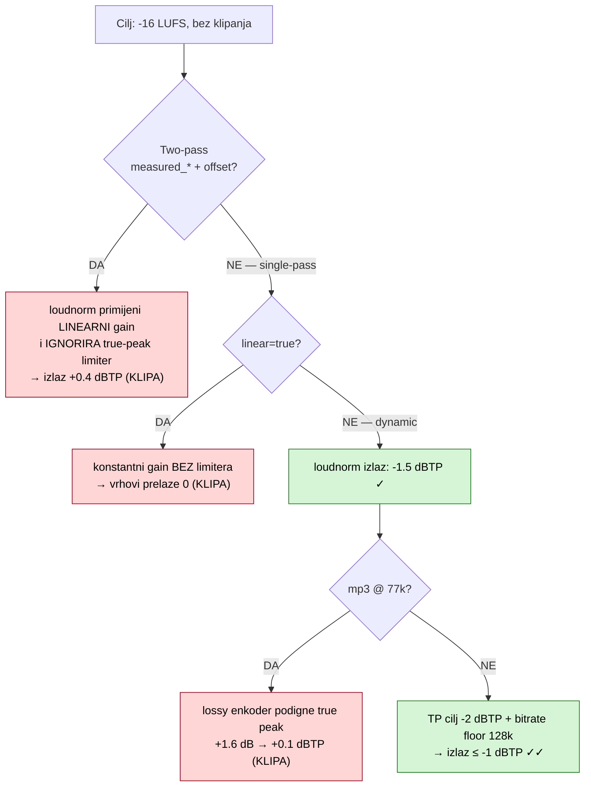

# Kako smo automatski izjednačili glasnoću 2683 podcast epizode

*2026-05-29 · audio inženjering, ffmpeg, EBU R128*

Ako si ikad slušao playlistu podcasta s raznih kanala, znaš osjećaj: jedna epizoda je pretiha pa pojačaš, sljedeća te raznese pa stišavaš. Naš katalog od **2683 epizode kroz 42 kanala** bio je upravo takav — od epizode na **-42 LUFS** (morfaš pojačati na max) do one na **-7 LUFS** (skidaš slušalice). Raspon od **35 LU** između najtiše i najglasnije.

Ovaj post je priča kako smo to riješili: automatski, jeftino, i s tvrdim brojkama prije/poslije.

## Što je uopće "glasnoća"?

Ne vršni signal (peak), nego **percipirana glasnoća** kroz vrijeme — mjeri se u **LUFS** (Loudness Units Full Scale) po EBU R128 / ITU-R BS.1770 standardu. Streaming platforme normaliziraju na fiksni cilj (Spotify/YouTube ~-14, Apple Podcasts -16) baš zato da slušatelj ne mora dirati volume. Mi smo odabrali **-16 LUFS** kao cilj.

## Korak 1 — izmjeri stanje

Prvo smo izmjerili svaku epizodu (`ffmpeg ebur128`). Trik za brzinu: mjerili smo 16 kHz mono `.wav` koje pipeline ionako generira za transkripciju — ~1270× brže od realtimea. To unosi sustavan **~+3 LU offset** vs pravi full-band izvor, ali **raspon između epizoda ostaje valjan** (offset je jednak za sve), a apsolut se ionako re-mjeri pri normalizaciji.

Nalaz: median prave glasnoće **~-19 LUFS** (3 LU pretiho), **75 % epizoda više od ±3 LU** od cilja, raspon **35 LU**. Katalog je bio objektivno neujednačen.

## Korak 2 — popravi, ali pazi na zamke

Naivno rješenje ("pusti `loudnorm` na svaku epizodu") **klipa zvuk**. Do pouzdanog rezultata vode tri otkrića, svako potvrđeno mjerenjem izlaza:



1. **Two-pass loudnorm s izmjerenim vrijednostima ignorira true-peak limiter.** Standardna preporuka za točnu glasnoću — ali kad mu predaš `measured_*`, primijeni čisti linearni gain i ne limitira vrhove. Na tihom izvoru (-33 LUFS, treba +17 dB) izlaz klipa na **+0.4 dBTP**.
2. **`linear=true` nema limiter uopće.** Transparentan je, ali ne možeš tihu snimku pojačati +17 dB bez prelaska preko 0. Rješenje: **dinamički mod** (`linear=false`) koji ima ugrađen limiter.
3. **Lossy enkoder naknadno podigne true peak.** Dinamički loudnorm da čist **-1.5 dBTP u losslessu**, ali mp3 na 77k unese ringing koji digne vrh za ~1.6 dB → opet klipa. Rješenje: nišani **-2 dBTP** (headroom za codec) + drži bitrate ≥ 128k.

Finalni recept: **single-pass dinamički loudnorm** iz najboljeg izvora (originalni Opus iz `.mkv`), cilj `-16 LUFS / -2 dBTP`, sve u **jednom ffmpeg prolazu** koji `asplit`-om fanout-a isti normalizirani audio u sve formate. Video se kod videa **kopira** (`-c:v copy`) — nula re-enkodiranja, jeftin CPU.

## Rezultat

Svaka obrađena epizoda zapisuje i ulaznu i izlaznu glasnoću, pa imamo before/after za svih 2683:

| Metrika (integrated LUFS) | PRIJE | POSLIJE |
|---|---|---|
| median | -18.7 | **-16.2** |
| raspon (max−min) | **35.0 LU** | **8.0 LU** |
| stddev | **5.21 LU** | **0.70 LU** |
| unutar ±1 LU od cilja | 17.9 % | **86.6 %** |
| >±3 LU od cilja | 54.5 % | **0.7 %** |

**Standardizacija je 7.4× tješnja** (stddev 5.21 → 0.70). **2508 od 2683 epizode (93.5 %)** sad padaju u jedan jedini 2.5-LU prozor oko cilja, dok je prije katalog bio rasut preko 30 LU:

```
PRIJE  — rasuto preko ~30 LU            POSLIJE — zbijeno oko -16
  -25..-22.5  ████████████████ 301        -20..-17.5  ██ 154
  -22.5..-20  █████████████████████ 400   -17.5..-15  ██████████████████████████████ 2508
  -20..-17.5  █████████████████████████   -15..-12.5  ░ 14
  -17.5..-15  ██████████████████████████████ 579
  -15..-12.5  ████████████████████ 385
   ...rep do -4.6 i -39.6
```

True peak nakon obrade: **nigdje preko 0** — nijedna epizoda ne klipa.

## Zašto je ovo važno

- **Slušatelj ne dira volume** prelazeći s epizode na epizodu, s kanala na kanal.
- **Automatizirano i jeftino:** single-pass, video se ne transkodira, skalira na cijeli katalog (i na svaku buduću epizodu kao korak u pipelineu).
- **Sigurno:** ulazne snimke se ne diraju (master ostaje), a true-peak limiter jamči da pojačanje tihih epizoda (do +26 dB!) ne unese klipanje.

Sljedeći korak: ista normalizacija ugrađena u korak isporuke, da svaka epizoda na `domovina.ai` ima ujednačen, kvalitetan zvuk — bez ručnog mastera, za cijeli katalog odjednom.
