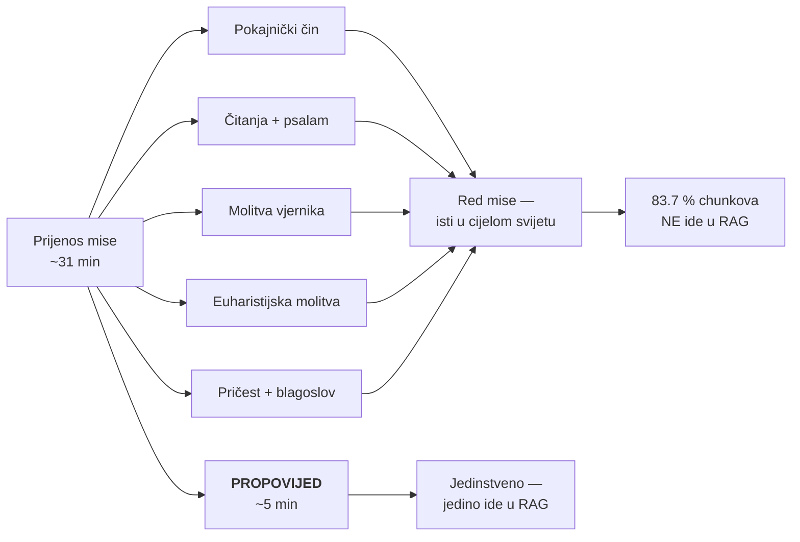
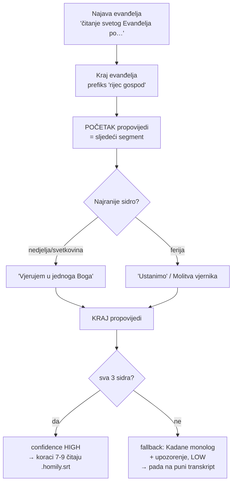

# Ekstrakcija propovijedi iz prijenosa sv. mise (Nova Eva) — 2026-08-05

Zašto se prijenosi misa ne smiju obraditi kao obična epizoda, kako se propovijed
reže, koje su mjere to potvrdile i što je ostalo neprovjereno.

**Vezani dokumenti:** [`PIPELINE_FULL.md`](./PIPELINE_FULL.md) (koraci 0→13),
[`UNLISTED_PIPELINE.md`](./UNLISTED_PIPELINE.md) (ad-hoc protokol),
[`speaker_attribution_hallucination_2026-07.md`](./speaker_attribution_hallucination_2026-07.md)
(strict mode koji je odbio pogađati ime propovjednika),
[`data_contract.md`](./data_contract.md) (granica prema `domovina-rag`).

---

## 1. Problem

Kanal Nova Eva ima dva odvojena toka. `/videos` su montirane nedjeljne propovijedi
don Damira Stojića (~70 % pokrivenosti nedjelja). `/streams` su **dnevni prijenosi
sv. mise iz crkve sv. Josipa u Varaždinu**, koje slave don Anto Stojić SDB, don
Ivan Šibalić SDB i don Zvonimir Tomaš SDB. Propovijedi te trojice ne postoje
nigdje osim unutar streamova.

Misa je međutim najvećim dijelom Red mise — tekst identičan u cijelom svijetu.
Ako cijela misa uđe u RAG, korpus se zatrpa near-duplicate chunkovima.



## 2. Mjerenja

Obrađene tri mise: **24.7.2026.** (petak, ferija + spomendan sv. Šarbela),
**23.7.2026.** (četvrtak, spomendan sv. Brigite), **2.8.2026.** (nedjelja, 10:30).

### 2.1 Koliko je mise boilerplate

Mjereno na misi 24.7. nakon punog prolaska pipelinea (Opus backend):

| Sloj | Propovijed | Liturgija | Udio liturgije |
|---|---|---|---|
| RAG chunkovi | 7 | 36 | **83.7 %** |
| Znakovi RAG teksta | 5 293 | 25 017 | 82.5 % |
| Sekcije članka | 3 | 13 | — |
| Znakovi članka | 2 902 | 10 376 | **78.1 %** |
| Trajanje | 5 min 11 s | 25 min | 83.0 % |

Ekstrapolirano na 426 misa: **~15 300 near-duplicate chunkova** naspram ~3 000
nosivih.

### 2.2 Head-to-head: dvije različite mise

Različita čitanja, različiti sveci, isti Red mise. 4-grami, normalizirano:

| Usporedba | Dijeljenih 4-grama | Containment |
|---|---|---|
| Liturgija ↔ liturgija | **496 / 1522** | **32.6 %** |
| Propovijed ↔ propovijed | **0 / 699** | **0.0 %** |

Nula — ne "malo". 32.6 % je **donja** granica jer ASR šum umjetno smanjuje
podudaranje.

### 2.3 Nuspojava koja je važnija nego što izgleda

Svaka misa počinje **misnim nakanama** — imenima pokojnika i obitelji naručitelja:

```
[00:00:29] Mijeslavna je posljednja posljednja dva djela koja se učinila poslije.
           Parić, Ivančan Marijana, veru Fotes.
```

Batch od 426 misa unio bi stotine imena privatnih osoba u pretraživ korpus.
Rez propovijedi ih izbacuje usput. Ako se ikad odluči indeksirati punu misu, to
mora biti svjesna odluka.

### 2.4 Što NIJE boilerplate izvan propovijedi

Ranija tvrdnja "sve osim propovijedi je smeće" je pretjerana. Od 13 liturgijskih
sekcija ~2 nose mjesno/datumski specifičan sadržaj:

- `Zagovori za Crkvu, papu Lava i biskupa Božu`
- `Dvadeset četvrti u mjesecu: blagoslov po zagovoru Marije Pomoćnice` — varaždinska
  salezijanska specifičnost, ne opći obrazac

Zaključak se ne mijenja, ali ako se rez ikad proširi, tih par sekcija vrijedi
zadržati.

## 3. Detekcija granica — i zašto je prvi dizajn bio kriv

Prvotna pretpostavka je bila da je **strukturni signal** (najduži neprekinuti
monolog) primarni, a liturgijska sidra samo potvrda. **To je krivo.**

Na misi je slavitelj isti govornik i za evanđelje i za propovijed, **bez prekida** —
izmjereno: `SPEAKER_00` drži `05:17 → 11:46` u komadu. "Najduži monolog" bi zato
progutao evanđelje, a evanđelje je točno ono što ne smije u RAG.



### 3.1 Tri zamke

**1. Otvarači propovijedi NISU pouzdani.** Misa 24.7. počinje s "Bratovi i sestre",
ali 23.7. kreće **ravno u životopis sv. Brigite** bez ikakvog oslovljavanja. Verzija
koja je granicu vezala na otvarač dala je na 23.7. **21 min / 77 % mise**. Otvarač
smije biti samo potvrda, nikad granica.

**2. Canary izobliči "Riječ Gospodnja".** Izgovara se brzo i preklapa s odgovorom
puka:

| Misa | Canary ispis | Hvata li `rijec gospod` |
|---|---|---|
| 24.7. | „Riječ gospod**čima svete**" | ✓ |
| 23.7. | „Riječ gospod**ine**" | ✓ |
| 2.8. | „Riječ gospodnja." (čisto) | ✓ |

Zato se hvata samo prefiks, i to **tek iza najave evanđelja** (inače lažni pogodak
na kraju prvog čitanja).

**3. Vjerovanje postoji SAMO nedjeljom i o svetkovinama.** Na ferijalni dan
propovijed prelazi ravno u Molitvu vjernika. Sidro vezano na Vjerovanje nikad ne bi
okinulo na radni dan i rez bi curio dalje u misu. Uzima se **najranije** sidro koje
se pojavi. `"Ustanimo"` je *inclusive* jer zna biti zalijepljen na kraj zadnje
rečenice propovijedi (24.7.: „…nekad stostruko ustanimo.") — ekskluzivni rez pojeo
bi cijelu zadnju minutu.

### 3.2 Rezultati

| Misa | Tip dana | Propovijed | Trajanje | Udio | Krajnje sidro | Čistoća | Conf. |
|---|---|---|---|---|---|---|---|
| 24.7. | ferija | 06:33 → 11:43 | 5 min 11 s | 17.0 % | „ustanimo" | 93 % | HIGH |
| 23.7. | spomendan | 07:40 → 11:28 | 3 min 48 s | 13.7 % | „ustanimo" | 89 % | HIGH |
| 2.8. | **nedjelja** | 17:32 → 27:37 | 10 min 06 s | 20.8 % | **„vjerujem u jednoga Boga"** | 84 % | HIGH |

Sve tri ručno provjerene. **Nezavisna potvrda:** Opus je, čitajući cijeli transkript
bez ikakvih sidara, u outlineu označio „Homilija (1. dio)" na **00:06:33** —
identično ekstraktoru.

## 4. Integracija u korake 7-9

Prošireno je postojeće `resolveDiarizedSrt` u sva tri skripta, ne novi mehanizam.
Prioritet **`homily → sortformer → canary`**. Discovery i izlazna imena ostaju
canary-anchored, pa se dedup po leksikografski najvećem `_{date}_{model}.article.json`,
R2 putanje i `count_progress.js` ne mijenjaju — pomiče se samo izvor čitanja.

Gate: `confidence === "high"` **i** `timestamps_preserved === true`. LOW/medium pada
na puni transkript — krivi rez je gori od dugog. Escape hatch:
`DOMOVINA_IGNORE_HOMILY=1`.

Helper je **copy-pastean u sva tri skripta** po konvenciji repoa (nema shared modula)
— pri izmjeni mijenjati u sve tri kopije.

**Timestampovi se čuvaju.** Nikad ne rezati audio pa re-transkribirati — to bi
vratilo timestampove na nulu i razbilo deep linkove i screenshote koji gađaju
izvorni YouTube video.

Provjereno: tri mise razrješavaju na `homily` (5 071 / 4 274 / 7 756 zn), ne-misni
video ostaje na `canary` (11 363 zn), `DOMOVINA_IGNORE_HOMILY=1` vraća puni
transkript (18 419 zn). `generate_article_gemini.test.js` 60/60.

## 5. Identifikacija propovjednika po glasu

Model `pyannote/wespeaker-voxceleb-resnet34-LM`, ~90 s govora po uzorku:

| Usporedba | Kosinusna sličnost |
|---|---|
| Propovjednik 24.7. ↔ Šibalić 2018a | **0.820** |
| Propovjednik 24.7. ↔ Šibalić 2018b | **0.848** |
| Šibalić 2018a ↔ 2018b (isti čovjek, dan razmaka) | 0.957 — gornja referenca |
| **Kontrola**: čitač s iste mise ↔ Šibalić | 0.096 / 0.104 |

Razdvajanje ~8×. **Stilometrija je za isto bila neuvjerljiva** — „znači" se pojavljuje
6.5× rjeđe 2026. nego 2018., što na ~700 riječi ne razlikuje govornika od registra.

**⚠️ Kontrola je bila lagana.** Čitač se glasovno očito razlikuje. Pravi test je
Šibalić protiv Ante Stojića i Zvonimira Tomaša — slična dob, isti naglasak, ista
crkva, isti mikrofon. Prag ~0.5 treba kalibrirati na njima **prije nego se ijedno ime
prikaže na stranici**.

Preporučeni pristup: **ne anotirati N epizoda nego N glasova.** Klasterirati
embeddinge propovijedi bez oznaka → čovjek označi svaki klaster jednom → propagirati.
Za Varaždin ≈ 3 oznake za 426 misa.

## 6. Otvoreno / neprovjereno

- **KORAK 6.5 nikad nije pokrenut** — nula `.embeddings.json` u repou. Skripta nema
  `--file`/`--video-id`, samo `--channel`/`--limit`.
- **Validirano 3 od 426 misa.** Netestirano: misa **bez propovijedi** (ferijalno je
  fakultativna), **koncelebracija** gdje propovijeda netko drugi, i
  **`3 POLNOĆKE - 20h, 22h, 24h`** — tri mise u jednom videu, gdje bi ekstraktor našao
  jednu propovijed i tiho ispustio dvije.
- **Nema ingestion puta za mise.** `refresh_podcasts.sh` skenira `/videos`; mise su na
  `/streams`. Filtriranje po naslovu ne radi: `"sv. misa"` = 426 od 2010, `"misa"` = 823,
  a postoje i mise bez te riječi (`Utorak, 19:00h - A - 3.3.2026.`, `BOŽIĆ - 12h`,
  `Velika Gospa`).
- **Disk.** 170 MB po misi → 426 misa ≈ 75–90 GB. DOMOVINA1TB je na 92 % (83 GB
  slobodno) — ne stane; DOMOVINA2TB ima 240 GB. `nova_eva` **nema unos u `storage.conf`**.
  Vrijedi razmotriti brisanje WAV-a i mkv-a nakon ekstrakcije (104 od 170 MB).
- **Registry.** Unos `nova-eva` ima `tracking.enabled: false`, `voditelji: []`,
  `metadata.status: "unknown"`. Salezijanska pripadnost i imena svećenika nisu zapisani.
- **Trošak.** Opus backend je za jednu misu potrošio $1.21 (4 poziva, 77k tokena).
  Za batch koristiti `vertex`, ne `claude`. Na propovijedi (17 % teksta) trošak pada ~5×.
- **UI za pregled propovijedi** nije rađen. Treba agregat `homilies.json` na CDN-u; Flutter
  čita samo CDN. Liturgijski dan i čitanja moraju ući u metapodatke **od prve epizode** —
  to je join key za pogled „isto evanđelje, različiti propovjednici"; naknadno dodavanje
  znači reprocessing.

## 7. Preporučeni sljedeći korak

Klaster-pilot na ~20 misa: pokrenuti KORAK 6.5, klasterirati embeddinge propovijedi i
provjeriti razdvajaju li se tri varaždinska svećenika čisto. To je jedini podatak koji
nedostaje prije nego se ime smije prikazati. Tek zatim odluka o punom backfillu, s
izmjerenom stopom LOW/fallback umjesto pretpostavke.
