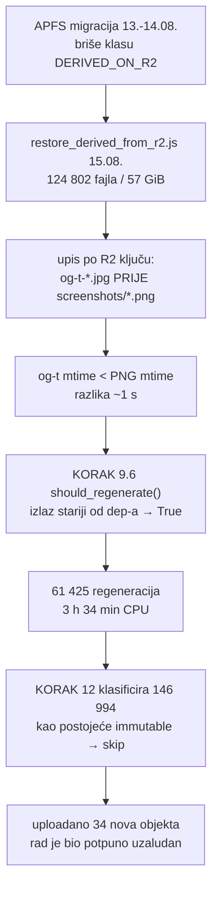

# mtime-inverzija nakon bulk restorea — KORAK 9.6 regenerirao 61 425 već postojećih og-t slika

**Datum:** 2026-08-16
**Repo:** `fetch.domovina.tv`
**Povod:** prvi čisti nightly prolaz nakon APFS migracije (13.–14.08.) i restorea (15.08.)

## Sažetak

Nightly 16.08. prošao je s exit 0 i koraci 7–12 su stvarno izvršeni, ali je
**KORAK 9.6 (og-sections) pojeo 3 h 34 min od ukupnih 4 h 30 min** regenerirajući
**61 425 og-t JPEG-ova koji su već postojali i lokalno i na R2**.

Uzrok nije nedostatak R2-aware skipa. Uzrok je **inverzija mtime-ova** koju je
napravio `restore_derived_from_r2.js`: on ne čuva `LastModified` s R2, nego svaki
vraćeni fajl dobiva vrijeme upisa. Kako `--kind both` vraća obje klase isprepleteno,
og-t JPEG i njegov izvorni screenshot PNG dobiju mtime u razmaku od **jedne sekunde**
— a tko je od njih dvoje ispao stariji odlučeno je redoslijedom upisa, ne semantikom.

Provjereno na disku:

```
og-t-179.jpg                          2026-08-15 13:07:24
..._screenshots/..._00-00-10.png      2026-08-15 13:07:25   ← 1 s kasnije
```

`generate_og_sections.py:should_regenerate()` regenerira ako je izlaz **stariji od
bilo kojeg dep-a** (`article.json` + izvorni PNG). Jedna sekunda razlike = puna
regeneracija.

## Zašto je to promašilo gotovo sve, a ne pola

Očekivalo bi se ~50/50 ako je redoslijed slučajan. Stvarno stanje po mtime-u
(uzorak 20 000 og-t fajlova):

| mtime | broj | značenje |
|---|---|---|
| 2026-08-16 | 17 942 | regenerirano ovim nightlyjem |
| 2026-08-15 | 465 | preživjelo restore (og-t upisan **nakon** svog PNG-a) |
| ≤ 2026-07-31 | ~1 600 | nikad obrisano migracijom |

Restore ide po R2 ključu, a `images/{id}/og-t-{sec}.jpg` leksikografski dolazi
**prije** `images/{id}/screenshots/{ts}.png`. Zato og-t gotovo uvijek završi stariji
od svog izvora — nije coin-flip, nego sustavna posljedica poretka ključeva.

## Tok kvara



Da je ovo prošlo neprimijećeno, potvrda bi izostala jer korak 12 uredno javi
„Uploadano: 4.8 MB" — R2 je cijelo vrijeme imao točne bajtove. Jedini trag je
vremenska os na KORAK banneru, uvedena commitom `0b0b5d2` istog dana.

## Zašto trošak nije katastrofa, ali zamka jest

Regeneracija je **jednokratna**: og-t su sad lokalno s mtime-om 2026-08-16, koji je
noviji od izvornih PNG-ova (2026-08-15), pa idući prolaz uredno preskače. Ali zamka
je latentna — **svaki budući bulk restore je opet aktivira**, a s rastom korpusa
raste i cijena.

Bitna razlika prema ranijem zapisu u memoriji: korak 9.6 **nije** bio „uredan
preskakač". Njegov gate je mtime-usporedba, a mtime nije svojstvo sadržaja nego
artefakt načina na koji je fajl nastao. Bulk restore je operacija koja mtime
uništava po definiciji.

## Opcije popravka (nijedna nije izvedena 16.08.)

| # | Zahvat | Ocjena |
|---|---|---|
| 1 | `restore_derived_from_r2.js` postavlja `utimes()` na R2 `LastModified` | **preporučeno** — popravlja uzrok za sve potrošače mtime-a, ne samo 9.6 |
| 2 | Restore obrađuje `screenshots` prije `og-sections` | krhko — ovisi o redoslijedu, ne o istini |
| 3 | 9.6 dobiva R2-aware skip kao korak 10 (`2e45220`) | pomaže, ali ostavlja mtime-inverziju drugim koracima |
| 4 | 9.6 uspoređuje sadržaj/postojanje umjesto mtime-a | skupo (61k hasheva) |

Opcija 1 je jedina koja ne ostavlja isti problem sljedećem koraku koji se osloni na
mtime. R2 `ListObjectsV2` već vraća `LastModified` u odgovoru koji restore ionako
čita, pa nema dodatnog LIST troška.

## Ostali nalazi istog prolaza

- **KORAK 6**: 3227/3227 diarized, 0 za obradu → popravak HF tokena (15.08.) drži.
- **KORAK 8**: 2 od 3 članka uspjela. Pao `6dcab9c9837` (subclub): `claude` CLI tri
  puta vratio exit 1 uz `input_tokens: 0, duration_api_ms: 0` — dakle CLI je pukao
  **prije** API poziva. Nije veličina ulaza: `cd7ac05aabf` (93 KB) je isti prolaz
  prošao, a pali ima 80 KB. Faza 1 i iteracija 1 su spremljene u `_raw/`; članak ne
  postoji pa ga idući nightly automatski ponavlja.
- **KORAK 10**: 228 neuspjelih frameova, ali **0 videa obrađeno** — sve su to poznate
  rupe koje ni R2 nema (`KvJlt9ewgTQ` u dva direktorija, `iG2G9tLSyzs`, `e9CzkhTD43M`,
  `1R1_ZbmLyJI`, `jzlPf100vy4`, te po 1 frame za `0qt-wHxiFMY`, `UCiGz2aBUhU`,
  `eKVHg2z3E_8`). Čekaju iPhone proxy.
- **iPhone proxy** (`100.71.146.11:8888`) i dalje nedostupan → **6** fetcheva na
  HTTP 403, ne 3 kako je zabilježeno 15.08.: uz `nYU3eJQTmaw`, `aJY04aIYZEI`,
  `pqJbevwuORY` dodali su se `xGst3nZbB1c`, `h_6vqQEL2uc`, `OKXoCOOY05M`. Svi su u
  `failed[]`, retry je automatski.
- **launchd**: `tv.domovina.rag.sync` je sad exit 0 (bio 1 — bila je posljedica toga
  što nightly 15.08. nije proizveo ništa novo). Ostaje `ai.domovina.nightly-build` = 1,
  drugi repo, neistraženo.
- **Kozmetika loga**: KORAK banneri pišu lokalno vrijeme, a node/python skripte unutar
  koraka UTC — isti trenutak se u logu vidi kao 07:28 i 05:28.

## Vezani dokumenti

- `../domovina-storage/docs/2026-08-15-nakon-migracije.md` §6–§9 — migracija, gubitak
  klase `DERIVED_ON_R2`, restore
- `docs/PIPELINE_FULL.md` — koraci 0→13
- memory: `derived_files_are_idempotency_signals`, `restore_derived_from_r2_tool`,
  `mtime_unsafe_after_bulk_restore`
