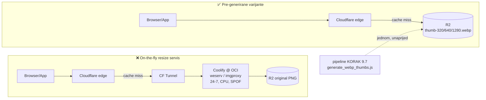

# WebP thumbnail varijante — zašto pre-generiranje, a ne resize servis

**Datum:** 2026-08-25
**Status:** ✅ implementirano, katalog backfillan
**Dodiruje:** `generate_webp_thumbs.js`, `upload_to_r2.js`, `domovina.ai/lib/widgets/cached_thumbnail.dart`, `domovina.ai/lib/services/cdn_config.dart`

## Problem

Liste epizoda u Flutter appu su se sporo učitavale. Prvotna dijagnoza (kolovoz 2026)
bila je „previše paralelnih HTTP requestova" i vodila je prema dizanju on-the-fly
image resize servisa.

Prava dijagnoza je bila drugdje. Mjereno na produkcijskom `KvJlt9ewgTQ`:

```
https://cdn.domovina.ai/images/KvJlt9ewgTQ/thumbnail.png
  1280×720, PNG, 829.635 B = 810 KB
```

PNG je bezgubitni format namijenjen grafici s plohama boje. Za fotografski
screenshot iz videa je najgori mogući izbor. Lista od 20 epizoda povlačila je
**~16 MB**.

Nije bio problem broj requestova. Problem je bio što svaki request nosi 810 KB
tamo gdje treba 13 KB.

## Izmjereno

Isti izvorni PNG, ImageMagick, `-strip`, bez upscalea:

| Varijanta | Veličina | vs. original |
|---|---|---|
| `thumbnail.png` 1280px (original) | 810 KB | — |
| **WebP q80 @320px** | **13 KB** | **61×** |
| JPEG q82 @320px | 18 KB | 45× |
| **WebP q80 @640px** | **33 KB** | **24×** |
| JPEG q82 @640px | 51 KB | 16× |
| **WebP q80 @1280px** | **71 KB** | **11×** |
| JPEG q82 @1280px | 133 KB | 6× |

Lista od 20 epizoda: **15,8 MB → 0,3 MB**.

## Odluka: pre-generiranje, ne resize servis

Razmatrane su četiri opcije:

| Opcija | Ishod |
|---|---|
| `weserv/images` na Coolifyju | ❌ odbačeno — vidi niže |
| `imgproxy` na Coolifyju | ❌ nepotrebno |
| Cloudflare Image Transformations | ❌ nepotrebno |
| **Pre-generirane varijante na R2** | ✅ **odabrano** |



Desna grana nema ničega što bi se moglo srušiti, preopteretiti ili zloupotrijebiti:
između edgea i bajtova stoji samo R2.

On-the-fly resizing rješava **nepredvidive** transformacije: user-generated
sadržaj, proizvoljne dimenzije, slike koje se mijenjaju. Naš slučaj je suprotan:

- Katalog je fiksan (~3.157 epizoda) i raste polako
- Thumbnaili su **immutable** — screenshot epizode iz 2019. se neće promijeniti
- Trebaju nam **3 fiksne dimenzije**, ne proizvoljne
- Pipeline te slike **ionako već proizvodi**

Za takav profil je servis koji na svaki cache miss iznova računa isti
deterministički rezultat čista režija.

### Što pre-generiranje eliminira

- Nema servisa u request pathu → jedan SPOF manje na OCI kutiji koja
  [još nema backup](../../domovina-infra/docs/05-backup-strategy.md)
- Nema WAF pravila ni URL potpisivanja — nema abuse surfacea
- Nema CPU-a pri requestu, nema cold starta
- Nema Docker imagea za održavati

### Zašto ne `weserv/images` (konkretno)

`ghcr.io/weserv/images:5.x` je **single-platform `linux/amd64`** — nema arm64
manifesta. Ciljani server `domovina-001` je `aarch64` (Ampere Altra, Neoverse-N1),
a `binfmt_misc` na njemu ima registriran samo `python3.12` — **qemu nije
instaliran**. Kontejner se ne bi digao (`exec format error`), ne bi radio sporo.

Uz to: weserv nema GitHub releaseove (samo rolling `5.x` tag → nema pinnanja ni
rollbacka) i ima 5 contributora naspram 111 kod imgproxyja.

Tvrdnja „weserv je optimiziran za Cloudflare" je zamjena teze: javni *servis*
wsrv.nl se vrti na Cloudflareovoj mreži, ali *software* (nginx + Lua + libvips)
nema ništa Cloudflare-specifično. Self-hostan na OCI ne donosi ništa od toga.

### Zašto ne Cloudflare Image Transformations

Nije loša opcija i cijena je danas niska (Free: 5.000 unique transformations/mj;
Paid: $0,50/1.000, naplata po **unique transformation**, ne po requestu — pun
backfill 3.157 × 3 ≈ 9.500 bi bio jednokratno ~2,25 $). Ali uvodi ovisnost i
neizvjesnost: ako edge cache izbaci dugi rep starih epizoda, transformacije se
mogu ponovno brojati. Kod statičnih fajlova te neizvjesnosti nema.

## Implementacija

### Generiranje — `generate_webp_thumbs.js`

ImageMagick (isti alat i spawn-obrazac kao `generate_og_image.js`):

```
magick {src} -resize {w}x> -strip -quality 80 -define webp:method=6 {out}
```

- `{w}x>` — proporcionalno, **nikad upscale** (izvor uži od tražene širine
  ostaje kakav jest; inače bi 1280px iz 640px originala bio veći i mutniji)
- `-strip` — EXIF/ICC je na thumbnailu balast
- q80 je knee-point: q90 udvostruči bajtove za razliku koja se ne vidi,
  q70 počne mrljati gradijente

Dva izvora: lokalni pipeline output (`--input-dir`) ili backfill s CDN-a
(`--from-cdn`), po uzoru na `backfill_og_sections_from_cdn.py`.

### Upload — `upload_to_r2.js`

Varijante idu kroz **postojeći** uploader (MD5/ETag idempotencija, immutable
`Cache-Control`, CF purge) — dodani su samo `.thumb-{w}.webp` u `UPLOAD_SUFFIXES`,
`image/webp` u `CONTENT_TYPES`, i mapping u `getFlutterKey`:

```
{channel}/{base}.thumb-{w}.webp  →  images/{videoId}/thumb-{w}.webp
```

Backfill koristi temp kanal `_webpbackfill/`, a izvor se sprema kao `.src.png`
(NE `{base}.png`) da uploader ne re-uploada original preko sebe — collect
prihvaća samo točan `{base}.png`.

### Klijent — `CachedThumbnail`

Logika je namjerno **u widgetu**, ne u ~12 call-siteova koji zovu
`CdnConfig.thumbnailUrl`. Widget prepozna kanonski `/images/{id}/thumbnail.png`
i sam ga zamijeni varijantom prema stvarnoj render-širini × devicePixelRatio.

**Fallback:** ako varijanta 404-a, `errorListener` jednom prebaci na originalni
PNG. U sretnom slučaju nema nijednog dodatnog requesta — nema probe-a unaprijed
(za razliku od `resolveMedia` kod videa, gdje je probe opravdan jer je datoteka
velika).

## `og:image` NAMJERNO ostaje JPEG

`og-share.jpg` (1200×630, progressive JPEG q85) se **ne** pretvara u WebP.

Link preview ne renderira browser nego crawler svake platforme (Facebook,
WhatsApp, LinkedIn, X, Telegram…). Ti crawleri su konzervativni i **nijedan ne
dokumentira WebP podršku** — Facebookov službeni dokument navodi samo dimenzije
i 8 MB limit, o formatima šuti.

Odnos rizika je asimetričan: dobitak je ~60 KB jednom po dijeljenju, gubitak je
da se preview ne prikaže **uopće** i link izgleda kao gola URL-a.

Za **in-app** prikaz WebP je potpuno siguran — Flutter sam dekodira sliku, ne
ovisi o browseru. (Browserska podrška je ionako 96,18%, Safari 16+/iOS 14+.)

## Rezultat backfilla (2026-08-25)

```
epizoda s thumbnailom:   3.016   → 9.042 varijante
audio-only (bez thumba):   171   → očekivano, app renderira cover fallback
izvor (PNG):            1.762 MB
varijante:                254 MB
trajanje:                 212 s  (concurrency 8, lokalno na Macu)
```

R2 zauzeće +254 MB (free tier je 10 GB → 2,5%).

### Provjereno na produkciji nakon uploada

Nasumični uzorak 40 epizoda: 40/40 dostupno, `content-type: image/webp`,
`cache-control: immutable`, edge cache `MISS → HIT`.

Stvarni bajtovi povučeni s CDN-a za listu od 20 nasumičnih epizoda:

| | Veličina |
|---|---|
| prije (`thumbnail.png`) | **13,73 MB** |
| sada (`thumb-320.webp`) | **0,19 MB** |
| | **73× manje (−98,6 %)** |

(73× naspram 61× iz tablice gore jer prosječna epizoda ima nešto veći PNG od
onoga na kojem je mjerenje prvi put rađeno.)

Audio-only epizode su beamly/transistor kanali bez YouTube videa
(`_yt_matched === false`) — imaju `audio.mp3`, nemaju i nikad neće imati
`thumbnail.png`.

## Zasebni nalaz: JSON se ne cachira na edgeu

Usput izmjereno:

```
/data/{id}/info.json      cache-control: public, max-age=31536000, immutable
                          cf-cache-status: DYNAMIC     ← NE cachira se
/images/{id}/thumbnail.png
                          cf-cache-status: MISS → HIT  ← cachira se
```

Cloudflare po defaultu cachira po **ekstenziji**, iz fiksne liste. `.json` na
njoj nije, i `Cache-Control` s originea to sam od sebe ne mijenja. Posljedica:
svako otvaranje appa udara u R2 za svaki JSON.

**Riješeno isti dan** — `setup_cdn_cache_rule.sh` kreira dva Cache Rulea:

| Putanja | Edge TTL | Razlog |
|---|---|---|
| `/data/**.{json,md,srt}` | **1 dan** (override) | Ograničen namjerno, vidi niže |
| `/channels/**.json` | respect origin (60 s) | Uploader već postavlja ispravno |

Nakon primjene, izmjereno na 50 zahtjeva (10 „korisnika" × 5 fajlova iste
epizode): **49 HIT s edgea, 1 MISS do R2**. Prije toga svih 50 išlo bi na R2.

### Zašto 1 dan, a ne `respect_origin`

`/data/*` nosi `immutable` (1 godina). Da edge to poštuje doslovno, a artefakt
se ipak regenerira, edge bi servirao stari sadržaj **godinu dana**. Purge to ne
bi spasio: `purgeCloudflareCache()` u `upload_to_r2.js` zove se **samo za
`.mp4`** (`purgeCloudflareCache(mp4Urls)`), JSON nikad. Upravo je ta kombinacija
i bila razlog zašto je JSON prvotno držan izvan cachea.

Ograničen TTL znači da se zastarjelost sama izliječi u 24 h, bez ijednog purge
poziva. Kad se pokaže da se ništa ne mijenja, TTL se može dići na 7 dana.

### Što NIJE riješeno: browser TTL

Pravilo sadrži `browser_ttl: override_origin 3600` i Cloudflare ga prihvaća, ali
**ne prepisuje `Cache-Control` u odgovoru** — provjereno na tri svježa MISS-a,
i dalje stiže origin `max-age=31536000, immutable`. Vjerojatno ograničenje plana.

Posljedica: klijent može držati `/data/` artefakt godinu dana.
- **Flutter app nije pogođen** — `package:http` nema HTTP cache, svaki start
  ponovno dohvaća.
- **Web build jest.** Ako to postane problem, jedini pouzdan zahvat je
  promijeniti `CACHE_CONTROL_IMMUTABLE` za `data/` ključeve u `upload_to_r2.js`
  i re-uploadati da se metapodaci osvježe.

### Zone ID je hardkodiran u skripti

Token skopiran samo na `Zone → Cache Rules → Edit` **nema `Zone:Read`**:
`/zones?name=…` vrati `success:true` s praznom listom, `/zones/{id}` vrati
`9109 Unauthorized`, a `/zones/{id}/rulesets` uredno radi. Lookup po imenu bi
zato tražio širi token nego što posao zahtijeva.

## Preostalo

- **Purge ne pokriva JSON** — `purgeCloudflareCache()` se zove samo za `.mp4`.
  Dok je edge TTL 1 dan to nije hitno, ali je preduvjet za dizanje TTL-a na
  7 dana. Uz to: `isContentMutable()` vraća `false` za `data/*.json`, pa
  regenerirani artefakt pod istim Flutter ključem uopće **ne bi bio re-uploadan**
  (preskoči se kao „existing immutable") — vrijedi provjeriti je li to namjerno.
- **`index_bundle.json` je 5,14 MB**, `max-age=60`, i ne referencira se nigdje u
  `domovina.ai/lib` ni `web/`. Provjeriti tko ga zove pa ili cachirati ili ugasiti.
- **`info.json` (85 KB) se dohvaća dvaput** po epizodi — dva call-sitea.
- **Screenshotovi** (`images/{id}/screenshots/*.png`) imaju isti problem i ima ih
  više po epizodi nego thumbnailova. Isti postupak bi se primijenio, ali je
  volumen bitno veći pa nije rađen u ovom prolazu.
- **Cache Rule za JSON** — čeka token s odgovarajućom ovlašću.

## Vezani dokumenti

- [`data_contract.md`](data_contract.md) — §8 ključevi na CDN-u
- [`../../domovina-wsrv/README.md`](../../domovina-wsrv/README.md) — napušteni
  weserv plan i razlog (amd64 image na ARM serveru)
- [`../../domovina-infra/docs/01-overview.md`](../../domovina-infra/docs/01-overview.md)
  — OCI instanca. Ondje piše „Shape 4 OCPU / 24 GB (ARM/x86 — provjeri u
  konzoli)"; provjereno preko SSH-a: **`aarch64`**, Ampere Altra
  (Neoverse-N1, CPU part `0xd0c`), bez qemu u `binfmt_misc`.
