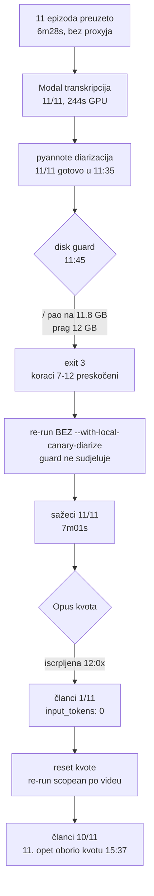

# 26.08.2026. — tihi 403 u nightlyju, backfill 11 epizoda i prvi izmjereni baseline

Jedan dan koji je počeo kao „provjeri backlog", a završio s popravkom uzroka,
punim prolazom kroz pipeline i prvim brojkama koje se mogu koristiti za planiranje.

## 1. Uzrok: PATH je odlučivao koji `yt-dlp` pobjeđuje

Nightly je od 18. do 26.08. gurao epizode u `failed[]`. Obrazac je bio uniforman:

```
[info] QO6S_aCVt3Y: Downloading 1 format(s): 396+251
ERROR: unable to download video data: HTTP Error 403: Forbidden
```

Metapodaci (`.info.json`, `.description`, thumbnail) su prolazili — padao je **samo
medijski stream**. Na disku je ostajala epizoda bez medija.

Uzrok nije bio IP nego **verzija**. `automatic/nightly_pipeline.sh` prependa dva
direktorija, oba iz valjanih razloga:

| linija | direktorij | zašto je tu | `yt-dlp` |
|---|---|---|---|
| 78 | `/Library/Frameworks/Python.framework/Versions/3.13/bin` | Pillow za `generate_og_sections.py` | 2026.08.17 |
| 82 | `/opt/homebrew/bin` | rclone, ffmpeg, jq | **2026.03.17** |

Linija 82 je zadnja, pa je pobjeđivala — nightly je 8 dana vrtio ekstraktor star
pet mjeseci. Interaktivni shell je dobivao onaj drugi i radio, što je maskiralo problem.

Stari ekstraktor vuče `android vr` player API, novi `visionos`. Isti video, isti
format, isti IP:

| | direktno | preko iPhone proxyja |
|---|---|---|
| yt-dlp 2026.03.17 | `403` | — |
| yt-dlp 2026.08.19 | ✅ 21 MB/s | ✅ 0,3 MB/s |

**Rezidencijalni proxy je bio nepotreban.** Radi, ali je ~15× sporiji. Prije nego
se posegne za proxyjem, provjeriti verziju — i to **iz launchd konteksta**, ne iz
svog shella.

### Popravak

`automatic/resolve_ytdlp.sh` (commit `03d993a`) bira **najnoviji** `yt-dlp` na PATH-u
umjesto da to prepusti redoslijedu prependa, i glasno javi ako je i najnoviji stariji
od ~90 dana. Sourcaju ga nightly i priority.

Usporedba verzija ide preko `10#`: mjesec i dan nisu zero-padded u svim buildovima
(`2026.3.17` vs `2026.08.19`), pa bi leksikografska usporedba proglasila stari
novijim — točno obrnuto od namjere.

## 2. Zamka u vlastitom auditu

Prvi popis backloga imao je 12 epizoda. Bio je **11**.

`h_6vqQEL2uc` je uredno obrađen 17.08. u `muzevni_budite` (članak, Magisterium, EPUB,
RAG, CDN 200). U `_unlisted` je ostao samo `.info.json` — `auto_reuse_adhoc.js` seli
medije u kanal, a metapodatke ostavlja. Audit-pravilo „ima metapodatke, nema medij
⇒ preuzimanje je palo" ga je zato prijavilo kao rupu.

Da je ušao u prolaz, obradio bi se **drugi put pod `_unlisted`** i prepisao dobar CDN
zapis novim člankom bez Magisteriuma i EN prijevoda — CDN ključ je po video ID-u, ne
po kanalu. Parkiran je u `_unlisted/.reused-into-channel/` (dot-dir preskaču svi skeneri).

Trijaž prije nego se rupa proglasi rupom:

```bash
find -L storage/output -maxdepth 2 -name "*_yt_<ID>.*" | sed 's|storage/output/\([^/]*\)/.*|\1|' | sort -u
curl -s -o /dev/null -w '%{http_code}\n' https://cdn.domovina.ai/data/<ID>/article.json
```

## 3. Redoslijed padova kroz dan



Dva prekida, dva različita uzroka, oba **obrane a ne kvarovi**.

### 3A. Disk guard — Docker, ne pipeline

Guard je opalio na 11,8 GB uz prag od 12 GB. Krivac je Docker VM
(`MemoryMiB 14336`), koji pini ~12,8 GB swapa na sistemskom disku.

Bitno za dijagnostiku:

- `/` je startao na **22 GB** nakon čišćenja ~10 GB cachea — i to nije bilo dovoljno.
- Swap se nakon izlaska pyannotea **ne isprazni sam**; `/` ostaje na 11,8 GB.
- Prekid je pao **na kraju** koraka 6: svih 11 epizoda već je imalo
  `.canary.diarized.srt`. Izgubljeni su samo koraci 7–12.

Zaobilazak koji je prošao, bez diranja tuđih kontejnera: ponoviti run **bez**
`--with-local-canary-diarize`. Diarizacija je gotova, pa korak 6 i njegov guard ne
sudjeluju, a koraci 7–12 su daleko lakši na RAM-u.

Preduvjet: provjeriti da **svih N** ima `.canary.diarized.srt` — inače ovo tiho
preskoči neobrađene umjesto da ih obradi.

### 3B. Opus kvota — headless i interaktivna sesija dijele prozor

Potpis greške:

```json
{"is_error":true,"duration_api_ms":0,"num_turns":1,
 "usage":{"input_tokens":0,"output_tokens":0},"total_cost_usd":0}
```

**Isti potpis** ima i tranzijentni pad CLI-ja zabilježen 16.08. Razlikovanje:

| | tranzijentni pad | iscrpljena kvota |
|---|---|---|
| opseg | jedna epizoda, sljedeća prođe | **sve od te točke nadalje** |
| trajanje pokušaja | varira | sva tri padnu za ~1 s |

Ono što je promaknulo pri planiranju: **interaktivna Claude Code sesija i headless
pipeline troše isti ~5h prozor**. Run od 11 epizoda pokrenut je u 11:56 nakon jutra
interaktivnog rada → prošao 1 članak. Nakon reseta i uz mirovanje interaktivne sesije
prošlo je 9 od 10.

**Jedan prozor ne nosi 11 članaka uz paralelan interaktivni rad.** To je točno ono što
`CLAUDE_WINDOW_START/END` (00:00–02:30) štiti — zaobići ga znači preuzeti taj rizik
svjesno. Vidi [2026-08-26-claude-window-ograda.md](2026-08-26-claude-window-ograda.md).

### 3C. Nikad katalog-wide članci na Opusu

Re-run je scopean **po videu** (`--channel` + `--video-id`), ne katalog-wide.
Razlog je zapisan u `generate_article_gemini.js:905`: 31.07. je nescopean prolaz javio
**3097 videa za obradu na Opusu** kad je done-cache pao.

Uz `--video-id` po epizodi ta klasa greške je nemoguća. `--channel` je isto obavezan —
bez njega se video praćenog kanala obradi i u `_unlisted/` i u `<kanal>/`, dakle 2× kvote.

## 4. Izmjereni baseline

11 epizoda, **10,2 h audia**, prosjek 56 min.

| Faza | Gdje | Wall clock | × realtime | Po epizodi |
|---|---|---|---|---|
| Preuzimanje | lokalno | 6m28s | 95× | 32 s |
| MP3 → WAV | CPU | 23 s | 1600× | 2 s |
| Transkripcija | Modal A100 | 21m17s | 29× | 1m56s |
| — od toga GPU | Modal A100 | **244 s** | 151× | 22 s |
| Diarizacija | Mac M4 Pro, CPU | 35m19s | 17× | 3m12s |
| Sažeci | Opus | 7m01s | 88× | 38 s |

Dvije stvari koje se iz ovoga vide, a nisu očite unaprijed:

1. **Diarizacija je 46 % vremena** i CPU-bound je. Bacanje GPU-a ne pomaže —
   poznata karakteristika pyannotea, ne regresija.
2. **Modal je 21 min wall, ali samo 244 s računanja.** Ostatak je hladan start i
   upload 1179 MB. Poluga za ubrzanje je veličina uploada, ne GPU.

### Tokeni (Opus, izmjereno)

| | pozivi | ulaz | izlaz | ukupno |
|---|---|---|---|---|
| sažetak | 1 | 25k | 2k | ~27k |
| **članak** | **5** | **220k** | **69k** | **~290k** |

Članak je **~10× skuplji od sažetka**. Batch od 25 epizoda ≈ 6M tokena.

### Zamka: `est_usd` laže za pretplatu

`.gemini_usage.json` upisuje `est_usd` i za pretplatničke pozive — za sažetke ovog
runa ispada **$3,40**. To je *notional* iznos po API cijenama ($5/M ulaz, $25/M izlaz).
Polje `project` stoji na `claude-code-subscription`, dakle stvarni marginalni trošak
je **nula**. Taj stupac ne smije ući u izvještaje o potrošnji.

## 5. Otvoreno

- **`7N0gyXAfA4M` nema članak** — oborio kvotu u 15:37. Dir-driven pipeline ga
  pokupi sam u sljedećem prolazu.
- **Koraci 9.x–12 zastarjeli za većinu epizoda.** Screenshotovi, og-sections, EPUB,
  RAG i R2 izvršili su se 12:23–13:40, a članci su nastali 14:15–15:37. U 15:50
  pokrenut dovršetak (`automatic/logs/finish_20260826_1550.log`); **rezultat nije
  verificiran**.
- **CDN nije sinkroniziran s diskom** — u 15:50 bilo 10 članaka na disku, 1 na CDN-u.
  Uz to `data/{id}/*.json` su write-once immutable, pa epizoda koja je već jednom
  objavljena traži `force_upload.js` + CF purge, ne običan upload.
- **Docker poluga nije povučena.** `MemoryMiB` 14336 → 6144 vratilo bi ~8 GB stroju.
  Traži restart Docker Desktopa (pad `domovina-rag` i `pediludium` stacka), pa je
  odluka korisnikova. Dok nije, svaki nightly s novim epizodama je kandidat za isti `exit 3`.
- **`DnzG2OvRflI`** (subclub, 19.08.) — WAV kraći od videa za 4302 s, obrisan pa će se
  pokušati ponovo. Nevezano za ovaj batch.
- **1,2 GB yt-dlp fragmenata** (`.f396.mp4`, `.f251.webm`) od ovih 11. Očekivano
  (`fetch.js` ima `-k`, `count_progress.js:109` ih filtrira), ali zauzimaju mjesto.
- **156 neuspjelih screenshotova** u katalog-wide prolazu (od 63 214 preskočenih,
  57 novih). Nije analizirano.

## Vezani dokumenti

- [2026-08-26-claude-window-ograda.md](2026-08-26-claude-window-ograda.md) — zašto koraci 7+8 odgađaju epizode
- [claude_code_backend_2026-07.md](claude_code_backend_2026-07.md) — SSOT za `--gemini-backend claude`
- [pipeline_memorija_i_propusnost_2026-08.md](pipeline_memorija_i_propusnost_2026-08.md) §3A — Docker kao izvor pritiska na swap
- [transcription_colab_vs_modal_cost_2026-07.md](transcription_colab_vs_modal_cost_2026-07.md) — Colab batch vs Modal ad-hoc
