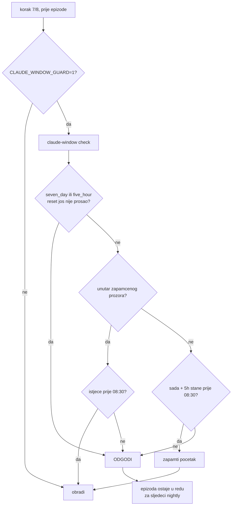

# Claude prozor kvote — zašto koraci 7+8 znaju odgoditi epizodu

*2026-08-26*

Ako u nightly logu vidiš `⏸️ [ODGOĐENO] <base> — …` ili `⏸️ Claude prozor … —
odgađam N preostalih u sljedeći nightly`, ovo je razlog. Epizoda **nije pala**, nego
je namjerno ostavljena za sljedeću noć.

## Problem

`--gemini-backend claude` troši Claude Code **pretplatu**, ne API ključ. Pretplata
mjeri kvotu u prozoru od ~5h. Poziv nakon isteka prethodnog prozora otvara **novi**.

Nightly pipeline ima dugačak rep. Zadnjih 12 runova prije promjene (start 03:00):

| 9m | 10m | 12m | 16m | 18m | 25m | 57m | 1h07 | 1h32 | 2h11 | **4h31** | **6h37** |
|---|---|---|---|---|---|---|---|---|---|---|---|

Medijan ~20 min, ali 14.8. je završio u 09:37 i 16.8. u 07:31. U tim runovima su se
Opus sessioni spawnali u **07:35 i 08:31** i otvarali svjež 5h prozor tik prije nego
korisnik u 08:30 sjedne za komp — pa je jutro počinjalo s već potrošenom kvotom.

**Pomak sata to ne rješava.** Run pokrenut u 01:00 koji traje 6h i dalje zove
`claude` u 07:00. Trebala je ograda unutar samog runa.

## Zašto ne fiksni cutoff

Prva verzija je imala `CLAUDE_WINDOW_END=02:30` u `automatic/nightly_pipeline.sh`.
To je bilo krivo postavljeno pitanje — postoje dva:

| pitanje | odgovor |
|---|---|
| Jesam li **unutar** već otvorenog prozora? | poziv je besplatan do kraja tog prozora |
| Otvaram li **novi** prozor? | mora vrijediti `sada + 5h ≤ 08:30`, dakle prije ~03:30 |

Fiksni 02:30 odgovara samo na drugo → baca ~3h budžeta kad je prozor ionako otvoren
od 00:10. Fiksni 05:30 odgovara samo na prvo → puca kad je taj prozor u međuvremenu
istekao, jer poziv u 05:20 otvara nov do ~10:20. Iz sata se ne vidi koji je slučaj.

## Rješenje

Odluku donosi dijeljeni arbitar **`claude-window`** — repo
`stepanic/launchd-menubar`, `tools/claude-window`, symlinkan u `~/.local/bin`
(sva tri fetch plista ga već imaju u PATH-u). Politika, konfiguracija i 17 testova
su tamo; ovaj repo samo pita.

Arbitar uči tvrde limite iz `quotaLimits` zapisa koje Claude Code CLI ostavlja u
`~/.claude/projects/*/*.jsonl` kad request bude odbijen (nose `resetsAt` i
`rateLimitType`).

## Gdje je ograda uključena

| datoteka | uloga |
|---|---|
| `lib/claude_window.js` | wrapper oko arbitra (`claudeWindowClosed()` / `claudeWindowReason()`) |
| `summarize_gemini.js` | provjera po epizodi u glavnoj petlji (korak 7) |
| `generate_article_gemini.js` | provjera po epizodi, `break` + `deferred` u sažetku (korak 8) |
| `automatic/nightly_pipeline.sh` | postavlja `CLAUDE_WINDOW_GUARD=1` |
| `automatic/priority_pipeline.sh` | isto; `priority_poller.js` širi `{...process.env}` pa flag stigne do koraka 7+8 |
| `automatic/magisterium_pipeline.sh` | isto; poller provjerava prije claima |

Bez `CLAUDE_WINDOW_GUARD=1` ograda **ne radi ništa** — ručni runovi su nepromijenjeni.
Ako arbitar nije dostupan (symlink fali), wrapper propušta posao i viče u log; gora
je varijanta da nightly stane zbog ograde.

## Odgoda, ne degradacija

Alternativa je bila past cutoff pasti natrag na Vertex/Flash. Odbačeno: to poništava
odluku od 2026-07-29 (`docs/claude_code_backend_2026-07.md`) — Flash je u incidentu
atribucije imena (Ivan Voras / `cb4CsFDCDho`) prekršio strict uputu i imenovao
voditelja iz općeg znanja, Opus u slijepom testu nije. Epizoda je trajni statični
sadržaj, pa radije čeka noć nego dobije lošiji tekst.

Pipeline je dir-driven: epizoda bez `.summary.json` ostaje u redu i bude pokupljena
idući nightly sama od sebe. Ne-AI koraci (transcribe, R2 upload, index) nastavljaju
normalno i nakon što se prozor zatvori.

## Praktične posljedice

- **Preko dana arbitar propušta.** Granica koju štiti je *sljedećih* 08:30, pa blokira
  samo ~03:20–08:30. Ad-hoc zahtjevi kroz `priority_poller` tijekom radnog dana nisu
  ništa sporiji.
- **Veliki priljev epizoda se razvuče na više noći** umjesto da pojede jutarnju kvotu.
  Ako to postane problem, prvo provjeri je li uzrok tjedni limit (§ dolje), ne prozor.
- **Tjedni limit je često prava prepreka.** 18.–21.8.2026. je `seven_day` bio pun
  četiri dana zaredom. Tada ni raspored ni ograda ne pomažu — arbitar samo prestane
  retryati u zid.

## Vezani dokumenti

- `stepanic/launchd-menubar` → `SCHEDULING.md` — puna analiza, mjerenja, raspored svih
  launchd jobova, revert procedura
- `docs/claude_code_backend_2026-07.md` — zašto koraci 7+8 uopće idu preko Claude Opusa
- `docs/adhoc_video_processing.md` — prioritetni fast-path
- `docs/2026-08-26-backfill-i-baseline.md` — što se dogodi kad se ova ograda zaobiđe:
  headless run i interaktivna sesija dijele isti prozor, 10 od 11 članaka palo
