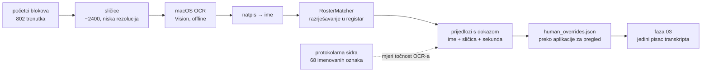

# OCR imena s ekrana kao izvor identiteta govornika — priprema (2026-08-26)

Zamisao korisnika: saborski stream **ispisuje ime i prezime govornika na ekranu**
kad osoba počne govoriti. Ako se izvuku sličice na početku svakog istupa i
propusti ih se kroz **macOS offline OCR**, dobiva se izvor identiteta koji je
potpuno neovisan i o protokolarnoj najavi i o modelu.

Ovo je **priprema, ne izvedba** — feature se radi u zasebnoj sesiji. Ovdje stoji
samo ono što je već izmjereno, da se ne otkriva dvaput.

---

## 1. Zašto je ovo vrijedno baš ovdje

Protokolarno sidrenje staje na 66 % govornog vremena i to je strop: **19 od 28
preostalih govornika predsjedavajući nikad ne imenuje** (upadice, dobacivanja,
„Izvolite odgovor."). Nikakvo proširenje regexa tu ne pomaže —
`docs/sabor_pilot_zakljucak_2026-08.md` §7.

Natpis na ekranu ne ovisi o tome je li itko izgovorio ime. Za tu klasu govornika
to je jedini izvor osim glasovnog otiska.

---

## 2. Što je već provjereno na disku

| činjenica | vrijednost | kako je utvrđeno |
|---|---|---|
| lokalno imamo **samo zvuk** | `raw/part_NN.m4a`, 1.1 GB | `01_ingest.js` skida `-f bestaudio[ext=m4a]` |
| videa na disku **nema** | — | `ls storage/output/sabor/<id>/{raw,audio}` |
| blokova (istupa) | **802** | `aligned_transcript.json` |
| različitih oznaka | 117 | isto |
| **oznaka bez imena** | **46** | isto |
| trajanje govora | 17.9 h | `stats.total_speech_sec` |

**Nije potrebno OCR-ati 20 h videa.** Natpis se pojavljuje kad govornik krene,
pa su ciljne točke **početci blokova**: 802 trenutka. Uz 3 sličice po bloku
(npr. +2 s, +5 s, +10 s) to je **~2400 sličica**, ne stotine tisuća.

---

## 3. Video: veličine su izmjerene, ali možda ne treba skidati

`yt-dlp -F` nad 1. dijelom (20 h ukupno u 4 dijela):

| format | rezolucija | veličina 1. dijela | ~4 dijela |
|---|---|---|---|
| `396` av01 mp4_dash | 640×360 | 382 MiB | **~1.5 GB** |
| `134` avc1 mp4_dash | 640×360 | 582 MiB | ~2.3 GB |
| `397` av01 mp4_dash | 854×480 | 659 MiB | ~2.6 GB |
| `135` avc1 mp4_dash | 854×480 | 1.11 GiB | ~4.4 GB |
| `136` avc1 mp4_dash | 1280×720 | 2.24 GiB | ~9 GB |

⚠️ **Prije skidanja provjeri je li skidanje uopće potrebno.**
`screenshot_youtube.js` u ovom repou već radi upravo ono što treba: *„Ne
downloada cijeli video — samo seekira na timestamp i izvlači 1 frame"* (yt-dlp
daje stream URL, ffmpeg seeka). Za 2400 sličica to je 2400 mrežnih seekova, što
može biti sporije i ranjivije na anti-bot od jednog preuzimanja — **to treba
izmjeriti, ne pretpostaviti.**

Dvije poznate zamke tog alata (obje u memoriji):
* screenshotovi su ispadali **360p** jer su odabrani live-only formati;
* **anti-bot** blok → alat se prebacuje na lokalnu datoteku, koje ovdje nema.

**Otvoreno pitanje o rezoluciji:** natpis mora biti čitljiv OCR-u. 360p je
vjerojatno premalo za pouzdano čitanje imena, 480p možda dovoljno. To se rješava
jednim pokusom nad **jednim** poznatim trenutkom, prije nego se išta skida u
količini.

---

## 4. Kako bi se uklopilo u postojeći sustav

Tri stvari koje iz ovoga slijede:

1. **OCR je izvor PRIJEDLOGA, ne pisac.** Isto mjesto koje već zauzima slijepa
   provjera modelom (`blind_check_agy/w*.json`). Ime ulazi u proizvod tek kroz
   `human_overrides.json`, a transkript i dalje piše samo faza 03. Time run
   ostaje ponovljiv — `docs/sabor_human_in_the_loop_2026-08.md` §1.

2. **Validacijski skup već postoji.** 68 oznaka koje je protokol imenovao su
   gotova provjera: pusti OCR na njihove blokove i izmjeri slaganje. Bez toga bi
   OCR bio još jedan mehanizam koji je „siguran" i kad promaši — pravilo iz §7
   istog dokumenta.

3. **Pogreške OCR-a su podnošljive.** `RosterMatcher` je isti onaj koji već
   razrješava ASR-varijante prezimena („Habijen"/„Habijan", „Auguštan"/
   „Auguštan-Pentek"). Nekoliko krivih slova ne ruši podudaranje; prag 0.86
   odnosno 0.90 za jednorječno ime već je podešen na tu klasu greške.

---

## 5. Što treba provjeriti prije nego se krene

| pitanje | zašto je otvoreno |
|---|---|
| Podržava li Vision **hrvatski**? | `VNRecognizeTextRequest.supportedRecognitionLanguages` — ako ne, latinica se i dalje čita, ali dijakritika strada. Matcher to podnosi, ali treba znati koliko. |
| Koja je **najniža rezolucija** na kojoj se natpis čita? | određuje i veličinu preuzimanja i brzinu OCR-a |
| **Koliko dugo** natpis stoji na ekranu? | određuje koliko sličica po bloku i s kojim odmakom |
| Pojavljuje li se natpis **na svakom** istupu? | ako samo na najavljenima, ne pokriva upravo onih 46 bez imena — a to je cijela svrha |
| Seek-po-sličici vs jedno preuzimanje | mjerenje, ne pretpostavka (§3) |

⚠️ Četvrto pitanje je **kritično i može srušiti cijelu zamisao**: ako režija
natpis stavlja samo kad predsjedavajući najavi govornika, OCR pokriva točno one
koje protokol već pokriva, a upadice i dobacivanja ostaju prazni. **To se
provjerava prvo**, na nekoliko trenutaka iz skupine „nema najave".

---

## Vezani dokumenti

* `docs/sabor_human_in_the_loop_2026-08.md` — sloj ljudskih odluka, aplikacija, revizija
* `docs/sabor_pilot_zakljucak_2026-08.md` — §7: zašto protokol staje na 66 %
* `screenshot_youtube.js` — postojeći seek+frame alat
