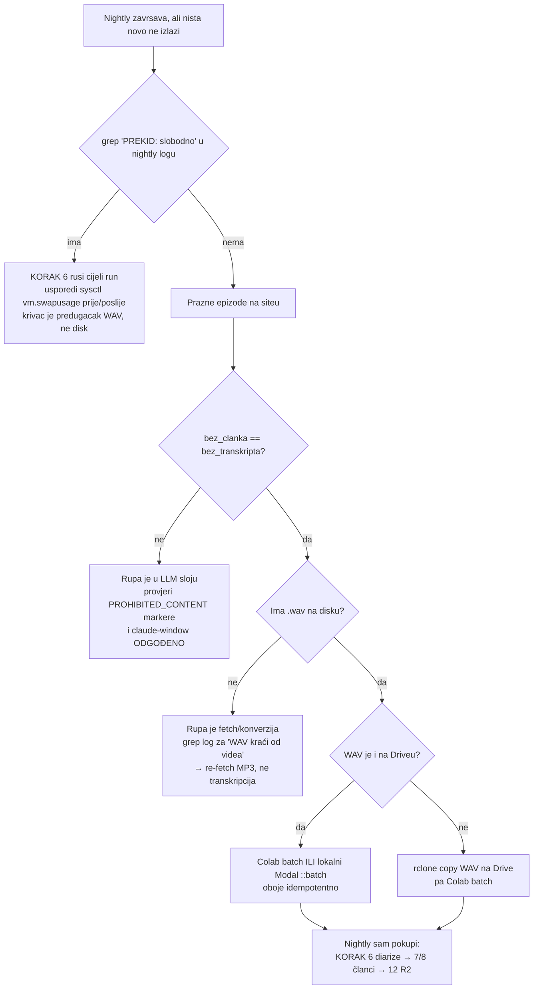

# Prazne epizode na homepageu: nightly Modal korak koji nikad nije opalio

**Datum nalaza:** 2026-08-27
**Simptom:** u railu „UPRAVO STIGLO" na domovina.ai stoji hrpa epizoda bez sadržaja,
dok su *novije* od njih uredno obrađene.
**Opseg:** 14 epizoda (13 iz 01.–26.08.2026. + 1 stara `subclub` epizoda).
**Status:** epizode sanirane ručnim Modal batchem; **uzrok samog kvara nije utvrđen**,
u `run_pipeline.sh` je ugrađena dijagnostika koja ga treba prijaviti u sljedećem nightlyju.

---

## 1. Prvo pitanje: gdje je rupa?

Instinkt je kriviti LLM sloj („Gemini/Opus nije napisao članak"). U praksi je gotovo
uvijek **transkripcija** — vidi i `docs/content_gaps_audit_2026-07-25.md`. Provjera je
jeftina i traje sekundu, pa ide **prije** bilo kakve hipoteze:

```bash
node -e '
const fs=require("fs"),p="storage/meta/channels/data";
let all=[];
for(const f of fs.readdirSync(p)){ if(f==="index.json"||!f.endsWith(".json")) continue;
  const j=JSON.parse(fs.readFileSync(p+"/"+f,"utf8"));
  for(const v of (j.videos||[])) all.push({ch:j.id,date:v.date,id:v.id,pl:v.pipeline||{}});
}
all.sort((a,b)=>String(b.date).localeCompare(String(a.date)));
console.log("bez clanka:",all.filter(v=>!v.pl.has_article).length,
            "| bez transkripta:",all.filter(v=>!v.pl.has_transcript).length);
for(const v of all.filter(x=>!x.pl.has_article))
  console.log(v.date,v.ch,v.id);
'
```

Ako su ta dva broja **jednaka**, rupa je transkripcija i LLM sloj je nedužan. Ovdje su
bili 14 i 14.

Potvrda na disku — epizoda ima `.wav`, nema `.canary.srt`:

```bash
ls storage/output/<kanal>/ | grep -F "<VIDEO_ID>"
```

> **Preduvjetni lanac.** `.canary.srt` → `.canary.diarized.srt` → sažetak → članak.
> Diarizacija je striktan preduvjet za korake 7–12, pa jedan nedostajući SRT gasi
> cijeli AI sloj za tu epizodu i ona zauvijek ostaje prazna na siteu (`has_article`
> je gate za homepage).

## 2. Što je konkretno nađeno

Svih 14 epizoda ima `.wav`, nijedna nema `.canary.srt`. Dvije neovisne stvari:

### 2a. Nightly Modal korak nije transkribirao **nijednu** epizodu praćenog kanala

`KORAK 2.6` javlja isti redak u **svakom** nightly logu od uvođenja single-passa
(02.08.) do 27.08.:

```
   📋 Modal kandidata (scope='channels'): 0
```

To nije „nema se što raditi":

| Noć | KORAK 2 | Modal scan ~20 s kasnije |
|---|---|---|
| 12.08. | `✅ Konvertirano: 4` (točno 4 od zapelih epizoda) | `0 kandidata` |
| 13.08. | `✅ Konvertirano: 1` | `0 kandidata` |
| 14.08. | `✅ Konvertirano: 1` | `0 kandidata` |
| 27.08. | `✅ Konvertirano: 1`, WAV mtime **01:12:34** | scan u **01:13:04** → `0 kandidata` |

U `KORAK 2.5` isto tako nedostaje redak `🔒 Izuzimam N WAV-ova …`, pa je lista bila
prazna već ondje — dakle pao je **scan**, ne petlja koja zove Modal.

**Transkripti koji postoje došli su iz ručnih runova, ne iz nightlyja.** Vremenske
oznake `.canary.srt` datoteka slažu se u dva ručna batcha (~2 min po fajlu = Modal
cold start po epizodi, nije Colab):

- 17.08. 21:08–22:03 → 7 epizoda
- 26.08. 10:50–11:09 → 11 epizoda (`--modal-scope all`; WAV-ovi prethodno `touch`ani
  da prođu `MODAL_FRESH_DAYS` gate)

Otud dojam „novije su obrađene, starije nisu" — nema veze s datumom epizode, nego s
tim je li netko ručno pokrenuo obradu.

**Uzrok nije nađen.** Blok `run_pipeline.sh:594-641` izvađen je doslovno i pokrenut s
pravim parsiranjem argumenata, pod `/bin/bash` 3.2, sa `set -e`, i pod minimalnim
launchd-like okruženjem (`env -i HOME=… PATH=<isti kao u plistu> LANG=hr_HR.UTF-8`).
**Svaki put nađe kandidata** (`FINAL N=1`, `scan_dirs=50`, `mtime=[-mtime -2]`,
`MODAL_ONLY_ID` prazan). Isključeno je i: bash 3.2 vs 5.x, `set -e`, relativni vs
apsolutni `OUTPUT_DIR`, GNU vs BSD `find` (launchd PATH razrješava `/usr/bin/find`),
`MODAL_ONLY_ID`/fast-path (log bi ispisao `⚡ PRIORITETNI FAST-PATH`), cap
`MODAL_MAX_FILES` (log bi ispisao `> cap`), te `.env` override (nema nijedne
`MODAL_*` varijable). Disk je APFS, pa ni mtime granularnost nije u igri.

### 2b. `subclub / DnzG2OvRflI` pada svaku noć — ali MP3 nije kriv

```
❌ [GREŠKA] …_yt_DnzG2OvRflI.mp3: WAV kraći od videa (4302s) — obrisan, provjeri disk/izvor
```

Konverzija detektira da je WAV kraći od prijavljenog trajanja, briše ga — i sutradan
pokušava iznova s istim MP3-om. Beskonačna petlja koja se u logu vidi samo kao
`❌ Grešaka: 1`, a epizoda ostaje bez `.wav`, pa je nikakav Colab/Modal batch ne može
spasiti (`::batch` traži postojeći WAV).

Prva pretpostavka („krnji download, treba re-fetch") **bila je kriva.** Mjerenje:

```
deklarirano (.info.json)  4336 s
stvarno (ffprobe .mp3)    4302 s
manjak                      34 s = 0,8 %
```

`convert_to_wav.js` je imao **apsolutnu** toleranciju `DURATION_TOLERANCE_SEC = 15`, uz
komentar „mp3 vs video zna odstupiti <1s". To vrijedi za yt-dlp izvore, gdje `duration`
dolazi iz samog medija. **Beamly epizode (`subclub`, `launched`) dobivaju `duration` iz
RSS feeda**, gdje odstupanje od promila trajanja nije kvar. Na 72-minutnoj epizodi 15 s
je 0,35 % — pretijesno.

Popravak (2026-08-27): tolerancija je sada `max(15 s, 2 % trajanja)`. Pravi kvar (ubijen
`ffmpeg`, pun disk — incident 2026-07-28) daje manjak reda veličine desetaka posto i
dalje se hvata; metapodaci iz feeda više ne ruše konverziju.

**Pouka:** kad epizoda ima `.mp3` a nema `.wav`, prije nego posegneš za re-fetchom
**izmjeri** koliko stvarno nedostaje:

```bash
ffprobe -v error -show_entries format=duration -of csv=p=0 <file>.mp3
node -e 'console.log(JSON.parse(require("fs").readFileSync(process.argv[1],"utf8")).duration)' <file>.info.json
```

Manjak od nekoliko postotaka = metapodaci/tolerancija. Manjak od desetaka postotaka =
stvarno krnji izvor → re-fetch.

### 2c. Saborska snimka od 20 h rušila je KORAK 6 — i time cijeli AI sloj

Zaseban kvar, otkriven pri saniranju gornjih 14 epizoda, **težih posljedica od njih**.

`diarize_canary.py` u batch modu skuplja WAV-ove `os.walk`-om nad cijelim
`storage/output`. Time je pokupio i
`sabor/sabor_11_izvanredna_11_gospic/audio/full_session_16k.wav` — **2,2 GB, 20 h 01 min**
— jer i on ima `.canary.srt` pokraj sebe. Jedan prolaz nad tolikom snimkom prelije RAM,
macOS naraste swap sa 6 na 15 GB, swap pojede prostor u APFS kontejneru, i nadzornik
ispravno prekine s `exit 3`.

```
[11/15] full_session_16k.wav
   Diarizing (2199.5 MB)...
   ▶ korak: segmentation
     segmentation 0.0% (0/72066) | pozicija ≈ 0:00:00 / 20:01:14
PREKID: slobodno na / palo na 9.2 GB (prag 12 GB) | RSS 0.2 GB | swap 0.0/0.0 GB
```

Tri stvari koje ovo čine podmuklim:

1. **Poruka krivo optužuje disk.** Prostor je posljedica, ne uzrok — potrošio ga je swap.
   Brisanje datoteka kupuje minute, ne rješava ništa. Provjera je `sysctl vm.swapusage`
   prije i poslije: ako je swap narastao za onoliko koliko je prostora nestalo, problem je
   memorijski.
2. **`RSS 0.2 GB` u istoj poruci djeluje kao demanti.** Nije — MPS alokacije ne ulaze u
   RSS (vidi „MPS: RSS je slijep").
3. **run_pipeline umire na KORAKU 6, pa koraci 7–12 nikad ne krenu.** Jedna datoteka koja
   nije ni podcast blokira sažetke, članke, screenshotove i R2 upload za cijeli katalog.

Trajalo je od **26.08. do 27.08.2026., u svakom runu**. Provjera kroz logove:

```bash
for f in automatic/logs/nightly_*.log.gz automatic/logs/nightly_*.log; do
  printf "%s PREKID=%s\n" "$(basename "$f")" \
    "$({ gzcat "$f" 2>/dev/null || cat "$f"; } | LC_ALL=C grep -ac 'PREKID: slobodno')"
done
```

Popravak: `EXCLUDED_TREES = {"sabor"}` u `diarize_canary.py` — batch scan preskače to
stablo, `--file` ga i dalje prihvaća (ručni rad ostaje moguć), a `run_sabor_session.sh` sa
svojom chunked diarizacijom nije dirnut. Izlaz u nuždi:
`DIARIZE_INCLUDE_EXCLUDED_TREES=1`.

**Pouka za nova stabla u `storage/output`.** Sve što nije podcast epizoda, a završi ondje
s `.canary.srt` pokraj sebe, ulazi u nightly red za diarizaciju. Ako je dulje od nekoliko
sati, ne ruši samo sebe nego sve iza sebe u redu.

### 2d. Partial-save članak izgleda kao gotov članak

Kad KORAK 8 padne usred dvofazne generacije (ovdje: iscrpljena Claude kvota na 3. od 3
iteracije), partial-save ipak zapiše `article.json` — s onim iteracijama koje su prošle.
Datoteka time postaje **signal idempotencije**: svaki idući run je preskoči kao gotovu, a
KORAK 12 je uploada na CDN. `lood_podcast / 39rfI_lF-ho` je tako objavljen s 2 od 3
iteracije — zadnjih ~40 min od 118-minutne epizode nije bilo u članku, a ništa to ne bi
prijavilo.

Provjera potpunosti (usporedi broj iteracija u outlineu i u članku):

```bash
node -e '
const fs=require("fs"),d=process.argv[1],id=process.argv[2];
const pick=(suf)=>fs.readdirSync(d).filter(x=>x.includes("_yt_"+id)&&x.endsWith(suf)).sort().pop();
const a=JSON.parse(fs.readFileSync(d+"/"+pick(".article.json"),"utf8"));
const o=JSON.parse(fs.readFileSync(d+"/"+pick(".outline.json"),"utf8"));
console.log((a.iterations||[]).length+" / "+(o.iteracije||o.iterations||[]).length+" iteracija");
' <kanal-dir> <VIDEO_ID>
```

Sanacija ima **dva** koraka, i drugi se lako zaboravi:

1. **Preimenuj** članak (`.partial-NodM.bak`), ne briši — outline i `_raw/` ostaju, pa ga
   idući run regenerira.
2. **Force-uploadaj** ga. Regeneracija sama za sebe NE popravlja objavljenu verziju:
   `data/*/*.json` je na R2 immutable, pa ga `upload_to_r2.js` u sljedećem runu preskoči.
   Provjereno 27.08.2026.: nakon uspješne regeneracije na 3/3 CDN je i dalje servirao 2/3.

```bash
node force_upload.js --video-id <VID> --channel <kanal>
curl -s https://cdn.domovina.ai/data/<VID>/article.json \
  | node -e 'let s="";process.stdin.on("data",d=>s+=d).on("end",()=>console.log(JSON.parse(s).iterations.length))'
```

Verificiraj **GET-om, ne HEAD-om** — Cloudflare zna vraćati 200 na HEAD uz stari body
(vidi „cdn.domovina.ai cache-ira 404 4h").

## 3. Zašto se ovakva rupa gomila tiho

Tri strukturne stvari, svaka sama po sebi razumna:

1. **`MODAL_FRESH_DAYS=2` nema re-queue.** Ograda postoji da jednokratni backlog (novi
   kanal, 60 epizoda) ne povuče cijeli disk na Modal. Ali čim epizoda promaši svoj
   dvodnevni prozor, **nikad se sama ne vrati** — ništa je ne stavlja natrag u red.
2. **`0 kandidata` je legitiman ispis.** U zdravom runu doista nema što raditi, pa
   redak ne izgleda kao kvar i ne ističe se ni u digestu.
3. **`find … 2>/dev/null`.** Tihi `find` error (permisija, neispravan argument) bio je
   nerazlučiv od „nema fajlova".

Zbog (1) je posljedica trajna, zbog (2) i (3) je nevidljiva.

## 4. Što je poduzeto 27.08.2026.

**Sanacija (13 epizoda, ~$0,15):**

```bash
# HR kanali
modal run modal_canary/canary_modal.py::batch --input-dir storage/output \
  --channels "podcast_cuspajz,neuspjeh_prvaka,ad_deum_podcast,muzevni_budite,lood_podcast,zeljka_markic_i_narod_hr" \
  --source-lang hr --target-lang hr --concurrency 2

# EN kanali (automatic/channel_languages.conf: subclub, catholic_futurist, launched)
modal run modal_canary/canary_modal.py::batch --input-dir storage/output \
  --channels "subclub,catholic_futurist" --source-lang en --target-lang hr --concurrency 2
```

`::batch` je idempotentan (preskače WAV s postojećim `.canary.srt`) i sortira po
veličini uzlazno, pa `--dry-run` prvo služi kao provjera da je popis točno onaj koji
očekuješ. **Uvijek prvo `--dry-run`** — `--channels` hvata *sve* netranskribirane
WAV-ove tih kanala, ne samo one koje si nabrojao.

### Provjeri pokrivenost, ne samo „SRT postoji"

`::batch` javi `✅` za svaki fajl koji je prošao — to znači „model je nešto vratio", ne
„transkript je upotrebljiv". Od 10 HR epizoda jedna je izašla neupotrebljiva:

| Epizoda | Segmenata | Pokriveno |
|---|---|---|
| `zeljka_markic_i_narod_hr / Fwh_jUh-lX0` (80 min) | **25** | **4,9 %** |
| ostalih 9 | 63–909 | 86–95 % |

Uzrok: epizoda je **višejezična** — hrvatski uvod, pa razgovor na talijanskom sa
španjolskim gostima. Canary s `--source-lang hr` uredno odradi uvod, a na stranom
dijelu propadne: rupe od 1:48 → 8:24 → 25:48 i degenerativna repeticija
(`100.000.000.000…`). Zadnji timestamp je na 79 % trajanja, pa „SRT seže do kraja"
**nije** dokaz pokrivenosti — treba zbrojiti trajanja segmenata.

Provjera nakon svakog batcha (usporedi zbroj segmenata s `duration` iz `.info.json`):

```bash
node -e '
const fs=require("fs");
const t=s=>{const m=s.match(/(\d+):(\d+):(\d+)[,.](\d+)/);return m?+m[1]*3600+ +m[2]*60+ +m[3]:0};
const base=process.argv[1];
const info=JSON.parse(fs.readFileSync(base+".info.json","utf8"));
const blocks=fs.readFileSync(base+".wav.canary.srt","utf8").trim().split(/\n\n+/);
let cov=0; for(const b of blocks){const ts=b.split("\n").find(x=>x.includes("-->"));
  if(!ts)return; const[a,z]=ts.split("-->"); cov+=t(z)-t(a);}
console.log(blocks.length,"seg |",(100*cov/info.duration).toFixed(1)+"% pokriveno");
' <basename-bez-ekstenzije>
```

Ispod ~85 % transkript ne treba puštati dalje: članak izgrađen na 5 % zvuka je gori od
epizode bez članka. Za višejezičnu epizodu jedini smislen potez je ponoviti s pravim
`--source-lang` (ili je izuzeti) — vidi i „Canary EN→HR prijevod je lossy".

Ponovljeno s `::main --wav … --source-lang it --target-lang hr --force`:

| Prolaz | Segmenata | Pokriveno |
|---|---|---|
| `hr→hr` | 25 | 4,9 % |
| `it→hr` | **837** | **64,9 %** |

Bitno je i **što se ne popravi**: `it→hr` je 13× bolji, ali i dalje ispod praga, jer sad
gubi hrvatske dionice voditeljice. Canary ima **jedan** `source_lang` po prolazu, pa
istinski dvojezična epizoda nema dobar jednoprolazni odgovor — treba je ili prihvatiti
kao djelomičnu, ili segmentirati po jeziku prije transkripcije. Zadržan je `it→hr`.

**Dijagnostika u `run_pipeline.sh` (KORAK 2.6 scan):** brojači koji se ispisuju
**samo kad je rezultat prazan**, plus `find` stderr koji više ne ide u `/dev/null`:

```
   🔍 Modal scan prazan: dirova=1/1 | find pogodaka=67 (vec .canary.srt=67, van --modal-only=0) | filter=[-mtime -2]
```

Time se u sljedećem nightlyju odmah vidi je li `find` uopće našao datoteke:

- `find pogodaka=0` → problem je u `find`/mtime gateu/putanjama (i stderr će reći što),
- `find pogodaka=N, vec .canary.srt=N` → sve je uredno obrađeno, nije kvar.

## 5. Runbook za sljedeći put



### Zadnji korak: provjeri CDN, ne disk

Uspješan upload nije dokaz da je epizoda vidljiva. Ako je netko (ili neki health-check)
zatražio `article.json` prije nego što je postojao, Cloudflare drži **keširani 404** i
poslije uspješnog PUT-a. Dogodilo se 28.08.2026. s `muzevni_budite / KuFF8y_JARs`: objekt
je bio na R2 od 21:56, a CDN je i dalje vraćao 404.

```bash
for id in <VID1> <VID2> …; do
  printf "%-14s HTTP %s\n" "$id" \
    "$(curl -s -o /dev/null -w '%{http_code}' https://cdn.domovina.ai/data/$id/article.json)"
done
```

Razlikovanje: `HeadObjectCommand` na R2 kaže je li objekt ondje. Ako **jest** a CDN vraća
404 → keširan 404, riješi ga `force_upload.js`-om (radi PUT + purge). Ako **nije** →
upload je stvarno preskočen.

Ključno pravilo: **ne treba ručno pokretati cijeli pipeline.** Čim `.canary.srt`
sjedne pokraj WAV-a, sljedeći nightly ga sam odvede do kraja (diarizacija → sažetak →
članak → screenshotovi → R2). Transkripcija je jedini korak koji treba gurnuti.

Provjera da li se rupa uopće još gomila — jedan redak po nightlyju:

```bash
for f in automatic/logs/nightly_*.log.gz automatic/logs/nightly_*.log; do
  printf "%-34s " "$(basename "$f")"
  { gzcat "$f" 2>/dev/null || cat "$f"; } | LC_ALL=C grep -a "Modal kandidata\|🎯 Modal scope\|🔍 Modal scan prazan" | head -1
  echo
done
```

## 6. Otvoreno

- **Uzrok `0 kandidata` u launchd kontekstu.** Čeka ispis nove dijagnostike.
- **Re-queue za promašeni prozor.** Dok `MODAL_FRESH_DAYS` gate nema fallback, svaka
  epizoda koju nightly propusti ostaje zauvijek vani. Kandidat: tjedni sweep koji
  traži `*.wav` bez `.canary.srt` i, ispod praga (npr. ≤20), pušta ih na Modal batch.
- **Dvojezične epizode.** Canary ima jedan `source_lang` po prolazu; `Fwh_jUh-lX0` je
  najbolji dobiveni rezultat 64,9 % (`it→hr`). Ako se takve epizode pojave češće, treba
  segmentacija po jeziku prije transkripcije, ne bolji `--source-lang`.
- **Pokrivenost se ne mjeri nigdje automatski.** Provjera iz §4 je ručna; prirodno joj je
  mjesto uz `inspect_pipeline.js` (koji već ima `TRANSCRIPT_GAP` detektor) ili kao
  ne-fatalno upozorenje u KORAKU 6, da nizvodni koraci ne grade članak na 5 % zvuka.
