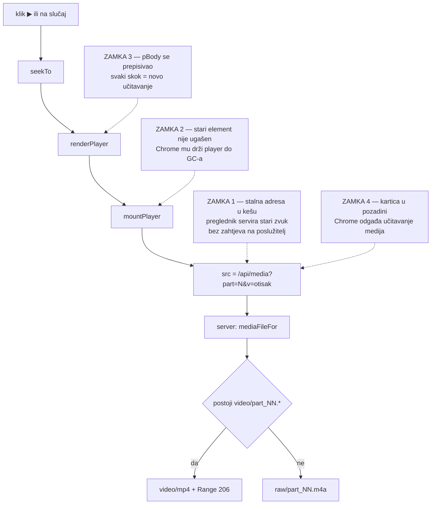

# Pregled govornika: raspored za 16:9 i lokalna snimka (2026-08-27)

Nastavak na `docs/sabor_human_in_the_loop_2026-08.md`. Ondje je opisan **sloj
odluka**; ovdje je opisano **koliko brzo se do odluke dođe**, jer je to jedino
što razlikuje alat koji se koristi od alata koji stoji.

Mjera je bila konkretna: koliko se slučajeva riješi bez skrolanja i koliko
klikova traži pitanje „tko ovo govori".

---

## 1. Raspored: tri stupca umjesto dva

| stupac | sadržaj | skrola |
|---|---|---|
| lijevi ~300 px | brojke sjednice, rangovi, filtar, red čekanja | samo red čekanja |
| srednji 1fr | odluka, kandidati, najave-sidra, istupi s tekstom | cijeli |
| desni ~340–460 px | snimka, dokazi natpisa, skok na istup | sve ispod snimke |

Snimka je prije stajala `position:sticky` na vrhu srednjeg stupca. To je bio
kompromis koji **radi protiv sebe**: dok se skrola do istupa, player prekrije
tekst koji se čita, a odluka ostane ispod pregiba. Na 1920×806 sada odluka +
kandidati + oba sidra stanu na ekran odjednom.

Dvije manje promjene s istim ciljem:

* **U lijevom stupcu skrola samo lista.** Brojke i filtar stoje. Prije se filtar
  gubio čim se lista pomakne — a filtriranje i skrolanje su ista radnja.
* **Stavke reda čekanja su dvoredne** (ime + trajanje, oznake ispod), pa su
  jednake visine. Dok su oznake bile u istom retku, dugo ime ih je guralo u
  treći red i lista se nije dala skenirati okom.

Ispod ~1360 px raspored pada na dva stupca: snimka iznad detalja, red čekanja
zadržava punu visinu. Pogled „Petlja i revizija" nema pojedinačnu oznaku pa se
desni stupac sklanja.

---

## 2. Lokalna snimka umjesto YouTube `<iframe>`-a

`01_ingest.js` skida samo `bestaudio` — i to je i dalje ispravno, jer sve
nizvodne faze rade nad zvukom. Ali za ručni pregled je slika često **jedini**
dokaz: lice govornika i ime koje režija ispiše u donjoj traci.

Tri stvari koje `<iframe>` ne može:

1. **Ne premota se bez ponovnog učitavanja.** Bez YouTube IFrame API-ja (vanjska
   skripta) svaki skok znači novi `src` — okvir se ruši i gradi iznova.
2. **Ne pokreće se sam.** Autoplay u prekograničnom okviru pada na politikama
   preglednika, pa svaki `▶` traži još jedan klik unutar okvira.
3. **Traži internet i pristaje na anti-bot.** Pregled je lokalni alat nad
   snimkom koja je već na disku.

### Alat i trošak

`sabor_pipeline/tools/fetch_video.js --session <id>` → `video/part_NN.mp4`.

Format je **480p avc1 (`-f 135`)**, isti izbor i iz istog mjerenja kao
`ocr_captions.js`: na 360p natpis s ekrana više nije pouzdano čitljiv, a 720p ne
donosi ništa osim dvostruke datoteke
(`docs/sabor_ocr_imena_s_ekrana_2026-08.md`).

Izmjereno na pilot-sjednici (`sabor_11_izvanredna_11_gospic`, 20:01:14 u 4 dijela):

| dio | trajanje | veličina | preuzimanje |
|---|---|---|---|
| part_01 | 05:44:41 | 1.4 GB | 96 s |
| part_02 | 06:08:44 | 731 MB | 61 s |
| part_03 | 06:11:37 | 1.5 GB | 76 s |
| part_04 | 01:56:11 | 233 MB | 18 s |
| **ukupno** | **20:01:14** | **3.9 GB** | **~4 min** |

Ranija procjena iz `ocr_captions.js` („4.4 GiB, ~14 min") odnosila se na cijelu
sjednicu, ne na dio — stvarni trošak je **niži nego što je dokumentirano**.

### ⚠️ Manifest se NE dira

`fetch_video.js` ne upisuje `video_file` u `session_manifest.json`. Manifest je
vremenska os sjednice iz koje se računa svaki deep link; ne prepisuje se zbog
pomoćnog artefakta koji ne mijenja nijedno trajanje. Poslužitelj sliku nalazi po
**dogovoru o imenu** (`video/part_NN.*`), pa se preuzeta snimka vidi odmah, bez
ponovnog ingesta. `p.video_file` se i dalje poštuje ako ga sjednica ima.

---

## 3. Autoplay: klik JE izjava namjere

Svaka radnja kojom čovjek kaže „ovim se sada bavim" sada pokreće snimku: klik na
slučaj u redu čekanja (player se namjesti na **najduži** istup, jer je to i
najbolji uzorak) i svaki `▶` uz istup ili najavu.

Jedina iznimka: **ponovno crtanje detalja nakon spremanja odluke ne pokreće
snimku.** Zastavica `S.autoplay` postavlja se isključivo u `selectSpeaker` —
`renderDetail` se zove i nakon `save()`, a snimka koja krene iznova pri svakom
spremanju je smetnja, ne pomoć.

---

## 4. Četiri tiha kvara — i zašto ih je bilo teško vidjeti

Nijedan od njih nije javio grešku. Svi su izgledali isto: `<video>` stoji prazan,
`networkState` LOADING, `readyState` 0, a u logu poslužitelja **nema ničega**.

**1. URL snimke mora nositi otisak datoteke.** `/api/media?part=1` je stalna
adresa uz `Cache-Control: private, max-age=3600`, a sadržaj joj se promijenio iz
zvuka u video. Preglednik je sat vremena servirao stari zvuk **iz keša, bez
ijednog zahtjeva** — u logu poslužitelja nije bilo ni traga. Vidjelo se tek
brojanjem otvorenih veza (`lsof -nP -iTCP:8788`): nula.
Rješenje: `&v=<veličina>-<mtime>` u URL-u + `ETag`.

**2. Stari `<video>` se mora ugasiti prije zamjene.** `innerHTML = …` ga samo
otkvači iz stabla; Chrome mu drži `WebMediaPlayer` i vezu dok ga ne pokupi GC.
Nakon dovoljno skokova po dijelovima novi element više ne krene.
Rješenje: `pause()` → `removeAttribute("src")` → `load()`.
Uz zvuk se to nije primjećivalo jer se element rijetko presnimavao.

**3. `#pBody` se ne smije prepisivati pri svakom crtanju.** `renderPlayer` je
gradio cijeli player iznova, pa je svaki skok značio novo učitavanje, izgubljen
buffer i `play()` nad elementom koji više nije isti. **To je bio pravi razlog
zašto se player „nije pokretao sam"** — a komentar u kodu je tvrdio suprotno
(„lokalni player se NE presnimava kad se skače unutar istog dijela").
Rješenje: skelet (`#pBar` / `#pBody` / `#pWarn`) se gradi jednom, osvježava se
samo traka.

**4. ⚠️ Chrome odgađa učitavanje medija u kartici u pozadini.** Ovo NIJE bug
aplikacije nego zamka **testiranja**. Automatizirani test koji klika po stranici
bez fokusiranja kartice vidi `readyState 0` i nula mrežnih zahtjeva
neograničeno dugo — identično stvarnom kvaru. `fetch()` s iste stranice radi
normalno, što dodatno zavara. Kartica se probudi čim postane aktivna i snimka
krene u istoj sekundi.
**Prije nego što se stanje `<video>`-a proglasi kvarom, kartica mora biti u
prvom planu.**

---

## 5. Poslužitelj: čitanje se gasi kad veza padne

`serveMedia` sada radi `res.on("close", () => stream.destroy())`. Preglednik
napusti učitavanje snimke pri svakom skoku na drugi dio, a bez toga tok ostane
visjeti na protupritisku i drži utičnicu zauzetom. Uz zvuk je to bilo
podnošljivo; dio snimke je 1.5 GB i tok traje dovoljno dugo da smeta.

Ograda za otvoreni raspon (`bytes=0-` → najviše 4 MB po odgovoru) je od prije i
ostaje — bez nje jedan zahtjev drži cijelu datoteku otvorenom.

---

## 6. Što ostaje otvoreno

1. **Slika je preuzeta samo za pilot-sjednicu.** Za svaku novu sjednicu treba
   pokrenuti `fetch_video.js` nakon faze 01. Nije dodano u
   `run_sabor_session.sh` — orkestrator provodi četiri pravila imenovanja i
   nema razloga da čeka 4 min na artefakt koji nijedna faza ne troši.
2. **Nema čišćenja.** 3.9 GB po sjednici na `DOMOVINA2TB` (1.1 TB slobodno) nije
   problem danas, ali nijedan mehanizam ne briše sliku kad je pregled gotov.
3. **`--fmt` nije mjeren za druge sjednice.** 480p je potvrđen na pilotu; ako
   režija promijeni veličinu natpisa, prag se mora premjeriti.

---

## Vezani dokumenti

* `docs/sabor_human_in_the_loop_2026-08.md` — sloj ljudskih odluka, zašto zaseban
* `docs/sabor_ocr_imena_s_ekrana_2026-08.md` — natpis s ekrana, mjerenje 480p vs 360p
* `sabor_review/README.md` — raspored, načini playera, zamke ukratko
* `sabor_pipeline/README.md` — `tools/fetch_video.js` u popisu alata
