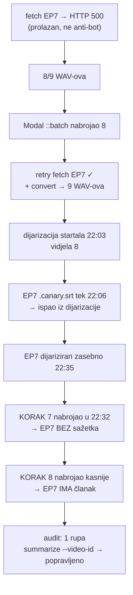

# abbacast — onboarding novog kanala i puni backfill (28./29.08.2026.)

Prvi onboarding nakon konvergencijskog popravka (`docs/2026-08-28-konvergencija-pipelinea.md`),
pa je usput poslužio i kao provjera radi li scan po stanju na svježem kanalu. Radi.

**Ishod:** 9 epizoda (~13,4 h zvuka) od nule do CDN-a u **1 h 30 min**, uz Magisterium
(HR+EN) za najnoviju epizodu. `audit_pipeline.js` ne prijavljuje nijednu rupu za kanal.

## 1. Mjerenja

| Faza | Trajanje | Napomena |
|---|---|---|
| Fetch (9 ep) | ~9 min | 1 epizoda pala na `HTTP 500`, uspjela iz drugog pokušaja |
| MP3 → WAV | ~25 s | |
| Canary transkripcija (Modal `::batch`) | **7,4 min** za 8 ep | 37 s inference/fajl, ~$0,17–0,26 |
| Canary, 9. epizoda zasebno | 3,0 min | cold start dominira: 25 s inference, 3 min wall |
| **Dijarizacija (pyannote, MPS)** | **28 min 51 s** za 12,4 h | 2 workera, CPU 54 min 49 s, **speedup 1,9×** |
| Dijarizacija, 9. epizoda zasebno | 2 min 24 s | 59 min zvuka |
| Koraci 7–13 (sažetak→članak→RAG→og→screenshot→EPUB→R2) | ~43 min | Vertex `gemini-3.5-flash` |
| EN prijevod (summary+article+magisterium) | **33 min 55 s** | 132 s + 736 s + 1166 s |

**Dijarizacija ≈ 22× realtime** na M4 Pro s 2 workera. GPU (`ioreg` AGXAccelerator)
stoji na **99–100 % Device Utilization** i ~11,5 GB unified memory tijekom
segmentacije/embeddinga.

> ⚠️ **RSS je slijep na MPS-u.** `ps` je za te iste procese pokazivao 489 i 569 MB.
> Prava potrošnja je onih 11,5 GB iz `ioreg`. Ne zaključuj o memorijskom headroomu iz
> `ps` — vidi memoriju `mps_rss_blind_and_watermark`.

To što je GPU na 100 % **ne proturječi** pravilu iz CLAUDE.md da je pyannote CPU-bound.
Pravilo govori o ukupnom wall clocku (clustering je CPU faza i zato Colab ne isplati);
segmentacija i embedding su GPU faze i tijekom njih kartica je zasićena.

## 2. Scoped backfill — zašto ne `run_pipeline.sh` od KORAKA 1

`fetch.js` **nema `--channel`** (hardkodiran `LISTS_DIR`, čita sve `*-lista.txt`), pa bi
puni run usput odradio mini-nightly nad svih 50 kanala. Recept koji je korišten:

```bash
for id in $IDS; do node fetch.js --video-id "$id"; done      # scoped fetchom, ne listom
node convert_to_wav.js --channel abbacast
modal run modal_canary/canary_modal.py::batch --channels abbacast --source-lang hr --target-lang hr
python3 colab_diarize/diarize_canary.py --input-dir storage/output/abbacast --workers 2
./run_pipeline.sh --only-articles --channel abbacast --with-screenshots --with-r2-upload
```

`--only-articles` preskače korake 0–6 i ulazi na KORAK 7, pa pokriva 7→13 uključivo s
channel indexom. Cijelo vrijeme se drži `automatic/logs/.pipeline.lock.d` da nightly i
Magisterium poller ne uđu paralelno.

## 3. Kaskada koja je koštala najviše: jedan `HTTP 500`



**Pouka:** svaki korak nabraja datoteke **jednom, na startu**. Epizoda koja se pridruži
nasred runa proći će kroz neke korake a kroz druge neće, i to izgleda kao slučajna rupa.
Kad kasniš s epizodom, planiraj catch-up prolaz umjesto da se nadaš da će je tekući run
pokupiti. `audit_pipeline.js` to pouzdano nađe.

## 4. Zamke

### 4.1 `summarize_gemini.js --input-dir <kanal>` tiho nađe 0 datoteka
Traži **korijen** + `--channel`. Naredba koju `audit_pipeline.js` ispisuje kao uputu
(`--input-dir storage/output/<KANAL> --video-id <ID>`) **ne radi** — izađe s exit 0 i
„Nema novih datoteka", što izgleda kao da rupe nema. Konvencija se razlikuje po skripti:
`diarize_canary.py` traži baš suprotno (`--input-dir storage/output/<kanal>`).
**Otvoreno:** popraviti uputu u `audit_pipeline.js`.

### 4.2 Provjera potpunosti članka laže dok KORAK 8 još radi
Partial-save nakon svake iteracije je resume mehanizam, pa epizoda u obradi uredno stoji
s 1 od 3 iteracije. Umjesto usporedbe s outlineom koristi marker koji članak sam nosi:
`metadata.complete === true && iterations.length === metadata.iterations_expected`.

### 4.3 `has_article` je pod `pipeline`, ne na korijenu videa
U `channels/data/<kanal>.json` provjeravaj `v.pipeline.has_article`
(`generate_channel_index.js:427`). Provjera `v.has_article` vraća 0/9 i izgleda kao da
naslovnica neće prikazati ništa.

### 4.4 Orphan yt-dlp fragmenti
18 datoteka / **1,8 GB** (`.f243.webm`, `.f251.webm`, `.f396.mp4`) pored gotovih `.mkv`,
za svaku epizodu. Nije univerzalno — `domovina_tv` i `eho_projekt` imaju nula.
Bezopasni: `screenshot_youtube.js:findBestLocalVideo` gradi točne putanje pa fragment ne
može biti izabran. Svih 9 `.mkv` ima video+audio i trajanja se poklapaju u sekundu.
**Otvoreno:** nisu očišćeni.

## 5. Magisterium EP9 (`e4aPRlJ04fc`)

`overall_score` **82/100**, 22/22 sekcije, raspon 62–92, 38 zabrinutosti,
15 holističkih + 14 per-section citata. 7 `chat` poziva sekvencijalno, 10 `search`
paralelno. Keš `magisterium_doc_urls.json`: razriješeno 8 od 13 nerazriješenih
(1273 → 1281), `source_url` 16 → 24.

Najniža ocjena (**62**) — sekcija s metaforom stabla: prigovor je svođenje grijeha na
„ventil" duboke povrede, uz upozorenje da psihoterapijski model nije cjelovito objašnjenje
kršćanskog ozdravljenja. Ista nit (psihologizirajući redukcionizam) ide kroz holističke
`concerns`. Najviša (**92**) — zdrave granice i komunikacija.

### 5.1 Premjestiti markere ≠ izmisliti ih
Postojeća uputa dopušta **premještanje** `[^N]` markera koje model izbaci kao prefiks
prije JSON-a u tekst `assessment`/`enrichment`. Ako batch odgovor nema **nijedan** marker
— čest slučaj, ovdje batchevi 00 i 01 — markeri se **ne smiju dopisati**: to bi pripisalo
konkretne crkvene dokumente tvrdnjama koje model tako nije citirao.

**Nula per-section citata je legitiman ishod.** Uzorak produkcijskih datoteka: neke imaju
29/28/19/18/13/7 citata, neke čistu nulu, ovisno vraća li model markere sam.

### 5.2 Tipografski navodnici razbijaju keš
Naslovi dolaze s `“…”`, pa `match` s ravnim `"` nikad ne pogodi, a assemble to prijavi
samo kao „nerazriješen dokument". Biraj `match` bez navodnika
(`False Misticism and Spiritual Abuse`, ne `"Foglio" for the Audience…`).

## 6. Otvoreno

- **Magisterium za preostalih 8 epizoda** — nije pokrenut, čeka odluku.
- **`abbacast` u `automatic/full_backfill_channels.txt`** — nije upisan, čeka odluku.
- **1,8 GB orphan fragmenata** — nije očišćeno (§4.4).
- **Uputa u `audit_pipeline.js`** ispisuje neispravnu `summarize_gemini.js` naredbu (§4.1).
- **`audit_pipeline.js` je binaran za git** — sadrži NUL bajt, pa se diffovi prikazuju kao
  `Bin … bytes`. Node ga parsira normalno; kozmetički, ali buduće izmjene su neusporedive.
- **Status kanala** u registru je `active`, a zadnja epizoda je od 2026-02-14 (§ memorija
  `abbacast_channel_state`).

## Vezani dokumenti

- `docs/2026-08-28-konvergencija-pipelinea.md` — audit sadržaja i isporuke
- `docs/MAGISTERIUM_MCP_RUN.md` — runbook korišten za §5
- `docs/2026-08-27-nightly-modal-nula-kandidata.md` — scan po stanju
- `docs/transcription_colab_vs_modal_cost_2026-07.md` — Colab vs Modal break-even
