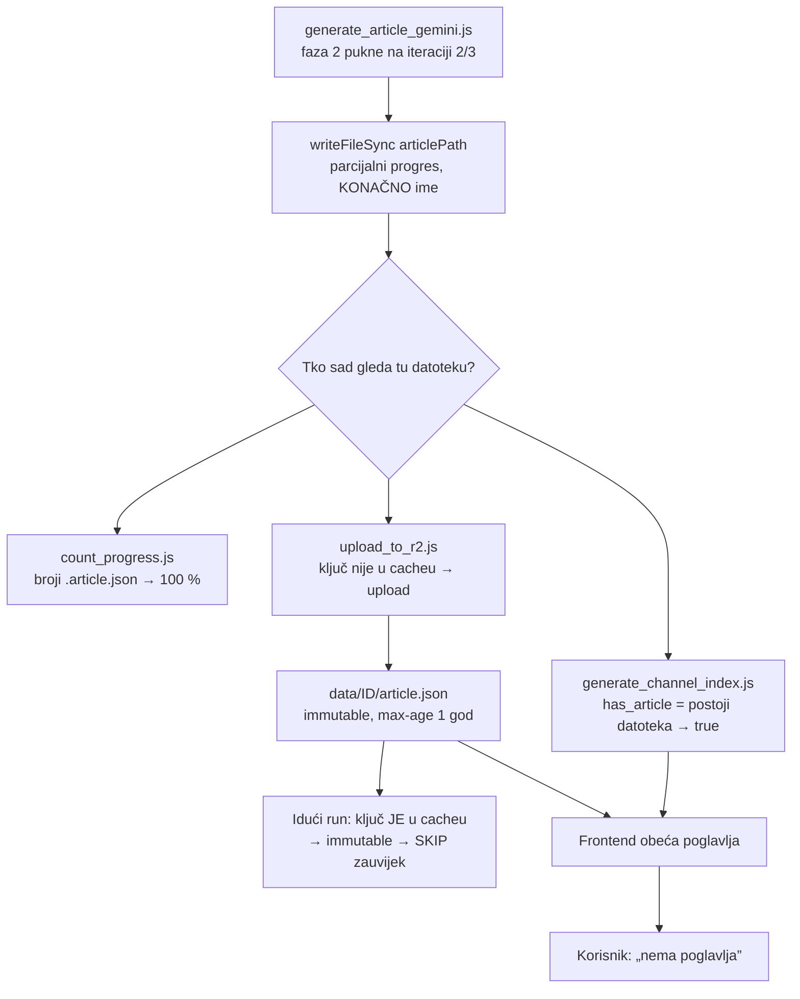
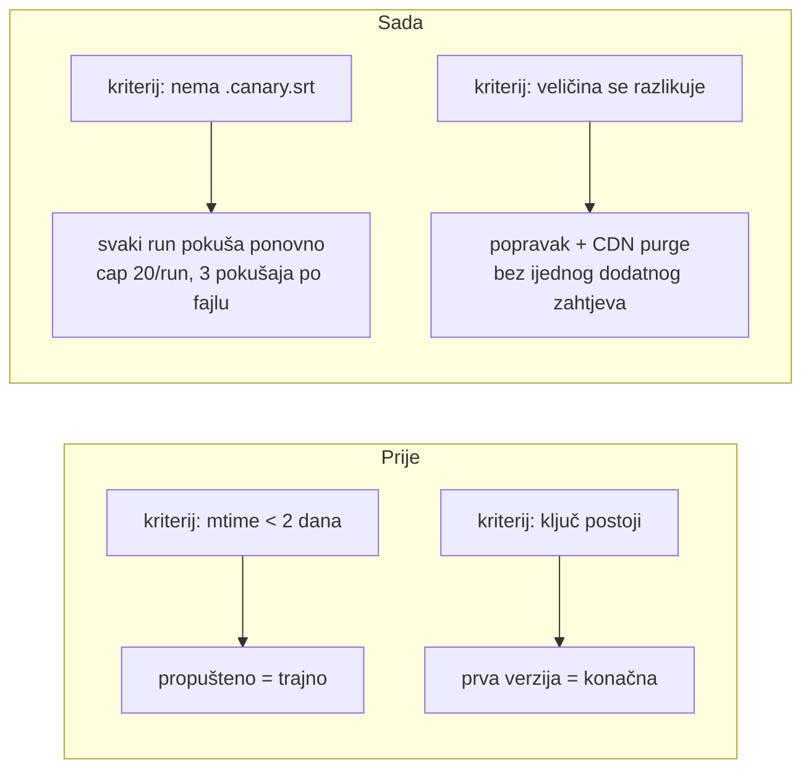

# Konvergencija pipelinea prema 100 % — analiza i mehanizam (28.08.2026.)

**Kratko:** `count_progress.js` je pokazivao ~100 % gotovih članaka dok je CDN
za 35 epizoda servirao krnji ili prazan `article.json`. Uzrok nije jedan bug
nego jedno pravilo primijenjeno na tri mjesta: **postojanje datoteke se tretiralo
kao dokaz dovršenosti**. Uz to je jedna TCC dozvola tiho ugasila automatsku
transkripciju na 26 noći. Ovaj dokument opisuje mjerenje, uzroke i mehanizam koji
svaki idući run tjera prema 100 % umjesto da rupu ostavi zauvijek.

## 1. Što je izmjereno

`node audit_pipeline.js --deep` nad 3263 epizode (28.08.2026., 09:00):

| Nalaz | Broj |
|---|---|
| Potpuno ispravnih (disk + CDN) | 3188 (97,7 %) |
| `article.json` na CDN-u **krnji** (manje sekcija nego na disku) | 34 |
| `article.json` na CDN-u **prazan** (`iterations: []`) | 1 |
| `article.json` na CDN-u samo od starijeg modela (kozmetika, ne rupa) | 11 |
| Ostali drift disk→R2 (`outline`, `magisterium`, `epub`) | 66 ključeva |
| Preuzeto ali nikad transkribirano | 3 |
| Bez screenshotova (nisu audio-only) | 4 |
| Osirotjeli medij bez `.info.json` | 4 |

Ukupno **126 R2 ključeva** na 64 epizode odstupa od diska. Lokalni disk je pritom
bio **čist**: nijedan lokalni članak nije bio krnji. Sav gubitak je bio u isporuci.

Prijavljeni primjeri:

- `QO6S_aCVt3Y` — disk 3 iteracije / 46 sekcija, CDN 279 bajta s `iterations: []`.
- `3eh-QoW6ty0` — R2 je ispravan (62 KB, 2 iteracije / 32 sekcije). Ovdje je
  krivac preglednik: raniju, krnju verziju istog ključa dobio je s
  `Cache-Control: max-age=31536000, immutable`, pa je ne revalidira ni na reload.
  Ista bolest, faza kasnije.

## 2. Tri mjesta na kojima „datoteka postoji” znači „gotovo”



Nijedan od ta tri potrošača nije gledao **sadržaj**. Dok je članak parcijalan,
sva tri ga proglase gotovim, a `immutable` Cache-Control tu prvu verziju zamrzne
i na R2 (uploader je preskače) i u pregledniku (ne revalidira).

## 3. Zašto nightly nije uhvatio novu epizodu

`wF0ctR3DJp4` je objavljen 27.08., preuzet i konvertiran u WAV isti dan u 20:10,
a nightly u 01:05 sljedećeg jutra prijavio je `Modal kandidata: 0`. Dijagnostika
ugrađena dan ranije dala je odgovor prvom noći:

```
find: .../storage/output/40_dana_za_zivot/: Operation not permitted
```

**macOS TCC.** launchd agent pokreće `/bin/bash`, koji nema dozvolu za vanjske
volumene na koje kanalski direktoriji pokazuju symlinkovima. `[ -d "$_d" ]` (stat)
prolazi, `opendir()` ne — pa je `find` na svih 50 direktorija vraćao EPERM, stderr
je išao u `/dev/null`, a rezultat je bio prazna lista. Node (nvm binary) ima
pristup: `convert_to_wav.js` je u istom runu uredno pročitao iste direktorije.

Trajanje kvara: **02.08.–27.08.2026., 26 uzastopnih noći.** Korak je non-fatal,
pa je nightly svaki put završio s „✅ Svi koraci OK”.

Drugi sloj istog problema: čak i da je `find` radio, `MODAL_FRESH_DAYS=2` znači
da se epizoda starija od dva dana **više nikad ne ponudi**. Propuštena noć je bila
trajna — pipeline se principijelno nije vraćao na vlastite rupe.

## 4. Mehanizam konvergencije

Četiri promjene. Svaka pretvara „jednokratni pokušaj” u „ponavlja dok ne uspije”.



### 4.1 `tools/scan_modal_candidates.js` — sken kroz Node, kriterij je stanje

Zamjenjuje shell `find` (TCC) i mtime prozor. Kandidat je **WAV bez
`.canary.srt`**, poredak najnovije-prvo, cap `MODAL_MAX_FILES` (20) po runu.
Backlog se troši ostatkom capa umjesto da soft-skip ugasi cijeli korak.

Ograda od vječnog ponavljanja: `storage/.modal_attempts.json` broji pokušaje po
videu; nakon 3 kandidat ispada. `--reset-attempts <ID>` ga vraća.

### 4.2 `upload_to_r2.js` — keys-cache v2 nosi veličine

LIST je veličinu objekta ionako vraćao i mi smo je bacali. Sada se sprema
(`{"v":2,"sizes":{...}}`), pa je drift disk→R2 mjerljiv **bez ijednog dodatnog
zahtjeva**: lokalna datoteka koja se razlikuje po veličini od one na R2 ide u
`driftFiles` → re-upload → **CDN purge** (bez purge-a edge servira staro godinu dana).

Ograničeno na male derivirane JSON-ove (`article`, `outline`, `summary`,
`*.magisterium*`, `*.en`). Video, EPUB, slike i SRT ostaju immutable.
`info.json` je namjerno izvan popisa — yt-dlp pri svakom re-fetchu vrati drukčiji
popis formata, pa bi drift bio trajan šum.

Format v1 (goli niz ključeva) se i dalje čita; tada su veličine nepoznate i
drift-provjera miruje dok `--verify-r2` ne osvježi cache.

### 4.3 `generate_article_gemini.js` — žig dovršenosti

Članak sada nosi `metadata.complete` i `metadata.iterations_expected` (iz
outlinea, koji je ugovor faze 1). Žig se osvježava pri svakom spremanju,
uključujući spremanja iz catch grana.

`upload_to_r2.js` odbija poslati `article.json` s `complete: false`. Radije nema
članka nego tihi polovični: idući run ga dovrši i uploada normalno.

### 4.4 `audit_pipeline.js` — mjera koliko je ostalo do 100 %

Novi alat. Za razliku od `count_progress.js`, provjerava sadržaj i isporuku:

```bash
node audit_pipeline.js                 # disk + R2, jedan LIST
node audit_pipeline.js --deep          # dohvati sporne article.json s CDN-a i
                                       # razluči „CDN KRNJI” od „samo drugi model”
node audit_pipeline.js --no-r2         # brzo, bez mreže
node audit_pipeline.js --fix-plan      # ispiši naredbe za sanaciju
node audit_pipeline.js --json out.json
```

Izlazni kod: 0 = nema rupa, 1 = ima, 2 = audit nije mogao teći. Vrti se kao
korak nightlyja (`|| true` — izlaz 1 je mjera, ne alarm).

## 4.5 Rezultat sanacije (28.08.2026.)

| | prije | poslije |
|---|---|---|
| Potpuno ispravnih | 3188 / 3263 (97,70 %) | **3240 / 3263 (99,30 %)** |
| Krnji/prazni članci na CDN-u | 35 | **0** |
| Preuzeto ali netranskribirano | 4 | 0 |

Izvedeno: 126 R2 ključeva re-uploadano + CF purge (3,0 MB), pa pun prolaz pipelinea
za 4 netranskribirane epizode (Modal → pyannote → sažetak → članak/Opus → RAG →
screenshotovi → EPUB → R2, 1 h 47 min). Sva četiri nova članka nose
`metadata.complete: true` — žig radi kroz cijeli lanac.

Dvije stvari vrijedne bilježenja:

- **CDN purge je godinu dana bio poluučinkovit — `Vary: Origin`.** R2 odgovara s
  `Vary: Origin`, pa Cloudflare drži **odvojen cache zapis po vrijednosti `Origin`
  headera**. Purge po golom URL-u čisti samo zapis bez Origina — točno onaj koji
  gađa `curl`. Preglednik (Flutter web `fetch`) uvijek šalje
  `Origin: https://domovina.ai` i dobiva **drugi zapis, koji purge nije dirao**.
  Zato je nakon uspješnog popravka i „uspješnog" purge-a `curl` vraćao 200 s
  ispravnim sadržajem, a stranica je i dalje bila prazna: `wF0ctR3DJp4` je
  preglednicima 404-ao, a `QO6S_aCVt3Y` im je i dalje servirao `iterations: []`.
  Reproducirano jednom naredbom:

  ```bash
  curl -so /dev/null -w '%{http_code}\n' URL                          # 200
  curl -so /dev/null -w '%{http_code}\n' -H 'Origin: https://domovina.ai' URL   # 404
  ```

  `purgeCloudflareCache()` (`upload_to_r2.js`) i `force_upload.js` sada svaki URL
  purge-aju u **obje varijante**. Stara memorijska bilješka „HEAD=200 ali GET=stari
  404" je bila simptom ovoga. **Verificiraj GET-om i s `Origin` headerom** — goli
  `curl` gađa cache zapis koji nijedan korisnik nikad ne vidi.
- **Četiri članka su nakon popravka MANJA nego prije** (65–92 % stare veličine).
  Provjereno: sva četiri su cjelovita (`iteracija == outline`, nula praznih sekcija) —
  razlika je model (`gemini-3.5-flash` piše gušće sekcije od `gemini-2.5-flash`). Popravak
  je primijenio postojeće pravilo dedupa („najnoviji lokalni mtime pobjeđuje"), CDN je samo
  bio zaglavljen na starijem uploadu. Nijedna epizoda nije skraćena.

Preostalih 23 epizoda s rupom: 4 osirotjela medija bez `.info.json`, 4 bez screenshotova
(Beamly, nema lokalnog videa), 15 s driftom koji je kozmetički (`samo drugi model`,
`magisterium`, `epub`).

## 5. Što ostaje ručno

- **Otrovani preglednici.** `immutable` znači da preglednik koji je jednom dobio
  krnju verziju ne revalidira ni na reload. CDN purge popravlja edge, ne klijente.
  Trajno rješenje je verzionirano ime ključa ili query-bust u frontendu
  (vidi MEMORY `immutable_assets_need_versioned_filenames`). Za sada: hard reload.
- **`generate_channel_index.js`** i dalje diže `has_article: true` na temelju
  postojanja lokalne datoteke, ne na temelju toga je li članak na CDN-u i cjelovit.
  Nakon 4.3 razlika je mala (krnji ne izlazi), ali index još uvijek može obećati
  članak koji na CDN-u kasni jedan run.
- **TCC.** Fix zaobilazi problem (Node umjesto `find`), ne rješava ga. Ako se
  ikad doda novi shell `find` nad `storage/output/`, past će isto i jednako tiho.
  U repou preostaju `automatic/beamly_video_finish*.sh` — tamo `find -L … -delete`
  pod launchd-om ne briše ništa (fail-safe, ali svejedno ne radi posao).

## 6. Provjera nakon promjene

```bash
node -c audit_pipeline.js && node -c upload_to_r2.js && node -c generate_article_gemini.js
node -c tools/scan_modal_candidates.js && bash -n run_pipeline.sh
node tools/scan_modal_candidates.js --scope channels          # očekivano: 4 kandidata
./run_pipeline.sh --with-modal-transcribe --modal-scope channels --dry-run
node upload_to_r2.js --input-dir storage/output --verify-r2 --dry-run   # prikaz drifta
node audit_pipeline.js --deep
```
