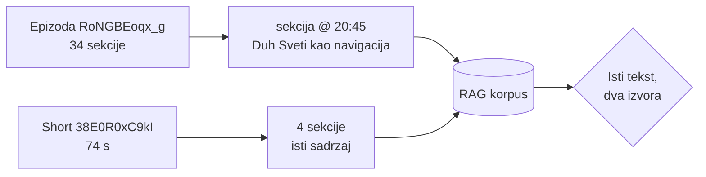

# EN overlay probija poller timeout — mjerenja s 29.08.2026.

> **Kratko:** `translate_to_english.js` za jednu epizodu od 34 sekcije traje **3412 s
> (~57 min)**, a ne „25-30 min" kako tvrdi runbook. Poller (`MAG_RUN_TIMEOUT_MS`) ubija run
> nakon **60 min**. Autonomni `@docs/MAGISTERIUM_MCP_RUN.md <VID> +EN` kroz poller zato
> **ne može proći** za dugu epizodu — HR dio i EN dio zajedno prelaze cap.

Vezani dokumenti: [`MAGISTERIUM_MCP_RUN.md`](./MAGISTERIUM_MCP_RUN.md) (runbook),
[`magisterium_mcp_hybrid_2026-05.md`](./magisterium_mcp_hybrid_2026-05.md) (arhitektura hibrida).

## Kontekst mjerenja

Epizoda `RoNGBEoqx_g` — Matej Galić, „Bog je vjeran", kanal `muzevni_budite`, 20260822.
Članak `_2026-08-26_opus`, **34 sekcije u 2 iteracije**. Traženi HR **i** EN (korak 6 runbooka).

## Izmjereno

| Faza | Trajanje | Veličina izlaza |
|---|---|---|
| `summary` → `.summary.en.json` | **160,5 s** | 8,6 KB |
| `article` → `.article.en.json` | **1287,4 s** (21,5 min) | 129,2 KB |
| `magisterium` → `.article.magisterium.en.json` | **1963,8 s** (32,7 min) | 221,2 KB |
| **Ukupno (1 kopija)** | **3412,4 s ≈ 57 min** | 359 KB |

Backend: `gemini-3.5-flash`, `global` endpoint, Vertex OAuth, `project-a275a620`.

Za usporedbu, jedino ranije zapisano mjerenje (`biRibr8NByE`, `catholic_futurist`,
**11 sekcija**, `gemini-3.5-flash`) bilo je **1183 s ≈ 20 min**. Skaliranje je dakle
otprilike linearno po broju sekcija: **~100 s po sekciji** ukupno kroz sve tri faze.

> **Pravilo palca:** `EN sekunde ≈ 100 × broj_sekcija`. Prije nego pokreneš `+EN`,
> prebroji sekcije u `article.json` — 34 sekcije znače sat vremena, ne pola.

## Zašto je to problem

```mermaid
gantt
    title Autonomni run s +EN vs poller cap
    dateFormat mm
    axisFormat %M min
    section HR dio
    prep + 10 chat poziva  :hr, 00, 18m
    assemble + search      :after hr, 4m
    section EN dio
    summary                :en1, 22, 3m
    article                :en2, after en1, 22m
    magisterium            :en3, after en2, 33m
    section Ograda
    MAG_RUN_TIMEOUT_MS 60 min :milestone, m1, 60, 0m
```



HR dio (prep, 1 holistički + 9 batch `chat` poziva, `search`, assemble) sam po sebi traje
~20 min. Uz EN od 57 min ukupan run je **~80 min**, a poller ga prekida na 60. Rezultat bi bio
poznati kvar iz presedana `biRibr8NByE [en]`: proces ubijen, `.en.json` nikad zapisan, poller
vidi 404 na CDN-u i označi zahtjev `failed` — a HR dio je pritom već bio gotov na disku.

**Posljedica za praksu:** `+EN` za epizode s **≳25 sekcija ne pokretati kroz poller**. Ili:

1. pokreni HR kroz poller, pa **EN naknadno ručno** (idempotentno je — `translate_to_english.js`
   preskače postojeće `.en.json`, pa HR korake ne treba ponavljati), ili
2. podigni `MAG_RUN_TIMEOUT_MS` na 7 200 000 (2 h) za taj konkretan run.

Opcija 1 je jeftinija jer ne drži poller blokiranim.

## Čekanje pod 10-minutnim Bash capom

Obrazac iz memorije `translate_en_foreground_wait_under_headless` i dalje radi, ali treba
**6-7 iteracija** bounded-waita, ne 3:

```bash
node translate_to_english.js --input-dir storage/output --video-id "$VID" \
  >> /tmp/mag_en_$VID.log 2>&1; echo "EXIT=$?" >> /tmp/mag_en_$VID.log   # run_in_background
# pa ponavljaj dok se ne pojavi EXIT=:
timeout 570 bash -c 'until grep -q "EXIT=" /tmp/mag_en_'"$VID"'.log; do sleep 20; done'
```

## Dvije zamke u verifikaciji

### 1. `assessment_en` NIJE na razini sekcije

U `.article.magisterium.en.json` engleska polja sjede **unutar `section['magisterium']`**:

```
iterations[] → sections[] → magisterium → { score, assessment, concerns, enrichment,
                                            citations, assessment_en, enrichment_en,
                                            concerns_en }
```

Provjera `'assessment_en' in section` vraća `False` na **ispravnoj** datoteci i izgleda kao da
prijevod nije prošao. Ispravna provjera pokrivenosti:

```bash
python3 -c "
import json,sys; d=json.load(open(sys.argv[1]))
tot=en=0
for it in d['iterations']:
    for s in it['sections']:
        m=s.get('magisterium') or {}
        tot += bool(m); en += bool(m.get('assessment_en'))
print(f'{en}/{tot} sekcija ima EN')" <file>
```

Na ovoj epizodi: **34/34**. Struktura je identična referentnoj `fO7iltytw0I`.

### 2. CDN put za channel index nema `meta/` prefiks

Lokalno je `storage/meta/channels/data/<slug>.json`, na CDN-u je
`https://cdn.domovina.ai/channels/data/<slug>.json`. `curl` na `meta/channels/data/…` vrati
**HTTP 404 s 27 KB HTML tijela** — dovoljno velikim da izgleda kao podatak ako gledaš samo
veličinu. Provjeravaj status kod i parsiraj JSON, ne samo `size_download`.
Vidi memoriju `verify_from_consumer_vantage_point`.

## Rezultat obrade (za referencu)

| Metrika | Vrijednost |
|---|---|
| Sekcija ocijenjeno | 34/34 |
| Root `overall_score` | 78 |
| `overall.holistic_score` | 82 |
| Zabrinutosti | 66 |
| Razriješenih `source_url` | 38 |
| Keš `magisterium_doc_urls.json` | 1283 → 1292 |

Tri dokumenta ostala **namjerno bez URL-a** — `search` ih ne nalazi u korpusu ili postoji samo
druga jezična inačica (talijanska `Visita Pastorale … S. Teresa fuori Porta Salaria` za engleski
citat): *The Dialogue of Divine Providence*, *El Espíritu Santo según el Nuevo Testamento*,
*24 January 1982: Pastoral Visit … St Theresa outside „Porta Salaria"*. Runbook traži URL samo
na high-confidence pogotku; `document` + `reference` tekst ostaje i bez njega.

## Stanje kanala `muzevni_budite` (recompute 29.08.2026.)

**76 epizoda, 69 s Magisteriumom, fali 7.** Brojka iz 2026-07-25 (71/65) više ne vrijedi —
kanal raste, pa recompute prije svake tvrdnje o pokrivenosti ostaje obavezan.

Bez Magisteriuma: `KuFF8y_JARs` `3u0RmP0qAS4` `Kz9W3Eq9htA` `tIUwvVfbPbI` `JDsdghnELbM`
`rLGFxgV3SMs` `h8kT3I7kQ1I`. Prva dva imaju gotov `_opus` članak i spremna su za obradu;
`h8kT3I7kQ1I` visi od 2026-06-27.

---

# Dodatak: prvi YouTube Short kroz pipeline (`38E0R0xC9kI`)

29.08.2026. prvi put je **YouTube Short** pušten kroz pipeline. Radi — ali uz tri stvari koje
treba znati prije nego se shorts pusti serijski.

## Što je napravljeno

`38E0R0xC9kI` — „Duh Sveti te uvijek dovodi do Isusa!", kanal `muzevni_budite`, **74 s**,
objavljen 20260828. Ušao kroz `_unlisted` ad-hoc put, live na `domovina.ai/v/38E0R0xC9kI`
(vizualno potvrđeno u pregledniku, ne samo curlom).

```bash
node fetch.js --unlisted-url "https://www.youtube.com/watch?v=38E0R0xC9kI" \
  --unlisted-title "Duh Sveti te uvijek dovodi do Isusa!" --unlisted-date 20260828
node convert_to_wav.js --output-dir storage/output --channel _unlisted
./run_pipeline.sh --with-modal-transcribe --with-local-canary-diarize \
  --modal-only 38E0R0xC9kI --with-r2-upload
```

Rezultat: 1 iteracija, **4 sekcije** (00:08 / 00:28 / 00:48 / 01:05), sažetak, 4 screenshota,
og-sections, EPUB, `video_h264.mp4`. Cijeli run **2 min 34 s**.

## Zamka 1 — `--with-modal-transcribe` NE povlači diarizaciju

Prvi run je pao tiho: `--with-modal-transcribe --modal-only <ID> --with-r2-upload` proizveo je
`.canary.srt`, ali **KORAK 6 je preskočen** jer nedostaje `--with-local-canary-diarize`. Bez
`.canary.diarized.srt` koraci 7-12 nemaju ulaz, pa je pipeline prošao kroz sve korake i završio s
`EXIT=0` i „✅ PIPELINE ZAVRŠEN" — **bez ijednog AI artefakta**. Log kaže samo:

```
⏭️  Preskačem korak 6 (Canary diarizacija) — nije zadan --with-local-canary-diarize
```

Za ad-hoc single-video run **oba** flaga su obavezna. Nadopunjuje
`diarization_is_prerequisite_for_ai_steps` i `pipeline_anti_bot_silent_continue`
(„ZAVRŠEN" ≠ uspjeh — uvijek provjeri artefakte na disku, ne exit kod).

## Zamka 2 — slike na CDN-u idu pod `images/`, ne `data/`

Provjera je najprije lažno pokazala tri 404-ke jer sam gađao `data/{id}/og-share.jpg`.
Stvarni raspored ključeva:

| Ide u `data/{id}/` | Ide u `images/{id}/` |
|---|---|
| `info.json`, `summary.json`, `article.json`, `outline.json`, `diarized.srt`, `book.epub`, `video_h264.mp4` | `og-share.jpg`, `thumbnail.png`, `og-sections.json`, `og-t-*.jpg`, `screenshots/*.png`, `screenshots/manifest.json` |

Isti obrazac greške kao `meta/channels/` vs `channels/` iz glavnog dijela ovog dokumenta:
**pogodi krivu putanju → 404 → zaključiš da korak nije radio.** Ne nagađaj ključeve;
pročitaj ih iz `upload_to_r2.js --dry-run`.

`data/{id}/audio.mp3` **nije** proizveden (KORAK 12.6: „0 uploadano") — taj korak cilja
audio-only kanale. Short ima video, pa player koristi `video_h264.mp4`. Nije kvar.

## Zamka 3 — 74 sekundi ne daje kontekst za imenovanje govornika

Sažetak govornika zove **„Govornik"** (`suggested_name`), a ne „Matej Galić", jer se u isječku
nitko ne predstavlja. Strict-mode audit je pritom radio ispravno: `strict_attribution: true`,
jedini `flagged_names` je „Duha Svetoga".

Na stranici se uz ikonu osobe prikazuje chip **„Tomo"** — to je `entities[0]` sekcije 2, osoba
koju govornik *spominje* (transkript, redak 15: „…ali onda mi je bio i Tomo…"), **ne** govornik.
Podatak je točan, ali u prikazu se čita kao atribucija.

**Zaključak za shorts:** izrezani isječak nasljeđuje temu, ali ne i identitet govornika.
Ako se shorts puštaju serijski, ime govornika treba **naslijediti iz matične epizode**
(veza: isti kanal + preklapanje teksta), a ne očekivati od LLM-a da ga pogodi iz 74 s.

## Otvoreno pitanje — duplikat u korpusu

Short je doslovan isječak sekcije „Duh Sveti kao navigacija: prvo vrati ukradeno, pa onda na
ispovijed" iz epizode `RoNGBEoqx_g` (@ 00:20:45). Nakon obrade isti sadržaj postoji **dvaput**:



Za jedan Short nebitno. Za **88 shortsa samo ovog kanala** (a svaki je isječak već indeksirane
epizode) to bi značilo sustavno dupliciranje RAG chunkova — isti odgovor vraćen dvaput, jednom
s korisnim kontekstom epizode, jednom bez njega.

**Nije riješeno.** Prije serijske obrade shortsa treba odlučiti jedno od:
1. shorts **ne idu** u RAG (samo `/v/` stranica + dijeljenje), ili
2. shorts se dedupliciraju protiv matične epizode, ili
3. shorts se tretiraju kao *pointeri* — deep link na epizodu umjesto vlastitog chunka.

Opcija 3 djeluje najbolje jer čuva ono što Short jest (ulazna točka), a ne troši korpus.
