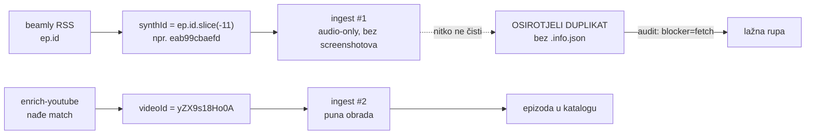

# 2026-09-02 — audit na nuli: tri klase rupe koje su izgledale kao jedna

`audit_pipeline.js --deep` je od 30.08. do 02.09. svaku noć javljao **identičnih
23 rupe** (3256/3279 = 99,30 %). Ista brojka četiri noći zaredom nije bila znak da
je nešto zapelo — bio je znak da nijedna od tih rupa nije bila u dosegu nightlyja:
svaka je tražila zahvat koji pipeline po dizajnu ne radi sam.

Nakon sanacije: **3276/3276 = 100,00 %, exit 0.** Broj epizoda pada s 3279 na 3276
jer tri „epizode" nisu bile epizode nego duplikati.

```
── prije ────────────────────────────  ── poslije ──────────────────────────
Preuzimanje (.info.json)   4 epizode    ✅ Potpuno ispravnih: 3276/3276
Screenshotovi              4 epizode       (100.00 %)
Isporuka na R2/CDN        15 epizoda    ⚠️  S rupom: 0
po težini: DRIFT=31
```

---

## 1. Zašto je preporuka samog audita bila opasna

Audit uz svaku drift-rupu ispisuje `force_upload.js`. Ta je preporuka **smjerno
slijepa**: `DRIFT` znači samo „disk ≠ R2", ne „disk je noviji". Mjereno na svih 15
driftanih epizoda:

| smjer | epizoda | primjer |
|---|---|---|
| **CDN bogatiji** (disk zaostaje) | 13 | `ZkMcSRvajCw`: CDN 2 it / **42 sek** vs disk 2 it / **17 sek** |
| **disk bogatiji** (CDN zaostaje) | 2 | `oxq1U0xypu8`: CDN je servirao `article.magisterium.json` od **17.03.**, disk ima verziju od **20.03.** |

Da je `force_upload` pokrenut po popisu, **13 epizoda bi na CDN-u dobilo lošiji
članak** — točno obrnuto od namjere audita.

Uzrok asimetrije: opus prolaz (koraci 7+8 s `--gemini-backend claude`) proizveo je
članke 30.–31.07., oni su otišli na R2, a lokalne `.article.json` / `.outline.json`
datoteke su poslije nestale s diska. Da su ti prolazi doista bili lokalni, dokazuju
screenshotovi: za svih 13 epizoda `_screenshots/` već sadrži **svaki**
`screenshot_timestamp` iz opus članka (`nedostaje=0`), uključujući one kojih u
gemini verziji nema. Nestali su samo JSON-ovi, ne i posljedice njihova postojanja.

### Odgovor: `tools/reconcile_r2_drift.js`

Alat mjeri obje strane pa bira smjer. Mjera bogatstva po artefaktu:

| artefakt | mjera |
|---|---|
| `article.json`, `outline.json`, `article.magisterium.json` | `sekcije × 1000 + iteracije` |
| `summary.json` | zbroj znakova polja u `summary` |
| `book.epub`, `diarized.srt` | bajtovi |

Dvije zamke ugrađene u alat:

1. **Ime povučene datoteke** se izvodi iz `metadata` (`source_file` + `model` +
   `generated_at`), pa dedup po leksikografski najvećem `_{date}_{model}` i dalje
   bira nju. Model-slug ide kao goli alias (`opus`, ne `claude-code:opus`) — inače
   `'c' < 'g'` znači da Opus članak nikad ne pobijedi gemini.
2. **`outline.json` na CDN-u nema `metadata`.** Prva verzija alata ga je zato
   prepisivala preko postojeće gemini-imenovane datoteke → opus sadržaj pod tuđim
   model-slugom u imenu. Sada se `article.json` obrađuje **prvi** i outline dobiva
   prefiks svog članka.

Rezultat prvog prolaza: **29 datoteka povučeno u 13 epizoda, 0 push-eva**, backup
starih u `storage/.drift_backup/2026-09-02/`.

---

## 2. „Nema `.info.json`" nije bio neuspio fetch

Tri epizode (`eab99cbaefd` / launched, `6dcab9c9837` i `cd7ac05aabf` / subclub) su
imale WAV, transkript, članak i EPUB — ali ne i `.info.json`, pa ih je audit
svrstao pod `blocker=fetch`.

Prvi nagon — dopisati im metapodatak — bio bi **pogrešan smjer**. Svaka od njih ima
blizanca s pravim YouTube ID-em:

| synth ID (višak) | pravi ID (blizanac) | blizanac potpun? |
|---|---|---|
| `eab99cbaefd` | `yZX9s18Ho0A` | info.json + članak + screenshotovi ✅ |
| `6dcab9c9837` | `hPwt12zZMCY` | ✅ |
| `cd7ac05aabf` | `Xv04J1cr16Q` | ✅ |



To je poznata posljedica synth→real re-matcha; `ingest_beamly.mjs` je i sam zove
„odgođen rename-migracijski posao". Dedup (`done.has(synth)`) sprječava buduće
dvostruko skidanje, ali staru kopiju ne miče.

**Postupak:** 41 datoteka (351 MB) premještena u
`/Volumes/DOMOVINA2TB/fetch_domovina_tv_output/_orphan_duplicates/2026-09-02/` —
isti volumen kao kanali, pa je to rename bez kopiranja, i izvan `storage/output/`
pa ga nijedan skener ne vidi. **ID-evi ostaju u `completed[]`** jer na njima visi
dedup. Ključevi `data/<synth>/*` na R2 su ostavljeni (5 objekata po epizodi, ništa
ih ne referencira, audit ih ne gleda).

Za slučaj kad blizanca doista nema, dodan je `ingest_beamly.mjs --repair-info`:
dopisuje samo `.info.json`, base čita s diska po `_yt_<id>` (ne računa iz naslova —
`sanitizeTitle` se kroz vrijeme mijenjao), `_yt_matched` izvodi iz ID-a u imenu.
Četvrta epizoda te klase, `TTLmH1TiKbs`, riješena je jednostavnije: njezin
`info.json` je postojao na R2 (`data/TTLmH1TiKbs/info.json`, 1514 B) i vraćen je
odande.

---

## 3. Screenshot bug koji je sam sebe skrivao

Četiri subclub epizode su u **svakom** nightlyju padale na „Ne mogu dohvatiti ni
stream URL ni lokalni video". Videi su na YouTubeu javno dostupni (`yt-dlp
--simulate` to potvrdi u sekundi).

Uzrok u `screenshot_youtube.js`:

```js
if (info._source && info._source !== "youtube") {
    localOnly = true;          // → preskoči yt-dlp, traži lokalni .mp4
}
```

`localOnly` je namijenjen sintetičkim ID-evima (X/Twitter, audio-only beamly) gdje
YouTube lookup nema smisla. Ali uvjet gleda **samo izvor**, a beamly epizoda
matchana na YouTube ima `_source: "beamly"` **i** pravi ID. Za nju se lokalni video
nikad ne skida → jedini dopušteni izvor ne postoji → trajni pad.

Ironija: `TTLmH1TiKbs` je screenshotove **imao** upravo zato što joj je `.info.json`
nedostajao — bez markera je kod otišao normalnim YouTube putem.

Popravak je jedna ograda (`&& info._yt_matched !== true`); rezultat 135
screenshotova u 4 epizode, 0 neuspjelih, svaka sekcija pokrivena.

> ⚠️ U nightlyju je za iste epizode pucalo i čitanje Brave kolačića pod launchd-om
> (Keychain traži tty). Popravak uklanja logičku prepreku, ali ako se pad ponovi
> pod launchd-om, epizode treba pokrenuti interaktivno.

---

## 4. Prolazni kvarovi koje ne treba goniti

Dva nalaza iz ove sesije **nisu** bili kvarovi:

- `--deep` je za `biRibr8NByE` javio `CDN NEDOSTUPAN [fetch failed]`. Isti ključ na
  `curl` vraća 200 u obje `Vary` varijante. Klasificirano kao prolazno.
- `priority` i `magisterium` tick su u 07:49 javili `fetch failed` prema
  `pipeline.domovina.ai` (jednom danas; 01.09. 124 puta). Servis odgovara.

Pravilo: prije nego što `[fetch failed]` postane stavka na popisu, provjeri ga
drugim instrumentom.

---

## 5. Otvoreno

- **RAG zaostaje za člankom u 13 restauriranih epizoda.** `rag_combined.jsonl` je
  građen iz gemini outlinea (npr. `dDDwWZPVS0s`: RAG 20.07., članak 31.07.). To je
  starije od ovog posla i audit tu klasu ne mjeri. Re-chunkanje nije napravljeno.
- **R2 ključevi osirotjelih duplikata** (`data/eab99cbaefd/`, `data/6dcab9c9837/`,
  `data/cd7ac05aabf/`, po 5 objekata) nisu obrisani.
- **Sljedeći nightly ima normalan posao**: upload 135 novih screenshotova (KORAK 12)
  i `og-sections` za te 4 epizode (KORAK 9.6). To nisu rupe.
- `audit_pipeline.js` i dalje ispisuje slijepu `force_upload` preporuku. Nije
  mijenjan — ali `tools/reconcile_r2_drift.js` je ispravan put.

---

## 6. Vezani dokumenti

- [`2026-08-28-konvergencija-pipelinea.md`](./2026-08-28-konvergencija-pipelinea.md)
  — uvodi `audit_pipeline.js` i keys-cache v2; ovaj dokument je prvi put kad je taj
  audit doveden na nulu.
- [`2026-08-27-nightly-modal-nula-kandidata.md`](./2026-08-27-nightly-modal-nula-kandidata.md)
  — ista klasa problema (tihi kvar pod launchd-om), drugi mehanizam (TCC vs Keychain).
