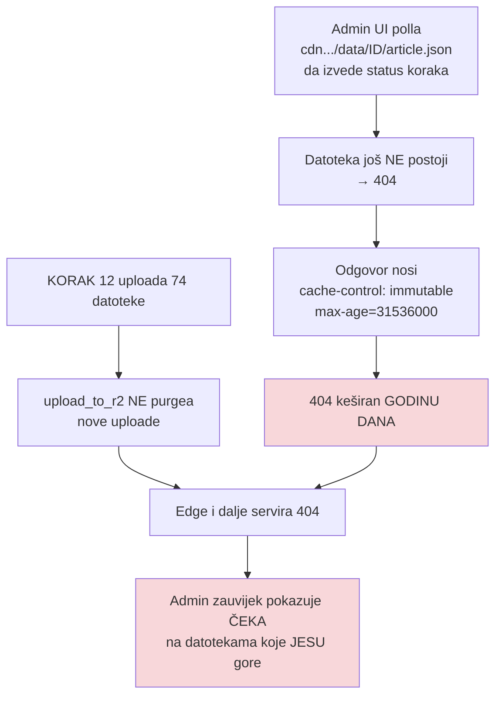

# Ograda diska i keširani CDN 404 — dvije tihe blokade (14.–15.09.2026.)

Nastalo pri odpauzi pipelinea nakon migracije na `bimbo-sync-prod`
(`docs/2026-09-14-migracija-na-bimbo-sync-prod.md`). Jedan prioritetni video
(`pNSblshqEuU`) otkrio je dvije blokade koje **ne javljaju grešku na mjestu gdje ih
gledaš**.

## 1. Ograda diska je opalila dvaput

`colab_diarize/diarize_canary.py` ima `MachineGuard` (prag `/` ≥ 12 GB). Opalio je:

| pokušaj | izlaz | izmjereno |
|---|---|---|
| 15:29 | **exit 2** (predpolet) | `samo 6.2 GB slobodno na / (prag 12 GB)` |
| 16:03 | **exit 3** (u letu) | `palo na 11.1 GB \| RSS 0.8 GB \| swap 5.5/6.0 GB` |

Oba puta **transkript je preživio** (`.canary.srt`), izgubljena je samo diarizacija
u letu. Koraci 7–12 nisu ni krenuli jer je diarizacija striktan preduvjet.

**Prag se NE popušta** — ako stane, to je signal da treba osloboditi prostor.

### Krivac NIJE bio pipeline

`_unlisted` je od 28.08. symlinkan na DOMOVINA2TB (16 GB ondje), a cijeli repo drži
~520 MB na SSD-u. SSD je bio na **99 %** od običnog dev posla:

| Potrošač | Veličina |
|---|---|
| `~/git` (svi projekti) | 143 GB |
| Docker (`Docker.raw`, 60 GB apparent) | **39 GB stvarno** |
| `~/Library/Developer` (Xcode) | 13 GB |
| `~/Library/Caches` | 9.3 GB |

### ⚠️ Gašenje kontejnera NE vraća RAM

Ugašen je pediludium Supabase stack (8 kontejnera, ~1.5 GiB). Mjereno odmah nakon:

```
com.apple.Virtua   MEM 14G   CMPRS 18G     ← nepromijenjeno
vm.swapusage: used = 5265 M  (bilo 5537 M)  ← jedva pomaknuto
```

Docker VM drži **fiksnu rezervaciju** (`MemoryMiB 14336`), pa oslobađanje RAM-a
*unutar* VM-a ne vraća ništa macOS-u. Jedina poluga koja stvarno vraća RAM je
promjena `MemoryMiB` + **restart Docker Desktopa** — koji ruši tuđe kontejnere
(`newsroom-be`, `domovina-rag` ClickHouse, `domovina-api` Supabase).

### Što je stvarno pomoglo

1. `docker image prune -a` → **7.8 GB**. ⚠️ `Docker.raw` je sparse i **ne skuplja se
   sam**; `df` pokaže dobitak tek kad APFS obradi purgeable prostor (kod nas s
   minutom zadrške). `fstrim` kroz `justincormack/nsenter1` vratio je samo 440 MB.
2. `docker builder prune` → 3.9 GB.
3. **Preseljen `~/Library/Developer/Xcode/iOS DeviceSupport` (5.6 GB) na
   `/Volumes/DOMOVINA2TB/xcode_temp_files/` + symlink.** Isti obrazac koji je već
   primijenjen na `DerivedData` (10.09.). Xcode ga regenerira; najgori scenarij je
   „ne mogu simbolizirati device log dok disk nije priključen".

Rezultat: 5.7 GB → **21 GB**. Diarizacija je tada prošla za 2:47, a disk je pao
samo 1 GB (na 20 GB) i **vratio se na 29 GB** kad je pyannote izašao — swap se
ovaj put sam ispraznio.

`xcrun simctl delete unavailable` vratio je **0 B** — ne računaj na njega.

### Ne seli `CoreSimulator` na USB

`~/Library/.../CoreSimulator` je 7.4 GB, ali `/Library/Developer/CoreSimulator` je
**48 GB** (od toga `Volumes/` 33 GB su **montirani** DMG-ovi, ne dodatni prostor;
stvarno je `Cryptex/` 8 GB + `Caches/` 7.2 GB). Symlink na USB je loša ideja:
`CoreSimulatorService` tiho stvori prazan `Devices/` ako disk nije montiran, a USB
latencija usporava boot simulatora. Pravi potez je `xcrun simctl runtime delete <id>`
za nekorišteni runtime (~8 GB po komadu, podržano).

## 2. Keširani CDN 404 — i admin UI ga sam proizvodi



Promatranje kvari ono što promatra: UI izvodi status koraka iz CDN `Last-Modified`,
pa ga **polla prije uploada** i time truje edge.

### Dijagnostika: HEAD i GET se ne slažu

```
curl -sI  .../article.json   → HTTP/2 200, ispravan last-modified
curl -s   .../article.json   → 404, 27150 B, ct=text/html   (SPA shell)
```

**Taj raskorak je koristan signal:** HEAD 200 s točnim `last-modified` **dokazuje da
objekt postoji u R2**, pa ne diraj uploader nego purgeaj. Kontrolna proba koja
razlučuje „nov fajl" od „routing je pukao": isti GET na **stariju, poznato živu
epizodu** (vratila je 200 `application/json`).

### Purge mora u OBJE `Vary: Origin` varijante

Izmjereno nakon uspješnog Magisterium runa koji je i sam purgeao:

```
article.magisterium.json      goli=200 | Origin=404   ← stranica prazna
article.magisterium.en.json   goli=200 | Origin=200
```

Run je javio `done` i tvrdio da je verificirao — a purgeao je samo golu varijantu.
**I automatska self-verifikacija zna provjeriti krivu varijantu.**

**Pravilo:** purgeaj **sve** ključeve epizode u obje varijante, i to **nakon zadnjeg
koraka koji uploada** (12.5/12.6/13), ne odmah iza KORAKA 12 — inače H.264 video i
audio ostanu otrovani. Provjera je uvijek **GET** (`-r 0-500` je jeftino), nikad HEAD.

`audio.mp3` 404 je **normalan** za YouTube epizode (audio-only je Beamly put) —
provjeri na staroj epizodi prije nego to prijaviš kao rupu.

## 3. Usput otkriveno: dvije strategije dedupa

`upload_to_r2.js` bira canonical `article.json` po **mtime-u** („najnoviji mtime
pobjeđuje, tiebreaker veći fajl"), dok `screenshot_youtube.js` i
`generate_og_sections.py` biraju **leksikografski po imenu**. Ta dva se mogu razići
(`touch`, restore s backupa, bulk rsync mijenja mtime a ne ime).

**Posljedica:** članak generiran danas slabijim modelom ima svježiji mtime i
**prepisao bi** jučerašnji bolji članak na CDN-u, bez obzira na slug. Zato A/B
mjerenja idu bez uploada — vidi `docs/2026-09-15-gemini-3.8-vs-opus.md`.

Ovo opovrgava tvrdnju iz `CLAUDE.md` da downstream dedupa leksikografski pa
`opus` > `gemini-*`: to vrijedi za `findLatestFile()`/`hasCompleteArticle()`, ali
**ne za isporuku na CDN**.

## Otvorene stavke

1. **Discovery Engine datastore je ostao na starom projektu** `project-a275a620`.
   Njegov storage SKU troši neovisno o launchd-u — ni pauza ni migracija ga ne diraju.
   Provjeriti Billing → Cost table → group by SKU.
2. Docker slike (7.8 GB) obrisane i pediludium kontejneri ugašeni — vraćaju se
   `docker start`/`docker pull` po potrebi.
3. `MemoryMiB 14336 → 6144` (~8 GB natrag) i dalje **nije** povučeno.
4. `CLAUDE.md` tvrdnja o leksikografskom dedupu treba ispravak (t. 3).

## Vezani dokumenti

- `docs/2026-09-14-migracija-na-bimbo-sync-prod.md` — GCP projekt, odpauza launchd-a
- `docs/2026-09-15-gemini-3.8-vs-opus.md` — A/B mjerenje modela
- `docs/2026-09-09-launchd-pauza-gcp-billing.md` — pauza koja je prethodila
- `docs/2026-08-28-konvergencija-pipelinea.md` — `Vary: Origin` §4.5
