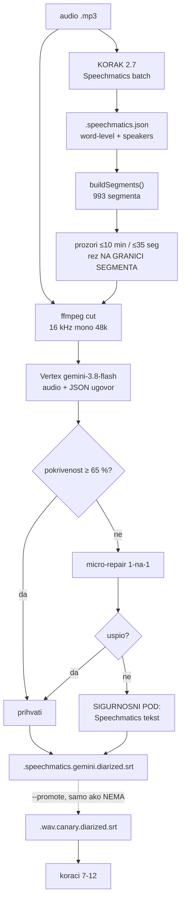
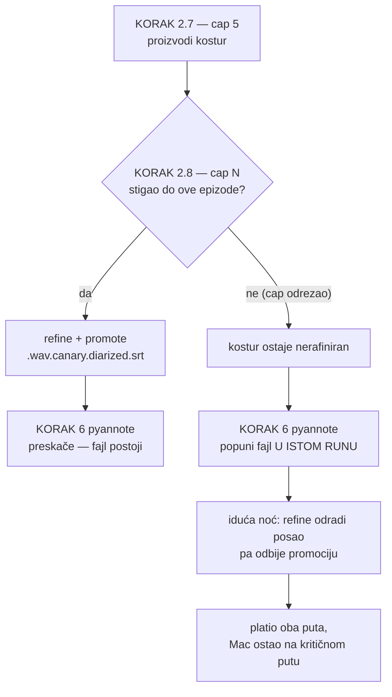

# Speechmatics kostur + Gemini sluh (KORAK 2.8) — mjerenje i odluka

**Datum:** 2026-09-19
**Kod:** `refine_diarized_gemini.js`, `tools/compare_transcripts.js`, `run_pipeline.sh` (KORAK 2.8)
**Izvor arhitekture:** `../../adria-analytics/adria-brainstormer/experiments/gemini-audio/studio_asr.py`
(`--engine skeleton --skeleton speechmatics`) + `docs/2026-09-11-gemini-skeleton-poravnanje.md` tamo
**Vezani dokumenti:** [launchd QoS i transkodiranje](2026-09-19-launchd-qos-i-transkodiranje.md)
**Povod:** dvije epizode zapele u nightlyju 19.09. + primjedba da Canary zna ispisati istu riječ 30+ puta

---

## Zaključak u jednoj rečenici

Nijedan ASR nije pobjednik: Canary piše bolji hrvatski ali **katastrofalno otkaže
na 4,8 % kataloga**, Speechmatics je stabilniji i bolje segmentira ali češće
lupeta na razini riječi — pa je ispravan potez ne birati između njih, nego uzeti
Speechmaticsov **kostur** (tko, kada) i pustiti Gemini da **čuje** što je rečeno.

---

## 1. Zašto uopće: ASR collapse, izmjeren nad cijelim katalogom

Skenirana su sva **3301** `.wav.canary.diarized.srt` transkripta.
Mjera je `max_run` — najdulji niz identične riječi zaredom nakon normalizacije
(`tools/compare_transcripts.js`, funkcija `degeneracy`).

| prag `max_run` | datoteka | % kataloga |
|---|---|---|
| ≥ 5 | 740 | 22,4 % |
| ≥ 10 | 241 | 7,3 % |
| **≥ 30** | **157** | **4,8 %** |
| ≥ 100 | 98 | 3,0 % |

Medijan je **3**, aritmetička sredina **9,5**. Raspodjela je **bimodalna**, ne
kontinuirana: 65 % datoteka s `max_run ≥ 10` ima ga ≥ 50. Transkript je ili
uredan ili eksplodira — nema blagog pogoršanja.

> 🔴 **ISPRAVAK ISTOG DANA: 4,8 % je bilo 2,5× podcijenjeno.** `max_run` gleda
> samo identične UZASTOPNE tokene, pa mu izmiče **ciklički** collapse gdje se
> ponavlja fraza: `"on je vodio on, on je vodio on…" (×42)` daje `max_run = 8`.
> Uhvaćeno slučajno, na epizodi koju smo držali urednom. Mjera `cyclicDegeneracy`
> dodana u `tools/compare_transcripts.js`; ponovni sken u §1.2.

> ⚠️ Prag 3–5 je najvećim dijelom **legitiman**. Hrvatski govorni jezik ima
> stvarna trostruka ponavljanja ("da da da"). Tek ≥ 30 je siguran signal kvara —
> nijedan čovjek ne ponovi riječ trideset puta.

Najgori slučaj, `bozja_pobjeda` / `_yt_Cu3N9THrw0A`, **419× „ono"** u jednom segmentu:

```
[SPEAKER_01] Zato što je ono ono ono ono … (419×) … ono Loš, jako jednostavno.
```

Najpogođeniji kanali (stopa `max_run ≥ 10` naspram kataloškog prosjeka 7,3 %):
`bozja_pobjeda` 26 %, `bozanstvena_komedija` 23 %, `podcast_cuspajz` 21 %,
`neuspjeh_prvaka` 18 %.

### 1.2 Ciklički collapse — prava stopa je 12 %, ne 4,8 %

Ponovni sken svih **3303** transkripta s mjerom `cycle_reps` (najviše uzastopnih
ponavljanja bloka duljine 2–8 riječi):

| prag `cycle_reps` | datoteka |
|---|---|
| ≥ 5 | 525 |
| **≥ 10** | **395** |
| ≥ 40 | 234 |
| ≥ 100 | 39 |

| | staro (`max_run ≥ 30`) | novo (`cycle_reps ≥ 10`) |
|---|---|---|
| pogođenih | 157 | **395** |
| % kataloga | 4,8 % | **11,96 %** |

**238 datoteka (7,2 %) bilo je dosadašnjoj mjeri potpuno nevidljivo.**

> 📌 `max_run ≥ 30` je **strogi podskup** od `cycle_reps ≥ 10` — nula datoteka ima
> jedno bez drugog. Matematički nužno: 30 identičnih riječi JE period-2 ciklus s
> ~15 ponavljanja. Dakle `cycle_reps` nije komplementaran signal nego **nadmjera**,
> i stari prag treba povući iz upotrebe, ne držati uz novi.

Primjeri koje je stara mjera proglasila urednima:

```
max_run=6   podcast_cuspajz       "da li"  ×129
max_run=3   zeljka_markic…        "da ti"  ×128
max_run=2   hnb                   "ja mogu" ×121
max_run=2   popcast_pavicic       "da je"  ×120
```

```
[SPEAKER_01] Ja znam tu po Karlovcu kužeš, ma kaže, kaže, da li, kaže,
             da li, da li, da li, da li, da li, da li, da li, da li, …
```

Najpogođeniji kanali po udjelu (n ≥ 20): `bozanstvena_komedija` **40,0 %**,
`bozja_pobjeda` 35,2 %, `podcast_cuspajz` 28,9 %, `hercegovina_info` 22,0 %,
`neuspjeh_prvaka` 21,1 %, `popcast_pavicic` 20,7 %, `catholic_futurist` 20,0 %.

Najveći pomak zbog nove mjere: **`launched` 2 → 20 (10×)**, `radio_mreznica`
8 → 28, `lood_podcast` 11 → 33. Pet kanala koji su po staroj mjeri imali **nulu**
sada imaju pogodaka (`podcast_bitno_net`, `merz_institut`, `marijanski_zavjet`,
`marin_miletic`, `sapere_aude`).

### 1.1 Što collapse košta — i što NE košta

Prvotna hipoteza je bila da collapse truje deep linkove, jer 85 % njih stane u
jedan segment, a taj segment ima patološki timestamp (`00:00:00 --> 01:45:01`).
**Hipoteza je izmjerena i oborena.**

Patološki cue nije zamjena vremenske osi nego **preklop** preko nje: pokvaren mu
je samo `start` (resetiran na nulu), `end` je točan, a unutar njegova raspona
normalni cueovi i dalje postoje — kod `skBC7BYU3CQ` njih 1050.

| | nominalno | stvarno |
|---|---|---|
| najgori pojedinačni segment | 6301 s | **≈ 37 s** |
| zbroj svih 18 patoloških | 7,7 h | **53 min** |

Šteta nizvodno, mjereno na 10 najgorih epizoda:

- **9/10 ima nula stvarno neoslonjenih timestampova** u članku; ukupno **jedna**
  sekcija pogađa u prazno (`_yt_5ANEovqL5VU`).
- `.rag_combined.jsonl` je **čist** — tekst patološkog cuea u njega uopće ne ulazi,
  nijedan chunk nije naslijedio patološki raspon. (U stari `.rag_chunks.jsonl`
  ulazi; fixed-size strategija ga guta, hibridna ne.)

Dvije su populacije, s malim presjekom:

| skup | broj |
|---|---|
| collapse (`max_run ≥ 30`) | 157 |
| patološki segment (> 300 s) | 18 |
| oba | 12 |
| **collapse bez oštećenja vremenske osi** | **145** |
| dugi segment bez collapsea | 6 — stvarne tišine/glazba, nije kvar |

**Zaključak: collapse je čisto tekstualni kvar.** Transkript izgleda kao greška i
takav ulazi u članak, e-knjigu i RAG, ali linkovi drže. Vrijednost koraka 2.8 je
čitljivost i vjernost, ne integritet linkova.

Krivac je **Canary, ne pyannote** — isti pokvareni cue postoji već u
`.wav.canary.srt`, prije diarizacije.

> 📌 Usput izmjereno, dosad nezapaženo: **644 datoteke** imaju barem jedan cue s
> `end ≤ start` (ukupno 1095). Blaža, zasebna anomalija; nije istražena.

---

## 2. Canary vs Speechmatics — nije ono što se čini

Na 25 epizoda koje imaju oba transkripta:

| metrika | Canary | Speechmatics |
|---|---|---|
| prosječni `max_run` | 8,08 | 3,84 |
| **medijan `max_run`** | **3** | **3** |
| prosječni `runs_3plus` | 2,24 | **4,20** |

Dvije stvari koje se naizgled ne slažu, a obje su stvarne:

1. **Canary nije sustavno repetitivniji** — medijan je identičan. Cijela razlika
   u prosjeku dolazi od dva outliera (`93QA-9hGB1g`: 73 vs 4; `S5bScs9Q…`: 57 vs 4).
   Maknu li se, Canary padne *ispod* Speechmaticsa.
2. **Speechmatics ima gotovo dvostruko više mjesta s 3+ ponavljanja** i u 21 od 25
   parova je jednak ili gori po tom kriteriju. To vjerojatno nije kvar nego
   **vjernost** — zapisuje stvarna „da da da" koja Canary uglađuje.

> 🔴 `max_run` i `runs_3plus` mjere **dvije različite pojave**: prvo hvata ASR
> collapse, drugo vjernost disfluencija. Za detekciju kvara koristan je samo prvi.
> Nemoj ih zbrajati u „ocjenu kvalitete".

Uzorak od 25 parova je malen i skošen na rujan 2026. — dovoljan da pokaže da
metrike ne mjere isto, **nedovoljan za presudu o kvaliteti**.

### 2.1 Dokaz da nijedan nije pobjednik

Ista epizoda (`lood_podcast` / `93QA-9hGB1g`), dva mjesta.

**Na 00:49:19 Canary potpuno otkaže** — 37,5 s zvuka pretvoreno u 73× „ovoj",
i još pripisano krivom govorniku:

```
CANARY  [SPEAKER_01] Ovaj, ovoj, ovoj, ovoj … (73×)

SPEECH  [SPEAKER_00] Kako ovaj? Kako ti za sebe ili recimo kad razgovara sa
                     drugim muškarcima? Znači nisu dečki, nego muškarci ovaj,
                     kako kako pronađeš granicu?
        [SPEAKER_00] Kad govorimo o ove dvije krajnosti, recimo, na jednoj
                     krajnosti bi možda mogli opisati kao tvrd, kao tvrdoglav…
```

**Na 00:52:32 Canary je bolji**:

```
CANARY  I puno ljudi, ne kažem samo muškarci i žene, zasnovali su svoju
        egzistenciju na bazi svoje rane. I samo ju na razne načine aspektiraju…

SPEECH  I puno ljudi ne kažu samo muškarci i žene imaju. Zasnovali su svoju
        egzistenciju na bazi svoje rane i samo i na razne načine aspektima…
```

Isti par datoteka, deset kilometara razlike u zaključku ovisno o tome gdje
pogledaš. Zato je odluka „uzmi oboje, pitaj trećeg koji čuje", a ne „zamijeni A s B".

---

## 3. Arhitektura KORAKA 2.8

Tri pitanja, tri alata — podjela preuzeta iz adria-brainstormera:

| pitanje | alat | zašto |
|---|---|---|
| TKO govori i KADA | Speechmatics | akustika, word-level vremena, stabilna segmentacija |
| ŠTO je rekao | Gemini 3.8 Flash | jedini sudionik koji **čuje** zvuk |
| KAKO se zove | koraci 7+8 | kontekst iz sažetka, kao i dosad |

Gemini **ne popravlja tekst kao tekst**. Dobije gotov kostur segmenata s već
određenim govornikom i intervalom, pa mu se preda zvuk TOG prozora i traži da
svaki segment ispuni onim što čuje. Izlaz je JSON po `id`-u segmenta, uz
`responseSchema`; segmente ne smije spajati, dijeliti ni preimenovati.



### 3.1 Zašto Vertex, a ne Gemini API

Izvorna implementacija ide na AI Studio (`generativelanguage`) ili Vertex express,
oboje s API ključem. **Ovdje nije potrebno ni jedno ni drugo.**

Skripta ionako reže zvuk ffmpegom po prozoru prije slanja, pa svaki poziv nosi
isječak od ~10 min — daleko ispod inline limita od 20 MB. Files API je time
udobnost, ne nosivi zid, i cijela stvar staje u obični `generateContent` s
`inlineData` na **project-scoped Vertexu s OAuth bearerom** — isti auth put koji
već koriste koraci 7+8. Nema drugog ključa, nema drugog naplatnog kanala.

Empirijski potvrđeno istog dana: HTTP 200 na
`bimbo-sync-prod` / `locations/global` / `gemini-3.8-flash`, **25 audio-tokena po
sekundi** zvuka (60 s → 1500 tokena).

> ⚠️ Ne vrijedi tvrdnja „to Vertex ne može, samo Gemini API". Ono što je stvarno
> vezano uz Gemini API: Files API, Interactions API i `gemini-3.5-transcribe`
> (koji na Vertexu nosi `-preview` i ima uži limit, 15 min vs 30 min). Ništa od
> toga ovaj korak ne koristi.

### 3.2 Ograde

| ograda | zašto |
|---|---|
| rez prozora **na granici segmenta** | na fiksnoj minuti model dobije pola rečenice i „dopuni" je izmišljotinom |
| `responseMimeType` + `responseSchema` | bez njih model vrati prozu oko JSON-a; parsiranje puca na dugim prozorima |
| quality gate 65 % | model zna vratiti prazne segmente kad mu pažnja padne pred kraj prozora |
| **sigurnosni pod = Speechmatics tekst** | popravak je dodatak, ne uvjet; segment se NIKAD ne izgubi |
| `maxOutputTokens` vezan uz duljinu natuknice | fiksnih 8192 je u izvornom eksperimentu bila kriva pretpostavka (stvarni strop je 65 536) |
| raspolavljanje prozora na blokadi | mjereno drugdje: 3/6 prozora `blockReason: OTHER` nedeterministično, isti zvuk drugdje prođe |
| ponovljeni `id` se **spaja**, ne pregazi | model zna podijeliti segment u dva zapisa |

### 3.3 Zašto promocija nije automatska

Izlaz ide u **vlastiti namespace** `.speechmatics.gemini.diarized.srt`. Tek
`--promote` napiše `{base}.wav.canary.diarized.srt` — kanonsko ime koje čita 20
skripti nizvodno — i to **samo ako ga nema**. Prepisivanje postojećeg traži
`--force-promote` i uz to radi `.bak`.

Presedan je `colab_sortformer` (CLAUDE.md): eksperiment živi u odvojenom
namespaceu dok ne dokaže da je bolji.

---

## 4. Izmjereno na dvije zapele epizode

Obje su 19.09. zapele jer je nightly pao na disk ogradi prije koraka 6
(pyannote), pa `.canary.diarized.srt` nikad nije nastao — a bez njega koraci 7-12
ne kreću. Speechmatics je za obje već bio gotov i stajao neiskorišten.

### 4.1 Rezultat

| | **Iva Kraljević** `aue1GuuMsbA` | **Radio Mrežnica** `70uXR4DDZiE` |
|---|---|---|
| trajanje | 161 min | 131 min |
| segmenata / govornika | 993 / 4 | 810 / 2 |
| prozora | 29 | 24 |
| **prihvaćeno** | **958** (96,5 %) | **810** (100 %) |
| micro-popravaka | 6 | 7 |
| palo na Speechmatics pod | 35 (jedan prozor, 429) | **0** |
| raspolavljanja prozora | 2 | 3 |
| riječi: Speechmatics → Gemini | 25 946 → 27 605 (**+6,4 %**) | 17 823 → 18 877 (**+5,9 %**) |
| wall clock | 24 min 49 s | 19 min 58 s |
| trošak (Gemini) | $0,526 | $0,443 |
| trošak (Speechmatics) | $2,152 | $1,747 |

### 4.2 Metrike, sve četiri verzije

`aue1GuuMsbA`:

| izvor | riječi | r/min | seg | gov | maxRun | 3+× |
|---|---|---|---|---|---|---|
| Speechmatics | 26 083 | 161,7 | 993 | 4 | 5 | 21 |
| **Speechmatics + Gemini** | **27 788** | **172,3** | 993 | 4 | 6 | 66 |
| Canary | 25 813 | 160,1 | 1695 | — | 8 | 30 |

`70uXR4DDZiE`:

| izvor | riječi | r/min | seg | gov | maxRun | 3+× |
|---|---|---|---|---|---|---|
| Speechmatics | 17 932 | 136,9 | 810 | 2 | 3 | 4 |
| **Speechmatics + Gemini** | **19 030** | **145,3** | 810 | 2 | 6 | 18 |
| Canary | 17 958 | 137,1 | 1133 | — | 8 | 7 |

> ⚠️ **Porast `3+×` (21→66, 4→18) NIJE degradacija.** `maxRun` ostaje 6 — duboko
> unutar legitimnog ljudskog govora. Gemini vjerno zapisuje stvarna ponavljanja
> koja Speechmatics proguta, što je u skladu s nalazom iz §2 da `runs_3plus` mjeri
> vjernost disfluencija, a ne kvar. Isti razlog stoji iza +6 % riječi.

### 4.3 Dokazani popravci

Mrežnica, 00:36:01 — Speechmatics krivo čuo dijalekt, Gemini popravio (Zagreb je
kajkavski, ne ikavski); Canary se slaže s Geminijem:

```
SPEECHMATICS  … Zagrepčane sa zagrebačkim govorom kao ikavice.
GEMINI        … Zagrepčane sa zagrebačkim govorom kajkavice…
CANARY        … zagrebčane i sva. sa zagrebačkim govorom kajkavice…
```

Iva, uvod — Speechmatics razbio trostruku najavu u besmislice, Gemini čuo da su
to tri uzastopna snimka iste rečenice:

```
SPEECHMATICS  Bok svima. Ja sam Iva Kraljević. Dobrodošli u podcast ja sam
              Kraljević. Dobrodošli u box. Ja sam Kraljević dobrodošao u klub.
GEMINI        Bok svima, ja sam Iva Kraljević i dobrodošli u podcast. (×3)
```

```
SPEECHMATICS  u da se ne stavi neki u montaži.
GEMINI        A sad nek stave u montaži neki pljesak sa strane.
```

### 4.4 Dvije zamke uhvaćene tijekom runa

1. **Tipografsko označavanje igre riječi.** Model je rimu na „-iva" počeo pisati
   kao `skr-iva-`, `kreat-iva-`. Zatvoreno pravilom 10 u promptu (samo izgovorene
   riječi, bez crtica/zagrada/oznaka).
2. **429 „Resource exhausted" iscrpio 6 pokušaja u ~84 s** kad su dva runa išla
   paralelno na istoj kvoti → cijeli prozor (35 segmenata) pao na sigurnosni pod.
   Popravljeno: 429 ima vlastiti kvadratni raspored (15 s × n², ~10 min ukupno),
   odvojen od 5xx. **Sigurnosni pod je odradio posao — nijedan segment nije izgubljen.**

> 📌 Stats su u prvom runu dvostruko brojali pali prozor (958 + 70 = 1028 za 993
> segmenta): prozor koji padne brojao se i u petlji i u sklapanju. Popravljeno.


---

## 5. Trošak

| | |
|---|---|
| audio ulaz | 25 tok/s → **90 k tokena po satu zvuka** |
| epizoda 161 min | ~29 prozora, **≈ $0,45** |
| epizoda 131 min | ~24 prozora, **≈ $0,35** |
| cjenik | `gemini-3.8-flash` $0,75 / $3,75 po M (promo do 31.12.2026., **onda dupli**) |

Trošak se knjiži u zajednički `{base}.gemini_usage.json` pod `step: "refine"`,
uz korake `summary` i `article`.

> 💰 **ISPRAVAK.** Ranija računica „3 200 epizoda ≈ $1 400" brojala je SAMO Gemini,
> a Speechmatics je dominantan trošak (~$0,80/h zvuka). Uz prosječnu epizodu od
> ~1–1,5 h to je ~$1,25/ep ukupno:
>
> | opseg | epizoda | ≈ trošak |
> |---|---|---|
> | cijeli katalog | 3 303 | **~$4 100** |
> | svi s collapseom (`cycle_reps ≥ 10`) | 395 | **~$500** |
> | samo najteži (`cycle_reps ≥ 40`) | 234 | **~$290** |
>
> Ciljani backfill i dalje hvata gotovo cijelu korist za osminu cijene, ali brojka
> je 395 epizoda, ne 157. Zato korak ima isti prozor svježine kao 2.7
> (`GEMINI_REFINE_FRESH_DAYS=3`) — prati priljev, NE konvergira nad katalogom.

### 5.x Cap 2.8 mora pratiti cap 2.7 (ispravak 21.09.)

Cap je 19.09. spušten na 1 jer je korak blokirajući, uz obrazloženje „rep pokupi
sljedeća noć". To je bilo krivo, i mjerenje je to pokazalo u prve dvije noći.

Kad 2.7 proizvede više kostura nego što ih 2.8 smije obraditi, višak ostane
nerafiniran → **pyannote (KORAK 6) popuni `.wav.canary.diarized.srt` u istom
runu** → iduća noć uredno odradi refine i onda odbije promociju
(„već postoji — NE diram"). Rep se ne pokupi; on se preda.

Noć 20.09., 2 epizode:

| epizoda | izvor `diarized.srt` | trošak |
|---|---|---|
| `aSV2T6DO-Ls` (29 min) | ✅ Speechmatics + Gemini, promovirano 03:11 | $0.40 + $0.08 |
| `Y9BWTDMNH8w` (79 min) | ❌ **pyannote na Macu** 03:11→03:15 | $1.05 + $0.31 → **u prazno** |

Zato je 21.09. `GEMINI_REFINE_MAX_FILES` 1 → 5, a `SPEECHMATICS_MAX_FILES` 3 → 5.

**Pravilo: cap 2.8 ≥ cap 2.7.** Ako ih razdvojiš, fallback pobjeđuje utrku i
plaćaš oba puta.

Cijena tog pravila je latencija — obrada traje ≈ 0,14 min po minuti zvuka
(79 min zvuka → 11:26), pa 5 epizoda znači 30-55 min prije nego koraci 7-12
uopće krenu. Ako to počne gurati Opus pozive u nov prozor kvote
(`lib/claude_window.js`), spusti **oba** capa, ne samo 2.8.

---

## 6. Status i što dalje

| | |
|---|---|
| `refine_diarized_gemini.js` | ✅ radi |
| `tools/compare_transcripts.js` | ✅ metrike + `--sample N` poravnat po vremenu |
| `run_pipeline.sh` KORAK 2.8 | ✅ ožičen (`--with-gemini-refine`, `--gemini-refine-promote`) |
| **nightly** | ✅ **UKLJUČEN 19.09.** — `--gemini-refine-promote` |
| promocija | ✅ aktivna za NOVE epizode; postojeće se ne diraju |

### 6.1 Što se od 19.09. stvarno vrti u nightlyju

```
KORAK 2.6  Modal Canary        cloud    ✅ OSTAJE
KORAK 2.7  Speechmatics        cloud    ✅
KORAK 2.8  Gemini sluh         cloud    ✅ + promote
KORAK 6    pyannote            LOKALNO  ⏭️  preskače se sam
```

**Cilj nije bio maknuti Canary nego maknuti Mac Mini iz obaveznog puta.** Modal
Canary se vrti na modal.com, dakle može ga pokrenuti i cloud cron, košta ~$0,01/ep
i usput daje drugi nezavisan transkript za usporedbu. pyannote je jedino što traži
lokalni stroj — i jedino što 2.8 istiskuje.

Mehanizam je potpuno pasivan, **bez ijedne nove linije logike**:

| | |
|---|---|
| `refine_diarized_gemini.js` | promovira SAMO ako `.wav.canary.diarized.srt` ne postoji |
| `diarize_canary.py:886` | `has_diarized_transcript()` — preskače WAV koji taj fajl već ima |
| `diarize_canary.py:891` | „NIKADA ne prepisuje postojeće datoteke" |

⇒ uspije li 2.8, pyannote nema što raditi. Ne uspije li (Speechmatics pao, kvota,
nema ključa), pyannote radi točno kao dosad. **Fallback nije napisan, nego zatečen.**

> ⚠️ Ne „optimiziraj" tako da Modal preskoči epizode koje 2.8 pokrije. Prva verzija
> ove promjene to je radila (`tools/scan_modal_candidates.js`) i odbačena je isti dan:
> Modal je cloud-native i njegov je izlaz vrijedan kao kontrola.

### 6.2 Povratak na staro

Makni `--gemini-refine-promote` iz `automatic/nightly_pipeline.sh`. To je sve.
Postojeće promovirane datoteke ostaju (valjane su), nove se prestaju raditi,
pyannote se vraća u pogon sljedeću noć. Ovo je još uvijek development —
pojavi li se open-source ASR koji radi kao Speechmatics, mijenja se samo 2.7/2.8.

Otvoreno:

1. **Slijepa usporedba s uhom.** Ni jedan subagent ni metrika ne mogu presuditi
   „što je stvarno rečeno". Treba čovjek, na 2-3 izdvojena mjesta.
2. **Ciljani backfill 157 collapse epizoda** (~$70) — najbolji omjer koristi i troška.
3. **644 datoteke s `end ≤ start`** — neistražena anomalija.
5. **Prag za `cycle_reps` nije kalibriran.** Uzeo sam 10 jer razdvaja poznate
   slučajeve, ali granica legitimnog govora nije izmjerena — hrvatski ima stvarna
   ponavljanja fraza ("da da da", "ne ne ne"). Između 3 i 10 je siva zona.
4. **Gemini kao arbitar za Canary vs Speechmatics.** Za prosudbu Geminijeve
   VLASTITE verzije je pristran i ne vrijedi kao nezavisna potvrda.

---

## 7. Verifikacija u produkciji (21.09.2026.)

Dvije noći nakon uključenja, iz logova (`automatic/logs/nightly_*.log`), ne iz
pretpostavke.

### 7.1 Noći se skratile s pola dana na pola sata

| noć | trajanje | status |
|---|---|---|
| 15.09. | **5h53m** | ✅ |
| 18.09. | 3h30m | ✅ |
| 19.09. | 31m | ⚠️ 2 koraka nenula (2.8 još nije bio u nightlyju u 01:00) |
| 20.09. | 38m | ✅ |
| **21.09.** | **18m** | ✅ |

`audit_pipeline.js` u istoj noći: **3302/3302 (100,00 %), rupa 0.**

Zasluga je podijeljena: QoS fix (`ProcessType Background → Standard`, 12,7× na
CPU koracima — `docs/2026-09-19-launchd-qos-i-transkodiranje.md`) i ovaj korak,
koji pyannote miče s kritičnog puta.

Sitnice koje **nisu** regresije, ali se ponavljaju svake noći:

- `ingest_beamly` ENOENT na `../revenuecat/subclub/subclub-episodes.json` (non-fatal)
- 3 neuspjela screenshota od 65 263 — klasa „stale article timestamps"
- 429 na Vertexu u 2.8 — DSQ, retry ih pojede, pokrivenost ostaje 103–109 %

### 7.2 Utrka koju je fallback dobio

Vidi §5.x za mjerenje. Mehanizam:



Zato **cap 2.8 ≥ cap 2.7**. Od 21.09. su oba **5**.

### 7.3 Što još veže nightly za Mac

Nakon što 2.8 istisne pyannote, **računski** dio više ne traži ovaj stroj — run
21.09. nije taknuo Mac za računanje. Ostaje četvero, i nijedno nije CPU nego
**pristup**:

| | što veže | koliko tvrdo |
|---|---|---|
| KORAK 1 + 10 | `yt-dlp --cookies-from-browser brave` | 🔴 najtvrđe — datacentar IP dobije anti-bot, kolačići traže lokalni browser i tty |
| KORACI 7+8 | `claude -p --model opus` pod **pretplatom** | 🟡 vezano za sesiju, ne stroj; ali `CLAUDE_WINDOW_GUARD` je pisan za lokalni ritam |
| storage | 3302 epizode na vanjskim diskovima | 🟡 CDN je već R2; cloud treba radni prostor, ne katalog |
| 12.5 + 9.5/9.6/9.7 | ffmpeg / ImageMagick | 🟢 trivijalno prenosivo, pitanje egressa |

Realan put, **ako** se ide: cloud cron vrti 2.6/2.7/2.8 + 7/8 + 9.x/12.x, a doma
ostane tanki fetch agent s Brave kolačićima koji gura MP3 na R2.

⚠️ Odluka o selidbi **nije donesena**. Ovo je procjena, ne plan.

## Vezani dokumenti

- `docs/2026-09-19-launchd-qos-i-transkodiranje.md` — QoS fix, drugi razlog skraćenja noći
- `docs/speechmatics_evaluation_2026-09.md` — evaluacija 2.7
- `docs/2026-08-28-konvergencija-pipelinea.md` — zašto 2.6 nema prozor svježine, a 2.7 ima
