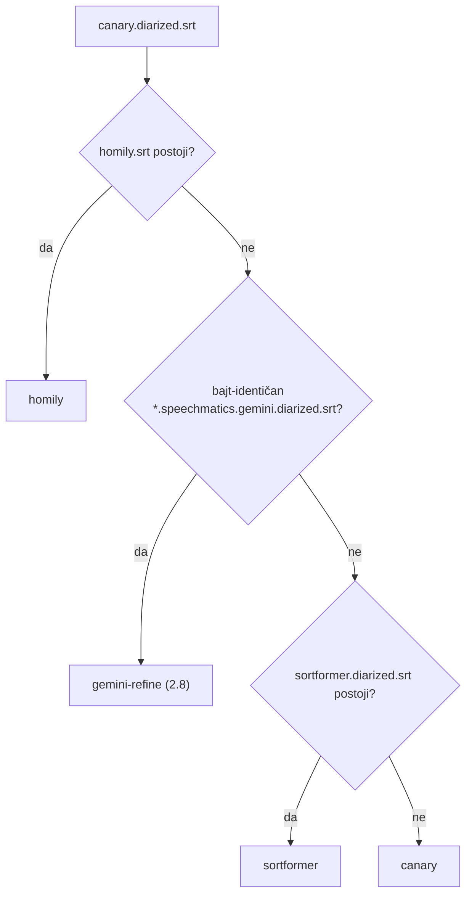

# Reobrada epizode NamKWyUNrbU kroz KORAK 2.8 — i zašto je Sortformer zasjenio novi transkript

**Datum:** 23.09.2026.
**Epizoda:** `NamKWyUNrbU`, kanal `iva_kraljevic`, „Izbor koji sam skupo platila – Antonija Domović" (20.06.2025.)

## Sažetak

Staru epizodu smo ponovno obradili: Speechmatics kostur i Gemini sluh (KORAK 2.8),
zatim novi sažetak, članak (Opus), RAG i EPUB. Na tome smo našli tihu grešku u
izboru transkripta: `resolveDiarizedSrt()` je davao prednost
`.wav.sortformer.diarized.srt` iz svibanjskog eksperimenta. Ta datoteka nosi
**stari Canary tekst**, pa bi reobrada napisala članak iz starog transkripta, iako
je novi već bio na disku.

Popravak je detektor `isPromotedRefine()`, identičan u **pet** kopija:
`summarize_gemini.js`, `generate_article_gemini.js`, `prepare_rag.js`,
`prepare_rag_combined.js` i `prepare_rag_import.js`.

## Mehanizam

`refine_diarized_gemini.js --promote` piše kanonski `.wav.canary.diarized.srt` kao
**bajt-identičnu kopiju** svog izlaza `{base}.{audio}.speechmatics.gemini.diarized.srt`.
Ta jednakost bajtova jedini je pouzdan znak da je 2.8 promovirao transkript: nema
marker datoteke, a mtime nakon bulk restorea ne vrijedi.

Redoslijed je homily → gemini-refine → sortformer → canary. Homily grana postoji
samo u `generate_article_gemini.js`. Discovery i imena izlaznih datoteka ostaju
vezani uz canary.

**Opseg rizika:** `.sortformer.diarized.srt` ima **1947** epizoda (izbrojeno Nodeom 23.09.). Svaka od njih bi
bez ovog popravka pri reobradi kroz 2.8 tiho pisala članak iz starog teksta.

## `force_upload.js` — novi targeti

Reobrada mijenja i ključeve koji su na R2 immutable, a `upload_to_r2.js` ih ne
prepisuje: `outline`, `diarized` (`text/plain`) i `epub` (`application/epub+zip`).
Dodani su u `TARGET_MAP`, a `contentType` se sada može zadati za pojedini target.

## Stanje nakon reobrade (provjereno 23.09. u 17:40)

| Artefakt | Disk | CDN `last-modified` |
|---|---|---|
| `diarized.srt` (= 2.8, bajt-identičan) | 16:57 | 15:10 UTC |
| `article.json` (`_2026-09-23_opus`) | 17:11 | 15:11 UTC |
| `outline.json`, `summary.json`, `book.epub` | 17:11 | 15:11 UTC |
| RAG (`rag_combined.jsonl`) | 17:11 | cloud CH: 52 → **84** chunkova, verifikacija 1/1 |
| Cloud Meili, person hub (cloud PG) | — | re-indeksirani u 17:21 |
| stats.domovina.ai | — | ručni deploy u 17:38 |

## Pad stroja u 17:26 — memorija, ne pipeline

RAG sync (`domovina-rag/scripts/sync-cron.sh`, ručno pokrenut u 17:20) je prošao
ETL, CH delta, Meili, person hub i person map. Stroj je pao na zadnjem koraku
(stats deploy): **kernel panic**, `watchdog timeout: no checkins from watchdogd in 93 seconds`.
U panic logu stoji
`Compressor ... 100% of segments limit (BAD) with 38 swapfiles and LOW swap space`.

RSS u trenutku panica (`/Library/Logs/DiagnosticReports/Retired/panic-full-2026-09-23-172622.0002.panic`):

| RSS | Proces |
|---|---|
| **23,8 GB** | `python3.13` PID 43498, nastao oko 17:21:26. **Neidentificiran.** Nije RAG cron (njegov Python je 3.14 iz `.venv-vectormap`) i nije embedder. |
| 14,0 GB | Docker VM |
| 9,9 GB | host embedder (:8008, MPS kapica 8 GB; jednom je vratio `MPS backend out of memory` kao HTTP 500, bez pada) |
| 6,8 GB | `node` |

Stroj ima 24 GB RAM-a. Samo embedder i Docker VM zauzimaju oko 24 GB, pa **svaki
dodatni teški Python proces tijekom RAG synca** gura sustav u swap-smrt.

Usput: regeneracija vektorske mape je pala na `import umap` (numba
`cannot cache function ... no locator available`), što nije problem memorije.
Najvjerojatnije se sync vrtio iz sandboxirane sesije koja ne smije pisati numba
cache u `.venv-vectormap`. Jutarnji launchd run isti korak prolazi.

## Otvoreno

- Tko je bio `python3.13` od 23,8 GB? Ako se ponovi, uhvati ga dok radi
  (`ps -o pid,rss,command -p <pid>`), jer panic log ne bilježi argumente.
- Na CDN-u je još jutarnja vektorska mapa (05:06). Osvježit će je cron u 05:00.
- Lokalni Meili (`localhost:7700`) ne radi ni u jednom današnjem runu. Cron to
  bilježi kao WARN i nastavlja dalje.

## Vezani dokumenti

- `docs/2026-08-28-konvergencija-pipelinea.md`
- memory: `korak_2_8_speechmatics_gemini_skeleton`, `rag_ingest_frozen_embedder_container_dead`, `docker_vm_reserves_14gib_of_24`
