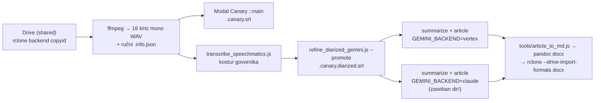

# Audio datoteka (ne YouTube) → članak — recept i mjerenja (26.09.2026.)

Demo za Tomislava Belavića („Prilika za susret”): 80-min diktafonska snimka
(`Glas 260919_160938.m4a`, 78 MB) iz dijeljenog Drive foldera provučena kroz
pipeline do sažetka i članka, u dvije verzije (Gemini 3.8 Flash i Claude Opus).
Svrha: pokazati da „audio → članak” radi i za snimke koje nisu na YouTubeu —
moguća podloga za aplikaciju za bilješke.

Pipeline nema ulaz za lokalnu audio datoteku (`fetch.js` zna samo URL), ali
koraci 2.6 → 8 su **dir-driven i source-agnostic**: dovoljno je složiti WAV s
imenom u konvenciji `{YYYYMMDD}_{slug}_yt_{11-char ID}.wav` i minimalan
`.info.json`. Ništa u repou nije trebalo mijenjati.

## Tok



## Naredbe

Radni direktorij **izvan `storage/output/`** (scratchpad), da ga nightly, R2
upload i RAG ne pokupe: `$R/prilika_za_susret/…` gdje je `$R` „korijen” (sve
skripte primaju `--input-dir` = korijen s direktorijima kanala).

```bash
# 1. preuzimanje s Drivea dijeljenog SA MNOM (po file ID-u, 78 MB za ~8 s)
rclone backend copyid google_drive_ms: <FILE_ID> ./

# 2. WAV; ID je sintetički: base64url(sha256("gdrive:<FILE_ID>"))[:11]
ffmpeg -i in.m4a -ar 16000 -ac 1 -c:a pcm_s16le $R/kanal/{base}.wav
#    + {base}.info.json s title/channel/upload_date/description, "_source":"gdrive-audio"

# 3. ASR
modal run modal_canary/canary_modal.py::main --wav $R/kanal/{base}.wav

# 4. govornici (isti put kao nightly od 19.09.)
node transcribe_speechmatics.js --input-dir $R --file <wav> --limit 1
node refine_diarized_gemini.js  --input-dir $R --file <wav> --limit 1 --promote

# 5. sažetak + članak
GEMINI_BACKEND=vertex node summarize_gemini.js        --input-dir $R --video-id <ID>
GEMINI_BACKEND=vertex node generate_article_gemini.js --input-dir $R --video-id <ID>

# 6. isporuka na Drive kao Google Doc
node tools/article_to_md.js <article.json> clanak.md "Gemini 3.8 Flash"
pandoc clanak.md -o gdoc/clanak.docx
rclone copy gdoc "google_drive_ms:<podfolder>" --drive-root-folder-id <FOLDER_ID> --drive-import-formats docx
```

## Mjerenja (80 min zvuka, 5 govornika)

| Korak | Trajanje | Trošak |
|---|---|---|
| Modal Canary (A100-40, inference 21 s) | 1 min 35 s | ~$0,05 |
| Speechmatics kostur | 5 min 13 s | ~$1,07 (0,80 $/h) |
| Gemini refine (9 prozora, 13 poziva) | 13 min 19 s | $0,24 |
| Sažetak Gemini 3.8 Flash | 19 s | — |
| Članak Gemini 3.8 Flash (3 poziva, 2 iteracije) | 5 min 34 s | $0,14 |
| Sažetak + članak Opus (pretplata, 4 poziva) | ~9 min 25 s | ≈ $2,71 ekvivalent |

Ukupno ~25 min i ~$1,5 do Gemini članka. Opus je napisao ~2× opširniji
članak (Markdown 262 vs 122 retka), bliži izgovorenom; Gemini sažetiji.
Ime predavača („Damir”) oba su modela izvukla ispravno — izgovoreno je u
transkriptu („A Damir je tako rekao”), dakle nije halucinacija.

## Zamke

1. **pyannote na Macu je odustao — nadzornik je radio ispravno.** Na `/` je bilo
   6,4 GB slobodno uz swap 14,8/16 GB; čak i s `--min-free-disk-gb 4` prekid u
   `embeddings` koraku (disk pao na 3,4 GB). Rješenje bez Maca: Speechmatics +
   Gemini refine (2.7/2.8). Ne gasiti nadzornik (`--guard off`) — vidi memory
   `nightly_diarize_guard_aborts_below_12gb`.
2. **Sažetak nema model slug u imenu** (`.canary.summary.json`), članak ima.
   Za A/B dva backenda vrti drugi backend u **zasebnoj kopiji direktorija**
   (kopiraj `.info.json`, `.canary.srt`, `.canary.diarized.srt`, symlinkaj WAV),
   inače drugi prolaz preskoči sažetak kao gotov ili ga pregazi.
3. **`summary.md` ubacuje linkove `domovina.ai/v/{id}` i `youtube.com/watch?v={id}`**
   — za sintetički ID ne postoje. Prije dijeljenja makni retke
   `**Epizoda:**` / `**Izvornik:**` / `**Kanal:**`.
4. **Drive MCP `download_file_content` vraća base64 u kontekst** — za 78 MB
   neupotrebljivo. `rclone backend copyid` radi po ID-u i za datoteke dijeljene
   s tobom; upload u tuđi folder ide s `--drive-root-folder-id`.

## Otvoreno

- Nema `fetch.js --local-audio` ulaza; za aplikaciju za bilješke to bi bio
  prvi korak (sintetički ID + info.json automatski, kao X ingestion).
- Disk na Macu (6,4 GB slobodno) i swap na rubu — i nightly diarizacija bi
  pala pod istim uvjetima.

## Vezani dokumenti

- `docs/UNLISTED_PIPELINE.md` — ad-hoc YouTube/X put
- `docs/2026-09-19-speechmatics-kostur-gemini-sluh.md` — koraci 2.7/2.8
- `docs/claude_code_backend_2026-07.md` — `GEMINI_BACKEND=claude`
- `modal_canary/README.md`
