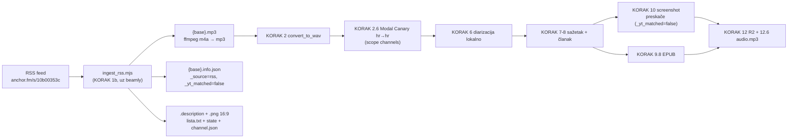

# Logopedski podcasti u Hrvatskoj — ciljani discovery i plan uvoza DijaLOG-a (2026-10-05)

**Zaključak.** U Hrvatskoj postoje točno **dva podcasta kojima je logopedija glavna tema**:
**DijaLOG – Logopedski podcast** (audio-only, Spotify/Apple/RSS) i **Norda Disleksija** (YouTube,
disleksija). U postojećem registryju (516 unosa) nijedan kanal nije logopedski — postoje samo
pojedinačne epizode. YouTube sweep je za ovu nišu slab izvor: jedini pravi logopedski podcast
nije na YouTubeu i našao ga je tek web research. Uveden je tag `speech-therapy`
(„Logopedija — govor, jezik, komunikacija").

DijaLOG je **uvezen u pipeline** (2026-10-05) iz RSS feeda, istim ugovorom kao Launched/Sub Club
(`ingest_beamly.mjs`): `ingest_rss.mjs` + KORAK 1b, kanal `dijalog`, cover po epizodi s Instagrama
(`tools/apply_episode_covers.mjs`) — vidi [§6](#6-dijalog-kroz-standardni-pipeline). Spotify nije
opcija (DRM). Na podcast.domovina.ai je uvedena kategorija **Logopedija** (🗣).

Sirovi artefakti prolaza: `data/discovery/runs/2026-10-05/` (sweep, probe, triage, LLM prompt +
odgovori, `web/speech_therapy_research.json`).

## 1. Metoda

Po runbooku [`REGISTRY_DISCOVERY.md`](REGISTRY_DISCOVERY.md), bez novog alata:

| Korak | Što | Rezultat |
|---|---|---|
| upiti | 17 redaka kategorije `speech-therapy` u `data/discovery/queries.txt` | — |
| `sweep --only-new-queries` | yt-dlp `ytsearch40` po novim upitima | 349 jedinstvenih kanala |
| `seed --source web-research-speech` | 6 YouTube kandidata iz web researcha (Spotify, Apple, HLD, ERF, SUVAG, udruge, Instagram, članci) | +1 novi kanal |
| `aggregate` | − registry (16) − ledger (30) | 304 za probe |
| `probe` + `triage` | zadnjih 60 videa po kanalu, nula medija | candidate 131, maybe 36, not_podcast 136 |
| `classify --model sonnet` | 7 batcheva, `claude -p` pod pretplatom | not_hr 136, institutional 13, not_podcast 8, **podcast_hr 6**, too_small 3, uncertain 1 |
| ručni pregled | svi redovi s logopedskim tragom u naslovu/opisu, **uključujući `not_podcast`** | vidi §2–§4 |
| registry scan | naslovi iz `watch-state.json` (445 kanala, do 60 videa) + svih epizoda praćenih kanala na disku | 0 logopedskih kanala |

`podcasts-tab` je namjerno preskočen (240 kanala medijskih kuća — nevezano uz temu).

Prag triagea (≥8 originala ≥30 min) ovdje reže krivo: stručni podcasti imaju epizode od 15–25 min
(4Kids/ALL IN je odbačen kodom i LLM ga nije ni vidio). Za male niše ručni pregled `not_podcast`
redova je obavezan.

## 2. Nalazi — logopedski podcasti

| Podcast | Platforma | Epizode | Raspon | Status | Zašto logopedski |
|---|---|---|---|---|---|
| **DijaLOG – Logopedski podcast** | [Spotify](https://open.spotify.com/show/1uLNzddcxKWG5Qz8LDWXD6), [Apple](https://podcasts.apple.com/hr/podcast/dijalog-logopedski-podcast/id1724226805), RSS `https://anchor.fm/s/10b00353c/podcast/rss`, IG @podcastdijalog | 54 numerirane + 7 kratkih (nulta, najave, blooperi); 48,2 h ukupno | 2022-11-28 → 2026-03-11 | sezonski (pauza ~7 mj.) | Logopedinje s ERF-a Zagreb (Laura Marinović, Ines Perović, Tamara Vlahović, Angela Peršun; studentska udruga Logomotiva). „Prvi logopedski podcast u Hrvatskoj." Teme: mucanje, afazija, disfagija, umjetna pužnica, dječja govorna apraksija, disleksija, diskalkulija, laringektomija, vokalna terapija, AAC, rani komunikacijski razvoj. |
| **Norda Disleksija** | [YouTube](https://www.youtube.com/channel/UCu4LN1f9qC_04exifajyw9Q) | ~14 razgovora 20–45 min od 69 videa (ostalo radionice, kratki isječci, EN serija RTWN) | 2021-02 → ~2023-10 | neaktivan | Udruga disleksičara (Vodice), Anja Norda. „Podcast o disleksiji" + serija „Razgovori o životu s disleksijom". Domaćica nije logopedinja nego osoba s disleksijom. |

RSS DijaLOG-a provjeren izravno (61 `<item>`, trajanja i datumi), ne samo iz web researcha.
Sezone: XI.2022–I.2023, IV–VII.2023, XI.2023–VII.2024, X.2024–III.2025, VII–XII.2025, II–III.2026.
Tišina od ožujka zato vjerojatno nije gašenje.

**„Dijalog" iz ledgera nije to:** `UCvnhn2X6nY60rBV1dF8AQLg` (@dijalog) je srpski talk show
(povijest, teologija, politika). DijaLOG nema YouTube kanal.

## 3. Granični slučajevi

| Kanal | Zašto granično | Prijedlog |
|---|---|---|
| **4Kids Podcast** (prije „Podcast ALL IN with Maida Arslanagić"), [YouTube](https://www.youtube.com/channel/UCYSyAnXuGP-Lor3yO25bhJg) | HR, 30 ep × ~20 min, 2021–2024. Tema: djeca s teškoćama u razvoju. Logopedske samo neke epizode (AAC ep. 3, logoped u vrtiću ep. 10, mucanje ep. 16, slikovnice i govorni razvoj ep. 21). | U registry kao `parenting`/`health` preko `seed --force`, **bez** `speech-therapy`. |
| **Pitaj logopeda** (pitajlogopeda.hr), [YouTube](https://www.youtube.com/channel/UCsDINSOl-6210O6PuIKmVAw) | 7 logopedskih videa 8–27 min (disfagija, laringektomija, moždani udar, JIL), 2021–22. Format (podcast vs predavanje) nepotvrđen. | Ostaje odbijen; ponovna provjera ako izađe više. |
| **PMB Podcast** (Petar je mali borac) | HR obiteljski kanal, 7 epizoda, jedna logopedska (Lucija Horvat). | LLM: `too_small`. |

## 4. Pojedinačne logopedske epizode u postojećim kanalima

Kanali se NE označavaju tagom `speech-therapy` — popis je za eventualnu tematsku zbirku.

| Kanal (slug) | Epizoda |
|---|---|
| `bliski-susreti-jezicne-vrste` / `gaj-tomas` | #82 Mucanje; #97 Disleksija; #202 Razvojni govorno-jezični poremećaji, uloga logopeda i roditelja (Ana Matić Škorić) |
| `koji-faks-upisati` | Zašto je Logopedija najpoželjniji faks? (Barbara Rukavina, Logopedija Rijeka) |
| `vox-medicus` | Poremećaj iz spektra autizma (Sanja Šimleša, ERF); Nagluhost (Nikola Zdrilić) |
| `in-medias-res` | „Što studirati?" — Edukacijska rehabilitacija (ERF) |
| `studentski-hr-tv` | Ep. 22: Edukacijski rehabilitatori i inkluzija djece s teškoćama |
| `metautism` | Matea Begić Alić, asistentica na ERF-u (autizam; kanal je EN) |
| `reci` | „Iva je gluha osoba…" |
| `druga-strana-medalje` | #52 Sveučilište za gluhe, znakovni jezik (Deborah Chen Pichler, Gallaudet) |
| `tribina-podcast-s-gostom` | Rukometna reprezentacija gluhih |
| Centar Pričaj mi (novi kandidat) | Podcast 4: Razvoj komunikacije, jezika i govora kod djece (logopedinja Dora Pribanić Maldini) |
| PMB Podcast (nije u registryju) | Lucija Horvat: o logopediji i radu s Petrom |
| Rastući s djecom (Bljesak.info) | Ivana Dodig: „Roditelji, ne čekajte 3. godinu za dolazak logopedu" |

## 5. Odbačeno

| Razlog | Kanali |
|---|---|
| srpski / BiH / crnogorski | @dijalog (talk show), Logoped za odrasle (Tanja Milovanović), Razvoj dece – DZ Kragujevac, Logopedi Avramović, Logoped Torbica, Marina Gavrić Govedarica (RTRS), Igraj Uči Rasti, Udruženje „Moj slobodan govor", Dive in / Pojačalo / Melos (samo epizode s logopedom), MIRIS POZITIVNOG DUHA |
| slovenski | Malinca, Poslušam.se |
| drugi jezici | teachmetotalk, The Preschool SLP, Řeči o řeči (CZ), Na bosaka (PL), Podręcznikarnia, Logorrea (ES), ECIE PECIE LOGOTOLKI, LOGUAN, Nilufar Defektolog (UZ) |
| nije podcast | VaLMod centar (kompilacija TV gostovanja o mucanju), Laboratorij za potpomognutu komunikaciju ERF, ICT-AAC, E-Glas (snimke konferencije ATAAC), Poremećaji jezika, govora i slušanja (isječci izlaganja), ERF UNIZG, Mario Dilberović (predavanja), Kokolingo (webinari) |
| HR, ali nije logopedija | PROgovori (javni nastup za poduzetnike), Skice za inkluziju (Radio Benčić) |
| nemaju podcast | Poliklinika SUVAG, Hrvatsko logopedsko društvo, Hrvatska udruga za disleksiju |

Nije pronađen nijedan HR podcast posvećen isključivo sluhu/umjetnoj pužnici, AAC-u ili gutanju —
te teme pokriva DijaLOG po epizodama.

### Usputni ulov (nije logopedija)

LLM je kao `podcast_hr` presudio još 5 kanala koje su upiti pokupili: XRPG 360 (CyberFleet, tech),
Lana Kihas (Zrnca mudrosti o odgoju), Centar Pričaj mi (psihologija roditeljstva), Trend Medij
(„Gost dana", Karlovac), Radio Varaždin („Intervju tjedna", zadnje 2019.). `apply --dry-run` ih
prikazuje zajedno s Nordom; odluka o upisu je otvorena.

## 6. DijaLOG kroz standardni pipeline

### 6.1 Što yt-dlp zna (izmjereno, yt-dlp 2026.08.17)

| Izvor | Rezultat | Upotrebljivo |
|---|---|---|
| Spotify (`open.spotify.com/show/…`) | `ERROR: [DRM] The requested site is known to use DRM protection. It will NOT be supported.` | **ne** |
| Apple Podcasts (`…?i=<episodeId>`) | ekstraktor radi, ali po epizodi (treba lookup API za popis) | moguće, nepotrebno |
| RSS (`anchor.fm/s/10b00353c/podcast/rss`) | generic ekstraktor: playlist od 61 stavke, enclosure = `.m4a` (AAC 44,1 kHz) | **da** |

Spotify, Apple i RSS su isti audio — Spotify for Podcasters (anchor.fm) hosta datoteku, a
Spotify/Apple je samo distribuiraju. RSS je izvor istine i ne treba ni yt-dlp ni kolačiće:
`<enclosure>` je direktni link kao `soundLink` kod Beamlyja.

### 6.2 Zašto ne `fetch.js` / lista s YouTube URL-ovima

Cijeli pipeline je izgrađen oko dvije pretpostavke koje RSS ne zadovoljava:

1. **11-znakovni ID** u imenu `{YYYYMMDD}_{naslov}_yt_{id}` — `extractVideoId()` (5+ kopija) i
   `convert_to_wav.js` ga vade iz `lista.txt` URL-a `https://youtu.be/{id}`.
2. **`.mp3`** — `convert_to_wav.js` traži isključivo `*.mp3`, `upload_audio_only.js` uploada
   `{base}.mp3` kao `audio/mpeg`. Anchor daje `.m4a`.

`ingest_beamly.mjs` već rješava oba za Launched/Sub Club, pa je ispravan put **isti ugovor, drugi
izvor kataloga**.

### 6.3 Ugovor koji ingester mora ispuniti (kao `ingest_beamly.mjs`)



| Artefakt | Sadržaj |
|---|---|
| `storage/output/dijalog/{YYYYMMDD}_{naslov}_yt_{id}.mp3` | enclosure skinut pa `ffmpeg -c:a libmp3lame` (ili `yt-dlp -x --audio-format mp3` nad enclosure URL-om) |
| `{base}.info.json` | yt-dlp oblik kao `buildInfoJson()`: `id`, `title`, `description` (HTML očišćen), `upload_date`, `timestamp`, `duration`, `uploader`/`channel` = „DijaLOG - Logopedski podcast", `channel_id: "rss_dijalog"`, `webpage_url` = `<link>` epizode, `thumbnail` = `itunes:image`, **`_source: "rss"`, `_rss_guid`, `_sound_link`, `_yt_matched: false`** |
| `{base}.description`, `{base}.png` | opis; cover složen u 16:9 thumbnail (§6.7) |
| `automatic/podcasts/dijalog-lista.txt` | `YYYYMMDD \| naslov \| https://youtu.be/{id}` |
| `automatic/podcasts/dijalog-lista-state.json` | `completed[]` |
| `automatic/podcasts/dijalog-channel.json` | ručno složen, kao `buildChannelJson()` |

**ID:** `<guid>` je UUID (`fcc78805-d7c4-…`). Sintetički ID = prvih 11 znakova
`sha1(guid)` u hexu — stabilan, deterministički, nikad ne izgleda kao pravi YouTube ID s `-`/`_`.
Dedup ide po ID-u izvedenom iz guida, ne po naslovu (naslovi se znaju ispraviti nakon objave).

**`_yt_matched: false` je ključan** — na njemu već rade, bez izmjene koda:
`screenshot_youtube.js` (preskače), `upload_audio_only.js` (KORAK 12.6 → `data/{id}/audio.mp3`,
frontend audio fallback), `generate_ebook.js` (bez YouTube navoda izvora), `generate_webp_thumbs.js`,
`backfill_youtube_subs.js`, `count_progress.js` (audio-only brojač).

### 6.4 Što je izvedeno (2026-10-05)

| Dio | Gdje |
|---|---|
| ingest RSS → mp3 + info.json (`_yt_matched:false`) + 16:9 `.png` iz covera | `ingest_rss.mjs` (izvori u `SOURCES`; `min_duration_sec: 600` izbacuje 6 kratkih stavki) |
| KORAK 1b u nightlyju, ne-fatalno, preskočen u priority fast-pathu | `run_pipeline.sh` (iza `ingest_beamly.mjs`) |
| kanal na disku | `storage/output/dijalog` → `/Volumes/DOMOVINA2TB/fetch_domovina_tv_output/dijalog` (auto-discover iz `DEFAULT`) |
| lista, state, channel.json | `automatic/podcasts/dijalog-lista.txt`, `-lista-state.json`, `-channel.json` |
| registry | `dijalog`: `source_type: audio-direct`, `source.provider: rss`, `youtube.type: audio-only`, `platforms` (Spotify/Apple/RSS/IG), `tags: [speech-therapy, education, health]`, `tracking.enabled: true` |
| cover po epizodi | `automatic/podcasts/dijalog-covers.json` + `tools/apply_episode_covers.mjs` (§6.7) |
| kategorija u javnom katalogu | `../podcast.domovina.ai/scripts/build-catalog.mjs` — `{ id: "logopedija", tags: ["speech-therapy"] }` |

Prve dvije epizode (54 i 53) provedene su ručno do kraja i provjerene iz točke potrošača:
`domovina.ai/v/f898a3f0774` svira `audio.mp3`, ima cover gošće, poglavlja, sažetak i EPUB; svi CDN
ključevi (`article.json`, `audio.mp3`, `thumbnail.png`, `og-share.jpg`, `book.epub`) vraćaju 200.

Korake za backlog vrtio sam pojedinačno, scope na kanal — puni `run_pipeline.sh` bi u KORAKU 0/1
vrtio rclone i fetch svih kanala:

```bash
node ingest_rss.mjs --source dijalog
node convert_to_wav.js --channel dijalog
MODAL_CANARY_MAX_CONTAINERS=1 modal run modal_canary/canary_modal.py::batch --channels dijalog
python3 colab_diarize/diarize_canary.py --input-dir storage/output/dijalog --hf-token "$(cat ~/.cache/huggingface/token)"
node tools/apply_episode_covers.mjs --channel dijalog          # PRIJE uploada (immutable thumbnail)
node summarize_gemini.js --input-dir storage/output --channel dijalog          # GEMINI_BACKEND nepostavljen = vertex
node generate_article_gemini.js --input-dir storage/output --channel dijalog
for s in prepare_rag_combined prepare_rag_import prepare_rag generate_og_image generate_ebook detect_sponsors; do
  node $s.js --input-dir storage/output --channel dijalog; done
node upload_to_r2.js --input-dir storage/output --channel dijalog
node upload_audio_only.js --input-dir storage/output --channel dijalog
node generate_webp_thumbs.js --input-dir storage/output --channel dijalog && node upload_to_r2.js --input-dir storage/output --channel dijalog
node generate_channel_index.js --input-dir storage/output && node upload_to_r2.js --meta-dir storage/meta
```

`diarize_canary.py` nema `--channel`; `--input-dir` usmjeren na direktorij kanala radi isto.

### 6.5 Trošak i trajanje backloga (55 epizoda, ~47 h zvuka) — izmjereno

| Korak | Procjena |
|---|---|
| download | ~1,9 GB m4a, nula API poziva |
| transkripcija | Modal `::batch`, jedan topli A100: 53/53, 0 grešaka, **$0,47–0,59** (~26 s inference/ep) |
| diarizacija | lokalno pyannote, ~1,5 min po 37 min zvuka → ~1,5 h za backlog |
| sažetak + članak | Vertex `gemini-3.8-flash`: **$7,11 za 55** (~$0,13/ep; starije epizode su 60–105 min pa članak ima više iteracija nego Ep. 53/54 na kojima je procjena bila $0,08) |
| ostalo (EPUB, sponzori, RAG, R2) | nula API poziva; R2 636 ključeva + 55 × `audio.mp3` |
| **ukupno** | **~$7,7** (Gemini $7,11 + Modal ~$0,55), ~4,5 h wall clock (diarizacija 2 h je usko grlo) |

### 6.6 Zamke

- **Ne pokušavati Spotify** ni preko „spotify downloader" alata — DRM, i pravno drugačija kategorija
  od javnog RSS enclosure linka.
- **Enclosure je redirect** (`anchor.fm/…/play/…` → CloudFront): `fetch` mora `redirect: "follow"`
  (kao `downloadTo()` u beamly ingestu).
- **Nije YouTube** → nema `--cookies-from-browser`, nema anti-bot rizika, nema `--via-iphone`.
- **Nemoj pisati shell `find` nad `storage/output/`** za ovaj kanal u nightlyju — macOS TCC
  (vidi CLAUDE.md). Ingest je Node.
- Prava: DijaLOG je javno distribuiran podcast, ali pun prijepis u EPUB-u ostaje opt-in
  (`--with-ebook-transcript`), isto kao za YouTube kanale. Javiti se autoricama (IG
  @podcastdijalog) prije objave je razumno — logopedska struka je mala i ovo je dobra veza.

### 6.7 Cover po epizodi s Instagrama

RSS daje isti cover (logo) za svih 55 epizoda. DijaLOG za svaku epizodu objavi Instagram karticu
s brojem epizode, imenom gosta i temom — to je thumbnail koji se vidi u aplikaciji.

- **Mapiranje** je u `automatic/podcasts/dijalog-covers.json` (ključ = RSS ID). 53 od 55 spojeno
  automatski: opis objave = početak RSS opisa (51), inače prezime gosta (2). Epizode 2 i 3 imaju
  samo „throwback" objave iz 2024. pa su upisane ručno. **Svih 55 provjereno vizualno** na
  kontaktnoj ploči (broj epizode i ime na kartici odgovaraju RSS-u).
- **Slike** skida `tools/apply_episode_covers.mjs` preko `gallery-dl --cookies-from-browser brave`
  (profil Default = ms@ff.hr) u `storage/covers/dijalog/` (keš, gitignored), pa radi `{base}.png`
  1280×720: kartica 4:5 u sredini, zamućena ista slika kao pozadina.
- **Zašto je mapiranje rađeno u browseru:** Instagram feed API (i `web_profile_info`, i
  `/api/v1/feed/user/`, i gallery-dl na razini profila) odbija skripte — 401/429 ili redirect na
  početnu. Pojedinačna objava (`/p/<kod>/`) radi jer se čita iz HTML-a. Mreža profila se puni samo
  **pravim scrollom** (`computer scroll`), ne `window.scrollBy` — programski scroll ne okida
  učitavanje. Alt tekst slike u mreži = opis objave, pa se spajanje radi u stranici, a natrag se
  vraća samo `ID → kod` (izlaz alata se reže na ~1 KB).
- Starije objave Instagram servira kao `.webp`, novije kao `.jpg`.
- ⚠️ `images/{id}/thumbnail.png` je na CDN-u **immutable** — cover se primjenjuje PRIJE prvog
  uploada. Nova epizoda u nightlyju dobije generički cover iz RSS-a; za karticu treba dopisati
  mapiranje i pokrenuti alat prije KORAKA 12 (ili force upload + CF purge naknadno).
- Kod objave kodira vrijeme (`Cr…` ≈ 2023-04, `C5…` ≈ 2024-03, `DV…` ≈ 2026-03) — brz test je li
  pogodak repost.

### 6.8 Zašto backlog NIJE prepušten nightlyju

Nightly vrti korake 7+8 s `--gemini-backend claude` (Opus pod pretplatom, ~430k tokena po epizodi)
i KORAK 2.7 Speechmatics nad svježim datotekama (ograda je mtime, a ingest ih čini svježima).
55 epizoda kroz nightly bi značilo ~23M tokena kvote + plaćeni Speechmatics za dio backloga.
Zato je backlog proveden ručno, Vertex Geminijem, prije noćnog runa. **mtime zamka:** svježe
skinut backlog ima današnji mtime, pa bi ga KORAK 2.7 iduće 3 noći slao na Speechmatics (5/noć);
mp3/wav su zato vraćeni na datum objave, a `ingest_rss.mjs` to sada radi sam za `.mp3` (`.wav` iz
KORAKA 2 i dalje dobije svjež mtime — za budući backlog ga treba vratiti isto). Backlog je proveden (nightly nema lock — dva
pipelinea ne smiju raditi istovremeno). Nove epizode (DijaLOG je trenutno na pauzi — objava
„Uzimamo malu pauzu!") idu normalno kroz nightly kao bilo koji kanal.

## 7. Upiti: što zadržati u `queries.txt`

| Upit | Kanala | Relevantni pogoci | Presuda |
|---|---|---|---|
| `poremećaji govora i jezika logoped` | 35 | Gaj Tomaš, Pričaj mi, Pitaj logopeda | zadržati |
| `logopedinja savjeti roditeljima razvoj govora` | 33 | PMB, Pitaj logopeda, Pričaj mi | zadržati |
| `disleksija disgrafija podcast` | 29 | **Norda**, Gaj Tomaš | zadržati |
| `logoped podcast` | 31 | PMB, 4Kids | zadržati |
| `potpomognuta komunikacija AAC` | 14 | 4Kids | zadržati |
| `mucanje podcast hrvatski` | 14 | 4Kids | zadržati |
| `razvoj govora djeca podcast`, `logopedija razgovor podcast` | 33, 23 | samo PMB (dupli pogodak) | izbaciti |
| `Edukacijsko-rehabilitacijski fakultet logopedija` | 29 | samo Pitaj logopeda (dupli) | izbaciti |
| `umjetna pužnica…`, `podcast Dijalog logoped`, `dječja apraksija govora`, `disfagija gutanje logoped`, `logopedske vježbe za roditelje`, `Hrvatsko logopedsko društvo`, `SUVAG…`, `logopedski centar Zagreb` | 3–35 | — (EN/SR/BiH šum) | izbaciti |

Pouka za buduće nišne prolaze: **YouTube search je za stručne niše slab izvor**. Stručni podcasti
(logopedi, liječnici, akademici) žive na Spotifyju/Appleu; YouTube vraća TV gostovanja i
tutoriale. Web research (Apple lookup API, članci, Instagram) je ovdje bio jedini koji je našao
glavni rezultat.

## 8. Usput uočeno

- **Duplikat u registryju:** `gaj-tomas` (kanal `UCTnBAvMUWsM2a--hPr9MrPw`) i
  `bliski-susreti-jezicne-vrste` (playlista istog kanala) su isti podcast.
- `apply` ne zna upisati audio-only unos (nema YouTube ključa) — DijaLOG ide ručno ili kroz
  `ingest_rss` konfiguraciju.
- Klasifikacija je krenula prije uvođenja taga `speech-therapy`, pa ga LLM nije mogao predložiti;
  Nordi je tag dodan ručno u `classification.json` (`manual_override`).

## 9. Izvedeno nakon odluke (2026-10-05)

1. `apply` sa svih 6 `podcast_hr` + 4Kids (ručna presuda u `classification.json`, `parenting`/`health`,
   bez `speech-therapy`) → registry +7. `speech-therapy` ima samo Norda Disleksija i DijaLOG.
2. DijaLOG uvezen (§6.4), covers (§6.7).
3. `exact-dates` za nove YouTube unose: prepušten nightlyju (watch → exact-dates → activity), jer
   treba watch-state za nove slugove; ručni run bi ponovio watch nad svih 400 kanala.
4. `queries.txt`: izbačeno 11 upita bez pogodaka (§7), zadržano 6.
5. `gaj-tomas` spojen u `bliski-susreti-jezicne-vrste`: `status: rejected`, `merged_into`,
   `tracking.permanently_excluded` (javni katalog ga isključuje), kanal zapisan kao
   `youtube_alternatives`; ledger `merged_into`. `watch_candidates.js` sada preskače i
   `rejected` (prije bi spojeni duplikat i dalje pratio).
6. Kategorija „Logopedija" u javnom katalogu — nightly KORAK 5c je deploya iz radne kopije.

## 10. Otvoreno (stanje 2026-10-06 00:30)

- **Prvi nightly s KORAKOM 1b (RSS)** (06.10. 03:00) nije pregledan: u logu treba stajati
  `📥 KORAK 1b: RSS audio-only (DijaLOG)` i `fetched=0 skipped=55`. KORAK 2.7 ne smije uzeti
  nijednu `dijalog` epizodu (mtime vraćen na datum objave).
- **Kategorija Logopedija na podcast.domovina.ai** izlazi tek s nightly KORAKOM 5c — provjeriti da
  se prikazuje (2 podcasta: DijaLOG, Norda Disleksija).
- **`exact-dates`** za 7 novih YouTube unosa radi nightly; Norda/Radio Varaždin/Centar Pričaj mi
  imaju približne datume iz flat liste.
- **Stranica kanala `domovina.ai/c/dijalog`** nije vizualno provjerena (ekstenzija se odspojila);
  CDN za svih 55 epizoda (article/audio/thumbnail) vraća 200, epizoda 54 provjerena u browseru.
- **`.wav` mtime** za budući veliki RSS uvoz: `ingest_rss.mjs` postavlja datum objave samo na `.mp3`,
  KORAK 2 napravi svjež `.wav` → Speechmatics ga može uzeti. Za DijaLOG riješeno ručno.
- **Javiti se autoricama** (IG @podcastdijalog) prije promocije kanala.
- Nove DijaLOG epizode (podcast je na pauzi) dobit će generički cover dok se ne dopiše mapiranje u
  `dijalog-covers.json` i pokrene `tools/apply_episode_covers.mjs` prije KORAKA 12.
