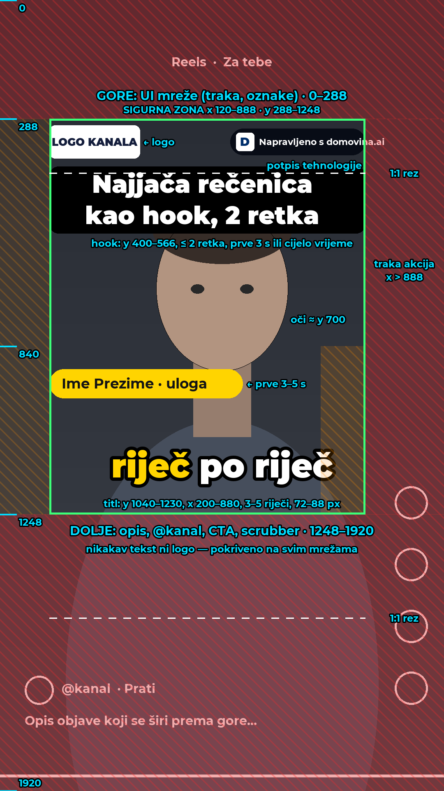

# Raspored reela iz podcasta — best practices (08.10.2026.)

Istraživanje o tome kako profesionalci slažu vertikalni isječak iz podcasta (1080×1920) za
Instagram Reels, TikTok, YouTube Shorts, Facebook, Snapchat, LinkedIn, X i WhatsApp: gdje
smije stajati tekst, gdje lice, gdje logo i potpis. Tri istraživačka subagenta, izvorni
izvještaji s poveznicama:

- `docs/reels-research/01-platform-safe-zones.md` — sigurne zone po mrežama (službeni overlayi)
- `docs/reels-research/02-podcast-clip-layout-conventions.md` — rasporedi, alati, branding
- `docs/reels-research/03-caption-typography.md` — titlovi, fontovi, hrvatski dijakritici

Slika rasporeda (generira je `tools/reels_layout_guide.py`, vidi dolje):
`docs/reels-research/reels-layout-guide.png`.

Vezano: `docs/2026-10-08-reels-poc.md` (naš alat `tools/render_reel.py`, raspored v1–v3).

## Ukratko

1. **Sva tri velika (TikTok, Instagram, YouTube) prekrivaju gornjih ~15 % i donjih ~35 %
   kadra, plus desni rub s gumbima.** Presjek službenih overlaya je **x 120–888,
   y 288–1248**. Ispod y 840 TikTokova traka gumba počinje već na x 780. Tekst, logo ni
   potpis ne smiju izaći iz tog pravokutnika.
2. **Profesionalni default za podcast je puni kadar govornika s praćenjem lica** („Fill“).
   Split ekran se koristi samo za brzu razmjenu, a uokviren 16:9 („Fit“, letterbox) samo
   kratko. Letterbox s naslovom prepoznaje se kao „reciklirani“ isječak agregatorskih kanala.
3. **Titl ide odmah ispod brade, iznad donje UI zone:** y ≈ 1040–1230, 3–5 riječi u jednom
   retku, 72–88 px. Aktivna riječ dobiva boju **i** još jedan znak (blago povećanje ili
   podloga), jer samo boja ne vrijedi za daltoniste.
4. **Logo je mali, uvijek u istom kutu, unutar sigurne zone** (y ≈ 300–390). Potpis
   tehnologije je najmanji element na ekranu: uz logo ili na završnoj kartici.
   Standarda za „powered by“ nema.
5. **Hrvatski:** brzina čitanja je 17 znakova/s (Netflix HR). TheBoldFont, Komika Axis i
   Lilita One **nemaju č/ć/đ**. Montserrat, Inter, Figtree i Atkinson Hyperlegible ih imaju.

Važno: **sve službene brojke su iz specifikacija za oglase.** Organski postovi imaju manje
UI-ja, pa su te zone konzervativna gornja granica. Nijedna mreža ne objavljuje sigurne
zone za organske postove.

## Sigurne zone (1080×1920)

| Mreža | Gore | Dolje | Lijevo | Desno | Izvor |
|---|---|---|---|---|---|
| Instagram / Facebook Reels | 269 | 672 | 65 | 65 (+ traka gumba ~227 px od y 1152) | Meta Ads Guide, 14 % / 35 % / 6 % |
| TikTok | 240 | 660 | 120 | 120 (+ traka gumba do 300 px od y 840) | TikTokov vodič, preko AdKita |
| YouTube Shorts | 288 | 672 | 48 | 192 | **službeni Googleov PNG, izmjeren** |
| Snapchat (oglasi) | 150 | 330 | — | — | Snap |
| LinkedIn, X | ~110–250 | ~250–400 | — | ~120–140 | samo treće strane |
| WhatsApp Status | ~200 | ~300 | — | — | procjena, nema službenog |

Naslovnica (thumbnail) se reže: Instagram grid je 3:4 (preživi y 240–1680), feed 4:5
(y 285–1635), a najgori slučaj je 1:1 (y 420–1500). **Tekst naslovnice zato ide u
y 480–1200.**

## Preporučeni raspored

| Element | Gdje (1080×1920) | Pravilo |
|---|---|---|
| Logo kanala | gornji lijevi kut sigurne zone, x 120–340, y 300–390, ~80–130 px visok | isti kut i veličina u svakom reelu; najviše jedna animacija |
| Potpis domovina.ai | isti red desno (x ~560–888) ili ispod loga; 22–28 px | najmanji element; nikad ne konkurira logu i titlu |
| Hook / naslov | y 400–566, x 120–888, ≤ 2 retka, 3–8 riječi, kutija ili debeli rub | prve 3–5 s ili cijelo vrijeme; podaci ne pokazuju što je bolje |
| Lice govornika | oči na y ≈ 640–800 (gornja trećina); s hookom iznad ≈ 720–820 | puni kadar s praćenjem lica; split samo za brzu razmjenu |
| Ime gosta | y ≈ 890–970, poravnato lijevo od x 120 | prve 3–5 s; ne slaže se na titl; klasični „lower third“ dolje pada pod UI |
| Titl | y ≈ 1040–1230, centriran, x 200–880 | 3–5 riječi, ≤ 25 znakova, 1 redak, 72–88 px |
| Ništa | y < 288, y > 1248, x > 888 | pokriva UI na svim mrežama |

**Split ekran** (rez na y 960): titl ide na šav. Donje lice uokviri visoko (oči na
y ≈ 1080–1150), inače pada u UI. **Letterbox:** traka 1080×608 na y ≈ 560–1168, hook u
gornjoj ispuni, titl odmah ispod trake.

## Titlovi (preporučena specifikacija)

| Parametar | Vrijednost |
|---|---|
| Font | Montserrat 800 / Inter 800 / Figtree 800 (OFL); provjeri da font ima `čćžšđČĆŽŠĐ„“…` (fontTools) |
| Veličina | 72–88 px (dno 64 px; BBC 9:16: visina retka 3.9–4.5 % od 1920) |
| Komad | 3–5 riječi, ≤ 25 znakova, 1 redak (najviše 2), 0.8–2.5 s; ako govornik ide brže od 17 zn/s, komadi su kraći |
| Pisanje | rečenično (ne VERZAL), osim kratkog hooka |
| Isticanje | jedna boja **plus** povećanje 105–110 % ili podloga, 80–150 ms; najviše jedna dodatno istaknuta riječ po komadu |
| Rub | crni, ~6–10 % veličine fonta, zaobljeni spojevi; ili kutija 70–80 % crne |
| Kontrast | ≥ 4.5:1 prema najgorem kadru; bez treptanja velikih površina (WCAG 2.3.1) |
| Poštapalice | izbaciti iz titla („ovaj“, „znači“, „ono“, „ee“), u zvuku mogu ostati; isticanje preskače njihovo vrijeme |
| Emoji i animacije | bez; nikako skakanje na svakoj riječi i mijenjanje boja |
| Najmanji tekst | ≥ 48 px (apsolutno dno ~30 px) |

## Hook, duljina, izvoz

- O tome hoće li gledatelj ostati odlučuju prve 1–3 s. Mjerilo je ≥ 80 % gledatelja na
  3. sekundi. Počinje se odmah krupnim licem i najjačom rečenicom, bez uvoda i bez
  logo-animacije.
- Duljina: mreže dopuštaju do 3 min (Shorts, Reels), a praksa za podcast je **20–60 s**.
  Jedan izvoz za sve mreže: **≤ 60 s** (Spotlight, TikTok TopView i WhatsApp Status
  imaju granicu 60 s).
- Jedan izvoz: 1080×1920, H.264 High, yuv420p, konstantnih 30 fps, AAC ≥ 128 kbps,
  `+faststart`, ~8–12 Mbit/s.
- WhatsApp sam prekodira na 480p ili 720p (HD), pa titl mora biti čitljiv i na 480p.
- Video ne smije nositi tuđi vodeni žig: Instagram od 2021. potiskuje reelse s TikTok
  watermarkom.

## Gdje je naš v3 u odnosu na to

Naš raspored (`render_reel.py` s `--brand`) složen je za **WhatsApp**, gdje nema trake
gumba ni opisa ispod videa. Za Instagram, TikTok i Shorts pada ovako:

| Element | v3 sada | Preporuka | Problem |
|---|---|---|---|
| Logo kanala | centriran, y ≈ 250–370 | kut, y 300–390 | gornji dio loga je u gornjoj UI traci |
| Naslov + bedž | y ≈ 380–560 | y 400–566 | u redu |
| Kadar | panel y 630–1670, zamućena pozadina | puni kadar s praćenjem lica | panel je bliži letterboxu; lice je manje nego u „Fill“ |
| Titl | y 1300–1520 | y 1040–1230 | **u donjoj UI zoni** (opis, @kanal) |
| Izvor („Podcast … #N“) | y ≈ 1555 | uz ime gosta ili u opisu objave | u UI zoni |
| Footer s domovina.ai | tamna kutija y ≈ 1690–1890 | uz logo gore | **u UI zoni na svim mrežama**; na TikToku i Reelsu stalno je pokriven opisom i imenom kanala, ne samo dok je video pauziran |

Za WhatsApp je v3 u redu. **Za Instagram, TikTok i Shorts postoji v4: `render_reel.py
--layout social`** (default ostaje `whatsapp` = v3). v4 je složen po ovom dokumentu:

| Element | v4 (`--layout social`) |
|---|---|
| Kadar | puni 9:16, praćenje lica (izrez 608 px iz 1080p, ×1.78) |
| Gore | meki tamni gradijent y 0–640; logo kanala lijevo (80 px, x 120, y 302); potpis domovina.ai desno u tamnoj kapsuli (završava na x 888) |
| Hook | kutija x 120–888 od y≈404, ≤ 2 retka (56 px), traka u bojama kanala (`stripe`) na dnu; tekst centriran na kutiju |
| Izvor | `--footer` 26 px odmah ispod hooka |
| Ime gosta | kapsula na y 890–956, x od 120, samo prvih 4.5 s (`BADGE_SEC`) |
| Titl | y 1040–1240, širina ≤ 680 px (x 200–880) |
| Donjih 35 % | čisti kadar |

Provjereno s `tools/reels_layout_guide.py --frame`: ništa ne izlazi iz sigurne zone.
Mana: izvor je 1080p, pa je izrez za puni kadar mekši nego panel u v3. Kod kanala sa
svijetlim ili tankim logom (npr. obojeni wordmark) gornji gradijent je nužan za
čitljivost.

Provjera bilo kojeg kadra: `python3 tools/reels_layout_guide.py out.jpg --frame kadar.png`
crta zone preko gotovog 1080×1920 framea.

## Što ostaje otvoreno

- **Koliko dugo hook stoji na ekranu** (prve 3–5 s ili cijelo vrijeme): podataka nema,
  treba A/B na vlastitim objavama.
- Nema neovisne A/B studije o rasporedima. Brojke o zadržavanju gledatelja su od
  proizvođača alata.
- Sigurne zone su iz specifikacija za oglase. UI se mijenja nekoliko puta godišnje, pa
  prije objave treba pogledati na pravom mobitelu (privatni testni post).
- Izvor 1080p 16:9: rez za puni kadar uzima ~600 px širine i povećava ga ~1.8×, pa je
  slika mekša. Profesionalci zato snimaju u 4K ili imaju zasebnu kameru za krupni plan.
  Za naše kanale ne možemo birati izvor.
