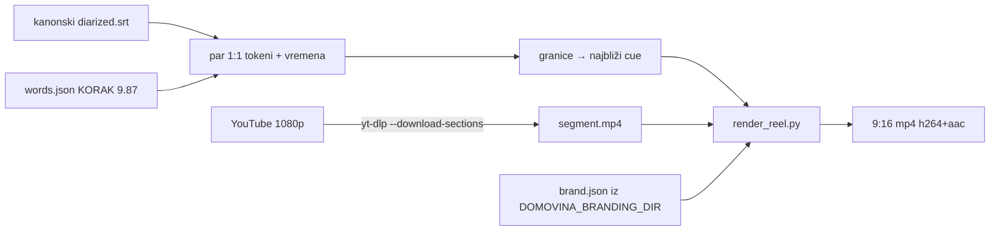

# Reelsi iz epizode — PoC (08.10.2026.)

`tools/render_reel.py` od 16:9 epizode radi 9:16 reel s titlom riječ po riječ.
Sve je lokalno, bez LLM-a i bez plaćenog API-ja. PoC je napravljen na dvije epizode
jednog kanala, a reelsi su renderirani u brendu kanala i u brendu organizacije gosta.

Bilješke o isporuci (kome je što poslano, povratne informacije) su privatne i nisu u
repou (`docs/private/`, gitignored).

Vezani dokumenti: `docs/2026-10-06-words-json-titlovi.md` (izvor vremena po riječi),
`data/branding/README.md` (format brenda), sibling repo `../domovina-cutter`
(`cutter.domovina.ai`, isječci 16:9 bez titla).

## Tijek

## Zašto baš ovako (mjerenja i zamke)

- **Izvor slike mora biti YouTube, ne CDN.** `video_h264.mp4` na CDN-u i lokalni mkv
  su 640×360, što je za 1080×1920 neupotrebljivo. `yt-dlp --download-sections
  --force-keyframes-at-cuts` skine samo traženi raspon (~1 min) u 1080p, bez kolačića.
  Cross-korelacija zvuka s WAV-om pokazala je da segment počinje točno (odstupanje 0.001 s).
- **Lokalni ffmpeg nema `libass`/`subtitles`/`drawtext`.** Zato se titl i tekst crtaju
  u Pythonu (Pillow), a ffmpegu se šalju sirovi frameovi kroz pipe.
- **Titl traži `words.json`.** Postoji za ~58 epizoda (Speechmatics), a `article.json`
  za 5 283. Canary FA backfill je parkiran (06.10.), i to je glavno ograničenje
  skaliranja.
- **Granice reela** se lijepe na rubove cue-a (−0.12 s / +0.45 s), inače rez pada
  usred riječi. Kraj se bira samo među cue-ovima nakon početka. Prije toga se kratak
  raspon znao zalijepiti na cue prije početka, pa je trajanje ispadalo negativno.
- **Praćenje lica** (OpenCV YuNet 2023mar, MIT, 230 KB): detekcija na svakom 2. frameu,
  deadzone 30 px, EMA 0.07, skok samo na rezu kamere (srednja razlika malog sivog
  kadra > 28). Bez deadzonea kadar „pliva“ za svakim pokretom glave.
- **Brzina:** ~35 s rendera za reel od ~60 s (M4 Pro, `h264_videotoolbox` 6 Mbit/s),
  ~70 s sa skidanjem s YouTubea. Datoteka ima 30–53 MB. Za više brendova istog trenutka
  segment se skida jednom (`--segment` / `--segment-start`).
- **yt-dlp čita stdin.** U `while read … done < popis.tsv` petlji pojede ostatak popisa,
  pa se renderira svaki drugi reel, bez ikakve greške. Rješenje: `read -u 3` i
  `done 3< popis.tsv`.
- `--download-sections` zna jednom pasti s `ffmpeg exited with code 8`. Drugi pokušaj
  prolazi, pa je dovoljan jedan retry.

## Raspored: v1 → v2

| | v1 (odbačen kao default) | v2 (u skripti) |
|---|---|---|
| kadar | preko cijelog ekrana, izrez 608 px, zoom ×1.78 | panel 1080×1180 na y=500, izrez 988 px, ×1.09 |
| pozadina | — | isti kadar zamućen, ×0.45 tamniji, rub panela 60 px |
| naslov / potpis | y≈150 / y≈1760 | odmah iznad panela (od y≈264) / y≈1555 |
| titl | sredina, zna pasti na lice | y 1300–1520, preko ruku i mikrofona |

Zašto v1 nije prošao:
- na WhatsApp iOS kontrole playera pokrivaju naslov, a traka sličica potpis
- kadar je prekrupan
- titl pada preko lica

Sigurna zona je zato y≈260–1600 od 1920; vrijedi i za TikTok, Reels i Shorts.

## Brendiranje (v3)

Reel nosi **primaran brend** (kanal kao autor ili organizacija gosta) i uvijek **potpis
domovina.ai** kao tehnologije.

- **Brendovi nisu u repou.** Ovaj repo je dio pipelinea i ostaje univerzalan, a brendovi
  su lokalna konfiguracija:
  - `--brand <ime>` čita `$DOMOVINA_BRANDING_DIR/<ime>/brand.json` (default
    `data/branding/`, gitignored, osim README-a, `_example/` i `domovina_ai/`)
  - format i postupak skupljanja su u `data/branding/README.md`
  - domovina.ai brend je iz `../mediakit.domovina.tv` (paleta `#FF0000` / `#FFFFFF` /
    `#002F6C`)
- Raspored s `--brand`:
  - logo 118 px iznad naslova (≥ y 250)
  - panel y 630–1670 (izrez 1100 px, bez povećanja)
  - pozadina 65 % boje `bg_tint`
  - traka od 8 px u dvije boje `stripe` na rubu panela
  - aktivna riječ i bedž u bojama `caption_active` / `badge_bg`
- **`--partner domovina_ai` je obavezan, bez obzira čiji je brend primaran.** Bez njega
  reel u brendu gosta izgleda kao da ga je napravila ta organizacija. Kad je zadan i
  `--footer` (izvor, npr. „Podcast X #N“), crtaju se oba retka:
  - izvor manjim slovima (30 px) na y≈1505
  - ispod njega logo domovina.ai (60 px) i „Napravljeno s domovina.ai“ na y≈1555

  Prva verzija je crtala samo jedno od to dvoje.
- Fontovi: ako je izvorni font licenciran (npr. Adobe Fonts), uzima se OFL zamjena s
  hrvatskim dijakriticima; ako je izvorni font OFL (npr. s Google Fonts), uzima se
  on sam.
- Ako organizacija već ima design tokene (brand book, Tailwind config nekog prototipa),
  oni su izvor istine. Boje koje izvedemo sami zamjenjuju se njihovim tokenima.

## Otvoreno

- **Biranje trenutaka je ručno.** Plan: `select_reels.js`, jedan LLM poziv po epizodi
  nad `segments.jsonl`. Izlaz `{base}.reels.json` (start/end/naslov), lijepljenje na cue.
  Dobri kandidati su samostalne misli od 40–85 s koje počinju na početku cue-a.
- **Poštapalice** („ovoga“, „dakle“) ostaju u titlu, odluka nije donesena.
- **Isporuka:** još nema uploada na `cdn.domovina.ai/reels/{id}/{n}.mp4` ni nightly
  koraka. Alternativa je render u `domovina-cutter` containeru (tamo je puni ffmpeg).
- Gost koji sjedi lijevo u kadru: izrez udara u lijevi rub, pa je lice malo lijevo od
  sredine.
- Fontovi bez brenda su macOS putovi (`--font-dir` za druge sustave).
- Automatsko izvlačenje brenda (`tools/capture_brand.*` za korake u browseru).
- Uvodni teaser epizode zna biti drugačije montiran (npr. crno-bijel). Reel tada
  nasljeđuje taj izgled.
