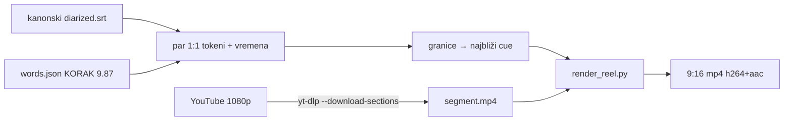

# Reelsi iz epizode — PoC (08.10.2026.)

Povod: Gabrijel Lukić (voditelj *Mladi za domovinu*) pitao je u grupi „Domovina
podcast“ može li sustav sam raditi reelse i isječke. Napravljen je PoC na #113
(Mladen Barać, `fln3cFCwHcs`, 91 min), tri reela poslana u grupu u dvije verzije
rasporeda, a skripta je javno u repou: `tools/render_reel.py` (commit `742c9acd`).

Vezani dokumenti: `docs/2026-10-06-words-json-titlovi.md` (izvor vremena po riječi),
sibling repo `../domovina-cutter` (`cutter.domovina.ai`, isječci 16:9 bez titla).

## Tijek

## Zašto baš ovako (mjerenja i zamke)

- **Izvor slike mora biti YouTube, ne CDN.** `video_h264.mp4` na CDN-u i lokalni mkv
  su 640×360 — za 1080×1920 je to neupotrebljivo. `yt-dlp --download-sections
  --force-keyframes-at-cuts` skine samo raspon (~1 min) u 1080p, bez kolačića.
  Cross-korelacijom zvuka s WAV-om provjereno: segment počinje točno (odstupanje 0.001 s).
- **Lokalni ffmpeg nema `libass`/`subtitles`/`drawtext`.** Zato se titl i tekst crtaju
  u Pythonu (Pillow) i ffmpegu se šalju sirovi frameovi kroz pipe.
- **Titl traži `words.json`.** Postoji za ~58 epizoda (Speechmatics), a `article.json`
  za 5 283. Canary FA backfill je parkiran (06.10.) — to je glavno ograničenje
  skaliranja.
- **Granice reela** se lijepe na rubove cue-a (−0.12 s / +0.45 s) — inače reže usred riječi.
- **Praćenje lica** (OpenCV YuNet 2023mar, MIT, 230 KB): detekcija svaki 2. frame,
  deadzone 30 px, EMA 0.07, skok samo na rezu kamere (srednja razlika malog sivog
  kadra > 28). Bez deadzonea kadar „pliva“ za svakim pokretom glave.
- **Brzina:** ~35 s rendera za reel od ~60 s (M4 Pro, `h264_videotoolbox` 6 Mbit/s),
  ~70 s s uključenim skidanjem s YouTubea. Datoteka 37–53 MB.

## Raspored: v1 → v2

| | v1 (odbačen kao default) | v2 (u skripti) |
|---|---|---|
| kadar | preko cijelog ekrana, izrez 608 px, zoom ×1.78 | panel 1080×1180 na y=500, izrez 988 px, ×1.09 |
| pozadina | — | isti kadar zamućen, ×0.45 tamniji, rub panela 60 px |
| naslov / potpis | y≈150 / y≈1760 | odmah iznad panela (od y≈264) / y≈1555 |
| titl | sredina, zna pasti na lice | y 1300–1520, preko ruku i mikrofona |

Korisnikova presuda na v1: boje dobre, ali na **WhatsApp iOS kontrole playera pokrivaju
naslov, a traka sličica potpis**; prekrupno („indijski filmovi“); titl preko lica.
Sigurna zona je zato y≈260–1600 od 1920 (vrijedi i za TikTok/Reels/Shorts).
v1 ostaje argument za brzi scroll (intimnije, veći titl) — Gabrijelu su poslane obje uz
usporedbu, njegov odgovor se čeka.

## Otvoreno

- **Gabrijelov odabir v1/v2** (ili miks: raspored v2, krupniji kadar).
- **Biranje trenutaka je ručno.** Plan: `select_reels.js` — jedan LLM poziv po epizodi
  nad `segments.jsonl`, izlaz `{base}.reels.json` (start/end/naslov), lijepljenje na cue.
  Za #113 ručno predloženo 9 + 3 rezerve (vidi transkript sesije); renderirana prva 3.
- **Sinkronizacija titla i zvuka** nije preslušana s moje strane — korisnik je pregledao.
- **Poštapalice** („ovoga“, „dakle“) ostaju u titlu — odluka nije donesena.
- **Isporuka:** nema još uploada na `cdn.domovina.ai/reels/{id}/{n}.mp4` ni nightly koraka.
  Alternativa: render u `domovina-cutter` containeru (tamo je puni ffmpeg).
- Gost sjedi lijevo u kadru → izrez udara u lijevi rub, lice malo lijevo od sredine.
- Fontovi su macOS putovi (`--font-dir` za druge sustave).

## Brendiranje po kanalu (v3, 08.10.2026. popodne)

Ideja: reel nosi brend **kanala kao autora** (primarno), a domovina.ai je potpisan kao
**tehnologija** (sekundarno, mali potpis dolje). Mladi za domovinu je PoC za ponudu
„brendirani reelsi“ svim kanalima.

- Podaci: `data/branding/<kanal>/brand.json` + logotipi; format, postupak skupljanja
  i pitanje prava opisani su u `data/branding/README.md`. domovina.ai brend je iz
  `../mediakit.domovina.tv` (paleta `#FF0000` / `#FFFFFF` / `#002F6C`, `domovina_ai_logo_square.svg`).
- MZD (mladizadomovinu.hr, computed styles):
  - navy `#071A35` (header/hero)
  - bordo `#840C0C` (theme-color)
  - crveno-narančasta `#BE3C28` (navigacija)
  - plava `#206FC8`
  - zlatna `#EFC465` (slogan, istaknuti citati)
  - Font je **Apparat** preko Adobe Fonts (typekit). Licenca ne dopušta skidanje, pa je
    zamjena **Fira Sans** Black/Bold (OFL, ima hrvatske dijakritike).
- Raspored s `--brand`:
  - logo kanala 118 px iznad naslova (≥ y 250)
  - panel y 630–1670 (izrez 1100 px, bez povećanja)
  - pozadina 65 % boje `bg_tint`
  - traka od 8 px u bojama logotipa na rubu panela
  - aktivna riječ i bedž u `highlight`
  - `--partner` dodaje logo domovina.ai (60 px) i „Napravljeno s domovina.ai“ na y≈1555
- Uz to je popravljena greška: kratak raspon se lijepio na kraj cue-a *prije* početka,
  pa je trajanje ispadalo negativno. Kraj se sada bira samo među cue-ovima nakon početka.
- Poslano samo u Matija Only (3 reela, svaki s opisom); Gabrijelu još ne.

Otvoreno za v3:
- suglasnost MZD-a za korištenje logotipa
- treba li drugi kanal (test generalizacije: kanal bez web-stranice, samo YouTube avatar/banner)
- izvući brand automatski (alat za claude-in-chrome korake, `tools/capture_brand.*`)
