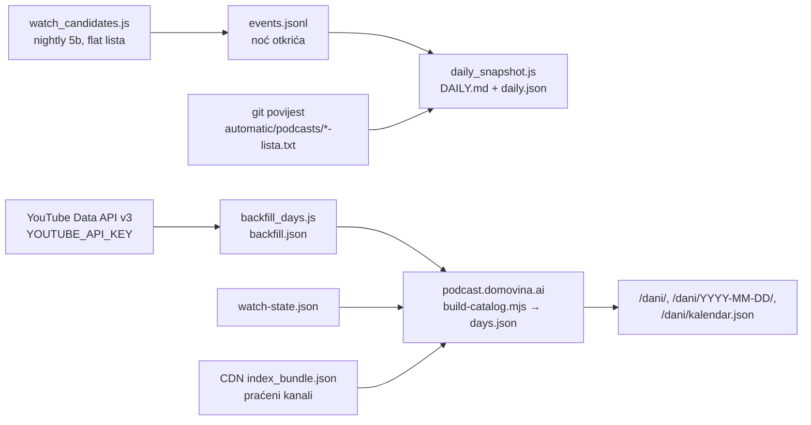

# Arhiva novih epizoda po danima + točni datumi objave (09.10.2026.)

Jedna sesija, od pitanja „koliko je noćas novih epizoda" do javne arhive
<https://podcast.domovina.ai/dani/>. Ovdje je ono što se ne vidi iz koda: mjerenja,
odbačene alternative i zamke.

## Tok podataka

Dva različita pitanja, dvije jedinice:

| | `DAILY.md` (fetch repo) | `/dani/` (javna stranica) |
|---|---|---|
| jedinica | **noć otkrića** (što je nightly našao) | **dan objave** po Europe/Zagreb |
| izvor | `events.jsonl` + git povijest lista | `backfill.json` (točno) + watch-state za ono što backfill još nije pokrio |
| točnost | točno po noći | točno po danu |

## Zašto je trebao YouTube Data API

`yt-dlp --flat-playlist` s `youtubetab:approximate_date` pretvara „prije 3 tjedna" u
datum. Izmjereno na watch baselineu (koliko je dana prošlo od objave):

| starost | razmaci koji se pojavljuju |
|---|---|
| 0–12 dana | svaki dan |
| 2–4 tjedna | samo 13, 20, 27 |
| mjeseci | samo 30, 61, 91, 122… |
| godine | samo 364, 729, 1095… |

Prva verzija arhive (samo watch) imala je artefakt nakon propuštenog runa 04.10.:
03.10. = 4 epizode, 04.10. = 22. S Data API-jem: 14 i 13.

Odbačeno: per-video `yt-dlp -j` za točan datum (~2 500 poziva za 90 dana; `discover.js
exact-dates` već hvata anti-bot nakon par stotina na Ethernetu).

## Kvota (10 000 jedinica/dan, reset u ponoć PT = 09:00 CEST)

| prolaz | jedinica | trajanje | rezultat |
|---|---|---|---|
| od 01.01.2026. | 1 849 | 114 s | 5 639 originala |
| od 01.01.2025. (full) | 2 839 | 165 s | 12 524 originala |
| procjena cijele povijesti | 10 (channels/playlists.list) | — | 456 izvora, **137 316 videa**, 2 986 stranica |
| do 2005., način `extend`, prvi dio | 3 800 (granica) | 232 s | 347/456 kanala, 30 060 originala ukupno |
| nightly inkrement | ~1 000 | — | zadnjih 7 dana po kanalu |

- API ne može skočiti na datum: svaki dublji prolaz kreće od najnovijeg videa. Zato je
  jedan prolaz do početka jeftiniji od više prolaza po godinu.
- `extend` (dublja granica nego zadnji put) ne dohvaća ponovno `videos.list` za već
  pokriven raspon: ~1 000 jedinica manje. Provjera: na `lood-podcast` extend i full daju
  isto (220 originala / 218 derivata / 1 420 shortsa), 60 vs 76 jedinica.
- Inkrementi idu prvi, dublji prolazi zadnji; na `QuotaStop` kanal ostaje netaknut, pa
  nikad nije napola.
- **Drugi GCP projekt za dodatnu kvotu = ne.** YouTube API pravila zabranjuju
  zaobilaženje kvote; rizik je gašenje pristupa za račun.
- Ključ: `bimbo-sync-prod`, ograničen na `youtube.googleapis.com`, napravljen preko
  `gcloud ... --account=stepanic.matija@gmail.com` (globalni aktivni račun je bio
  play-publisher SA).

## Odluke u prikazu

- **Objava arhive** = kanal s 5+ originala u jednom danu (13 dana od 2025., 147 epizoda;
  Andromeda 01.12.2025. = 64). Na stranici dana sklopljeno, ne broji se u dan ni u
  grafove — jedan takav dan razvukao je skalu grafa na 90.
- **Javna arhiva od max(01.01.2020., granica najplićeg kanala)**. Po godini osnivanja
  današnjih kanala: do 2010. ih je 10, do 2015. 76, do 2019. 133, do 2020. 181. Prije
  2020. dan bi pokazivao nekoliko starih kanala, ne scenu. Podaci se ipak čuvaju do 2005.
- Prošlost = povijest **današnjih** kanala (obrisani videi i ugašeni kanali se ne vide).
- Kalendar se puni iz `/dani/kalendar.json`; ugrađen u svaku stranicu, nightly bi
  mijenjao svih ~2 000 stranica (dnevna stranica 128 KB → 40 KB).

## Što podaci pokazuju (2025-01-01 → 2026-10-08)

- Medijan **20 epizoda/dan**; 88 % dana između 10 i 30. Ispod 10 skoro samo
  19.7.–12.9. (dno 15.8. = 4), iznad 30 samo veljača–lipanj (vrh 3.6.2026. = 37).
- Sezona se ponavlja obje godine: proljeće 21–24/dan, kolovoz 10,5 (2025.) i 11,3 (2026.).
- Dan u tjednu: radni dani 20–23, **četvrtak najjači** (najjači dan u 46 od 91 tjedna),
  vikend ~33 % manje; subota i nedjelja nikad nisu tjedni vrh.
- Sat objave: vrh **20–21 h** (14–16 %), a trećina epizoda izlazi između 18 i 21 h.

## Otvoreno

- **Dovršetak dubokog backfilla**: 109 kanala još je na granici 2025. Nightly
  10.10. u 03:00 troši ostatak kvote 09.10. (~1 250), nightly **11.10. u 03:00** ima
  svježu kvotu i trebao bi dovršiti. Provjera:
  `node -e 'const c=Object.values(require("./automatic/watchlist/backfill.json").channels);console.log(c.filter(x=>x.since!=="2005-01-01").length)'` → `0`.
  Tada se arhiva sama proširi na 2020. (~2 100 dana) u koraku 5c.
- Nightly **ne commita** `automatic/watchlist/` (`backfill.json`, `events.jsonl`,
  `DAILY.md`). Predloženo, nije napravljeno: commit korak u nightlyju odmah iza snapshota.
- `podcasts_registry.*` u radnoj kopiji mijenja nightly (`discover.js activity`), commit
  ostaje ručan.
- Feed „Upravo stiglo" i popisi epizoda kanala na naslovnici još koriste približne
  watch datume; mogli bi uzeti točne iz `backfill.json`.

## Vezani dokumenti

- `automatic/watch_candidates.js` (zaglavlje) — watch i klasifikacija original/derivat
- `../podcast.domovina.ai/README.md` §„Nove epizode po danima"
- `docs/REGISTRY_DISCOVERY.md` — registry i nightly `discover.js`
