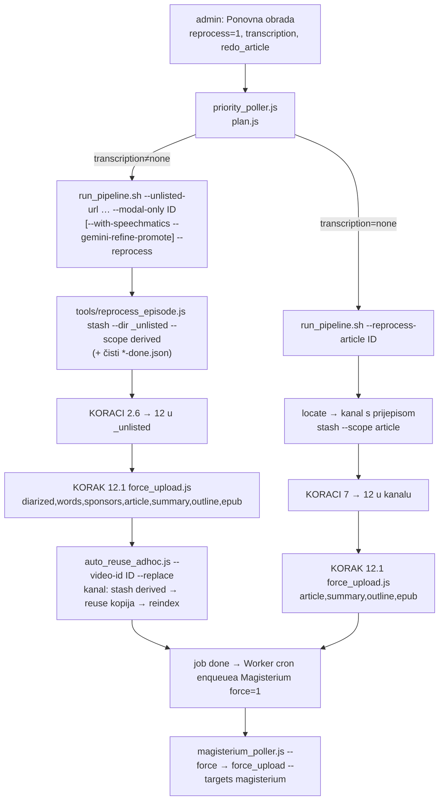

# Ponovna obrada objavljene epizode (fetch strana)

Admin `pipeline.domovina.ai` → „🔁 Ponovna obrada" sada podiže staru epizodu na razinu
nove (Speechmatics + Gemini sluh, Opus članak, words.json, Magisterium) bez Claude Code
sesije. Ovaj dokument je **fetch.domovina.tv** strana: što run radi, i pet zamki koje su
na testnoj epizodi `6e1MW97dv10` (08.–09.10.2026.) redom pokazale da „run je prošao" ≠
„CDN servira novo".

Vezani dokumenti:
- `../pipeline.domovina.ai/docs/2026-10-08-ponovna-obrada.md` — admin/bridge strana, model podataka, odluke
- `docs/2026-10-06-words-json-titlovi.md` — words.json i uparivanje u Flutteru
- `docs/2026-09-19-speechmatics-kostur-gemini-sluh.md` — KORAK 2.8

## Tok

Stari fajlovi se nikad ne brišu: `<realpath kanala>/../.reprocess_bak/<kanal>/<ID>_<ts>/`
(rename na istom volumenu, izvan `storage/output/`, pa ga ni skeneri ni rclone ne vide).

## Zamke (redom kako su se pojavile)

1. **Self-heal u adminu zatvarao job po STAROM članku.** Prvi pokušaj (08.10. 23:03) bio je
   `done` 17 s nakon claima. Popravljeno u pipeline.domovina.ai (`isFreshFor`).
2. **upload_to_r2.js preskače immutable `diarized.srt`, a `words.json` je nov ključ.**
   CDN je imao stari Canary prijepis (ožujak) + novi words.json → Flutter
   (`speaker_timeline.dart` `withWordTimings`: početak cue-a ±1 ms + točan broj riječi)
   ne ističe NIJEDNU riječ. Pravilo: SRT i words.json na CDN-u uvijek iz istog prolaza →
   KORAK 12.1.
3. **KORAK 2.8 promovira samo ako `.wav.canary.diarized.srt` ne postoji.** Ponovni run u
   `_unlisted` bi platio Speechmatics i zadržao stari prijepis → `stash` PRIJE runa.
4. **Done cacheovi (`storage/output/{summarize,articles,rag-*}-done.json`).** Drugi pokušaj
   (09.10. 00:01) sklonio je fajlove, ali 7+8 su javili „Preskočeno (cache): 1" i ništa
   nisu napisali; `--replace` je ispravno odbio dirati kanal (job failed). Ključ je goli
   basename, dijeljen između kanala → stash briše svaki unos s `_yt_<ID>` (commit 08b4de5c).
5. **Preglednik drži stare immutable ključeve godinu dana.** Purge čisti samo Cloudflare.
   Korisnik koji je epizodu već otvarao vidi stari prijepis/words.json dok ne očisti cache
   (potvrđeno 09.10.: nakon osvježavanja cachea sve radi). **OTVORENO** — vidi dolje.

Usput: `auto_reuse_adhoc.js` bez `--replace` javlja „kanal već ima diarized obradu — no-op"
pa kanal ostane na starom članku, a `upload_to_r2.js` kod drifta veličine uvijek uzme DISK →
sljedeći upload iz kanala bi vratio staro na CDN. Zato je `--replace` obavezan za reprocess.

## Mjerenja (6e1MW97dv10, 16.6 min, 1 govornik)

| | |
|---|---|
| treći (uspješni) run, claim → kraj | 00:09 → 00:16, ~7 min |
| Modal Canary | ~1.5 min (uklj. 51 s učitavanja modela) |
| Speechmatics + Gemini sluh | ~1.5 min; 74/74 segmenata prihvaćeno, 0 popravaka |
| Opus sažetak / članak | 16 s / ~2 min (1 iteracija) |
| Magisterium (MCP, Opus, force) | 00:47 → 00:57, ~9 min; overall_score 76 |
| words.json | `source: speechmatics`, anchored 0.797; 74/74 cueova uparivo |
| „Magisterium AI" u prijepisu | Canary: 1× točno + „magisterij MAI"…; Speechmatics+Gemini: 8× točno |

Canary NE čuje vlastita imena („magisterij MAI") ni u svježem prolazu — re-transkripcija
Canaryjem to ne popravlja; Gemini sluh s kontekstom da.

Modal Canary sad piše `.wav.canary.word_ts.json`, pa i Canary-only run dobije words.json
(`source: canary`) — Speechmatics više NIJE preduvjet za isticanje riječi.

## Otvoreno

- **Verzionirani URL-ovi za immutable data ključeve** (diarized.srt, words.json, article*,
  book.epub) ili kraći `max-age` — inače svaka ponovna obrada gledateljima koji su
  epizodu već otvarali stoji stara do godinu dana. Promjena u domovina.ai (Flutter
  `CdnConfig`) + upload. Nije započeto.
- Datoteke u `_unlisted` za 6e1MW97dv10 ostaju nazvane po URL-u (prvi job je imao naslov =
  URL); CDN ključevi su po ID-u pa nema posljedica. Admin to za nove jobove sprečava.
- `--reprocess-article` (samo članak) nije još isproban u stvarnom runu.
