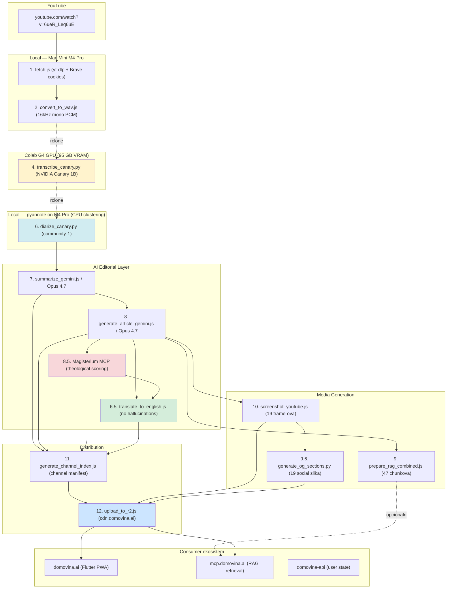
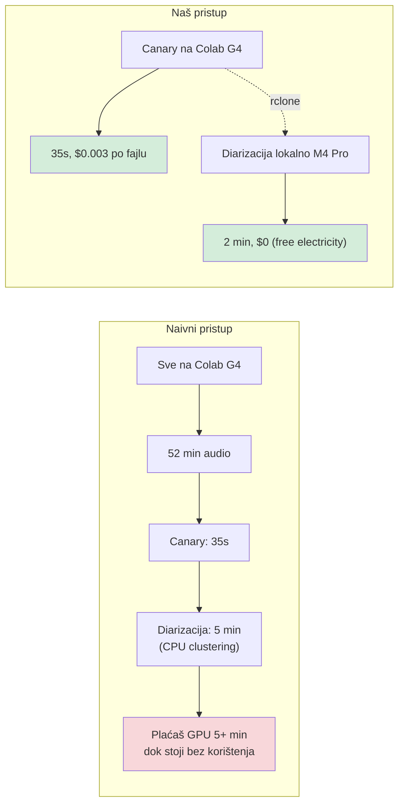
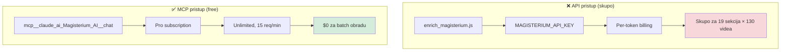
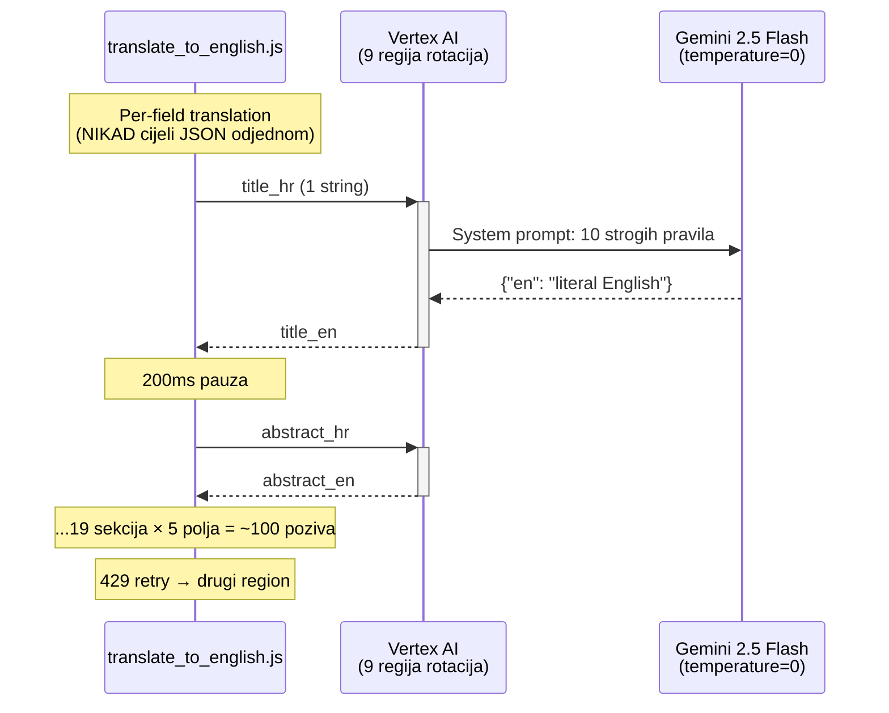
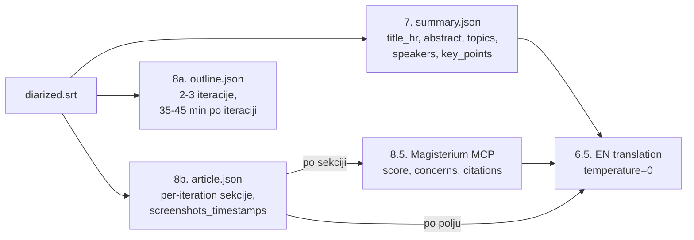
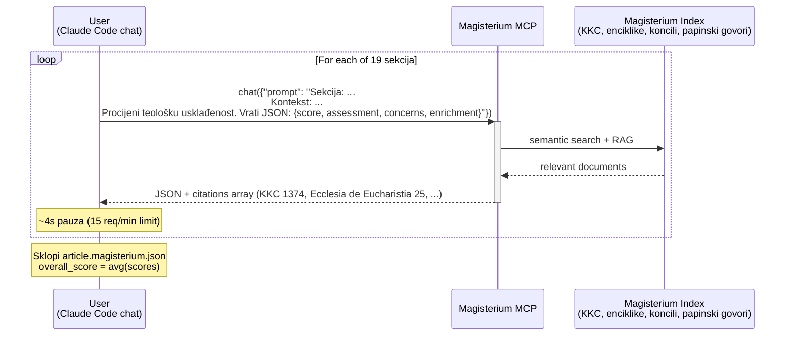
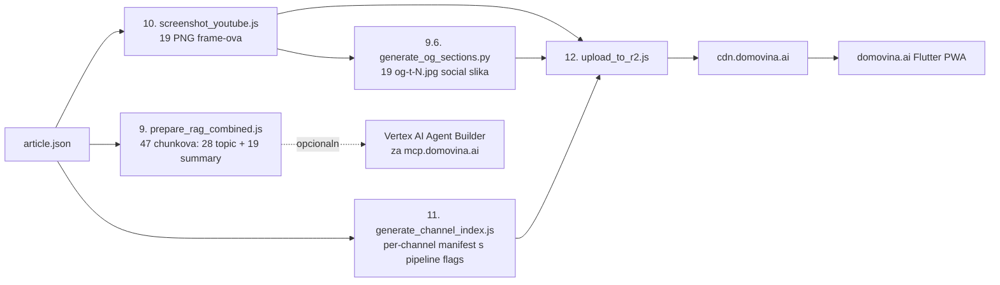
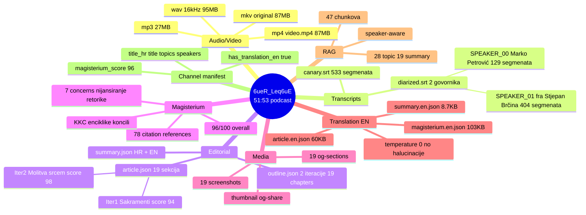
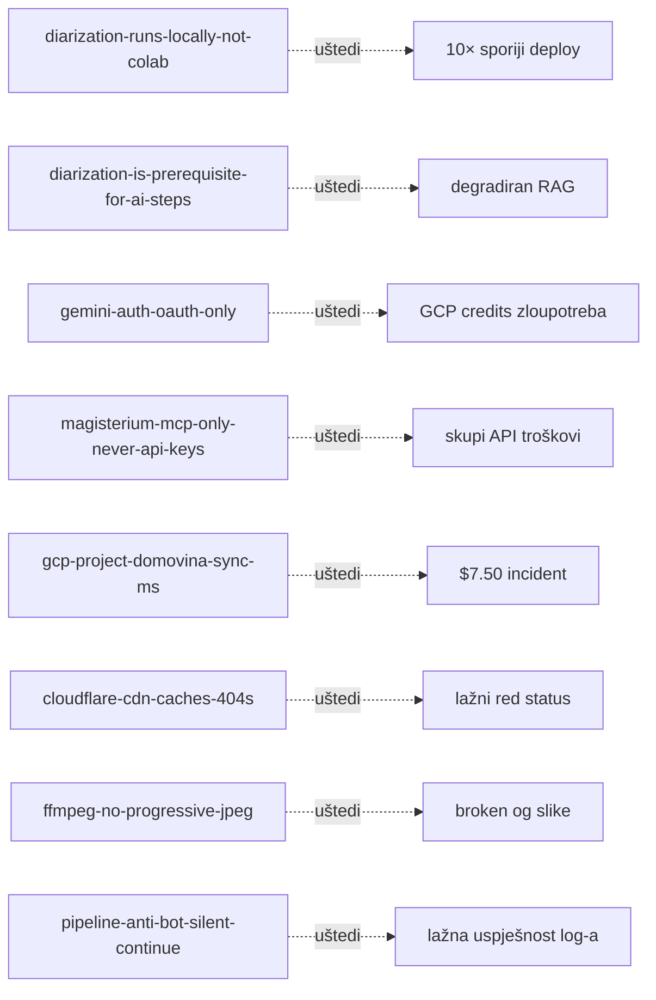

# DOMOVINA.ai Pipeline — Od YouTube URL-a do Magisterium-verificiranog članka

> **Što ovo radi**: uzima hrvatski katolički podcast s YouTube-a, kroz 12 koraka ga transformira u potpuno obrađenu, teološki verificiranu, pretražnu i prevedivu epizodu na `domovina.ai`. Sve s lokalnim hardverom, free MCP-jevima, i strogom garancijom da AI ne halucinira.

---

## Zašto je ovo posebno

Većina AI-procesinga je crna kutija. Ovaj pipeline je **deterministička proizvodna linija** s tri neobična dizajn-izbora:

1. **Hardware-aware podjela rada** — Canary (NVIDIA's state-of-the-art speech model) trči na Google Colab G4 GPU jer mu treba 26 GB VRAM-a, dok pyannote diarizacija trči **lokalno na Mac Mini M4 Pro** jer je njena clustering CPU-bound (G4 ne pomaže). Skupi GPU se koristi samo tamo gdje stvarno radi razliku.

2. **Magisterium AI MCP umjesto API-ja** — teološka verifikacija svake sekcije članka kroz katoličko AI (Magisterium.com) preko **MCP protokola** unutar Claude Code-a (free Pro subscription, unlimited) umjesto skupih API ključeva. Producira score 0-100, identificira zabrinutosti i obogaćuje citatima iz Katekizma, enciklika i koncilskih dokumenata.

3. **Zero-hallucination engleski prijevod** — Gemini 2.5 Flash sa `temperature=0` i striktnim "literal translator" promptom. Croatian proper names (Brčina, Antunovski hod) ostaju netaknuti; katolička terminologija mapira se na standardni engleski; svaki citat iz Magisterium-a ostaje izvorni (već engleski Vatikan-dokumenti).

Sve s **idempotent skriptama**: pipeline se može pokrenuti N puta, automatski preskače već obrađeno, lako se nadograđuje per-video po potrebi.

---

## End-to-end: od URL-a do CDN-a



**Legenda boja**:
- 🟡 Canary na Colab G4 (jedini step koji zahtjeva pricey GPU)
- 🔵 Diarizacija lokalno na M4 Pro (~2 min za 52-min audio)
- 🔴 Magisterium MCP (free, Pro subscription, unlimited)
- 🟢 No-hallucination English translation
- 💙 CDN distribution

---

## Tri "neobična" izbora — i zašto

### Izbor 1 — Hardware-aware podjela: Colab za Canary, M4 Pro za pyannote



**Empirijska tvrdnja iz `docs/diarization_research_2026-05.md`**: pyannote community-1 je u clustering fazi **CPU-bound** (sklearn agglomerative clustering, izolirano od GPU embedding-a). $20.000 G4 traje gotovo isto kao $1.500 M4 Pro za pyannote dio.

**Zaključak**: koristiti skupi GPU samo za ono što stvarno benefit-aira od GPU (segmentation + embedding na Canary 1B, ne za clustering).

Cijena na 96-file batch (1 tjedan podcastova): **~$0.29 ukupno na Colab Pro+**, plus lokalna struja za diarizaciju.

### Izbor 2 — Magisterium MCP vs API

Magisterium AI je katolički AI specijaliziran za teologiju i crkvenu doktrinu (KKC, enciklike, koncili, papinski govori). Imamo dva načina pristupa:



**Workflow**: za svaku od 19 sekcija članka, šaljemo Magisterium-u JSON: `{"score": 0-100, "assessment": "...", "concerns": [...], "enrichment": "..."}`. Plus dolaze citati iz Magisterium-ovih izvora.

**Za 6ueR_Leq6uE rezultat**: overall 96/100 ("Aktivno promiče katolički nauk"), 7 zabrinutosti (uglavnom nijansiranje retorike, ne dogmatska odstupanja).

### Izbor 3 — Zero-hallucination engleski prijevod



**Pravila u system prompt-u**:
1. Translate EVERY sentence faithfully. NO skipping, summarizing, adding.
2. Croatian proper names ostaju (Brčina, Antunovski hod, Sveti Duh) — NE anglicize.
3. Katolička terminologija → standard English (euharistija→Eucharist, klanjanje→Eucharistic adoration, krunica→Rosary).
4. Preserve ALL Markdown formatting.
5. Output ONLY: `{"en": "<translation>"}`.

**Rezultat**: paralelni `.en.json` fajlovi sadrže izvornik + sva `_en` polja kao additive. Flutter app može switchati HR↔EN per-episode bez gubitka konteksta.

---

## 12 koraka pipeline-a, detaljno

### Faza A — Pripremni materijal (lokalno + Colab)


**Koraci**:

#### 1. `fetch.js` — YouTube download
- yt-dlp + Brave cookies (`--cookies-from-browser brave`) za autentikaciju
- Three-tier state management (`completed[]` / `failed[]` / `private[]`)
- Anti-bot rate limiting (3 errors → 60s cooldown)
- Output: `{basename}.{mp4,mkv,mp3,info.json,description,png,og-share.jpg}`

#### 2. `convert_to_wav.js`
- ffmpeg `-ar 16000 -ac 1 -c:a pcm_s16le` (Canary input format)
- Output: `{basename}.wav` (~100 MB za 52 min)

#### 3. `generate_whisper_prompt.js` (legacy, skipped za Canary)
- Bio za Whisper.cpp; Canary ne treba prompt

#### 4. Canary 1B transcription (Colab G4)
- `colab_canary/domovina_tv_canary_transcribe.ipynb`
- NVIDIA Canary 1B v2 model, BF16, `torch.inference_mode()`
- 52-min audio → 23-35 sekundi wall-clock (G4 95 GB VRAM)
- T4 OOM-a — **mora G4** (vidi `colab_canary/README.md`)
- Output: `{basename}.wav.canary.srt` + `.csv`

#### 5. `transcribe_diarized.js` (legacy alternativa za Whisper, skipped)

#### 6. `diarize_canary.py` — pyannote diarization **lokalno**
- pyannote/speaker-diarization-community-1 (v4.0, CC-BY-4.0)
- MPS acceleration na Apple Silicon
- ~2-5 min za 52-min audio na M4 Pro
- Output: `{basename}.wav.canary.diarized.srt` s `[SPEAKER_00]`, `[SPEAKER_01]` oznakama

> **Striktno pravilo**: AI koraci 7-12 NE smiju krenuti dok ne postoji `.canary.diarized.srt`. Bez njega RAG chunking degradira na običan semantic split bez govornika u chunkovima, što kvari MCP retrieval po govorniku. (Memory: `diarization_is_prerequisite_for_ai_steps`)

---

### Faza B — Editorial AI sloj



#### 7. `summarize_gemini.js` — JSON sažetak (ili manual Opus 4.7)

System prompt strogo: hrvatski, no halucinacije, parafraze stvarnih izjava. Output schema:
```json
{
  "title_hr": "Tri koraka u hodu s Bogom...",
  "abstract_hr": "Fra Stjepan Brčina, organizator Antunovskog hoda...",
  "key_topics": ["antunovski hod", "sakramenti", "euharistijsko klanjanje", ...],
  "speakers": [{"id": "SPEAKER_00", "suggested_name": "Marko Petrović", "role": "voditelj"}],
  "key_points": [...],
  "mentioned_people": ["fra Stjepan Brčina", "Majka Terezija", "Karlo Acutis"],
  "mentioned_places": ["Sveti Duh", "Bazilika svetog Antuna Padovanskog"],
  "mentioned_organizations": ["Mladi za domovinu", "Antunovski hod"],
  "language": "hr", "content_type": "podcast", "sentiment": "positive"
}
```

#### 8. `generate_article_gemini.js` — dvije faze

**Faza 1 (outline)**: razdvoji transkript u 35-45 min tematske iteracije s "pametnim rezovima" (nikad usred misli/anegdote). Output: niz `{iteration_number, start_time, end_time, theme, chapters[]}`.

**Faza 2 (article)**: za svaku iteraciju generiraj niz sekcija s `{subtitle, screenshot_timestamp, screenshot_description, content (Markdown), keywords, entities}`. Treće lice, novinarski stil, no halucinacije.

**Multi-region Vertex AI rotacija**: 9 regija, svaki ima nezavisnu kvotu. 429 na jednom regionu → rotacija na sljedeći. Kombinacija s exponential backoff.

#### 8.5. Magisterium MCP — teološka verifikacija



**Schema** (per-section):
```json
{
  "magisterium": {
    "score": 95,
    "assessment": "1-2 rečenice teološke procjene",
    "concerns": ["Eventualne nejasnoće ili nedostaci"],
    "enrichment": "Dodatni teološki kontekst iz crkvenih dokumenata",
    "citations": [
      {"document_title": "Catechism of the Catholic Church", "document_reference": "1374"},
      {"document_title": "Ecclesia de Eucharistia", "document_author": "Pope John Paul II", "document_reference": "25"}
    ]
  }
}
```

**Score interpretacija**:
- 90-100 = Aktivno promiče katolički nauk
- 70-89 = Uglavnom usklađeno
- 50-69 = Djelomično usklađeno, nejasnoće
- 30-49 = Odstupanje od crkvenog nauka
- 0-29 = Proturječi katoličkom nauku

> **STRIKTNO**: koristiti MCP, NIKAD API ključeve. Pro subscription = unlimited MCP, free. API key plan = per-token, skupo. (Memory: `magisterium_mcp_only_never_api_keys`)

#### 6.5. `translate_to_english.js` — zero-hallucination prijevod

Vertex AI Gemini 2.5 Flash, `temperature=0`, per-field translation, strogi prompt (10 pravila). Output: `summary.en.json`, `article.en.json`, `article.magisterium.en.json` (paralelni fajlovi, superset HR+EN).

---

### Faza C — Media + Distribution



#### 9. `prepare_rag_combined.js` — speaker-aware RAG chunkanje

Dvije strategije chunkanja kombinirane:
- **Topic chunks**: segmenti grupirani po `chapters[]` iz outline-a, target 2000 chars (~500 tokena)
- **Summary chunks**: per-section summary za high-level retrieval

Output: `{basename}.rag_combined.jsonl` (JSONL format, 1 chunk per line)

Per chunk: `{chunk_id, video_id, channel, speaker, start_time, end_time, text, chunk_type: "topic"|"summary"}`.

#### 10. `screenshot_youtube.js` — frame-ovi za članak

Skida 19 frame-ova s YouTube streama na timestampovima iz `article.json`. Ako anti-bot blok, fallback na lokalni `.mkv` + ffmpeg (vidi cookbook za Korak 5b).

Output: `{basename}_screenshots/{basename}_{HH-MM-SS}.png` + `_manifest.json`

#### 9.6. `generate_og_sections.py` — Tier B social slike

Per-section 1200×630 JPEG-ovi za share URL-ove `domovina.ai/v/{VID}/t/{section}`. Reuse-a PNG-ove iz koraka 10, ImageMagick compositing (NE ffmpeg jer ne podržava progressive JPEG — memory `ffmpeg_no_progressive_jpeg`).

Output: `{basename}.og-sections/og-t-{section_id}.jpg` + manifest

#### 11. `generate_channel_index.js` — channel manifest

Skenira `storage/output/*/` i agregira per-channel listu videa s pipeline flagovima:
```json
{
  "id": "6ueR_Leq6uE",
  "title": "...", "title_hr": "...", "abstract": "...",
  "topics": [...], "speakers": [...],
  "magisterium_score": 96,
  "pipeline": {
    "has_transcript": true,
    "has_diarized": true,
    "has_summary": true,
    "has_article": true,
    "has_magisterium": true,
    "has_translation_en": true,
    "has_summary_en": true,
    "has_article_en": true,
    "has_magisterium_en": true
  }
}
```

Flutter app koristi ove flagove za conditional rendering (npr. EN toggle samo ako `has_translation_en: true`).

#### 12. `upload_to_r2.js` — Cloudflare R2 CDN upload

Mapira lokalne fajlove na CDN R2 key-eve:

| Local | R2 key |
|---|---|
| `{basename}.wav.canary.summary.json` | `data/{VID}/summary.json` |
| `{basename}.wav.canary.summary.en.json` | `data/{VID}/summary.en.json` |
| `{basename}....article.json` | `data/{VID}/article.json` |
| `{basename}....article.en.json` | `data/{VID}/article.en.json` |
| `{basename}....article.magisterium.json` | `data/{VID}/article.magisterium.json` |
| `{basename}....article.magisterium.en.json` | `data/{VID}/article.magisterium.en.json` |
| `{basename}....outline.json` | `data/{VID}/outline.json` |
| `{basename}.wav.canary.diarized.srt` | `data/{VID}/diarized.srt` |
| `{basename}.info.json` | `data/{VID}/info.json` |
| `{basename}.mp4` | `data/{VID}/video.mp4` |
| `{basename}.png` | `images/{VID}/thumbnail.png` |
| `{basename}.og-share.jpg` | `images/{VID}/og-share.jpg` |
| `{basename}_screenshots/...{HH-MM-SS}.png` | `images/{VID}/screenshots/{HH-MM-SS}.png` |
| `{basename}.og-sections/og-t-{N}.jpg` | `images/{VID}/og-t-{N}.jpg` |
| `storage/meta/channels/data/{channel}.json` | `channels/data/{channel}.json` |

**Optimizacije**:
- HEAD check + ETag dedup (ne re-upload-a ako file isti)
- Cache-Control split mutable (`channels/*`) vs immutable (`data/*/`, `images/*/`)
- Streaming upload za fajlove > 10 MB

---

## Data layer: što consumer vidi na CDN-u

```mermaid
graph TB
    subgraph CDN["cdn.domovina.ai (Cloudflare R2)"]
        subgraph DATA["data/&lt;VID&gt;/"]
            D1[summary.json]
            D1E[summary.en.json]
            D2[article.json]
            D2E[article.en.json]
            D3[article.magisterium.json]
            D3E[article.magisterium.en.json]
            D4[outline.json]
            D5[diarized.srt]
            D6[info.json]
            D7[video.mp4]
        end

        subgraph IMG["images/&lt;VID&gt;/"]
            I1[thumbnail.png]
            I2[og-share.jpg]
            I3[screenshots/manifest.json + 19×png]
            I4[og-sections.json + 19×jpg]
        end

        subgraph CHAN["channels/data/"]
            C1["&lt;channel&gt;.json — video list + pipeline flags"]
            C2[index.json — svi kanali]
            C3[index_bundle.json — cached bundle]
        end
    end

    subgraph APPS["Consumer apps"]
        F[Flutter PWA<br/>domovina.ai]
        M[MCP Server<br/>mcp.domovina.ai]
        S[Supabase<br/>watch_progress, favorites]
    end

    C1 -->|fetch episode list| F
    D1 -->|render header| F
    D2 -->|render article| F
    D2E -->|EN toggle| F
    D3 -->|magisterium card| F
    I1 -->|episode card| F
    I3 -->|inline screenshots| F
    I4 -->|social share| F
    D7 -->|audio player| F

    D1 -.indexing.-> M
    D2 -.indexing.-> M
    F <-->|user state| S
```



---

## Konkretan primjer: epizoda `6ueR_Leq6uE`

**Naslov**: "3 VAŽNA KORAKA U HODU S BOGOM - fra Stjepan Brčina | PODCAST #109"
**Kanal**: Mladi za domovinu
**Trajanje**: 51:53
**Datum**: 24. svibnja 2026.

### Što pipeline proizvede



### Pristup kroz `https://domovina.ai/v/6ueR_Leq6uE`

Flutter app će:
1. Skinuti `channels/data/mladi_za_domovinu.json` da nađe epizodu
2. Pokupiti `data/6ueR_Leq6uE/summary.json` za header (naslov, abstract, topics, speakers)
3. Renderirati Magisterium karticu sa score 96/100
4. Skinuti `article.json` i renderirati 19 sekcija u Markdown-u
5. Lazy-loadati `images/6ueR_Leq6uE/screenshots/{HH-MM-SS}.png` per sekcija
6. Prikazati 🇭🇷/🇬🇧 toggle (jer `pipeline.has_translation_en: true`)
7. Na klik EN — fetch `data/6ueR_Leq6uE/article.en.json`, cross-fade content

---

## Što ovaj sustav čini posebnim

### 1. Niche optimizacija
Specifično za **hrvatski katolički sadržaj**. Ne pokušava biti generalni audio AI. Specijalizacija = bolji rezultati:
- Canary 1B na hrvatskom bolji nego Whisper na ovom domenu (proper nouns, religiozni termini)
- Magisterium AI doslovno trenitan na katoličkim dokumentima — relevantnije od OpenAI/Claude default knowledge
- Speakers identifikacija optimizirana za HR podcast format (intervjuer + gost)

### 2. Cost engineering
- Colab Pro+ G4 za Canary: **~$0.003 po fajlu** (~30 fajlova / $1)
- pyannote lokalno: $0 dodatno (struja)
- Magisterium MCP: **$0 unlimited** (uključeno u Pro subscription)
- Vertex AI Gemini Flash: GCP credits (free za ovaj usecase)
- R2 storage: $0.015/GB/mjesec (vs S3 $0.023)
- **Ukupno marginal cost po videu: ~$0.01-0.05**

### 3. Idempotentnost
Svaki korak provjerava ima li već output, preskače ako da. Stranično:
- `fetch.js` ima `completed[]` / `failed[]` / `private[]` state
- `summarize_gemini.js` preskače ako `summary.json` postoji
- `upload_to_r2.js` HEAD-checka R2 i preskače nepromijenjene fajlove
- Cijeli pipeline se može re-pokrenuti bez ikakvog rizika

### 4. Audit trail i provenance
Svaki artefakt nosi `model`, `generated_at`, schema `version`. Magisterium artefakti dolaze sa citatima do izvora. EN prijevod ima `translation: {model, method: "literal-no-hallucinations", temperature: 0}`.

Možeš za bilo koju izjavu u članku pratiti:
- Source SRT segment + timestamp + speaker
- Magisterium procjena + citati
- EN prijevod parallelan HR-u

### 5. Multi-consumer arhitektura
Producer (ovaj repo) proizvodi sirovine. Tri odvojena consumer-a koriste iste artefakte:
- **Flutter app** (`../domovina.ai`) — vizualno renderiranje
- **MCP server** (`../domovina-rag`) — RAG retrieval za Claude/AI agenti
- **Supabase** (`../domovina-api`) — user state, watch progress, favorites

Loose coupling kroz CDN endpoint contract (`docs/data_contract.md`).

---

## Memory pravila koja čuvaju kvalitetu

Sustav ima persistent memory file-ove (Claude Code memory) koji čuvaju instituciono znanje:



Ovo su sva naučena iz stvarnih incidenata. Svaki memory zapis ima **Why** (razlog/incident) i **How to apply** (kad pravilo kicka in).

---

## Što je sljedeće

### Završeni dio (2026-05)
- Sve do CDN-a za `6ueR_Leq6uE` (prvi video s full pipeline + Magisterium + EN translation)
- Cookbook za ad-hoc obradu pojedinih videa (`docs/adhoc_video_processing.md`)
- Nightly automation (`automatic/nightly_pipeline.sh` + launchd)

### U planu
- **RAG index target diversifikacija** (vidi `docs/rag_clickhouse_postgres_plan.md`):
  - Vertex AI Agent Builder (za `mcp.domovina.ai` — postojeće, čeka docker)
  - ClickHouse (analytics + faster bulk queries)
  - Postgres pgvector (operational, integriran sa Supabase user state)
- **Sortformer GPU end-to-end** kao eksperimentalna alternativa (Canary + Sortformer 4spk on G4) — već postoji u `colab_sortformer/`
- **Per-section social share** kao Tier B feature (og-sections gotovo, treba još Flutter render handler)
- **Bulk translation** retroaktivno za top-50 epizoda

---

## Reference

| Dokument | Što sadrži |
|---|---|
| `CLAUDE.md` | Bird's-eye view repo-a; instrukcije za Claude Code agente |
| `docs/adhoc_video_processing.md` | Korak-po-korak cookbook za pojedinačni video |
| `docs/diarization_research_2026-05.md` | Detaljan benchmark zašto pyannote ide lokalno |
| `docs/data_contract.md` | API contract između producer i consumer repo-a |
| `docs/rag_clickhouse_postgres_plan.md` | Planning za alternativne RAG target-e |
| `colab_canary/README.md` | Canary 1B postavka na Colab G4 (T4 OOM-a) |
| `colab_diarize/README.md` | pyannote local diarization na Mac M4 Pro |
| `~/.claude/.../memory/MEMORY.md` | Persistent memory index (50+ pravila) |
| `automatic/nightly_pipeline.sh` | Noćna automatizacija (03:00 UTC) |

---

**Stvoreno**: 2026-05-26 kao deo eksperimenta da se `6ueR_Leq6uE` (fra Stjepan Brčina, Antunovski hod 2026) proveze kroz cijeli pipeline manualno-u-chatu (Claude Opus 4.7) sa Magisterium MCP teološkom verifikacijom i zero-hallucination engleskim prijevodom. Prvi video u sustavu s full multi-language coverage.
