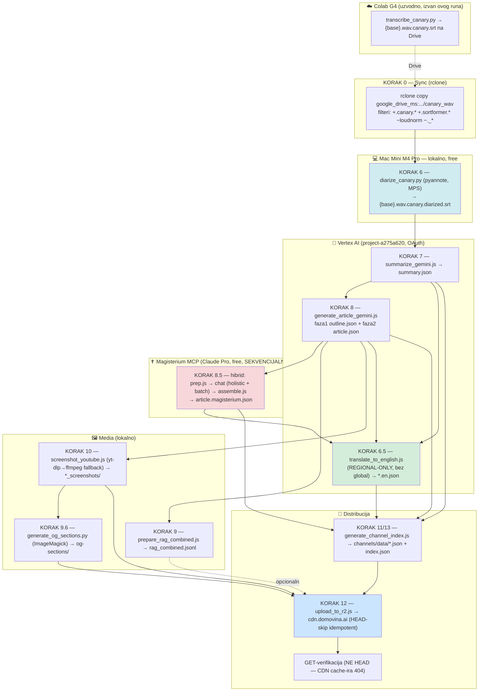
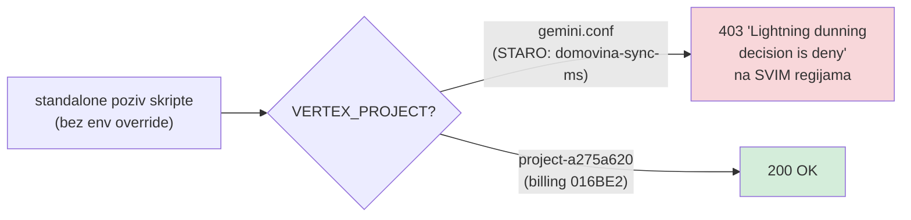
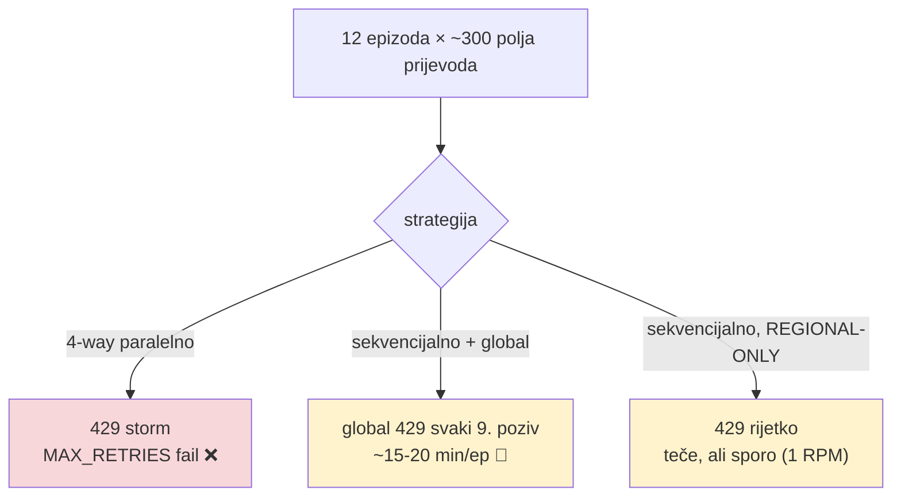

# DOMOVINA.ai — Potpuni pipeline (svi koraci 0→13) + mjereni case study

> **Što je ovo:** master-dokument koji vizualizira **cijeli** put od `.canary.srt` (Colab transkripcija) do
> publicirane, teološki-verificirane, dvojezične epizode na `cdn.domovina.ai`. Nadopunjuje [`PIPELINE.md`](./PIPELINE.md)
> stvarima **naučenima u produkcijskom runu 2026-06-08** (12 epizoda odjednom): naplatni projekt fix,
> hibridni Magisterium MCP flow s realnim brojkama, te `global`-endpoint quota gotcha kod EN prijevoda.

---

## 1. Pregled cijelog pipelinea (0 → 13)



**Striktni preduvjeti (chain dependencies):**
1. `.canary.diarized.srt` mora postojati prije AI sloja (7/8) — inače RAG degradira bez govornika.
2. `article.json` + `outline.json` moraju postojati prije Magisterium MCP (8.5) i RAG (9).
3. EN prijevod (6.5) treba summary + article + magisterium (prevodi sva tri additivno).

---

## 2. Tri stvari naučene u runu 2026-06-08 (NOVO)

### 2.1 Naplatni projekt: `domovina-sync-ms` je u dunningu → `project-a275a620`



- `domovina-sync-ms` (billing `0140D3-08E99F-E8C697`) je u **dunningu**: Vertex vraća
  `403 PERMISSION_DENIED "Lightning dunning decision is deny for project: projects/1091687353506"`.
- Ispravan projekt: **`project-a275a620-ef0c-45ae-99e`** (billing `016BE2-D24293-12968B`).
- **Cementirano:** `gemini.conf VERTEX_PROJECT=project-a275a620-...` + hardkodirani fallbacks u
  `summarize_gemini.js`, `generate_article_gemini.js`. `run_pipeline.sh:79` već je imao `export` override —
  ali standalone pozivi (bez run_pipeline) padali su na stari projekt. Sada rade out-of-the-box.

### 2.2 EN prijevod: izbaci `global` endpoint iz rotacije

`translate_to_english.js` rotira 9 regija uključujući `global`. Na svježem projektu **`global` endpoint je
rate-limited (429)**, dok **regionalni endpointi rade (200)**. Posljedice:
- **NE paraleliziraj prijevod** (4-way → 429 storm, ~svi prijevodi padnu na MAX_RETRIES).
- Sekvencijalno + `global` u rotaciji = puzanje (svaki 9. poziv stalls).
- **Fix:** `export VERTEX_REGIONS="us-central1,us-east1,us-east4,us-west1,us-west4,us-south1,europe-west1,europe-west4"`
  (bez `global`) → 429 rate padne s ~stotina na ~jedinice; prijevod teče.



**Korijenski uzrok (potvrđeno Cloud Quotas API-jem):** projekt `project-a275a620` ima Gemini RPM kvotu
**`1` zahtjev/min** (default za nov projekt; MedLM ima 60, Gemini 1). Zato je article-generacija (~3 poziva/ep)
prošla glatko, a prijevod (~300 poziva/ep) puzao. Regional-only fix samo izbjegne najgori `global` 429-zid —
ali stvarni strop je 1 RPM, pa je i regional-only run trajao **~7 h za 10/12** (2/12 ostala bez po 1 fajla).
Autonomni quota-increase (`gcloud alpha quotas preferences create/update`, 300 i 60 RPM) Google je **auto-deny**
("cannot grant ... at this moment, '0' granted") — nov projekt ne može self-grantati Gemini quotu dok ne sazri.
**Prava poluga je quota bump** (project maturity / support case); do tad EN je inherentno spor.

### 2.3 Magisterium MCP hibrid — stvarni flow i brojke

```mermaid
sequenceDiagram
    participant U as Claude (chat)
    participant P as prep.js
    participant M as Magisterium MCP
    participant A as assemble.js
    U->>P: prep --article ART --batch-size N --max-words W
    P-->>U: holistic.txt + batch_NN.txt + job.json
    U->>+M: chat(holistic)  [1×]
    M-->>-U: {overall_score, seeds_of_logos, concerns} + References
    loop svaki batch (N sekcija), SEKVENCIJALNO
        U->>+M: chat(batch_NN)
        M-->>-U: {results:[{score,assessment,concerns,enrichment}]} + References
        Note over U: timeout → ponovi KRAĆI sadržaj<br/>refuse → preformuliraj "moralno-teološki"
    end
    U->>A: assemble --job --results-dir --out STORAGE/article.magisterium.json
    A-->>U: root overall_score = avg(sekcije); holistic u overall.holistic_score
```

**Empirijski (12 epizoda, ~100 `chat` poziva):**
- **batch-size skaliranje:** male epizode (6 sekcija) → batch-4; velike svjetovne (50 sekcija) → batch-6 + `--max-words 40` (manje poziva bez timeout rizika; lever je KRATAK sadržaj po sekciji, NE manji batch).
- **3 failure-mode-a koje treba ručno gurnuti:**
  1. **timeout** (~5% poziva) → retry s kraćim sadržajem.
  2. **refuse** (sekularni/stranački sadržaj) → "ne mogu izvan katolicizma" → preformuliraj kroz socijalni nauk ("moralno-teološka procjena, ne stranačka").
  3. **prazan/`<thought>` odgovor** → spasi samo čisti JSON blok, omotaj u ```​json fence (assemble traži fence).
- **cache citata raste:** `magisterium_doc_urls.json` — dodao Ecclesia de Eucharistia, Sacramentum Caritatis, Gaudium et Spes (recurring u katoličkim epizodama). `search` JE parallel-safe; `chat` NIJE.

---

## 3. Case study: 12 epizoda kroz pipeline (2026-06-08)

**Ulaz:** 12 svježe transkribiranih epizoda (Colab Canary) povučenih s Drive-a, raspon 6–50 sekcija,
miješani sadržaj (katolički, obiteljski, wellness, geopolitika, lokalna politika, BiH polemika).

### 3.1 Magisterium scoreovi (scoring radi po tipu sadržaja)

| Epizoda | Kanal | Sekcija | root | holistic | Tip |
|---|---|---:|---:|---:|---|
| Tijelovo propovijed (DDV) | budi_frajer | 24 | **95** | 92 | katolički |
| Should you be kind to your AI | catholic_futurist | 6 | **92** | 94 | katolički/AI |
| Vjetroelektrana Gradina | hercegovina_info | 50 | **51** | 68 | svjetovni (Laudato si') |
| Tijelo inteligentnije od uma | lood_podcast | 8 | **81** | 65 | wellness/antropologija |
| Fra Ante Vučković (Mk 13) | mreze_rijeci | 13 | **96** | 98 | katolički (egzegeza) |
| Domagoj Delač | podcast_cuspajz | 9 | **73** | 82 | lifestyle |
| Fatmir Alispahić | podcast_cuspajz | 22 | **52** | 58 | političko/polemično |
| Brak i biznis | poduzetnistvo | 21 | **93** | 98 | katolički/obitelj |
| Ogorec (geopolitika) | radio_mreznica | 16 | **59** | 62 | svjetovni (just-war) |
| Vandelić (anti-korupcija) | radio_mreznica | 24 | **59** | 78 | političko |
| Rastući s djecom | rastuci_s_djecom | 24 | **91** | 98 | katolički/obitelj |
| Glasnović (lustracija) | zeljka_markic | 16 | **84** | 68 | političko/povijest |

Scoring točan: 90+ za teološki sadržaj, 50–60 za svjetovni/polemični, s konkretnim concerns (etničke
generalizacije, normalizacija nasilja, cinizam "svi su isti") i citatima socijalnog nauka (Laudato si',
Fratelli Tutti, Pacem in Terris, Compendium, Dignitas Infinita, KKC 2307-2317).

### 3.2 Mjerena vremena (sve nakon transkripcije)

| Korak | Trajanje | Napomena |
|---|---|---|
| KORAK 0 rclone pull | **27 s** | 12 novih `.canary.srt` |
| KORAK 6 diarizacija ×12 | **~24 min** | lokalno M4 Pro, ~1–3 min/ep (kraći ep 62 s) |
| KORAK 7+8 summary+article ×12 | **~15 min** | Gemini, pipelined (trailing diarizaciju), ~16 s/ep summary |
| **KORAK 8.5 Magisterium MCP ×12** | **~80 min** | ⏱️ DOMINANTNO — ~100 sekvencijalnih `chat` poziva, interaktivno |
| KORAK 9 RAG ×12 | **5 s** | lokalno |
| KORAK 10 screenshots | **~0** | već postojali (fetch ih je generirao) |
| KORAK 9.6 og-sections ×9 kanala | **27 s** | ImageMagick |
| KORAK 11 channel index | **~30 s** | 2707 videa, 42 kanala |
| KORAK 12 R2 upload ×12 + meta | **~10 min** | ~70 MB, HEAD-skip idempotent |
| GET-verifikacija | **~5 s** | svih 12: article+magisterium = **200** |
| **UKUPNO do "live na CDN" (HR + Magisterium)** | **~3 h 04 min** | od kojih ~80 min je Magisterium MCP |
| KORAK 6.5 EN prijevod (regional-only, sekvencijalno) | **~7 h 09 min** | ⚠️ 1 RPM Gemini quota: 10/12 (21:09→04:18), 2/12 ostala bez po 1 fajla |
| **UKUPNO do punog dvojezičnog publisha (10/12)** | **~10 h 15 min** | EN dominira zbog 1-RPM stropa; uz quota bump bilo bi ~+15 min umjesto ~7 h |

**Zaključak mjerenja:** do "HR + Magisterium live na CDN" kritični put je **interaktivni Magisterium MCP sloj**
(~80 min, sekvencijalan po dizajnu); sve ostalo (diarize/summary/article/RAG/media/R2) je ~1 h zajedno i većinom
paralelizabilno. Za **pun dvojezični** publish dominira **EN prijevod (~7 h)**, ali ne zbog algoritma nego
zbog **1-RPM Gemini quote na novom projektu** — to je jedini pravi infra-bottleneck cijelog sustava. Uz quota
bump (kad projekt sazri ili kroz support) EN bi pao na ~15 min, čime bi total do punog dvojezičnog publisha
bio **~3,5 h** umjesto ~10 h.

---

## 4. Reference

| Dokument | Sadržaj |
|---|---|
| [`PIPELINE.md`](./PIPELINE.md) | Originalni narativ + autonomous-mode pravila |
| [`MAGISTERIUM_MCP_RUN.md`](./MAGISTERIUM_MCP_RUN.md) | Turnkey hibridni Magisterium runbook (korak 8.5) |
| [`magisterium_mcp_hybrid_2026-05.md`](./magisterium_mcp_hybrid_2026-05.md) | Detaljni dizajn hibrida |
| [`diarization_research_2026-05.md`](./diarization_research_2026-05.md) | Zašto pyannote ide lokalno |
| `gemini.conf` | `VERTEX_PROJECT=project-a275a620-...` (cementirano 2026-06-08) |
| `magisterium_doc_urls.json` | Cache citat→UUID (raste sa svakim runom) |

**Stvoreno:** 2026-06-08 kao capstone produkcijskog runa od 12 epizoda (od Colab transkripcije do CDN-a),
prvi batch-run s hibridnim Magisterium MCP-om na realnoj skali i s naplatnim-projekt + EN-quota fixevima.
