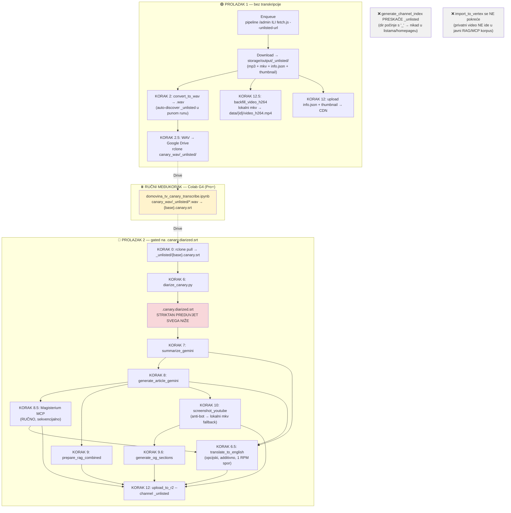
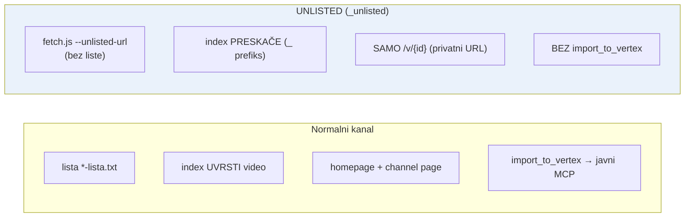
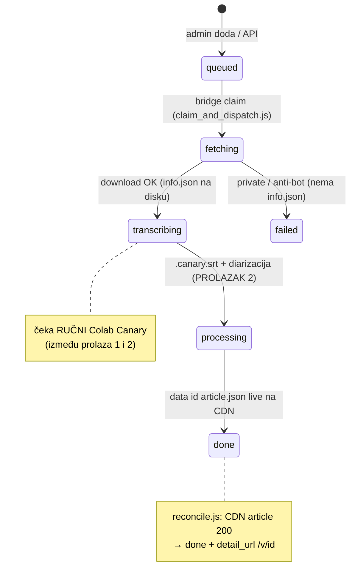

# UNLISTED PIPELINE — strogi two-pass protokol (single point of truth)

> **Što je ovo:** jedini mjerodavni protokol za obradu **unlisted / ad-hoc** YouTube videa
> (onih koji dolaze kroz `pipeline.domovina.ai` queue ili ručno kroz `fetch.js --unlisted-url`).
> Koristi ga kao **baseline** svaki put kad šalješ novi video na obradu, i kao referencu kad
> nekome objašnjavaš kako unlisted obrada radi.
>
> Za opći pipeline vidi [`PIPELINE_FULL.md`](./PIPELINE_FULL.md) (svi koraci 0→13) i
> [`adhoc_video_processing.md`](./adhoc_video_processing.md) (cookbook za video koji **već ima**
> transkripciju, normalni kanali). Ovaj dokument je **specifičan za unlisted** i naglašava
> **što je moguće u kojem prolasku** te **po čemu se unlisted razlikuje** (nikad indeksiran,
> privatni `/v/{id}`, ne ide u javni RAG/MCP).

---

## 0. ZAKON: svaki video treba TOČNO DVA PROLASKA

`.canary.diarized.srt` je **striktan preduvjet** cijelog AI sloja. Canary transkripcija se
radi **ručno na Google Colab G4** (vidi [`PIPELINE_FULL.md`](./PIPELINE_FULL.md) i CLAUDE.md —
diarizacija je CPU-bound pa ide lokalno, transkripcija GPU-bound pa ide na Colab). Zato se
**niti jedan** video ne može 100% obraditi u jednom prolasku:

| | PROLAZAK 1 (prije transkripcije) | RUČNI MEĐUKORAK | PROLAZAK 2 (poslije `.canary.diarized.srt`) |
|---|---|---|---|
| **Što** | download + WAV + WAV→Drive + (opcijski) bazna vidljivost (video + meta) | Colab Canary transkripcija | diarizacija → summary → article → Magisterium → RAG → EN → screenshots → upload |
| **Gate** | ništa (ne treba transkripciju) | — | **`.canary.diarized.srt` mora postojati** |
| **pipeline state** | `queued→fetching→transcribing` | `transcribing` (čeka) | `processing→done` |
| **`/v/{id}` pokazuje** | video + naslov + thumbnail (bez AI) | — | **puni članak, sažetak, teološka procjena, poglavlja, screenshoti** |

Nakon **uspješnog prolaska 2 video je 100% backfillan.** Tek tada je `done`.

> **Praktično:** u realnosti to znači **≥2 puna pipeline runa** (nightly ili manualni), jer je
> Colab korak ručan i događa se **između** dva runa. Run #1 odradi prolazak 1; ti pokreneš
> Colab; sljedeći run odradi prolazak 2. Sve je idempotentno — koraci preskaču već gotovo.

---

## 1. Master dijagram (dva prolaska + gate)



---

## 2. PROLAZAK 1 — moguće BEZ transkripcije

Ničemu ovdje ne treba `.canary.*`. Cilj: video skinut, WAV na Driveu (za Colab), i — opcijski —
**bazna vidljivost** (gledatelj odmah vidi video + naslov na `/v/{id}`, bez AI sadržaja).

| # | Korak | Komanda | Output | Treba transkripciju? |
|---|---|---|---|:--:|
| A | Enqueue | pipeline `/admin` forma **ili** `node fetch.js --unlisted-url "<URL>" [--unlisted-title "…"]` | red / direktni download | ne |
| B | Download | (bridge ili fetch.js) → `storage/output/_unlisted/` | `mp3, mkv, info.json, .png, .description` | ne |
| C | WAV | `node convert_to_wav.js --channel _unlisted` *(ili pun run — auto-discover)* | `{base}.wav` | ne |
| D | WAV→Drive | `rclone copy storage/output/_unlisted/ google_drive_ms:domovina_fetch_data/canary_wav/_unlisted -L --filter "+ *.wav" --filter "- *" --drive-shared-with-me` | `canary_wav/_unlisted/{base}.wav` | ne |
| E | H.264 video | `node backfill_video_h264.js --channel _unlisted` | `data/{id}/video_h264.mp4` na CDN | ne (samo lokalni mkv) |
| F | Bazna meta | `node upload_to_r2.js --input-dir storage/output --channel _unlisted --video-id {id}` | `data/{id}/info.json` + `images/{id}/thumbnail.png` | ne |

**Stanje nakon prolaska 1:** `/v/{id}` renderira **video + naslov + thumbnail** (Flutter traži
samo `info.json` 200 da ne baci 404). AI sadržaja još nema. pipeline job = `transcribing`.

> Koraci E i F su **opcijski** u prolasku 1 — daju ranu vidljivost. Ako ih preskočiš, sve
> svejedno dođe u prolasku 2 (KORAK 12 uploada sve odjednom). U punom nightly/`run_pipeline.sh`
> runu E (12.5) i F (12) se izvrše automatski jer su dir-driven i obuhvate `_unlisted`.

---

## 3. RUČNI MEĐUKORAK — Colab Canary transkripcija

**Mora ga pokrenuti čovjek.** Otvori `colab_canary/domovina_tv_canary_transcribe.ipynb` na
Colab **G4 (Pro+)** — notebook obrađuje sve podmape pod `canary_wav/`, pa pokupi i `_unlisted/`.
Rezultat: `{base}.canary.srt` natrag na Drive.

- T4 OOM-a na Canary 1B v2 — **G4 obavezan** (vidi CLAUDE.md).
- Engleski video? Canary radi **prijevod** uz `--source-lang hr` (vidi memory
  `canary_en_to_hr_speech_translation`).

Dok ovo ne završi, prolazak 2 je **blokiran** (nema što diarizirati).

---

## 4. PROLAZAK 2 — moguće ISKLJUČIVO nakon `.canary.diarized.srt`

Sve niže ima **striktan chain-dependency** na diarizirani SRT. Komande su scoped na `--channel
_unlisted` (ili `--video-id {id}`). U punom nightly/`run_pipeline.sh` runu sve osim Magisterija
(ručno) ide automatski jer su dir-driven.

| # | Korak | Komanda | Preduvjet | Gated? |
|---|---|---|---|:--:|
| 0 | Pull SRT | `rclone copy google_drive_ms:domovina_fetch_data/canary_wav/_unlisted storage/output/_unlisted -L --drive-shared-with-me` | Colab gotov | — |
| 6 | **Diarizacija** | `python3 colab_diarize/diarize_canary.py --input-dir storage/output/_unlisted` | `.canary.srt` | **proizvodi gate** |
| 7 | Summary | `node summarize_gemini.js --input-dir storage/output --channel _unlisted` | **`.canary.diarized.srt`** | ✅ |
| 8 | Article | `node generate_article_gemini.js --input-dir storage/output --channel _unlisted` | **`.canary.diarized.srt`** | ✅ |
| 8.5 | **Magisterium MCP** | RUČNO u Claude chatu (prep → chat sekvencijalno → assemble); **NIKAD `enrich_magisterium*.js` (API ključevi)** | `article.json` | ✅ |
| 9 | RAG | `node prepare_rag_combined.js --input-dir storage/output --channel _unlisted` | `article.json` + diarized | ✅ |
| 6.5 | EN prijevod (opc.) | `node translate_to_english.js --input-dir storage/output --video-id {id}` | summary+article+magisterium | ✅ |
| 10 | Screenshots | `node screenshot_youtube.js --input-dir storage/output --channel _unlisted` *(anti-bot → lokalni mkv ffmpeg, vidi adhoc cookbook §5b)* | `article.json` (timestampovi) | ✅ |
| 9.6 | og-sections | `python3 generate_og_sections.py --input-dir storage/output --channel _unlisted` | sekcije + screenshoti | ✅ |
| 12 | **Upload** | `node upload_to_r2.js --input-dir storage/output --channel _unlisted` | sve gore | ✅ |

**Stanje nakon prolaska 2:** `data/{id}/article.json` (+ summary, magisterium, outline, diarized,
screenshoti, og, EN) **live na CDN-u** → `/v/{id}` je 100% kompletan. pipeline job = `done`.

> **NE radi se** `generate_channel_index` (KORAK 11/13) ni `upload_to_r2 --meta-dir` za unlisted:
> `_unlisted` dir počinje s `_` pa ga indeks svejedno preskače. I **NE** `import_to_vertex` — privatni
> video ne smije u javni RAG/MCP korpus.

---

## 5. Po čemu je UNLISTED drukčiji (vs normalni kanal)



| | Normalni kanal | Unlisted (`_unlisted`) |
|---|---|---|
| Ulaz | `*-lista.txt` + `refresh_podcasts.sh` | `fetch.js --unlisted-url` / pipeline queue |
| Dir | `storage/output/{kanal}/` | `storage/output/_unlisted/` |
| Channel index | uvrštava (homepage, channel page) | **preskače** (`generate_channel_index.js` ignorira `_`-dir) |
| Vidljivost | javno u listama | **samo** `https://domovina.ai/v/{id}` (kao YouTube unlisted) |
| `/v/{id}` rezolucija | po ID-u (index-neovisno) | po ID-u (isto — radi i bez indeksa) |
| Per-video CDN upload | da | da (`upload_to_r2` uključuje `_`-dir) |
| RAG/MCP (`import_to_vertex`) | da | **ne** (ostaje privatno) |

Mehanizam i kod detaljno: memory `unlisted_adhoc_ingestion_mechanism` i README repo-a
`pipeline.domovina.ai`.

---

## 6. pipeline.domovina.ai — job stanja kroz prolaske



Bridge (`pipeline.domovina.ai/bridge/`): `claim_and_dispatch.js` (prolazak 1, KORAK 0 punog runa)
+ `reconcile.js` (završno javi `done`). Cloud cron vraća stuck `fetching` u `queued`.

---

## 7. BASELINE CHECKLIST — slanje novog unlisted videa

**Prolazak 1**
- [ ] Enqueue: pipeline `/admin` (zalijepi URL) **ili** `node fetch.js --unlisted-url "<URL>" --unlisted-title "…"`
- [ ] Pokreni pun run (`./run_pipeline.sh --with-r2-upload` ili sačekaj nightly) **ili** ručno B→F iz §2
- [ ] Provjeri: `curl -s -o /dev/null -w "%{http_code}\n" https://cdn.domovina.ai/data/{id}/info.json` → **200**
- [ ] WAV na Driveu: `rclone lsl google_drive_ms:domovina_fetch_data/canary_wav/_unlisted --drive-shared-with-me`

**Međukorak**
- [ ] Pokreni Colab `domovina_tv_canary_transcribe.ipynb` (G4) → `.canary.srt` na Drive

**Prolazak 2**
- [ ] Pun run s diarizacijom (`./run_pipeline.sh --with-local-canary-diarize --with-screenshots --with-r2-upload`) **ili** ručno 0→12 iz §4
- [ ] **Magisterium MCP ručno** (sekvencijalno) — vidi [`MAGISTERIUM_MCP_RUN.md`](./MAGISTERIUM_MCP_RUN.md)
- [ ] (opc.) EN prijevod
- [ ] Verifikacija **GET-om** (ne HEAD — CDN cache-ira 404 4h):

```bash
VID={id}
for p in data/$VID/info.json data/$VID/video_h264.mp4 data/$VID/summary.json \
         data/$VID/article.json data/$VID/article.magisterium.json \
         images/$VID/thumbnail.png; do
  curl -s -o /dev/null -w "%{http_code}  $p\n" "https://cdn.domovina.ai/$p"
done
```

- [ ] Otvori `https://domovina.ai/v/{id}` → puni članak vidljiv, a videa **nema** ni u jednom indeksu
- [ ] (pipeline) reconcile postavi job na `done`

---

## 8. Reference

| Dokument / kod | Sadržaj |
|---|---|
| [`PIPELINE_FULL.md`](./PIPELINE_FULL.md) | Svi koraci 0→13 + mjereni case study |
| [`adhoc_video_processing.md`](./adhoc_video_processing.md) | Cookbook (video s gotovom transkripcijom, normalni kanali) |
| [`MAGISTERIUM_MCP_RUN.md`](./MAGISTERIUM_MCP_RUN.md) | Magisterium MCP runbook (KORAK 8.5) |
| `fetch.js --unlisted-url` | Ad-hoc download u `_unlisted` |
| `convert_to_wav.js` | Auto-discover `_`-kanala u punom runu |
| `../pipeline.domovina.ai` | Queue servis (Worker + admin + bridge) |
| memory `unlisted_adhoc_ingestion_mechanism` | `_`-prefiks asimetrija (index skip vs CDN upload vs `/v/{id}`) |

**Stvoreno:** 2026-06-09 kao single-point-of-truth protokol za unlisted/ad-hoc obradu.
