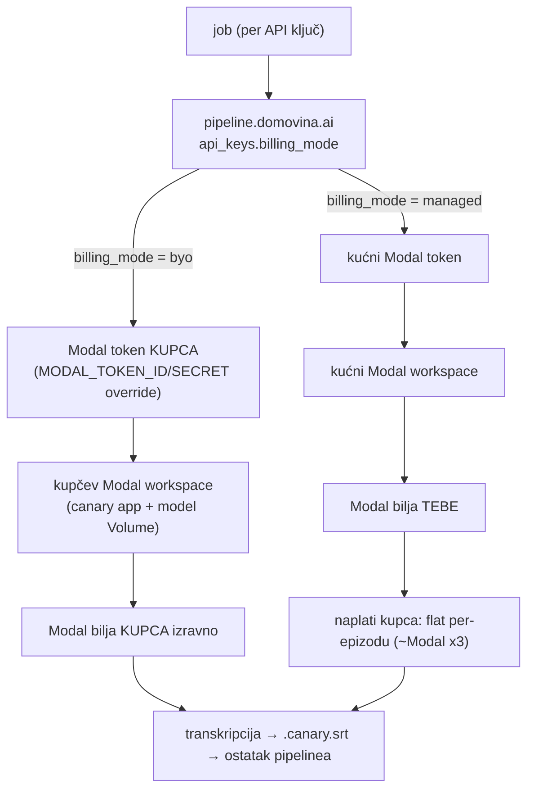
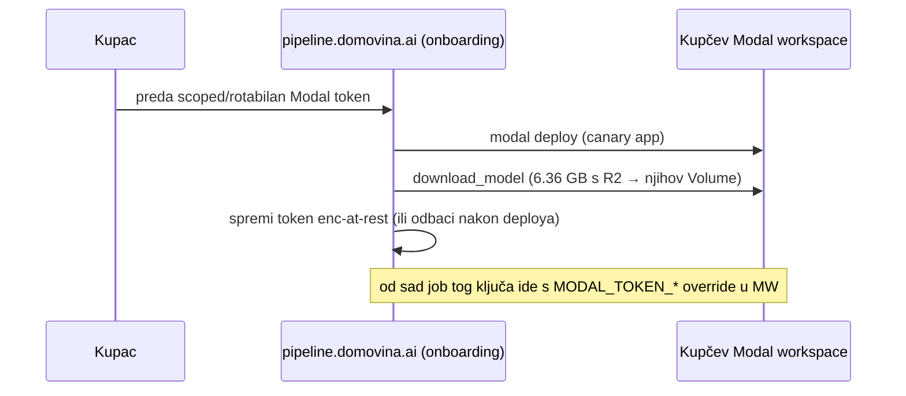

# BYO-Modal-key monetizacija za pipeline.domovina.ai — DESIGN NOTE (plan, nije građeno)

**Status:** 🟡 DESIGN NOTE / plan (2026-07-07). NIJE implementirano — hvata odluke i rizike prije
gradnje. Kad se krene: prati ovo pa ažuriraj status.
**Povezano:** `pipeline.domovina.ai` (`api_keys` tablica, `/api/*`), `modal_canary/canary_modal.py`,
`docs/transcription_colab_vs_modal_cost_2026-07.md`, memorija `byo_modal_key_monetization`.

## Model: dual-tier "bring-your-own-cloud + managed markup"

Dvije naplatne staze po API ključu (`api_keys.billing_mode`):

- **BYO tier** — svaki ključ nosi **vlastiti Modal token** → transkripcijski job te queue-a ide na
  **kupčev Modal workspace**, Modal bilja **izravno kupca**. Ti ne frontaš varijabilni GPU trošak.
- **Managed tier** — tko se ne želi zezati → koristi **kućni** Modal, naplaćuješ **~x3** (markup na
  convenience). Ti fronaš Modal trošak, kapiraš marginu.

## Ključne odluke i rizici (iz analize koda)

1. **Routing je lak, setup nije.** Runtime: `MODAL_TOKEN_ID/SECRET` env override per invocation
   usmjeri job u kupčev workspace. ALI svaki kupčev workspace treba **jednokratni onboarding**:
   `modal deploy` canary appa + `download_model` (6.36 GB s R2) u NJIHOV Volume.
2. **Security = najveći rizik.** Modal token secret = *full workspace access* (god-cred). NE držati
   long-lived u D1. Preferiraj: kupac deploya sam ili preda **rotabilan/scoped** token; ti nikad ne
   držiš god-cred. (Isti least-privilege instinkt kao `TRANSCRIBE_KEY` u claim/lock feature-u.)
3. **x3 metering.** Istinski "cost×3" traži per-invocation atribuciju (fiddly na Modalu). Preporuka:
   **flat per-epizodu** cijena (predvidljivo, drži marginu, bez usage-attribution pipelinea).
   Cijeni **cijeli pipeline** (Gemini ~$0.039/ep + R2 egress + diarize), ne samo Modal slice
   (~$0.06/ep) — Modal je jeftin dio.
4. **Minimalna kirurgija na postojećem.** `api_keys` već ima `credits` + `consumeApiKeyCredit`
   (metering hook). Dodaj `modal_token_id/secret` (enc-at-rest) + `modal_workspace` +
   `billing_mode ∈ {byo, managed}`. Claim/lock (`/api/transcription/*`) je neovisan.

## BYO onboarding (jednokratno po kupcu)

## Otvorena pitanja (za kad se gradi)
- Enc-at-rest kredencijala: envelope per ključ? KMS? Ili "deploy pa odbaci token" (re-auth na svaki redeploy)?
- Flat cijena po epizodi vs kreditni model koji već postoji (`api_keys.credits`, `PRICE_CENTS`).
- Onboarding automation: skripta koja radi `modal deploy` + `download_model` u tuđem workspaceu.
- Managed-tier egress/COGS izvan Modala (Gemini/R2) — uračunati u cijenu, ne samo Modal x3.
