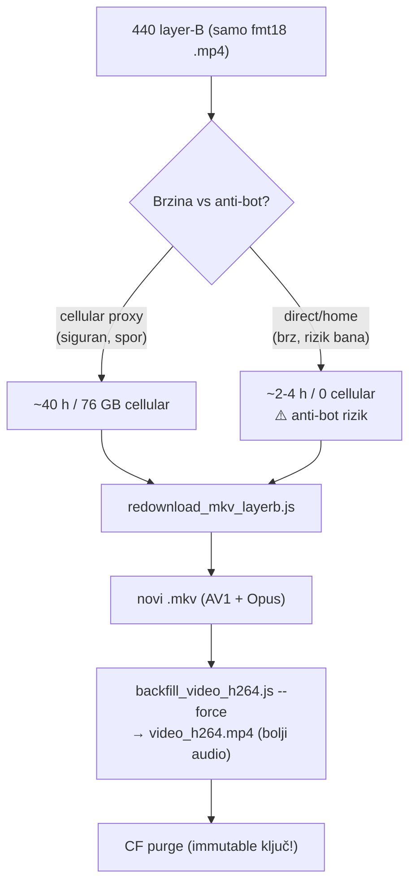
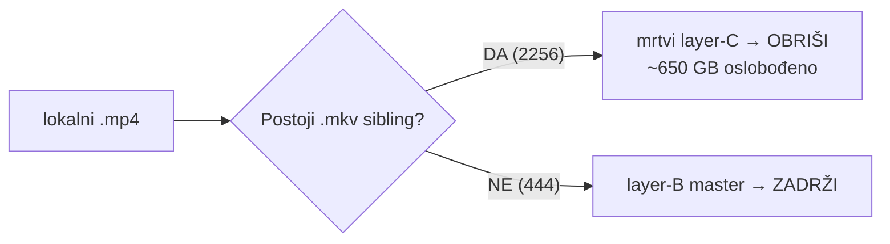
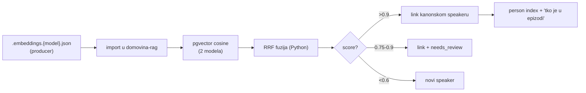
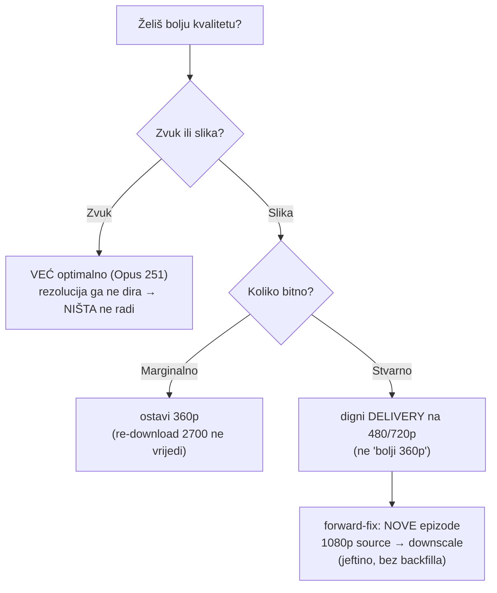

# Odgođene odluke — backlog iz sesije 2026-06-05

> **Što je ovo:** odluke koje smo u radu **profilirali i potvrdili kao smjer**, ali ih **nismo izvršili** u toj sesiji. Svaka ima: odluku, razlog, plan izvršenja, blokere i status. Izvršeno u istoj sesiji (H.264 migracija, brisanje legacy `video.mp4`, diarizacija u nightly, `count_progress` čišćenje) NIJE ovdje — to je u git historyju i memorijama.

---

## Pregled statusa

```mermaid
flowchart LR
    subgraph DONE["✅ Izvršeno (ova sesija)"]
        D1["H.264 migracija 2696/2696"]
        D2["Legacy video.mp4 obrisan (−305 GB)"]
        D3["Diarizacija u nightly"]
        D4["count_progress --with-r2-video"]
    end
    subgraph TODO["🕗 Odgođeno (ovaj dokument)"]
        T1["Layer-B re-download (440)"]
        T2["Lokalni layer-C .mp4 cleanup (~650 GB)"]
        T3["EN prijevod u nightly"]
        T4["Magisterium backfill (~2681)"]
        T5["Speaker embeddings Faza 3 (pgvector)"]
        T6["fetch.js quality forward-fix"]
    end
    DONE -.otključava.-> TODO
```

---

## 1. Layer-B re-download (440 epizoda) — najbolji audio izvor

**Odluka:** 440 epizoda ima samo YouTube **format 18** (`.mp4`, H.264 + slab ~48k AAC), bez `.mkv`. Re-downloadati pravi `.mkv` (odvojeni `bestvideo[h≤360]` AV1/VP9 + `bestaudio` Opus ~113k) → re-transcode H.264 s kvalitetnim audio izvorom. Time se i tih 440 svede na isti pipeline kao layer-A.

**Status:** skripta `redownload_mkv_layerb.js` **napisana, fixana i validirana** (potvrđen valjan 173 MB AV1+Opus `.mkv`), ali **NIJE pokrenuta** na 440.

**Naučeno tijekom smoke testa:**
- ❌ `--cookies-from-browser brave` u non-tty (spawnSync) **silently faila** → daje slomljen 4 KB `.mkv`. Fix: cookies su sad OPT-IN, clean cellular IP ih ne treba.
- ⏱️ **Cellular proxy ~0.5 MB/s** → ~5.5 min/video → **440 ≈ 40-44 h** (NE 10 h). U 10 h stane ~100.
- 📶 **~76 GB mobilnih podataka** kroz iPhone — može probiti data plan.
- ✅ Disk STANE: ~76 GB, ~36 GB na DOMOVINA1TB (ima 114 GB free).

**Plan izvršenja (preporučeno):** prvo **test 2-3 videa DIRECT (bez proxyja)** → izmjeri home brzinu + provjeri blokira li anti-bot. Ako čisto → bulk direct (brzo, besplatno, stane u dan), proxy fallback za blokirane. Ako blokira → cellular i prihvati ~40 h ili subset. **Pokretati ručno** (treba iPhone proxy + nadzor), NE u nightly. Nakon: `backfill_video_h264.js --force` + CF purge (jer prepisuje immutable `video_h264.mp4`).

**Vrijedi li uopće?** Da, za audio tih 440 (48k → 113k izvor je realan lift). Video je svejedno 360p. Nije hitno.

---

## 2. Lokalni layer-C `.mp4` cleanup (~2256 fajlova, ~650 GB)

**Odluka:** lokalni `.mp4` (layer C, VP9/AV1-u-mp4 `-c:v copy`) je **mrtav** otkad delivery ide kroz `video_h264.mp4` i legacy `video.mp4` je obrisan s R2. Zauzimaju lokalni disk bezveze (najviše na tijesnom DOMOVINA1TB).

**⚠️ KRITIČAN sigurnosni gate:** briši `.mp4` **SAMO ako za tu epizodu postoji `.mkv`**. Onih **444 layer-B `.mp4` su master** (jedini video izvor, nema `.mkv`) i **NE smiju se obrisati**.

**Status:** skripta NIJE napisana. **Plan:** skripta s `.mkv`-gate-om, dry-run default + `--confirm` (kao `delete_legacy_video_mp4.js`). Zadržati `.mkv` mastere + `.web.mp4` h264 mirror na DOMOVINA2TB. Napomena: ako se odradi **layer-B re-download (#1) prvo**, onih 444 dobiju `.mkv` pa i njihovi `.mp4` postanu deletable — ali tek nakon što su `.mkv`-ovi potvrđeni.

---

## 3. EN prijevod u nightly

**Odluka:** `translate_to_english.js` **uopće nije u `run_pipeline.sh`** — potpuno ručni korak. Trebao bi se automatizirati u nightlyju (kao diarizacija sad).

**Status:** nije implementirano. **Plan:** dodati korak (npr. KORAK 8.7) u `run_pipeline.sh` iza Magisteriuma/članka, gejtan flagom (npr. `--with-en-translation`), pa ga nightly prosljeđuje. Oprez: Vertex Gemini, ~80 min wall-clock za batch, temperature=0; provjeriti da ne troši kvotu kad nema novog posla (idempotentno preskače postojeće `_en`).

---

## 4. Magisterium MCP backfill (~2681 epizoda)

**Odluka:** Magisterium ide **isključivo preko MCP** (Pro subscription, free), a MCP radi **samo u Claude Code chatu** — nije skriptabilno u nightly. `--with-magisterium` flag u pipelineu koristi **API put (zabranjen)**. Dakle ostaje **ručni** hibridni runbook (`docs/MAGISTERIUM_MCP_RUN.md`).

**Status:** najveća sadržajna rupa (14/2698 obrađeno). **Plan:** batch ručno kroz hibridni flow (prep → MCP chat pozivi SEKVENCIJALNO → assemble). Ne automatizira se bez API ključeva (koje user eksplicitno odbija). Realno: postupno, prioritet po važnosti epizode.

---

## 5. Speaker embeddings — consumer Faza 3 (entity resolution)

**Odluka (potvrđena ova sesija):** glasovni embeddings → **Postgres/pgvector**, NE ClickHouse (mala skala + mutation-heavy + relacijski kontekst). RRF ensemble (TitaNet + wespeaker) **u Pythonu importera**, ne CH. Detalji: `rag_clickhouse_postgres_plan.md` §15 (usklađen).

**Status:** producer generira embeddings (148/2695 backfillano); **consumer Faza 3 NIJE kodirana** u `../domovina-rag`. **Plan:** PG `speakers` shema s `voice_embedding_{titanet,wespeaker}`, ivfflat indeksi, import-time resolution (5 signala: glas/ime/kanal/co-speaker/LLM), review queue. Otključava "tko je u kojoj epizodi" po glasu + person index na frontendu.

---

## 6. fetch.js quality forward-fix + video rezolucija (verdikt)

**Verdikt o kvaliteti (profiliran ova sesija):**
- 🔊 **Zvuk je već maksimalan** — Opus 251 je **neovisan o rezoluciji** videa (DASH). Download 1080p **NE bi dao bolji zvuk**. Nema što dobiti re-downloadom za audio.
- 🖼️ **Downscale 1080p→360p JEST oštriji** od native-360p (supersampling), ali za talking-head **umjeren** dobitak. Ako slika bitna, pravi lever je **dignuti delivery na 480/720p**, ne "bolji 360p".
- 💽 **1080p arhiv ~2.7 TB** za 2700 videa → treba **novi disk**. 4K većina nema, ogromno, ne vrijedi.

**Odluka:** **NE re-downloadati svih 2700** samo za marginalni 360p bump (2.7 TB + dani + cellular). **Plan (jeftino):** za **nove epizode** promijeniti `fetch.js` format-string (1080p source → downscale na delivery rezoluciju; preferiraj Opus audio da se izbjegnu budući layer-B slučajevi). Postupno se gradi HQ master katalog bez jednokratnog udara. Retroaktivni katalog-wide re-download odgođen dok ne postoji jasan razlog (npr. odluka o 720p deliveryju + novi disk).

**Status:** nije implementirano.

---

## Sažeti prioriteti (kad se vratimo)

| # | Stavka | Vrijednost | Trošak | Hitnost |
|---|---|---|---|---|
| 2 | Lokalni `.mp4` cleanup | ~650 GB diska | nizak (skripta + gate) | srednja (disk tijesan) |
| 1 | Layer-B re-download | audio lift 440 ep | visok (~40 h / 76 GB) | niska |
| 3 | EN prijevod u nightly | otpada ručni korak | nizak | srednja |
| 5 | Speaker Faza 3 | najveća NOVA vrijednost | visok (consumer kod) | niska |
| 4 | Magisterium backfill | najveća sadržajna rupa | ručno, postupno | srednja |
| 6 | fetch.js forward-fix | HQ master za nove | nizak | niska |
