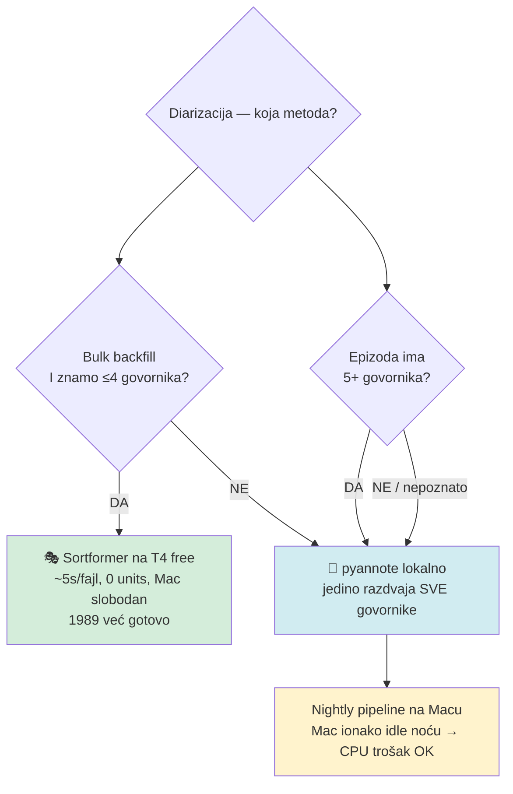
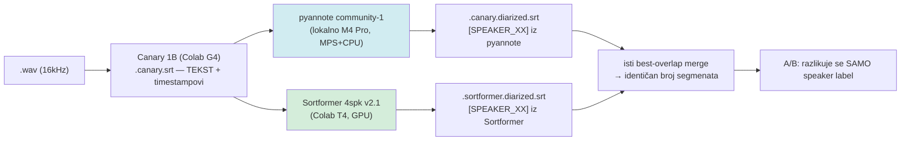

# Sortformer vs pyannote — empirijski A/B nad stvarnim korpusom (2026-06-01)

> **TL;DR**: Nad 18 stvarnih A/B parova (oba SRT-a izvedena iz **istog** Canary teksta, razlikuje se samo `[SPEAKER_XX]` atribucija) potvrđeno: obje metode se **slažu ~96%** oko *tko-kad-govori*. Razlika je u **broju identiteta govornika**. Sortformer 4spk v2.1 je **bounded na ≤4** (stabilan, nikad ne eksplodira), pyannote community-1 je **neograničen** (točan na čistom 2-spk, ali eksplodira do **29 govornika** na teškom/šumnom audiju).
>
> **Odluka**: pyannote ostaje produkcijski default jer dio korpusa ima **5+ govornika** koje dugoročno treba sve razdvojiti. Diarizacija je **one-time job** → CPU trošak se plaća jednom → u **nightly pipelineu na Macu (ionako idle noću)** to je posve prihvatljivo. Sortformer-na-T4 je **bulk backfill alat** za epizode za koje *znamo* da imaju ≤4 govornika (free, ~5 s/fajl, ne dira Mac).

---

## 1. Kontekst

Eksperiment iz svibnja 2026 (`colab_sortformer/`) proizveo je **1989** `.sortformer.diarized.srt` datoteka na Drive-u, ali nikad nije do kraja evaluiran protiv stabilnog pyannote outputa. Ovaj dokument zatvara tu rupu **stvarnim podacima**, ne teorijom.

Komplementaran je s [`diarization_research_2026-05.md`](./diarization_research_2026-05.md) (koji argumentira *gdje* diarizacija treba trčati — lokalno vs Colab — iz cost/perf kuta). Ovaj dokument argumentira *koja metoda* daje bolju kvalitetu i *za koji slučaj*.

### Korpus na Drive-u (`google_drive_ms:domovina_fetch_data/canary_wav`)

| Artefakt | Broj |
|---|---|
| `.canary.diarized.srt` (pyannote) | 1831 |
| `.sortformer.diarized.srt` (Sortformer) | 1989 |
| **Imaju OBA (A/B parovi)** | **1437** |

---

## 2. Metodologija

Oba diarizatora konzumiraju **isti** `.canary.srt` (NVIDIA Canary 1B transkript) i isti best-overlap merge algoritam. Posljedica: za isti video **broj segmenata i timestampovi su identični** (potvrđeno: 860/860, 526/526, 528/528 segmenata) — razlikuje se **isključivo** `[SPEAKER_XX]` oznaka po segmentu.

To omogućuje dvije čiste metrike bez referentnog labela:

1. **Slaganje labela po trajanju** — poravnaj segmente po indeksu, izgradi duration-weighted kontingenciju pyannote↔sortformer, nađi najbolju permutaciju mapiranja labela, izračunaj % trajanja gdje se mapirane oznake slažu. (≈ inter-metoda konzistencija; *nije* DER jer nema reference.)
2. **Broj govornika po metodi** — koliko distinktnih `SPEAKER_XX` (bez `UNKNOWN`) svaka metoda dodijeli.

**Ground truth datapoint**: `KvIhy5SESYs` i `oxq1U0xypu8` su 2-osobni intervjui (Belavić + Stepanić) gdje je istina poznata → pyannote=2 je **točno**, Sortformerovih 3–4 je **pre-cijepanje**.

> ⚠️ **Limit**: ovo mjeri slaganje + broj govornika, ne pravi Diarization Error Rate (DER) protiv ručno označene reference. Za konačno usvajanje treba spot-check na uho na nekoliko flagship epizoda.

---

## 3. Rezultati

### 3.1 Slaganje "tko-kad-govori"

| Video | Sadržaj | pyannote | sortformer | Slaganje |
|---|---|---|---|---|
| `KvIhy5SESYs` | Belavić + Stepanić (2 osobe, ground truth) | **2** ✓ | 3 | 96.1 % |
| `oxq1U0xypu8` | isti, dodaci (2 osobe) | **2** ✓ | 4 | 96.6 % |
| `MGLq9v3AtvE` | Code Club (više govornika) | 11 💥 | 4 | 72.2 % |

### 3.2 Distribucija broja govornika (15 dodatnih videa, razni kanali)

```
pyannote:   min=1  max=29  medijan=2     eksplozija (≥6 govornika): 2/15
sortformer: min=1  max=4   medijan=2     na hard-kapi (=4):         2/15
```

Najgori slučaj: `AAzm0ftoqsg` ("40 dana") — **pyannote 29 govornika**, Sortformer 4.

**Oba medijana = 2**, što odgovara stvarnosti korpusa (voditelj + gost). Razlika je u repu distribucije: pyannote ima dug, divlji rep (do 29), Sortformer je tvrdo odrezan na 4.

---

## 4. Kvalitativna usporedba

| Dimenzija | pyannote community-1 | Sortformer 4spk v2.1 |
|---|---|---|
| **Timeline (tko kad govori)** | ~96 % slaganja | ~96 % slaganja |
| **Broj govornika, čisti 2-spk** | **Točan (2)** ✓ | Pre-cijepa (2→3/4) ✗ |
| **Broj govornika, težak/šuman audio** | **Eksplodira (do 29)** ✗ | **Stabilan ≤4** ✓ |
| **Hard cap** | Nema | 4 (panel 5+ se mergea u 4) |
| **Govornici 5+ (dugoročni cilj)** | **Može razdvojiti sve** ✓ | **Nemoguće (>4 se gubi)** ✗ |
| **Downstream (name-assignment)** | 29 phantom = kaos | Stabilno, lako mapirati |
| **GPU** | Embedding GPU + clustering CPU (CPU-bound) | Fully GPU-resident |
| **Licenca** | CC-BY-4.0 | NVIDIA Open Model License (komerc. OK) |

Ključ: obje se **slažu ~96 %** oko vremenske raspodjele govora. Sva razlika je u **broju identiteta**.

---

## 5. Strateški zaključak



**Logika (potvrđena):**

1. **Dio korpusa ima 5+ govornika** → samo pyannote ih može sve razdvojiti. Sortformerov hard-cap od 4 trajno gubi identitete iznad 4. Dugoročno, ako želimo *sve* govornike razdvojene, **pyannote je jedini koji to omogućuje**. → pyannote ostaje **produkcijski default**.

2. **Diarizacija je one-time job** po videu. CPU-intenzivni trošak (pyannote clustering) plaća se **jednom** i amortizira se preko cijelog života epizode (članak, RAG, EN prijevod, retrieval). Skupa per-fajl operacija koja se nikad ne ponavlja → ukupni trošak zanemariv.

3. **Nightly pipeline = idealan dom za pyannote.** Mac Mini je noću ionako idle; CPU-teška diarizacija u 03:00 ne smeta interaktivnom radu. To je točno mjesto za "spori ali kvalitetni" one-time posao. → **da, nightly pyannote je posve OK.**

4. **Sortformer = bulk akcelerator za poznati ≤4 slučaj.** Kad imamo veliki backlog za koji *znamo* da je ≤4 govornika (npr. fiksni 2-osobni intervju format jednog kanala), Sortformer-na-T4 je dramatično brži i besplatan, a kvaliteta je dovoljna. Ali to je **opt-in optimizacija**, ne default.

```mermaid
quadrantChart
    title Izbor metode po profilu posla
    x-axis Malo-one-time --> Puno-bulk-backlog
    y-axis Do-4-govornika --> Pet-plus-govornika
    quadrant-1 pyannote (treba svi govornici)
    quadrant-2 pyannote (nightly default)
    quadrant-3 pyannote ili Sortformer
    quadrant-4 Sortformer na T4 (free)
    "Nightly nove epizode": [0.2, 0.35]
    "Backlog 2-spk intervjui": [0.85, 0.2]
    "Panel/round-table arhiva": [0.8, 0.8]
    "Flagship 2-spk": [0.25, 0.25]
```

---

## 6. Dijeljena arhitektura (zašto je A/B uopće moguć)



Oba diarizatora dijele isti Canary tekst i isti merge → segmenti i timestampovi identični → čista usporedba samo speaker-atribucije.

---

## 7. Što fali za promociju Sortformera u produkciju (ako se ikad poželi)

`.sortformer.*` namespace je **namjerno izoliran** — `run_pipeline.sh`, `count_progress.js`, rclone sync (KORAK 0) i `generate_channel_index.js` ga **ignoriraju** (vidi `CLAUDE.md` + memorija `sortformer_experimental_pipeline`). Za promociju:

- [ ] Downstream (summary/article/RAG) nauči čitati `.sortformer.diarized.srt`, ILI dodaj `--prefer-sortformer` flag koji bira izvor po epizodi
- [ ] Dodaj `.sortformer.*` u rclone sync filter (KORAK 0 — već je dodan kao `+ **.sortformer.**`, provjeriti)
- [ ] `count_progress.js` matcheri (suffix order: `.sortformer.diarized.srt` prije `.srt`)
- [ ] Spot-check na uho na 3–5 flagship epizoda (DER, ne samo slaganje)

**Trenutna preporuka: NE promovirati u default.** pyannote ostaje produkcija zbog 5+ govornika; Sortformer ostaje opt-in bulk alat.

---

## 8. Reprodukcija

A/B skripte korištene u ovoj analizi su ad-hoc (u `/tmp` tijekom analize), nisu commitane. Za ponovni run:

```bash
# 1. nađi parove koji imaju oba outputa
rclone lsf -R --include "*.canary.diarized.srt"     google_drive_ms:domovina_fetch_data/canary_wav --drive-shared-with-me | sed 's/\.canary\.diarized\.srt$//' | sort > p.txt
rclone lsf -R --include "*.sortformer.diarized.srt" google_drive_ms:domovina_fetch_data/canary_wav --drive-shared-with-me | sed 's/\.sortformer\.diarized\.srt$//' | sort > s.txt
comm -12 p.txt s.txt > both.txt   # A/B parovi

# 2. povuci par, izmjeri slaganje labela (best-permutacija) + broj govornika
#    (vidi git povijest ovog commita za /tmp/diar_compare.py + /tmp/spkcount.py logiku)
```

---

## Reference

| Dokument | Što sadrži |
|---|---|
| [`diarization_research_2026-05.md`](./diarization_research_2026-05.md) | *Gdje* diarizirati (lokalno vs Colab), cost/perf benchmark |
| [`PIPELINE.md`](./PIPELINE.md) | End-to-end pipeline, korak 6 (diarizacija) |
| `colab_sortformer/domovina_tv_sortformer_diarize_only.ipynb` | Pass-2 diarize-only notebook (T4 free) |
| `colab_sortformer/diarize_only_sortformer.py` | Workhorse skripta |
| `colab_diarize/diarize_canary.py` | pyannote lokalni diarizator (produkcija) |
| Memorija `sortformer_experimental_pipeline` | Namespace izolacija + licenca |

**Nalaz datiran**: 2026-06-01, nad korpusom od 1437 A/B parova (uzorak 18 evaluiran).
