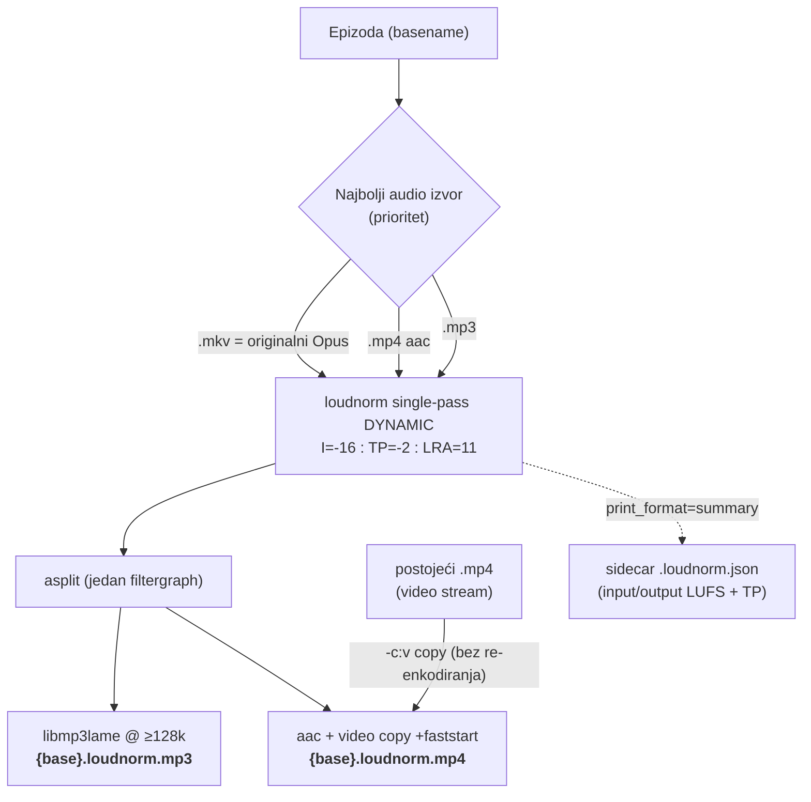
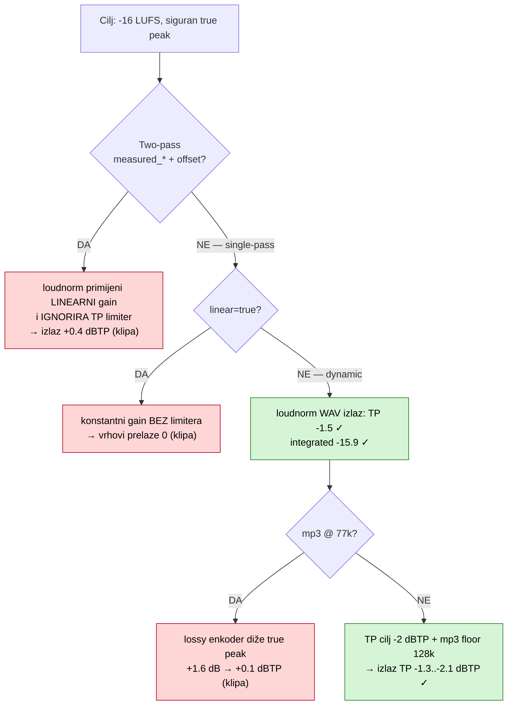
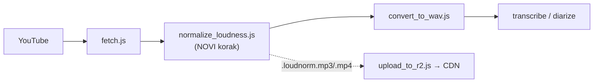

# Normalizacija glasnoće kataloga — inženjerski zapis (FAZA 2)

**Datum:** 2026-05-28
**Skripta:** `normalize_loudness.js`
**Prethodi:** [`loudness_analysis_2026-05.md`](loudness_analysis_2026-05.md) (FAZA 1 — mjerenje i nalazi)

Ovaj dokument bilježi *kako* je riješen problem nejednake glasnoće: arhitekturu rješenja i — važnije — **inženjerski put kroz tri zamke** (two-pass clipping, linearni gain bez limitera, codec true-peak inflacija) do pouzdanog, sustavno validiranog rezultata.

---

## Problem (sažetak iz FAZE 1)

Katalog od 2683 epizode bio je sustavno pretih (prava glasnoća ~-19 LUFS vs cilj -16) i golemog raspona (35 LU između najtiše i najglasnije epizode). Cilj FAZE 2: svaku epizodu dovesti na **-16 LUFS** uz siguran true peak, **bez prepisivanja originala** (nove datoteke za A/B preslušavanje).

---

## Finalna arhitektura

Po epizodi: jedan ffmpeg prolaz dekodira **najbolji audio izvor**, normalizira ga **single-pass dynamic** loudnorm-om i `asplit`-om fanout-a *isti* normalizirani audio u sve isporučne formate. Video se kopira bez re-enkodiranja.



**Zašto ovako:**
- **Najbolji izvor (mkv Opus)**, ne 16 kHz mono `.wav` (transkripcijski intermediate, band-limitiran) ni već-lossy `.mp3` — manje generacijskog gubitka.
- **Jedan prolaz + asplit**: audio se dekodira i normalizira *jednom*, pa mp3 i video dijele identičan audio. Nema dvostrukog decode/encode ciklusa.
- **Video `-c:v copy`**: video se nikad ne re-enkodira (brzo, bez gubitka); mijenja se samo audio.

---

## Inženjerski put — tri zamke

Naivno rješenje ("two-pass loudnorm s `linear=true` na mp3, TP -1.5") proizvodi **klipanje**. Do pouzdanog rezultata vode tri otkrića, svako potvrđeno mjerenjem (`ebur128=peak=true` na izlazu):



### Zamka 1 — two-pass `measured_*` ignorira TP limiter

Standardna preporuka je *two-pass* loudnorm (1. prolaz mjeri, 2. primijeni `measured_I/TP/LRA/thresh + offset`) radi točnog integrated targeta. Ali kad loudnorm-u date measured vrijednosti, on primijeni **linearni gain** i **ne aktivira true-peak limiter**. Na tihom izvoru (-33 LUFS, treba +17 dB) rezultat klipa: izmjereni izlaz **+0.4 dBTP**. → Odbačeno.

### Zamka 2 — `linear=true` nema limiter

`linear=true` je transparentan (čisti gain bez dinamike), ali **nema true-peak limiter**. Fundamentalno: ne možeš pojačati tihi sadržaj za +17 dB transparentno bez prelaska preko 0. → Default je **dinamički mod** (`linear=false`), koji ima ugrađen limiter.

### Zamka 3 — lossy codec naknadno diže true peak

Single-pass dynamic loudnorm proizvodi čist **-1.5 dBTP u losslessu (wav)**. Ali nisko-bitrate mp3 enkoder unosi ringing koji *podigne* true peak nakon limitera. Izolacijsko mjerenje na punom fajlu:

| Stadij | Integrated | True peak |
|---|---|---|
| loudnorm → **WAV** (prije enkodiranja) | -15.9 LUFS | **-1.5 dBTP** ✓ |
| WAV → **mp3 @ 77k** | -16.3 | **+0.1 dBTP** ✗ (klipa) |
| WAV → **mp3 @ 192k** | -16.2 | **-1.1 dBTP** ✓ |

Krivac je enkoder, ne loudnorm. **Fix (dva komplementarna):**
1. **TP cilj -2 dBTP** (ne -1.5/-1) — headroom za codec inflaciju (standardna praksa za lossy isporuku).
2. **mp3 bitrate floor 128k** — izvor je Opus (bolji od originalnog 77k mp3-a), pa matchanje na 77k je bilo podbacivanje; 128k smanjuje inflaciju i digne kvalitetu govora.

---

## Validacija (6 raznolikih epizoda, domovina_tv)

Finalne postavke (single-pass dynamic, TP -2, mp3 128k), nezavisno re-izmjereno `ebur128`-om na izlaznom mp3-u:

| Epizoda | Original | → Izlaz | True peak | Bitrate |
|---|---|---|---|---|
| Goran Jeras (zadruge) | -39.6 | **-17.0** | -1.9 | 128k |
| Dorian Jakov (blockchain) | -35.4 | -16.6 | -1.3 | 128k |
| Ivan Orlović (MOST) | -33.1 | -16.4 | -1.4 | 128k |
| katolička udruga (Belavić) | -23.0 | -16.6 | -2.1 | 128k |
| katolička udruga (Tomislav) | -23.0 | -16.6 | -2.1 | 128k |
| cc_01 ticketing (Rašić) | -23.0 | -17.0 | -1.3 | 128k |

Integrated konzistentno **-16.4 do -17.0 LUFS** (cilj -16, unutar ~1 LU); true peak **svuda ≤ -1.3 dBTP — nigdje ne klipa**. Raspon od ~16 LU unutar kanala sveden na <1 LU. Subjektivno (A/B preslušavanje): osnovni problem glasnoće riješen, "cvrčanje" na vrhovima (klipanje iz ranije linearne verzije) eliminirano.

> Validacija je usput potvrdila i FAZU 1: predviđene "true" vrijednosti (mjereno na 16 kHz wav + 3 LU offset) poklopile su se s full-band loudnorm mjerenjem na <0.1 LU (npr. Jeras predviđen -39.5, izmjeren -39.6).

---

## Rezultat na cijelom katalogu (2683 epizode)

Svaki `.loudnorm.json` sidecar bilježi i ulaznu (prije) i izlaznu (poslije) glasnoću koju loudnorm izmjeri tijekom obrade — pa je before/after dataset nastao kao nusprodukt same normalizacije (agregirano s `loudness_before_after.js`, bez ponovnog mjerenja).

| Metrika (integrated LUFS) | PRIJE | POSLIJE |
|---|---|---|
| median | -18.7 | **-16.2** |
| mean | -19.4 | **-16.4** |
| min … max | -39.6 … -4.6 | -22.3 … -14.3 |
| **RASPON (max-min)** | **35.0 LU** | **8.0 LU** |
| **stddev** | **5.21 LU** | **0.70 LU** |
| unutar ±1 LU od cilja | 17.9 % | **86.6 %** |
| unutar ±2 LU | 31.2 % | **97.1 %** |
| >±3 LU od cilja | 54.5 % | **0.7 %** |

True peak (poslije): max **-2.0 dBTP**, median -2.0 — **nigdje > 0**, dakle nijedna epizoda ne klipa.

```
Histogram integrated LUFS (broj epizoda po bucketu):

PRIJE  (rasuto preko ~30 LU)              POSLIJE (zbijeno oko -16)
  -30..-27.5  ████  93                      -20..-17.5  ██  154
  -27.5..-25  ██████████  192               -17.5..-15  ██████████████████████████████  2508
  -25..-22.5  ████████████████  301         -15..-12.5  ░  14
  -22.5..-20  █████████████████████  400
  -20..-17.5  █████████████████████████  485
  -17.5..-15  ██████████████████████████████  579
  -15..-12.5  ████████████████████  385
  -12.5..-10  ██████  107
   ...rep do -4.6 i -39.6
```

**Standardizacija je 7.4× tješnja** (stddev 5.21 → 0.70). 2508 od 2683 epizode (93.5 %) padaju u jedan jedini 2.5-LU bucket oko cilja, dok je prije katalog bio rasut preko ~30 LU. Preostali rep (par % izvan ±2 LU) su rubni slučajevi (npr. iznimno tihi izvori gdje single-pass nije do kraja konvergirao) — kandidati za pojedinačni pregled, ali ne kvare cjelinu.

> Napomena: brojke su loudnorm self-report (mjereno tijekom obrade). Neovisno re-mjerenje (`ebur128` nad izlazom) može odstupati ~0.3-0.5 LU zbog lossy enkodiranja, ali smjer i red veličine su isti.

---

## Finalna ffmpeg komanda (anotirano)

```bash
ffmpeg -i AUDIO.mkv -i VIDEO.mp4 \
  -filter_complex "[0:a]loudnorm=I=-16:TP=-2:LRA=11:linear=false:print_format=summary,asplit=2[am][av]" \
  -map "[am]" -ar 44100 -c:a libmp3lame -b:a 128k         OUT.loudnorm.mp3 \
  -map "[av]" -map 1:v:0 -c:v copy -c:a aac -b:a 142k \
             -movflags +faststart                          OUT.loudnorm.mp4
```

- `[0:a]` — audio iz najboljeg izvora (input 0 = mkv Opus)
- `linear=false` — dinamički mod s true-peak limiterom
- `asplit=2` — isti normalizirani audio u dva izlaza (jedan decode/normalize)
- `1:v:0` + `-c:v copy` — video iz postojećeg .mp4, kopiran bez re-enkodiranja
- `+faststart` — moov atom naprijed (streaming)

---

## Reprodukcija

```bash
# jedan kanal, oba formata, s verifikacijom
node normalize_loudness.js --channel domovina_tv --formats mp3,mp4 --verify

# cijeli katalog, samo mp3 (audio A/B), u backgroundu
node normalize_loudness.js --formats mp3 --concurrency 4

# parametri: --target -16 --tp -2 --lra 11 --audio-source auto|mkv|mp4|mp3
```

Izlaz: `{base}.loudnorm.mp3` / `.loudnorm.mp4` / `.loudnorm.json` uz original (original se ne dira → A/B). Idempotentno (preskače postojeće osim `--force`).

---

## Vizija: integracija u pipeline

Cilj je da normalizacija postane korak u `run_pipeline.sh` **odmah nakon `fetch.js`** (treba samo skinuti audio/video, ne transkripciju), pa svaka nova epizoda s YouTubea automatski dobije ujednačen zvuk. Otvorena odluka: postaje li normalizirana verzija *kanonska* isporuka (zamjenjuje i ide na R2 / CDN) ili ostaje uz original. Za sadašnju backlog/A-B fazu → uz original.


