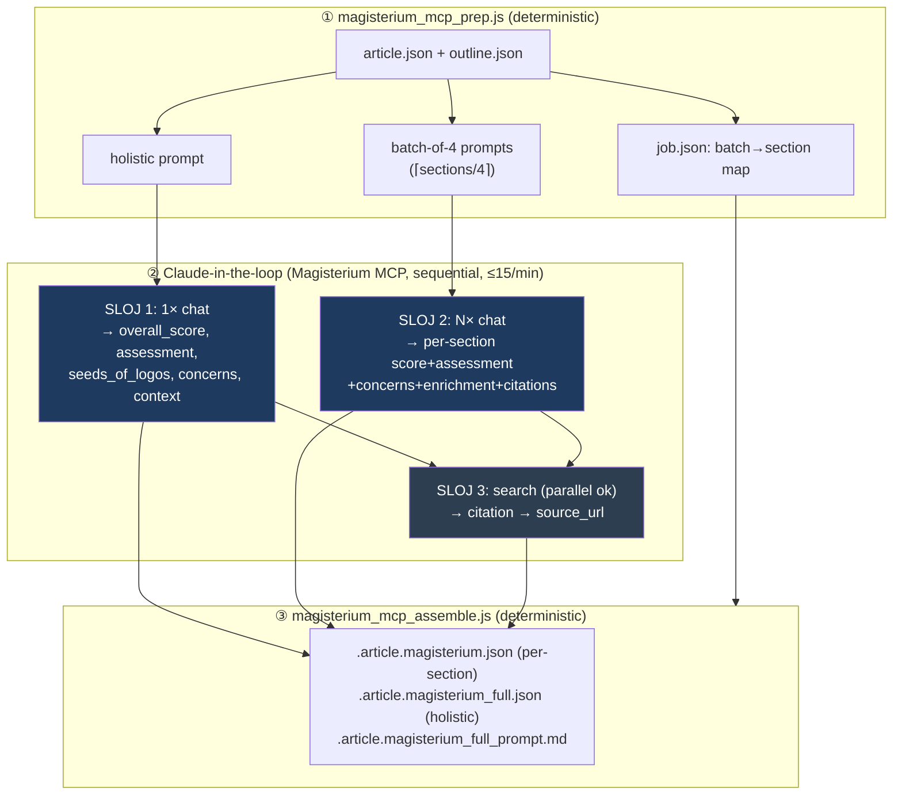
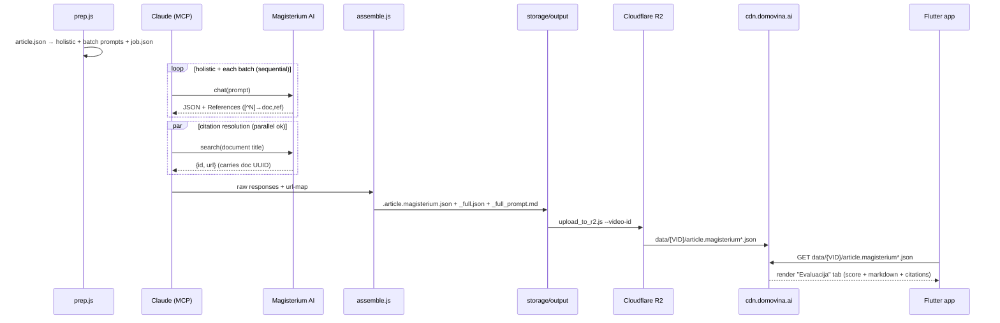

# Magisterium AI Integration — domovina.ai pipeline

> How the domovina.ai content pipeline integrates **[Magisterium AI](https://www.magisterium.com)**
> (by [Longbeard](https://longbeard.com), CEO Matthew Harvey Sanders) to add a
> citation-grounded Catholic theological evaluation to every podcast episode.
>
> This document is the public/shareable writeup. Operational runbook:
> [`magisterium_mcp_hybrid_2026-05.md`](./magisterium_mcp_hybrid_2026-05.md).

## TL;DR

Every episode in the pipeline gets a **theological alignment evaluation** scored 0–100
against the Catholic Magisterium — the Catechism, encyclicals, council documents, and
recent Vatican notes (e.g. *Antiqua et Nova*). We evaluate via **two integration modes**:

| Mode | Transport | Cost | When |
|---|---|---|---|
| **Direct API** | `magisterium.com/api/v1/chat/completions` | paid per-token | `enrich_magisterium*.js` (legacy) |
| **MCP (hybrid)** ⭐ | Magisterium MCP `chat`/`search`/`fetch` | free under Pro (15 req/min) | `magisterium_mcp_{prep,assemble}.js` + Claude-in-the-loop |

The **hybrid MCP workflow** is the current best approach: it combines a **holistic
whole-podcast pass** with **granular per-section scoring** and **citation→URL
resolution**, cutting the number of slow LLM calls ~3× versus naive per-section calls
while keeping full granularity and adding clickable Catholic sources.

---

## 1. Where it sits in the pipeline


Magisterium runs **after** article generation (it consumes `article.json` sections)
and **before** RAG, so the evaluation ships alongside the article on the CDN.

---

## 2. Implicit bilingual handling (EN → HR) — why Catholic Futurist works

The pipeline is built for **Croatian** podcasts, yet the *Catholic Futurist* channel is
**English**. It works transparently because the transcription step is not plain ASR —
**Canary 1B v2 does speech translation**. Configured with `--source-lang hr --target-lang hr`,
it renders **fluent Croatian directly from English speech**:


**Consequence:** the platform unifies multilingual sources into Croatian at the
transcription boundary. No downstream step (article, Magisterium, RAG) needs to know the
source language. *Catholic Futurist* was added specifically to validate this
EN-source → HR-output path end-to-end — and it does.

---

## 3. The hybrid: three layers

Naive options each fail one way: **per-section** MCP calls are *slow* (e.g. 26 sequential
`chat` calls), a **single whole-podcast** call lacks *granularity*. The hybrid does both:



- **SLOJ 1 — Holistic (1 call):** whole-podcast `overall_score`, narrative assessment,
  "seeds of the Logos" (positives), cross-cutting concerns, theological framing.
- **SLOJ 2 — Granular (⌈sections/4⌉ calls):** per-section score + assessment + concerns +
  enrichment + per-section citations. **Catches what the holistic pass misses** — e.g. in
  the demo, *SaintChat* (85) and *saints-debate* (80) scored lower for risk of
  anthropomorphizing AI vs. real intercession.
- **SLOJ 3 — Citation→URL (cheap):** unique cited documents resolved to clickable
  `magisterium.com` URLs via `search`. Best-effort (canonical docs resolve exactly; very
  recent/niche ones may not), so the `document`+`reference` text is always kept.

> **MCP tools are only callable inside a Claude Code chat**, not from a standalone Node
> script. So the workflow is *Claude-in-the-loop*: two deterministic scripts with Claude
> executing the MCP calls between them.

---

## 4. End-to-end data flow (delivery)



---

## 5. Output schema (CDN-delivered, Flutter-consumed)

Three artifacts per episode at `cdn.domovina.ai/data/{youtube_id}/`:

### `article.magisterium.json` — per-section (Flutter `MagisteriumData`)
```jsonc
{
  "version": "2.0-mcp-hybrid",
  "method": "mcp_hybrid",
  "overall_score": 96,            // root = mean of section scores (apples-to-apples
                                  //         with legacy files for channel-index aggregation)
  "score_interpretation": "Aktivno promiče katolički nauk",
  "overall": {                    // NEW holistic block (additive)
    "holistic_score": 96,
    "assessment": "…",
    "seeds_of_logos": ["…"],
    "concerns": ["…"],
    "theological_context": "…",
    "citations": [ /* see below */ ]
  },
  "score_breakdown": [ { "iteration": 1, "theme": "…", "score": 98 } ],
  "total_concerns": 8,
  "iterations": [ {
    "iteration_number": 1, "theme": "…", "iteration_score": 98,
    "sections": [ {
      "subtitle": "…", "screenshot_timestamp": "…",
      "magisterium": {
        "score": 100, "assessment": "…", "concerns": ["…"], "enrichment": "…",
        "citations": [ {
          "cited_text": "", "document_title": "Fratelli Tutti",
          "document_author": "Pope Francis", "document_year": "",
          "document_reference": "132",
          "source_url": "https://www.magisterium.com/docs/{uuid}/ref/132"
        } ]
      }
    } ]
  } ]
}
```

### `article.magisterium_full.json` — holistic (Flutter `MagisteriumFullData`)
Renders as the primary **"Evaluacija"** tab: `overall_score` badge + `evaluation`
(markdown = holistic assessment + seeds + concerns + theological context + per-section
breakdown) + `citations` (merged unique, with `source_url`).

### `article.magisterium_full_prompt.md`
The exact holistic + batch prompts, for transparency (renders as a **"Prompt"** tab).

### `article.magisterium.en.json` — English overlay (bilingual)
Produced by `translate_to_english.js` (Vertex Gemini, temp 0, no-hallucinations). It is a
full mirror of the per-section file with additive `_en` fields — `assessment_en`,
`enrichment_en`, `concerns_en`, `theme_en`, `subtitle_en`, `score_interpretation_en`, etc.
Citations are **not** translated (already English). Flutter loads it as an overlay and
swaps to `_en` fields in English mode. This is the production bilingual pattern (see
`fO7iltytw0I`): a single Croatian transcription/analysis, presented in HR or EN from one
data set. **The pipeline handles EN-source podcasts (Canary EN→HR translation, §2) and
EN-presentation (this overlay) on the same Croatian backbone.**

> **UI / full-file note:** when `magisterium_full.json` is present, `magisterium_panel.dart`
> shows the "Evaluacija" tab and treats per-section variants as fallback — and the v1 full
> model has no `_en` overlay. So the **bilingual standard ships per-section `.json` +
> `.en.json` and NOT a full file** (`MAGISTERIUM_MCP_RUN.md` enforces this). `--out-full`
> remains available only for HR-only ad-hoc previews.

---

## 6. The MCP tool catalog (empirical)

| Tool | Returns | Speed | Notes |
|---|---|---|---|
| `chat` | requested JSON **+ always** a markdown analysis + `References` (`[^N]→doc,paragraph`) | **slow** (bottleneck) | **sequential-only** — 3 parallel → 1 ok + 2 errors |
| `search` | `[{id, url, title}]`; URL carries the **document UUID** | instant | **parallel-safe**; one search harvests many doc UUIDs |
| `fetch` | full document text + `metadata.ref` | instant | resolve a citation to its source text |
| `get_saint` / `get_pope` / `get_person` / `get_diocese` / `get_diocese_statistics` / `get_martyrology` / `get_mass_readings` | structured lookups | fast | optional entity enrichment |

### Operational findings (2026-05-29)
- **`chat` timeout is stochastic** and scales with *generation depth per section*, not
  section count: batch-of-8 one-liners passed; batch-of-6 of real content timed out;
  batch-of-4 of real content sometimes timed out; **batch-of-4 of compressed content
  (~30 words/section) is reliable.** ⟹ **the lever against timeouts is shorter
  per-section content, not a smaller batch.** Retry with shorter content before splitting.
- **`search` is parallel-safe** (unlike `chat`) and returns the document UUID, enabling
  exact `…/docs/{uuid}/ref/{reference}` URLs. Citation→URL coverage in the demo: 43/50.
- **Rate limit 15 req/min** is shared; the hybrid uses **8 slow `chat`** calls for a
  26-section podcast (vs 26 per-section) + a handful of fast `search` calls.

---

## 7. Case study — "Building Magisterium AI" (Catholic Futurist)

A deliberate meta-demo: the episode where **Matthew Sanders** explains *building
Magisterium AI* is evaluated **by Magisterium AI itself**.

- **YouTube:** `KtMMSnQ7SP0` · 2 iterations · 26 sections · English audio → Croatian.
- **overall_score 96** ("Aktivno promiče katolički nauk"); 8 calls; 50 citations
  (43 with resolved `source_url`).
- **Granularity in action:** *SaintChat* **85**, *saints-debate* **80** — flagged for
  risk of anthropomorphization / anachronistic conclusions; the *Reiki* section **100**
  for correctly surfacing the USCCB *Guidelines for Evaluating Reiki*.
- **Sources cited:** *Antiqua et Nova*, *Fides et Ratio*, *Fratelli Tutti*,
  *Magnifica Humanitas* (Leo XIV), *Veritatis gaudium*, USCCB *AI Principles*, CELAM
  *La Inteligencia Artificial*, the Catechism.

Live: `https://cdn.domovina.ai/data/KtMMSnQ7SP0/article.magisterium.json`

---

## 8. Files

| File | Role |
|---|---|
| `magisterium_mcp_prep.js` | article+outline → holistic + batch prompts + `job.json` |
| `magisterium_mcp_assemble.js` | raw MCP responses (+url-map) → the 3 CDN artifacts |
| `docs/magisterium_mcp_hybrid_2026-05.md` | operational runbook (SSOT) |
| `enrich_magisterium*.js` | legacy direct-API variants (per-section / batch / full) — **paid**, not used |
