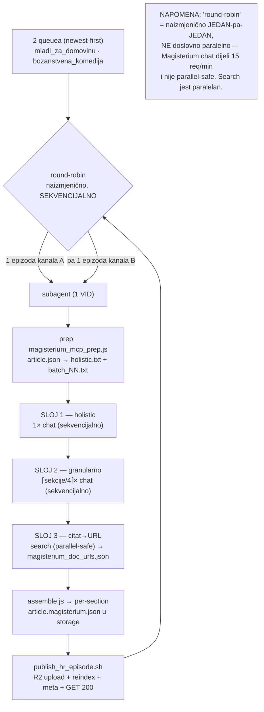
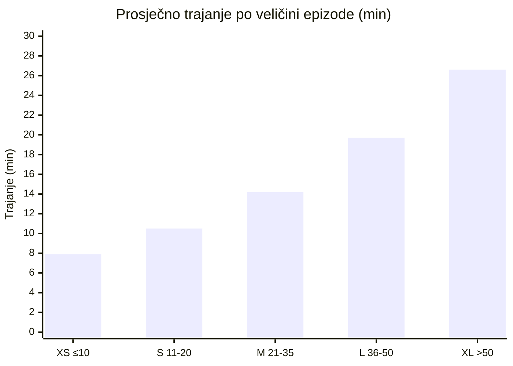
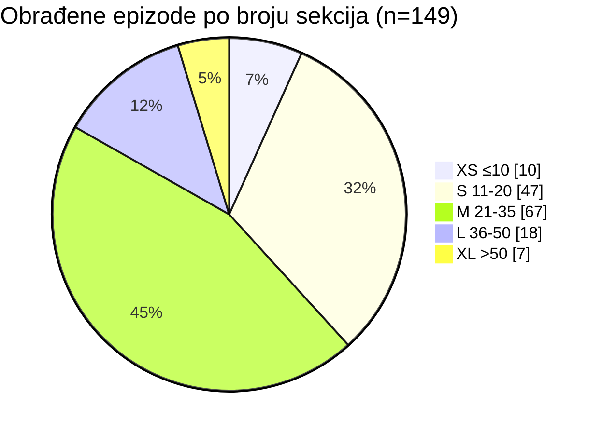

# Magisterium MCP — analiza trajanja bulk backfilla (2026-06-15 → 2026-06-17)

> **SSOT za stvarne metrike** najvećeg Magisterium MCP batcha do sada: **149 epizoda** kroz
> hibridni HR-only workflow (`mladi_za_domovinu` 121 + `bozanstvena_komedija` 27 + 1 prioritetna
> `hitna_pomoc_za_nemirne`). Svi podaci su **izmjereni** (trajanje svakog subagenta + broj
> ocijenjenih sekcija + `overall_score`), ne procijenjeni. Komplementarno s izvršnim runbookom
> [`MAGISTERIUM_MCP_RUN.md`](./MAGISTERIUM_MCP_RUN.md) i master pipelineom
> [`PIPELINE_FULL.md`](./PIPELINE_FULL.md). Hibridni dizajn: [`magisterium_mcp_hybrid_2026-05.md`](./magisterium_mcp_hybrid_2026-05.md).

## TL;DR

- **Prosjek po epizodi: 13m50s** (median **12m42s**); raspon **5m50s → 33m58s**.
- **Trajanje je linearno s brojem sekcija** (Pearson **r = 0.901**): `trajanje ≈ 354s + 18.5s × broj_sekcija`.
  Tj. ~**6 min fiksnog overheada** (prep + holistic + assemble + publish + CDN verify) + **~18.5 s po sekciji** granularne evaluacije.
- **Throughput: ~34 s po sekciji** (median 33.9). Broj sekcija ≈ broj `chat` poziva (`⌈sekcije/4⌉` batcheva + 1 holistic), a `chat` je sekvencijalan (15 req/min) → to je kritični put.
- **Kumulativno aktivno subagent-procesiranje: ~34.4 h** za 149 epizoda + **~21 min** izgubljeno na 4 tranzijentna fail/blocker subagenta.
- **Kvaliteta dosljedna:** prosječni `overall_score` **90.1** (median 92), oba kanala gotovo identična (mladi 90.0 / bozanstvena 90.4).
- **Skala potvrđena:** subagent-po-epizodi obrazac [[magisterium_backfill_subagent_pattern]] održiv preko 149 epizoda u jednoj sesiji, uz round-robin dva kanala.

## Arhitektura izvršavanja (round-robin + per-epizoda)

**Kritični put = SLOJ 2** (`chat` pozivi, sekvencijalni). Search je paralelan i ne dominira; prep/assemble/publish su sekunde.

## Trajanje vs veličina epizode (broj sekcija)

Trajanje raste gotovo linearno s brojem sekcija — veće epizode = više `chat` batcheva.

| Bucket (sekcije) | Epizoda | Prosj. trajanje |
|---|---|---|
| XS (≤10) | 10 | 7m52s |
| S (11–20) | 47 | 10m29s |
| M (21–35) | 67 | 14m09s |
| L (36–50) | 18 | 19m42s |
| XL (>50) | 7 | 26m38s |

Najveće epizode: `dNY5MVIh2jE` (96 sekcija, 33m58s), `JNxtmshvV54` (90, 29m04s), `4GI-a62FYyY` bozanstvena (71, 30m47s), `OEb4EwVl7JY` bozanstvena (59, 22m46s), `oM0SZAst29U` (55, 22m20s).

## Distribucija obrađenih epizoda

Većina kataloga su srednje epizode (11–35 sekcija = 76% obrađenih).

## Usporedba kanala

| Metrika | mladi_za_domovinu | bozanstvena_komedija | SVE |
|---|---|---|---|
| Obrađeno epizoda | 121 | 27 | 149* |
| Σ ocijenjenih sekcija | 3049 | 773 | 3832 |
| Prosj. trajanje/ep | 13m48s | 14m04s | 13m50s |
| Median trajanje/ep | 12m42s | 13m16s | 12m42s |
| Min / Max | 5m50s / 33m58s | 6m40s / 30m47s | 5m50s / 33m58s |
| Prosj. sekcija/ep | 25.2 | 28.6 | 25.7 |
| s po sekciji (median) | 34.1 | 32.6 | 33.9 |
| Prosj. `overall_score` | 90.0 | 90.4 | 90.1 |

\* uključuje 1 prioritetnu epizodu (`hitna_pomoc_za_nemirne/6e1MW97dv10`, 10 sekcija, score 94, 9m50s).

**Zaključak:** dva kanala vrlo različitog sadržaja (politički/aktivistički podcast vs satirična "Božanstvena komedija") daju **gotovo identičan profil trajanja i kvalitete** — trajanje ovisi isključivo o veličini epizode, ne o temi.

## Totali sesije

- **Uspješno objavljenih epizoda: 149** (sve CDN GET 200).
- **Ukupno ocijenjeno sekcija: 3832.**
- **Kumulativno aktivno subagent-procesiranje: ~34.4 h.**
  > Stvarni elapsed wall-clock je dulji jer su subagenti sekvencijalni, s međuprazninama za orkestraciju (checkpointi memorije, recompute queuea) i idle između korisničkih provjera. 34.4 h je zbroj efektivnog rada.
- **Cijena pouzdanosti:** 4 tranzijentna incidenta (3× Claude API "Overloaded/500", 1× nova neobrađena epizoda kao blocker) = ~21 min izgubljeno; svi riješeni ponovnim pokretanjem (idempotentno).
- **Prosječni `overall_score`: 90.1.**
- **Keš `magisterium_doc_urls.json` narastao** ~300 → ~830+ doc-UUID-a tijekom sesije (svaka epizoda jeftinija od prethodne za citat-URL razrješavanje).

## Failure-profil na skali (naučeno) 

Empirijski, na ~150 subagenata:

| Klasa | Učestalost | Rješenje (već u runbooku/obrascu) |
|---|---|---|
| `chat` timeout | često (mnoge L/XL epizode) | retry s **kraćim sadržajem**; pa split batcha na 2 |
| `chat` empty-JSON (samo References) | povremeno | isti retry s kraćim sadržajem |
| `chat` refuse na političke teme | rijetko | reframe kroz prizmu socijalnog nauka Crkve |
| Claude API "Overloaded"/500 (subagent umre) | 3× / 150 | ponovno pokreni isti VID (prep idempotentan) |
| citat NIJE u Magisterium korpusu | vrlo često (akademski/časopisni radovi, stari AAS) | ostavi bez `source_url` — **NE izmišljaj UUID**; neblokirajuće |
| nova epizoda bez `.article.json` | 1× (`AHAoSdr3IRU`) | blocker — treba uzvodni pipeline (Canary→pyannote→summary→article) prije Magisteriuma |

Ključno pravilo koje je držalo kvalitetu: **nikad ručno ne diraj `score`/`overall_score` ni ne fabriciraj citat-UUID**; ako raw odgovor nije valjan JSON → ponovi `chat`.

## Praktične implikacije za planiranje

- **ETA za novi kanal** = `broj_epizoda × 14 min` (median), korigirano naviše ako kanal ima dugačke epizode (provjeri distribuciju sekcija prije procjene).
- **Cost driver je broj sekcija, ne broj epizoda** — kanal s 30 kratkih epizoda je brži od 15 dugih.
- **Round-robin dvaju kanala** ne ubrzava (sekvencijalno zbog dijeljenog `chat` limita) ali daje ravnomjeran napredak na oba — korisno kad su oba prioritet.
- **Subagent-po-epizodi** ostaje obavezan iznad ~15 epizoda (čuva kontekst glavne sesije; svaki subagent vrati samo sažetak).

---

## Stanje obrade na trenutku prekida (2026-06-17)

Processing **namjerno prekinut** na zahtjev korisnika (dovoljno podataka za analizu). Preostalo za dovršetak (recompute je SSOT):

**mladi_za_domovinu — 124/129, preostalo 5:**
`AQDg3kcZgro lQAnbBAs9ls EYFjcDSiwUE bL4l4df_UTI _bYNrUFjW84`

**bozanstvena_komedija — 27/34 ready, preostalo 7 ready + 1 not-ready:**
`qT7BWA2XwC4 b-abdSpsgmE 6pTOfuRkzJQ cTYzLV8O9iU DupCwGp_VrI XzbXb69cz58 3ZLpCri7rKc`
(+ `AHAoSdr3IRU` = nova epizoda, NIJE Magisterium-ready — treba uzvodni pipeline prvo; isključena iz backfilla)

**Nastavak:** recompute oba queuea, pa subagent-po-epizodi (newest-first), helper `CH=<kanal> bash publish_hr_episode.sh <VID>` (za `_bYNrUFjW84` underscore je OK; za eventualne leading-dash VID-ove koristi `-- <VID>`). Detalji u memorijama `mladi_za_domovinu_hr_backfill_state` i `bozanstvena_komedija_hr_backfill_state`.
