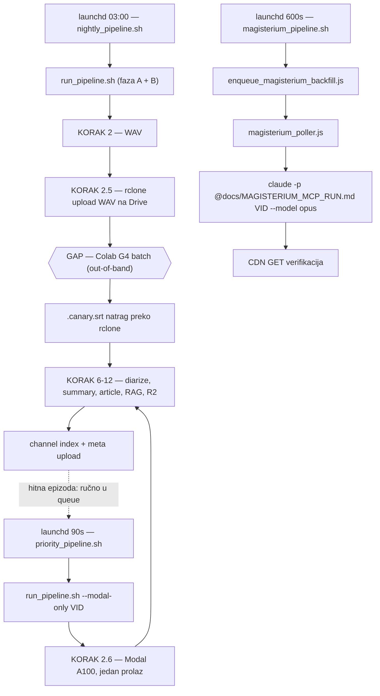

# Nightly u jednom prolasku (Modal transkripcija + Magisterium MCP) — istraživanje

**Status:** ISTRAŽIVANJE, **ništa nije implementirano**. Odluka: **nightly ostaje kakav jest**.
**Datum:** 2026-07-25.
**Povezano:** `docs/transcription_colab_vs_modal_cost_2026-07.md` (SSOT za trošak),
`docs/claude_code_backend_2026-07.md`, `docs/MAGISTERIUM_MCP_RUN.md`, `modal_canary/README.md`,
`automatic/nightly_pipeline.sh`, `automatic/magisterium_pipeline.sh`.

## Pitanje

Može li nightly u **jednom prolasku** odraditi i transkripciju (preko Modala, umjesto Colab
round-tripa) i Magisterium MCP na hrvatskom — jer pri malom broju novih epizoda latencija
Colab round-tripa (upload WAV na Drive → ručno pokreni notebook → rclone sync natrag) više
ne izgleda isplativo?

## Odluka (2026-07-25)

**Nightly ostaje nepromijenjen.** Colab G4 batch ostaje transkripcijski put za sve što
nightly pokupi, jer je **batch transkripcija i dalje najisplativija** (~$0.003/ep na skali).

Umjesto prepravljanja nightlyja, put za hitne epizode je: **nakon nightlyja dodaj konkretnu
epizodu u `pipeline.domovina.ai`** → prioritetni fast-path je odradi Modalom u jednom prolazu
(`priority_pipeline.sh`, ~10-15 min do članka). Ne mora sve što nightly pokupi ići istim putem.

Ovaj dokument čuva nalaze istraživanja jer su neovisno korisni (dva su ispravci pogrešnih
pretpostavki), i skicira plan da se ne mora ponovno istraživati ako se odluka ikad promijeni.

---

## Nalaz 1 — Magisterium MCP **već radi headless iz launchd-a** (pretpostavka opovrgnuta)

Polazna pretpostavka je bila da "launchd bash skripta ne može zvati MCP" i da interaktivno
autenticirani claude.ai konektori znaju biti nedostupni u headless/cron kontekstu. **Netočno
za ovaj setup** — mehanizam postoji i vrti se u produkciji od sredine srpnja:

```
launchd tv.domovina.fetch.magisterium (StartInterval 600s)
  → automatic/magisterium_pipeline.sh
      → automatic/enqueue_magisterium_backfill.js   (auto-enqueue novih epizoda)
      → ../pipeline.domovina.ai/bridge/magisterium_poller.js
          → claude -p "@docs/MAGISTERIUM_MCP_RUN.md <VID>" --model opus
                     --permission-mode bypassPermissions
          → verifikacija: CDN GET data/<VID>/article.magisterium.json
```

**Dokaz iz produkcijskih logova** (`automatic/logs/magisterium_2026-07-*.log`, brojano
`"live na CDN-u → done"`): **28 uspješnih runova u srpnju** — 14 (07-14), 7 (07-16), 1 (07-18),
1 (07-19), 4 (07-20), 1 (07-24). Svaki verificiran CDN GET-om, dakle stvarno je proizveo
Magisterium artefakt kroz MCP (`chat` + `search`), ne fallback.

Pouzdanost je u tome što je **CDN artefakt izvor istine**, a ne exit kod Claude CLI-ja.

## Nalaz 2 — MCP konektor se spaja **asinkrono**: startup race kod kratkih poziva

Živi test (2026-07-25, ovaj repo kao cwd):

| Test | Rezultat |
|---|---|
| `claude -p "<pozovi Magisterium search>" --model haiku` (jednokratno, odmah) | ❌ `MCP_NEDOSTUPAN` — *"MCP server je još u fazi konekcije"* |
| isto, uz `sleep 20` + retry do 4× (`--model sonnet`) | ✅ vratio rezultat |

**Zaključak:** claude.ai konektori se spajaju u pozadini nakon starta procesa. Prompt koji
MCP alat traži **odmah** može proći prije nego je konektor spreman i dobiti "nedostupno".
Dugi agentski runovi (kao Magisterium runbook, ~14 min, koji prve minute radi `find`/bash)
to prirodno prežive — zato produkcija radi bez ovog problema.

**Praktično pravilo:** ne graditi ništa na **kratkom, jednokratnom** MCP pozivu bez retryja.
Ako baš treba, ugradi sleep+retry (do ~4 pokušaja).

## Nalaz 3 — `--tools ''` **gasi MCP**; ne prenositi ga s Gemini-backend puta

`docs/claude_code_backend_2026-07.md` propisuje `--tools ''` kao **najvažniji** flag za
`--gemini-backend claude` (overhead 21 000 → 233 tokena po pozivu). To vrijedi **samo** za taj
put, gdje se traži čisti tekstualni LLM poziv bez alata.

Za Magisterium je **suprotno**: `--tools ''` ukloni i MCP alate → runbook nema čime raditi.
`magisterium_poller.js` ga s pravom ne koristi. Dva puta imaju suprotne zahtjeve — ne
generalizirati flagove s jednog na drugi.

## Nalaz 4 — ⚠️ D1 transcribe claim **NE pokriva videe praćenih kanala**

Ovo je najvažniji nalaz za bilo kakvo širenje Modala izvan `_unlisted`.

`pipeline.domovina.ai/backend/src/transcription/api.ts`:

```
// Claim: {claimed:true} → transkribiraj, {claimed:false} → drugi backend drži.
// {tracked:false} → video nije u queueu (glavni korpus) → uvijek claimed (nema gejta).
```

`GET /api/transcription/claims` vraća claimove samo za queue jobove (state
`transcribing`/`processing`). Dakle:

| Scenarij | Zaštićen od duple transkripcije? |
|---|---|
| `_unlisted` ad-hoc job (u queueu) | ✅ D1 claim + rclone filter |
| Video praćenog kanala (nije u queueu) | ❌ **D1 claim ne radi ništa** |

Za kanalske videe **jedina** zaštita bio bi rclone exclude filter u KORAKU 2.5
(`run_pipeline.sh:513-521`), koji trenutno izuzima samo `_unlisted/**`. Uz to, **KORAK 2.5
(Drive upload) izvršava se PRIJE KORAKA 2.6 (Modal)** — u trenutku uploada još se ne zna
koje će fajlove Modal uzeti. Bez prepravke bi Colab batch kasnije ponovno transkribirao
iste WAV-ove (dupli GPU trošak + prepisivanje `.canary.srt`).

## Nalaz 5 — Volumen: premisa točna za dnevni priljev, ali stoji jednokratni backlog

Stanje 2026-07-25, WAV-ovi bez `.canary.srt`:

| | Broj |
|---|---|
| **Ukupno pending** | **116** |
| od toga jednokratni backlog 16.07. | 83 (`mladifest_hrvatska` 62, `slijedi_svoj_poziv_1/2` 14, `na_kavi_sa_svetim_ignacijem` 5, ostalo) |
| od toga backlog 10.07. | 11 (`launched`) |
| **Stvarni dnevni priljev** | **≈1,3 ep/noć** (07-17: 1, 07-19: 4, 07-21: 1, 07-22: 3, 07-24: 1) |

**Zamka za dizajn praga:** gate tipa "ako je pending < N → Modal" **nikad se ne bi upalio**
dok stoji backlog od 116. Prag bi morao gledati **svježe** WAV-ove (mtime prozor), ne ukupni
pending.

**Ekonomika i dalje drži** (iz SSOT-a `transcription_colab_vs_modal_cost_2026-07.md`, §4-5):
Colab je jeftiniji po epizodi praktički od prve (nema "break-even nakon N"); Modalov free
tier (~$30/mj ≈ ~500 ep) ad-hoc čini efektivno $0; ispod ~20 nakupljenih epizoda razlika je
u centima pa je **odluka operativna (latencija), ne financijska**. Pri ≈1,3 ep/noć nightly
je nominalno u "Modal zoni" po latenciji — ali batch ostaje najjeftiniji, što je i bila
osnova odluke da nightly ostane na Colabu.

## Nalaz 6 — Magisterium pokrivenost je uska (config, ne mehanizam)

`automatic/full_backfill_channels.txt` sadrži **3 kanala** (`mladi_za_domovinu`,
`iva_kraljevic`, `eho_projekt`) od **57** u `storage/output/`. Nove epizode svih ostalih
kanala se **nikad ne enqueueaju automatski**. Uz baseline semantiku (samo epizode koje se
pojave NAKON uvrštenja kanala), to znači da je "nightly sam završi posao" za Magisterium
danas ograničen configom, a ne tehnologijom.

Trajanje nightlyja (07-18 → 07-24): 34 min do 3 h 07 min. Magisterium tick uzima pipeline
lock `nowait` pa **preskače dok nightly drži lock** — Magisterium efektivno kreće nakon
što nightly završi. To je namjerno i ispravno.

---

## Arhitektura kakva jest (nepromijenjena)



Dijeljeni mutex (`automatic/pipeline_lock.sh`, `mkdir` kao atomični test-and-set jer macOS
nema `flock`): nightly uzima `wait`, priority i Magisterium uzimaju `nowait` i ustupaju.

---

## Plan koji NIJE izveden (skica, ako se odluka ikad promijeni)

### Modal za praćene kanale

1. Izdvojiti scan pending WAV-ova u funkciju i pozvati je **prije** KORAKA 2.5; ta lista
   postaje jedini izvor istine i za rclone exclude i za Modal petlju (uklanja race iz Nalaza 4).
2. KORAK 2.5: graditi `RCLONE_MODAL_FILTER` iz te liste (`--filter "- *_yt_<id>*"` po videu)
   umjesto paušalnog `- _unlisted/**`. **Jedina stvarna zaštita za kanalske videe.**
3. KORAK 2.6: novi flag `--modal-scope channels|unlisted|all` (default `unlisted` = današnje
   ponašanje, nula regresije) + `MODAL_FRESH_DAYS` (default 2). **Ne** koristiti
   `MODAL_TRANSCRIBE_DIR=storage/output` — rekurzivni scan pokupi svih 116 → udari u
   `MODAL_MAX_FILES` → ABORT (all-or-nothing, ne obradi podskup).
4. Soft-skip umjesto ABORT-a kad svježih > cap (pusti Colab put) — današnji ABORT je pretvrd
   za unattended kontekst.
5. `nightly_pipeline.sh`: dodati `--with-modal-transcribe --modal-scope channels`.

Colab put ostaje netaknut: sve što Modal ne uzme i dalje ide na Drive u 2.5.

### Magisterium

6. Proširiti `automatic/full_backfill_channels.txt` (config, ne kod).
7. Opcionalno: pozvati `enqueue_magisterium_backfill.js` na kraju nightlyja, da enqueue bude
   odmah po objavi umjesto do 10 min kasnije. Ne zove MCP → ne dira lock semantiku.

**NE** inlineati Magisterium u `nightly_pipeline.sh`: queue+tick je bolji (nightly ne blokira
~14 min/epizodu, failovi imaju grace-retry i `MAX_FAILED`, lock disciplina ostaje).

### Rizici tog plana

| Rizik | Ozbiljnost | Mitigacija |
|---|---|---|
| Dupla transkripcija (Modal + Colab) na kanalskim videima — D1 claim ih ne pokriva | **Visok** | Filter iz iste liste u 2.5; dry-run verifikacija |
| Prag na ukupnom pendingu → Modal se nikad ne upali | Visok | mtime gate (`MODAL_FRESH_DAYS`) |
| Burst epizoda probije Modal cap noću | Srednji | Soft-skip na Colab umjesto ABORT-a |
| MCP startup race kod kratkih poziva | Nizak | Ne uvoditi kratke MCP pozive bez retryja |
| Širenje na 57 kanala → burst Magisterium jobova | Srednji | `MAGBF_MAX_ENQUEUE` (25) postoji; drenaža ~4 ep/h uz `MAG_MAX=1` |

Ograničenja koja vrijede u svakoj varijanti: **ne** dodavati `--with-vertex-import` u nightly,
zadržati lockfile mehanizam (`.nightly.lock` + `.pipeline.lock.d`), koraci 7+8 ostaju na
Vertex/gemini defaultu (Opus samo na eksplicitni zahtjev), Magisterium ostaje **MCP-only**
(`enrich_magisterium*.js` i `--with-magisterium` se ne diraju).
