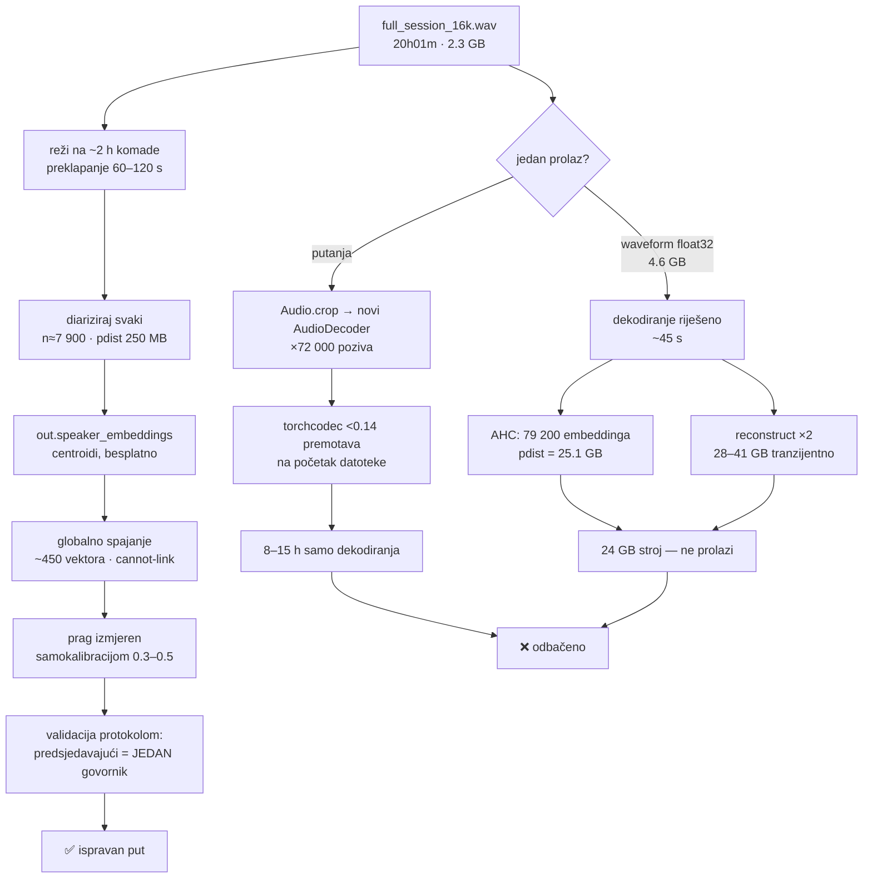

# Memorija i propusnost pipelinea — mjerenja i prijedlozi (2026-08-25)

Nastalo tijekom pilota saborskih sjednica (`sabor_pipeline/`), ali nalazi vrijede za
cijeli pipeline. Sve brojke su mjerene na ovom stroju (Mac Mini M4 Pro, 24 GB unified,
sistemski disk ~20 GB slobodno, swap 6 GB), ne procijenjene.

---

## 1. Što je izmjereno

### 1.1 Canary VRAM ne ovisi o duljini snimke

`torch.cuda.max_memory_allocated()` na Modalu (A100, BF16), raspon duljine **10×**:

| Snimka | Trajanje | WAV | Peak VRAM | Inference |
|---|---|---|---|---|
| part_04 | 1 h 56 m | 223 MB | 16.48 GB | 39 s |
| part_01 | 5 h 44 m | 662 MB | 16.48 GB | 101 s |
| part_02 | 6 h 08 m | 708 MB | 16.48 GB | 89 s |
| part_03 | 6 h 11 m | 714 MB | 16.48 GB | 86 s |
| full_session | **20 h 01 m** | 2199 MB | **16.48 GB** | 371 s |

Identično do druge decimale → NeMo `transcribe()` interno chunka. **Duljina snimke nije
razlog za chunking.** Vrijeme skalira ~linearno.

Ranija tvrdnja „~26 GB peak na dugim fajlovima" nije kontradikcija nego druga metrika:
`nvidia-smi` *reserved* za cijeli proces vs `max_memory_allocated` samo za tenzore.

### 1.2 Modalov klijent puca na velikom argumentu, poslužitelj ne

`Canary().transcribe.remote(wav_bytes)` s 2.3 GB WAV-om:

| | |
|---|---|
| lokalni `open().read()` istog fajla | 2.3 GB RSS, 2.6 s — bezopasno |
| ista datoteka kroz `transcribe.remote()` | **34 GB peak footprint** → macOS ubije proces |
| simptom | tiho, bez tracebacka, `EXITCODE=1` nakon ~65 s |

Serijalizacija bytes-argumenta ima ~15× memorijski overhead. **Nije Modalov dokumentirani
limit** (takav za argumente ne postoji) nego memorija klijenta. Rješenje je
`modal_canary/canary_modal.py::from_volume`. Volume limiti (docs 2026-08): v1 tvrdi limit
500 000 inodeova, v2 max 1 TiB po datoteci; ukupna veličina neograničena, naplaćuje se
zauzeće → brisati WAV nakon obrade.

**Prag**: bytes-argument do ~500 MB je dokazano OK (714 MB dijelovi prošli); iznad ~1 GB
ide preko volumea.

### 1.3 Diarizacija: `sf.read` je bio 3× skuplji nego što treba

```python
data, sr = sf.read(wav)                     # float64!
waveform = torch.from_numpy(data).float()   # + float32 kopija
```

`sf.read` bez `dtype` vraća **float64**, pa `.float()` radi drugu kopiju. Obje žive
istovremeno jer `del` dolazi tek nakon poziva pipelinea:

| Trajanje | s float64 (prije) | s float32 (sada) |
|---|---|---|
| 3 h podcast | ~2.0 GB | ~0.7 GB |
| 20 h sjednica | ~13.8 GB | ~4.6 GB |

Popravljeno u `diarize.py` i `colab_diarize/diarize_canary.py` (commit `2f6a8b6`).

### 1.4 Putanja umjesto waveforma: memorija postaje ravna

`sabor_pipeline/02_diarize.py` daje pyannoteu **putanju**, pa čita prozore lijeno:

| | RSS |
|---|---|
| kroz cijeli prolaz (1 h 56 m) | **ravno 0.7 GB** |
| peak (učitavanje modela + završno klasteriranje) | 2.02 GB |
| sistemski disk kroz run | nepomičan (19.8 → 19.9 GB) |

Brzina: **4.85 min po satu zvuka** (~12× realtime) — 863 segmenata i 28 govornika za
9.4 min na 1 h 56 m.

### 1.5 Zašto je ovo uopće opasno

Kad alokacija prelije RAM, macOS raste swap **na sistemskom disku**. Kad se on napuni,
ruše se nevezani procesi — Docker daemon zna ostati u stanju iz kojeg se diže samo
restartom stroja. Stroj kreće već napola u swapu (5 od 6 GB zauzeto pri mirovanju), pa
je rezerva manja nego što se čini.

---

## 2. Prijedlozi

Poredani po omjeru dobitka i rizika.

### P1 — Validirati putanju u `diarize.py` (najveći dobitak)

**Problem**: nightly i dalje učitava cijelu snimku u RAM.
**Zapreka**: komentar u kodu kaže da je waveform svjestan workaround „zaobilazi
AudioDecoder". Zato NIJE promijenjeno naslijepo.
**Dokaz da je možda zastarjelo**: putanja je 2026-08-25 dokazano radila na pyannote
4.0.4 s community-1 modelom (§1.4).
**Izmjena**: `pipeline(str(wav_path), **params)` umjesto waveform dicta, iza flaga, uz
A/B na 3-4 nightly epizode.
**Rizik**: srednji — drugi model (3.1 u `diarize.py`) i drugi kod-put.
**Dobitak**: nightly gubi cijelo učitavanje snimke; memorija postaje neovisna o duljini.

### P2 — Indikator napretka za duge diarizacije

**Problem**: pyannote ne javlja napredak. Na 20-satnoj snimci se 34 minute ne može
razlikovati „radi normalno" od „zaglavilo". Projekcija trajanja je linearna
ekstrapolacija, a završno klasteriranje ne skalira linearno.
**Izmjena**: `from pyannote.audio.pipelines.utils.hook import ProgressHook` i
`pipeline(..., hook=hook)`; nadzornik u `02_diarize.py` da uz RSS ispisuje i poziciju.
**Rizik**: nizak.
**Dobitak**: stvaran ETA umjesto ekstrapolacije; jasna razlika između sporog i zaglavljenog.

### P3 — Nadzornik stroja u nightly putu

**Problem**: nightly diarizira u 03:00 bez nadzora. To je najskuplji trenutak za scenarij
iz §1.5 — otkrije se ujutro, uz restart.
**Izmjena**: prenijeti child-proces + pragove iz `02_diarize.py` u nightly diarizacijski
korak (disk na `/`, RSS djeteta).
**Rizik**: nizak — obrana samo ubija posao, ne mijenja rezultat.
**Dobitak**: najgori ishod postaje „epizoda nije diarizirana" umjesto „stroj traži restart".

### P4 — Auto-ruta na Modal volume iznad praga

**Problem**: automatski put (`run_pipeline.sh`, priority poller) zna samo za
bytes-argument. Na velikoj datoteci bi umro tiho, bez tracebacka (§1.2).
**Izmjena**: iznad ~1 GB automatski `volume put` + `from_volume`, pa brisanje s volumea.
**Rizik**: nizak.
**Dobitak**: dugačke snimke prolaze automatski; nema tihe klase kvarova.

### P5 — Ispitati bazni pritisak na swap ✅ ODGOVORENO (2026-08-25)

**Problem**: 5 od 6 GB swapa zauzeto dok RAM nije pun. Svaki gornji problem je manji kad
stroj ne kreće već napola u swapu.
**Nalaz**: vidi §4 — swap drži Docker Desktopov VM, i to zbog fiksne rezervacije, ne curenja.
**Rizik**: nema.
**Dobitak**: veća rezerva za sve ostalo.

---

## 3. Otvoreno pitanje

**Je li čitanje s putanje sporije od waveforma u memoriji?** Head-to-head mjerenje NIJE
napravljeno. Mehanizam sugerira da je razlika mala: pyannote ionako radi po prozorima, a
čitanje ~320 KB po prozoru je podmilisekundno naspram desetaka ms za forward pass. Uz to
verzija s memorijom plaća unaprijed trošak učitavanja cijele snimke, kojeg putanja nema —
pa je na dugim snimkama putanja vjerojatno **brža** ukupno.

Mjerenje koje to zaključava: isti `part_04_16k.wav` starom metodom (putanja je dala
9.4 min). Ne pokretati paralelno s drugim pyannote poslom.

---

## 3A. Tko drži swap (P5, mjereno 2026-08-25)

`top -l 1 -o mem -stats pid,command,mem,cmprs` daje jednoznačan odgovor — jedan proces
nosi praktički cijeli bazni pritisak:

| PID | Proces | MEM | CMPRS |
|---|---|---|---|
| 46691 | `com.apple.Virtualization.VirtualMachine` | **12 GB** | **14 GB** |
| 23508 | Python (pyannote, 20 h sjednica) | 6.3 GB | 2.6 GB |
| 174 | WindowServer | 1.3 GB | 284 MB |
| ostalo (Chrome/Brave helperi, iTerm2, …) | < 800 MB svaki | |

Taj VM je **Docker Desktop** (`lsof` na PID-u pokazuje otvoren
`~/Library/Containers/com.docker.docker/Data/vms/0/data/Docker.raw`). Uzrok nije curenje
nego **fiksna rezervacija** u `~/Library/Group Containers/group.com.docker/settings-store.json`:

```
MemoryMiB   = 14336     ← 14 GiB od 24 GB stroja
Cpus        = 12
SwapMiB     = 1024
DiskSizeMiB = 61035
```

`docker stats` pokazuje da 11 aktivnih kontejnera unutar tog VM-a troši **~3.75 GiB**
(ClickHouse 2.05 GiB, pediludium Supabase stack ~1.65 GiB, ostalo sitno). Dakle
**58 % stroja je rezervirano za VM koji koristi četvrtinu toga.**

**Zašto je to bitno za sve gore**: rezervacija je uzeta prije nego pipeline išta zatraži,
pa "24 GB unified" u praksi znači ~10 GB za sve ostalo. Zbog toga se swap puni prije nego
RAM izgleda pun, a swap raste na sistemskom disku — što je točno mehanizam iz §1.5.

**Stanje diska u istom trenutku** (`/` i `/System/Volumes/Data` dijele isti APFS spremnik,
pa je slobodno mjesto zajedničko):

| | |
|---|---|
| slobodno na spremniku | **12.6 GB** (97 % popunjeno) |
| Docker.raw | 29 GB stvarno (64 GB rijetko alocirano) |
| Docker reclaimable | ~2.9 GB (1.4 GB build cache — 0 aktivnih, 354 MB exited kontejnera, 656 MB volumea) |
| WhatsApp group container | 11 GB |
| `~/Library/Caches` | ~6 GB (Google 1.3 GB, Brave 1.3 GB, WhatsApp 896 MB, Telegram 893 MB) |

**Poluge, po dobitku**:

1. **`MemoryMiB` 14336 → 6144** vraća ~8 GB stroju. Traži restart Docker Desktopa, dakle
   pad `domovina-rag` ClickHouse/postgres i pediludium Supabase stacka.
2. Gašenje pediludium Supabase stacka (drugi projekt, 8 kontejnera) — ~1.65 GiB, bez restarta.
3. `docker builder prune` + brisanje exited kontejnera — ~2.9 GB unutar Docker.raw, ali
   sama datoteka se ne skuplja dok se Docker ne restarta.

**Odluka 2026-08-25**: ništa se ne dira dok traje 20 h diarizacija; nalaz je zapisan, poluge
ostaju za trenutak kad stroj nije zauzet.

**Posljedica za P3**: prag nadzornika (12 GB slobodno na `/`) je *iznad* trenutnog stanja s
rezervom od svega 0.6 GB. To nije razlog za spuštanje praga — prag radi ono zbog čega
postoji. Ako nightly stane uz poruku "PREKID PRIJE STARTA", to je signal da treba povući
polugu 1 ili 3, a ne da treba popustiti prag.

---

## 3B. Što je od P1–P5 doista u kodu

Tablica je **konačno stanje**, usklađeno s ispravcima iz §4, §5 i §6 koji slijede.
Čitaj je zajedno s §4.4 („Što ovo mijenja u prijedlozima").

| | Status | Gdje u kodu |
|---|---|---|
| **P1** putanja umjesto waveforma | ❌ **POVUČEN** — smjer je bio pogrešan (§4.1, §5.3). Zastavica `--audio-input` postoji, default je `waveform`, `path` ispisuje upozorenje. Zadržana samo radi ponovljivosti mjerenja. | `diarize.py`, `colab_diarize/diarize_canary.py`, env `DIARIZE_AUDIO_INPUT` u `transcribe_diarized.js` |
| **P2** indikator napretka | ✅ isporučeno | `LogProgressHook` u `diarize.py`, `colab_diarize/diarize_canary.py`, `sabor_pipeline/02_diarize.py` |
| **P3** nadzornik u nightlyju | ⚠️ isporučeno, ali **nepotpuno po §5.8** — mjeri `df` i RSS, a RSS je na MPS-u slijep (§4.2, §5.7) i nedostaju swap-omjer i `phys_footprint`. `torch.mps.set_per_process_memory_fraction(0.55)` (§5.6) važniji je od cijelog nadzornika i **još nije ugrađen**. | `MachineGuard` + predpolet u `colab_diarize/diarize_canary.py`; `--guard/--min-free-disk-gb/--rss-cap-gb` provučeni kroz `run_pipeline.sh` KORAK 6 (env `DIARIZE_GUARD`, `DIARIZE_MIN_FREE_DISK_GB`, `DIARIZE_RSS_CAP_GB`); test `colab_diarize/test_guard.py` |
| **P4** auto-ruta na Modal volume | ✅ isporučeno | `modal_canary/canary_modal.py::main` — iznad `MODAL_VOLUME_THRESHOLD_MB` (default 1024) ide `modal volume put` + `transcribe_volume`, pa brisanje u `finally` |
| **P5** bazni pritisak na swap | ✅ utvrđeno (§3A), poluge **nisu** povučene | — (konfiguracija Docker Desktopa, ne kod) |

### Što je ostalo neprovjereno

- **A/B `--audio-input` nikad nije dovršen.** `tools/ab_diarize_audio_input.py` odigrao je
  samo prvu epizodu (17.5 min, `mreze_rijeci`): **100 % poklapanje** govornika po SRT
  retku, 211 vs 211 segmenata, 2 vs 2 govornika — dakle putanja i waveform daju **istu
  particiju**. Ali već ondje je putanja bila sporija (0.9 vs 0.7 min) i s nešto više RSS-a
  (1.51 vs 1.45 GB), na snimci gdje ušteda uopće nije mogla doći do izražaja. Run je
  prekinut jer je pitanje u međuvremenu zatvoreno uzvodnom provjerom (§5.1–§5.3).
  Zaključak koji vrijedi zadržati: **izbor audio ulaza ne mijenja rezultat, samo cijenu.**
- **20-satna diarizacija od 2026-08-25 09:23 završila je bez izlaza** — nema
  `diarization.json`, nema crash reporta za Python (dakle uredan izlaz, ne SIGKILL).
  Razlog je ispisan u terminalu iz kojeg je pokrenuta i nije sačuvan. Uzrok je ionako
  objašnjen u §5.4/§6.1: klasteriranje je O(n²) i 20 h ne prolazi na 24 GB.

---

## 4. Dopuna nakon 20-satnog runa (isti dan, kasnije)

Prva tri poglavlja pisana su nakon mjerenja na snimci od 1 h 56 m. Run na 20 h otkrio je
da **jedan od zaključaka ne skalira** i da su dva mjerna instrumenta bila kriva.

### 4.1 Putanja je na dugim snimkama DRAMATIČNO sporija (ispravak §1.4)

§1.4 tvrdi da putanja daje ravan RSS i preporučuje je. Ravan RSS **stoji**, ali cijena
je drugdje. Run nad 20 h WAV-om nakon **125 minuta još nije bio gotov** (projekcija iz
linearnog skaliranja bila je 97 min). `sample` na radniku:

```
1369 od 1382 uzoraka stacka:
  torchcodec::get_frames_by_pts_in_range_audio
    → SingleStreamDecoder::getFramesPlayedInRange
      → decodeAVFrame / av_read_frame / avcodec_send_packet
```

**99 % vremena je dekodiranje zvuka**, 100 % na jednoj CPU jezgri — ne klasteriranje,
kako se prvo pretpostavilo. Svaki dohvat prozora plaća seek/dekodiranje čija cijena
raste s duljinom datoteke → ukupni trošak je nadlinearan u duljini.

To je točno ono na što upozorava postojeći komentar u `diarize.py`:
„Proslijedi waveform dict umjesto file patha (zaobilazi AudioDecoder)". Taj workaround
NIJE zastario — opisuje ovaj problem.

**Posljedica za P1**: prijedlog da se `diarize.py` prebaci na putanju je **povučen**.
Za nightly (2-3 h epizode) razlika se ne vidi, ali smjer je pogrešan.

**Ispravan pristup za duge snimke**: waveform, ali učitan kao `float32` (§1.3).
20 h u float32 = **4.6 GB**, što na 24 GB stroju stane komotno — a AudioDecoder se
zaobilazi u potpunosti. Tek fix iz §1.3 čini waveform-pristup izvedivim na 20 h.

### 4.2 RSS ne mjeri MPS memoriju

Kroz cijeli run RSS djeteta je bio ravnih 0.6 GB, dok je sustav u isto vrijeme narastao
swap sa 6 na 10 GB. MPS alocira iz unified memorije i te alokacije **ne ulaze u RSS**.

**Posljedica**: prag „RSS ≤ 15 GB" u `sabor_pipeline/02_diarize.py` je mrtvo slovo —
nikad se neće okinuti. Jedini prag koji je išta uhvatio je slobodan prostor na disku.

### 4.3 `df` podcjenjuje stvarnu rezervu

| Mjera | Vrijednost u istom trenutku |
|---|---|
| `df` / `statfs` na `/` (čita nadzornik) | 12.6 GB |
| Finder „Available" | 126 GB (112 GB purgeable) |
| `memory_pressure` | **53 % memorije slobodno** |

Provjereno: nema APFS ni Time Machine snapshotova, nema obrisanih-a-otvorenih datoteka
(~0 GB). Izvor purgeable prostora nije utvrđen.

**Posljedica**: nadzornik je zamalo ubio zdrav posao. Disk je pao na 12.6 GB uz prag od
12 GB, dok sustav uopće nije bio pod pritiskom — i sam se zatim oporavio na 15 GB.
`df` sam nije valjan signal; treba ga kombinirati sa stvarnim pokazateljem pritiska.

### 4.4 Što ovo mijenja u prijedlozima

- **P1 povučen** (vidi §4.1) — smjer je bio pogrešan.
- **P2 dobiva na težini**: bez signala napretka 125 minuta se ne razlikuje od zaglavljivanja.
  Nadzornik treba i **razlikovati faze** — 100 % jedne jezgre je normalno u CPU fazi, a
  sumnjivo u GPU fazi.
- **P3 se mijenja**: ne RSS (§4.2) i ne `df` sam (§4.3), nego kombinacija stvarnog
  pokazatelja pritiska i praga na disku.

### 4.5 Otvoreno pitanje iz §3 — ODGOVORENO

„Je li čitanje s putanje sporije od waveforma u memoriji?" **Jest, i to znatno na dugim
snimkama.** Ranija procjena u §3 (da je putanja vjerojatno brža) bila je pogrešna;
mehanizam koji je promašila je torchcodec seek po prozoru (§4.1).

---

## 5. Online research (2026-08-25) — potvrde, ispravci i JEDAN NOVI ZID

Tri paralelna istraživanja. Nalazi su provjereni i uzvodno (GitHub, službena dokumentacija)
i mjerenjem na NAŠOJ datoteci.

### 5.1 Uzrok sporosti putanje — potvrđen uzvodno

**torchcodec PR #1449**: „Previously, the seeking logic would **always seek back to the
beginning of the file**". Popravljeno u **torchcodec 0.14.0**. Mi imamo **0.10.0**
(nadogradnja traži `torch >= 2.11`).

`Audio.crop()` (`pyannote/audio/core/io.py:394`) stvara **NOVI `AudioDecoder` pri svakom
pozivu**, a `speaker_diarization.py:406` ga zove po svakom chunku. Uz `segmentation_step
= 0.1` × 10 s prozor → korak 1 s → za 20 h to je **~72 000 poziva**.

Mjereno na `full_session_16k.wav` (dohvat 10 s prozora):

| offset | trajanje |
|---|---|
| 0 h | 4.3 ms |
| 5 h | 177 ms |
| 15 h | **3508 ms** |

Integrirano: **8–15 h samo za dekodiranje**. Naših 146 min bez završetka se uklapa.

### 5.2 Waveform je SLUŽBENA preporuka, ne workaround

- Model card `speaker-diarization-community-1`: „**Pre-loading audio files in memory may
  result in faster processing**".
- pyannote issue **#1955**, odgovor člana tima (`collaborator`): preporuka
  `pipeline({"waveform": ...})`. Prijavitelj izmjerio **1053.9 s → 49.8 s (21×)**.
- pyannote 4.0.0 CHANGELOG: uklonjeni `sox`/`soundfile` backendi — „only `ffmpeg` or
  **in-memory audio** is supported". In-memory JEST podržani backend.

Stari komentar u `diarize.py` bio je točan cijelo vrijeme.

### 5.3 ⚠️ Putanja NIKAD nije ni štedjela memoriju (ispravak §1.4 i §4.1)

`Inference.__call__` (`core/inference.py:403`) zove `model.audio(file)` →
`decoder.get_all_samples()` (`io.py:319`) i **učitava cijeli waveform za segmentaciju
svejedno**. Naš „ravan 0.7 GB RSS" na snimci od 1 h 56 m bio je upravo tih ~445 MB
waveforma te datoteke — ne dokaz štednje.

**Putanja = ista memorija PLUS kvadratno dekodiranje. Nema kompromisa koji bismo birali.**

Mjereno na našoj datoteci: `get_all_samples()` 11.8 s → tensor 4.61 GB float32, peak RSS
5.51 GB, crop iz RAM-a 0.46 ms → 72 000 cropova ≈ 33 s. **Ukupno ~45 s umjesto 8–15 h.**

### 5.4 🧱 NOVI ZID: klasteriranje je O(n²) i 20 h ne prolazi ni s waveformom

`pipelines/clustering.py:374` zove `scipy.cluster.hierarchy.linkage(embeddings,
method="centroid")` — **bez capa i bez subsamplinga**. Izmjereno skaliranje:

| n embeddinga | linkage | peak RSS |
|---|---|---|
| 5 000 | 0.81 s | 0.30 GB |
| 10 000 | 3.44 s | 1.14 GB |
| 20 000 | 16.51 s | 3.61 GB |

Za 20 h: ~70 000–110 000 embeddinga → kondenzirana matrica **20–47 GB**, peak RSS
**45–100 GB**. Na 24 GB stroju fatalno.

Provjera na našim podacima: `part_01` (5.74 h) ≈ 31k embeddinga ≈ ~9 GB — prošlo.
20 h je 3.5× dulje, a memorija raste s kvadratom → ~12× više.

**Zaključak: jedan prolaz nad 20 h nije izvediv na ovom stroju, bez obzira na I/O.**

### 5.5 Ispravna arhitektura za saborske sjednice

1. Waveform (float32) **bezuvjetno**, za sve snimke — čist dobitak i na 2 h epizodama.
2. Diarizacija **po dijelu** (`part_01..04`) — to nije workaround nego ispravna
   arhitektura; `part_01` je već uspješno prošao.
3. Identitet govornika preko granica dijelova: pyannote 4.x s `legacy=False` vraća
   `DiarizeOutput.speaker_embeddings` — **centroide poravnate s `diarization.labels()`**
   (`speaker_diarization.py:768–778`). Spajati **kosinusnom sličnošću centroida**, ne
   ponovnom diarizacijom cjeline. Jeftino, determinističko, izbjegava oba zida.

### 5.6 Pravi uzrok nestabilnosti stroja — konfiguracija, ne mjerenje

Iz `torch/include/ATen/mps/MPSAllocator.h`: `default_high_watermark_ratio = 1.7`.
Na ovom stroju `recommended_max_memory()` = 17.76 GiB → **hard limit 30.2 GiB uz 22.35 GiB
fizičkog RAM-a**. PyTorch po defaultu **nikad neće baciti OOM prije nego stroj ode u swap**.

Popravak je jedan redak, i **važniji je od cijelog nadzornika**:
```python
torch.mps.set_per_process_memory_fraction(0.55)   # ≈9.8 GiB cap
```
Testirano: daje čist `RuntimeError` umjesto swapanja.

⚠️ `PYTORCH_MPS_HIGH_WATERMARK_RATIO` **sam po sebi puca** („invalid low watermark ratio
1.4") — LOW mora biti ≤ HIGH, pa se moraju postaviti oba. Nije dokumentirano.
**Nikad `=0.0`** — internet to preporučuje kao „fix za OOM", a to je upravo ono što obara stroj.

### 5.7 ⚠️ Ispravak §4.2 i §4.3 — jedan nalaz potvrđen, jedan obrnut

**§4.2 POTVRĐEN**: RSS ne vidi MPS. Mjereno: alokacija 2 GiB na MPS → RSS narastao **3 MB**
(700× podcjenjivanje), dok `phys_footprint` vidi svih 2116 MB. Ispravna metrika je
`proc_pid_rusage(pid, RUSAGE_INFO_V4).ri_phys_footprint` — jedan syscall, radi cross-process
bez sudo, pokriva i CPU-side clustering i MPS/IOAccelerator u jednom broju.

**§4.3 OBRNUT — `df` je bio ISPRAVAN.** Finderovih 126 GB je
`NSURLVolumeAvailableCapacityForOpportunisticUsageKey` — kapacitet za **nebitne** resurse
koje sustav smije odmah baciti, ne za swap. Mjereno u istom trenutku:

| Ključ | Vrijednost |
|---|---|
| `ForOpportunisticUsage` (Finder) | 114.4 GB |
| `ForImportantUsage` (relevantan) | **17.6 GB** |
| `NSURLVolumeAvailableCapacityKey` (`df`) | 15.1 GB |
| `shutil.disk_usage()` | 12.2 GB |

`shutil.disk_usage()` je **konzervativniji i od Appleovog** „important" broja. Purgeable
prostor je fatamorgana. Swap dijeli isti APFS container (`/System/Volumes/VM`), pa je
praćenje `/` ispravan proxy. **Nadzornikov disk-prag treba zadržati.**

### 5.8 Ispravan poredak provjera u nadzorniku

Od najranijeg signala prema najkasnijem:

```
1. swap_used / swap_total          > 0.75  → ABORT   (rani; hvata uzrok)
2. shutil.disk_usage('/').free     < prag  → ABORT   (df je OK; Finder ignorirati)
3. phys_footprint(child)           > 14 GB → ABORT   (zamjena za RSS)
4. kern.memorystatus_vm_pressure_level >= 2 → ABORT  (kasni; zadnja crta)
```

`kern.memorystatus_vm_pressure_level`: 1=NORMAL, 2=WARN, 4=CRITICAL.
`vm.memory_pressure` **ne koristiti** — na ovom stroju vraća konstantnu 0.
`memory_pressure` 53 % nas nije lagao: sustav nije bio pod pritiskom **jer je macOS
pritisak već preselio u swap na disku**. Zato je swap rani, a memorystatus kasni signal.

---

## 6. Long-form diarizacija — literatura, mjerenja i ispravan postupak

Treće istraživanje, neovisno o §5, dolazi do istog zaključka i dodaje kanonsku referencu.

### 6.1 Presuda: jedan prolaz nad 20 h nije praksa i fizički ne prolazi

Izmjereno na ovom stroju (community-1, MPS, 900 s govora):
`RTF ≈ 0.099` (~10× realtime), **1099 embeddinga po sekundi zvuka**, korak 1 s.

Ekstrapolacija na 20 h 01 min (72 074 s):

| Faza | 20 h |
|---|---|
| chunkova (prozor 10 s, korak 1 s) | **72 065** |
| embeddinga u klasteriranje | **≈ 79 200** |
| AHC `scipy.linkage` (condensed float64) | **≈ 25.1 GB** ⛔ |
| `reconstruct()` `(chunks, 589, K)` float64, K=42–60 | **14.3–20.4 GB** ⛔ |
| …alocira se kao `np.nan * np.zeros(...)` → 2 kopije | **28–41 GB** ⛔ |
| …i poziva se **dvaput** (regularna + `exclusive`) | ⛔ |

Fatalno na **dva neovisna mjesta**, i to za faktor — nije rubno.

### 6.2 Granica u praksi je 1.5–4 h, i to na 32–64 GB strojevima

- pyannote **#1165**: pad na 3.5 h; prošlo tek prelaskom 16 → 32 GB RAM-a.
- pyannote **#1819**: 4 h / ~50 govornika → ~12 GB u embeddinzima. Zatvoreno kao
  **`wontfix` + `enhancement`** — priznato ograničenje, ne bug.
- NeMo **#7912**: 4 h → OOM na **64 GB**. Odgovara Taejin Park (autor NeMo diarizacije):
  *„I suppose 64GB RAM is not enough to handle 4 hours of diarization in an offline manner."*
- NVIDIA **PR #7737** uzima **1 h kao referentnu točku pucanja** naivnog klasteriranja.

### 6.3 Kanonska referenca je točno naš scenarij

**Huijbregts & van Leeuwen**, *Large-Scale Speaker Diarization for Long Recordings and
Small Collections*, IEEE TASLP 20(2):404–413, 2012 — duge snimke se sijeku, svaka se
diarizira zasebno, pa se klasteri **povezuju** u jedinstvene oznake. Primijenjeno na ~15 h.

Isto na arhivskoj skali: frizijska/nizozemska radijska arhiva, 3000 h — diarizacija po
traci pa cross-tape linking x-vektorima + PLDA (arXiv:1906.07955).

### 6.4 pyannote 4 daje centroide besplatno

`DiarizeOutput.speaker_embeddings` je `(num_speakers, 256)`, **poredan po
`speaker_diarization.labels()`** (`speaker_diarization.py:745-780`).

**Korak 2 iz `02_global_diarization.md` (drugi prolaz s `pyannote/embedding`) je
nepotreban.** Isti WeSpeaker model kojim je pyannote klasterirao → skale pragova se
poklapaju. Napomena: to su težinske sredine **nenormaliziranih** embeddinga →
L2-normalizirati prije usporedbe.

### 6.5 Ako ikad zatreba veliki AHC: `fastcluster.linkage_vector`

Drop-in za `scipy.linkage`, Θ(N) memorije umjesto Θ(N²), podržava `centroid`+`euclidean`
— točno potpis koji community-1 zove. Izmjereno:

| n | scipy | fastcluster peak RSS |
|---|---|---|
| 3 000 | 0.31 s | razlika visina **9.3e-15**, ARI = 1.0 (numerički identično) |
| 20 000 | 16.5 s / 3.61 GB | 72 s / **0.21 GB** |

Ekstrapolirano na n≈79 200: ~19 min, **~0.16 GB** umjesto 25.1 GB.

### 6.6 Pragovi — objavljene vrijednosti i zamka

| Sustav | Metrika | Prag |
|---|---|---|
| `speaker-diarization-3.1` | cosine, AHC centroid | **0.7045654963945799**, `min_cluster_size: 12` |
| `speaker-diarization-community-1` | euclidean na L2-normaliziranima → VBx | **0.6** (⇒ cosine distance **0.18**) |
| DiariZen (BUT) | PLDA/LDA-128 AHC → VBx | `ahc_threshold=0.6` |

⚠️ **Zamka**: te vrijednosti vrijede za **pojedinačne 10-sekundne** embeddinge. Naši
centroidi su prosjeci preko minuta govora i znatno su čišći → očekivani prag je
**bitno niži (0.3–0.5)**. Ne prepisivati 0.68 iz specifikacije.

⚠️ AHC prag u VBx pipelineima namjerno **pod-klasterira** da bi VBx imao slobodu spajanja.
Bez VBx-a treba vrijednost koja *direktno* razdvaja.

### 6.7 Samokalibracija praga bez ručnih oznaka

Imamo savršen izvor same/different parova:

1. Diariziraj **cijeli** `part_04` (1 h 56 m, najjeftiniji) → referenca.
2. Prepolovi isti dio na A i B, diariziraj **zasebno** → `speaker_embeddings` za A i B.
3. Iz reference znamo koji A-govornik = koji B-govornik → stvarni **cross-chunk
   same-speaker** parovi centroida, i different-speaker parovi.
4. Histogram kosinusnih udaljenosti dviju populacija → prag u sredini praznine (ili EER).

Mjereno na *našem* zvuku (mikrofoni Sabora, hrvatski, isti kodek). Naša ranija mjerenja
prepoznavanja govornika po glasu (same 0.82–0.85 cos-sim ⇒ dist 0.15–0.18; kontrola 0.09
⇒ dist 0.91) sugeriraju ogromnu prazninu — iskoristiti ju.

### 6.8 ISPRAVAN POSTUPAK za saborske sjednice

1. **Reži na ~2 h komade, ne 6 h.** Dijelovi od 6 h su tijesni: n ≈ 24 000 → `pdist`
   2.3 GB, `reconstruct` 8.6 GB tranzijentno × 2 poziva. Na 2 h: n ≈ 7 900,
   `pdist` 250 MB, `reconstruct` ≈ 1.4 GB. Udobno.
2. **Preklapanje 60–120 s**, rezovi u tišini (VAD). Preklapanje daje **besplatne
   same-speaker parove** za kalibraciju i sidra za sigurno spajanje.
3. **Centroide uzmi iz pyannotea** (§6.4), ne drugim modelom.
4. **Globalno spajanje**: ~50 centroida × 9 komada ≈ 450 vektora, `pdist` 0.8 MB —
   trivijalno. `linkage(method='average', metric='cosine')` + `fcluster`.
   **Nametni cannot-link**: dva centroida iz istog komada su po konstrukciji različite
   osobe i ne smiju se spojiti.
5. **Validiraj protokolom**: postotak globalnih `SPEAKER_XX` koji se 1:1 mapiraju na ime
   iz najave predsjedavajućeg. **Predsjedavajući mora ispasti JEDAN govornik kroz svih
   20 h** — ako ispadne dva, prag je pretijesan. To je end-to-end metrika, bolja od
   svakog proxyja.

### 6.9 Alternative — pregled

| Alat | Višesatno bez OOM-a? |
|---|---|
| NeMo `LongFormSpeakerClustering` | **Da, dizajnirano za 20 h** (over-klasteriraj po prozoru → reduciraj → globalno) |
| pyannote 4.x | **Ne** bez patcheva |
| whisperX | Ne — wrapper oko pyannotea |
| DiariZen | Ne — isto VBx klasteriranje |
| Sortformer | Ne — i dalje **max 4 govornika**, mi očekujemo 40–60 |
| diart | Da (konstantna memorija), ali online → niža točnost |
| pyannoteAI cloud | Da, do 24 h — plaćeno i zatvoreno |

### 6.10 Što NIJE nađeno

- Objavljen benchmark diarizacije **jedne** snimke od 20 h.
- Objavljen prag specifično za **linkanje centroida** (svi se odnose na per-chunk embeddinge).
- Održavana open-source biblioteka „chunkaj pyannote + spoji govornike" — pisati sami
  (~100 linija uz §6.4).

### 6.11 Reproducibilnost mjerenja iz §6.1

Probe ponovljen. Što je stabilno, a što nije:

| Veličina | 1. pokretanje | 2. pokretanje | Upotrebljivo? |
|---|---|---|---|
| broj embeddinga (900 s) | 989 | 989 | ✅ **bit-identično** → konstanta 1099/s i n≈79 200 stoje |
| RTF | 0.099 (hladno) | 0.074 (toplo) | ⚠️ raspon ~10–13.5× realtime → 20 h = **1.5–2 h**, ne fiksnih 2 h |
| peak RSS | 0.78 GB | 1.41 GB | ❌ **ne koristiti za ekstrapolaciju** — MPS alokator ne daje stabilan RSS |

Zadnji redak je treća neovisna potvrda §4.2/§5.7: RSS je na MPS-u neupotrebljiv i za
mjerenje i za pragove. Procjene memorije u §6.1 zato **ne ovise o RSS-u** — izvedene su
iz oblika nizova pročitanih iz koda (`pdist` = n²/2 × 8 B, `reconstruct` =
chunks × 589 × K × 8 B), što je egzaktno.

---

## 7. Ispravna arhitektura — dijagram

Zašto jedan prolaz pada i što ide umjesto njega:



Ključ: gornje dvije grane padaju iz **različitih** razloga (I/O vs memorija), pa
popravak jedne ne spašava drugu. Donja grana zaobilazi oba zida.

---

## 8. Provedba §6.8 — implementacija i mjerenja (2026-08-25, kasnije isti dan)

Postupak iz §6.8 je implementiran i pokrenut. Ovo poglavlje biljezi sto je
implementacija promijenila u odnosu na §5.8 i koje su brojke izmjerene, jer su
**dvije preporuke iz §5.8 pale na prvom kontaktu sa strojem**.

Kod: `sabor_pipeline/02_diarize.py` (faza 02a), `02b_merge_speakers.py` (02b),
`utils/{machine_guard,audio_chunker,diar_runner}.py`,
`tools/{calibrate_threshold,test_merge_speakers}.py`.

### 8.1 ⚠️ Ispravak §5.8, provjera 1 — swap-OMJER je neupotrebljiv, mjeri RAST

§5.8 stavlja `swap_used / swap_total > 0.75` kao najraniju provjeru. Na ovom
stroju je taj uvjet **ispunjen u mirovanju**:

| Mjera u istom trenutku | Vrijednost |
|---|---|
| `vm.swapusage` | 9575 M / 11264 M → **omjer 0.85** |
| `kern.memorystatus_vm_pressure_level` | **1 (NORMAL)** |
| `memory_pressure` | **68 % slobodno** |

Uzrok je poznat i nije nas posao: Docker Desktopov VM drzi fiksno rezerviranih
14 GiB (`MemoryMiB = 14336`). macOS `swap total` raste po potrebi, pa je omjer
visok kad god swap uopce postoji a nije se bas prosirio. Prag na omjeru bi
prekinuo svaki posao odmah, na potpuno zdravom stroju.

**Zamjena**: `swap_used − swap_used_na_pocetku_posla > 3.0 GB`. To je jedina
velicina koja govori o NASEM poslu, a zadrzava svojstvo zbog kojeg je swap
izabran za prvu provjeru — pojavi se prije nego stroj pocne stucati.
Izmjereno na 2 h komadu: vrsak rasta **+1.5 GB**, zatim pad na +1.3 GB. Prag od
3 GB je dobro postavljen — ostavlja dvostruku rezervu, a jos uvijek hvata pravi
odbjeg.

### 8.2 ⚠️ Ispravak §5.8, provjera 4 — WARN sam je LAZNI POZITIV

Nadzornik je s pragom „`pressure >= 2` → ABORT" **ubio zdrav posao** na prvom
probnom komadu. Stanje u trenutku prekida:

| Mjera | Vrijednost |
|---|---|
| `phys_footprint` djeteta | **4.96 GB** (prag 14) |
| slobodno na `/` | **13.5 GB** (prag 7) |
| rast swapa | **−0.1 GB** (swap se SMANJIO) |
| `memory_pressure` | 63 % slobodno |
| `kern.memorystatus_vm_pressure_level` | 2 |

Ponovljeno mjerenje pokazuje da razina **stoji na 2 kroz cijelu fazu
`embeddings`**, dok je footprint ravnih 4.9 GB. Razina 2 (WARN) je macOS-ov
*nagovjestaj* aplikacijama da otpuste cacheve, a ne najava rusenja — na stroju
gdje Docker VM drzi 14 GiB, podigne ga svaki iole veci posao.

Signal ipak nije smece: **u mirovanju je razina konstantno 1** (40 uzoraka
kroz minutu). Problem je osjetljivost, ne valjanost.

**Zamjena**: WARN je KVALIFIKATOR, ne okidac.

```
pressure >= 4 (CRITICAL)                    → ABORT odmah
pressure == 2 odrzan N uzoraka  I  swap raste → ABORT
pressure == 2 sam                            → samo se biljezi
```

### 8.3 Sto je mjerenje potvrdilo bez izmjene

- **`phys_footprint` je ispravna zamjena za RSS** (§5.7), treca neovisna
  potvrda: 2 GiB tenzor na MPS-u → RSS **+207 MB**, footprint **+2198 MB**.
  `proc_pid_rusage(pid, RUSAGE_INFO_V4)`, pomak `ri_phys_footprint` = 72 B,
  radi cross-process bez sudo.
- **`df` je ispravan** (§5.7): disk se kroz cijeli run nije spustio ispod
  13.1 GB. Prag se zadrzava.
- **Waveform je red velicine ispravan izbor** (§5.2, §5.3): ucitavanje 2 h
  isjecka kao `float32` = **425 MB u 0.3 s**. Isti taj isjecak preko putanje
  placa torchcodec seek po svakom cropu.

### 8.4 Trosak komada od 2 h — mjereno

| Velicina | part_04 (1 h 56 m, cijeli dio kao jedan komad) |
|---|---|
| trajanje | **5.3 min** (≈ 22× realtime) |
| vrsni `phys_footprint` | **5.0 GB** |
| vrsni rast swapa | +1.5 GB |
| najmanje slobodno na `/` | 13.5 GB (start 14.5) |
| lokalnih govornika | 28 |
| centroida | (28, 256) float32, nijedan nula-redak |

Vrhovi su ~3× ispod pragova. Ekstrapolirano na 10 komada: **~55 min** za cijelu
sjednicu od 20 h, umjesto jednog prolaza koji ne prolazi ni teoretski.

Zbog toga je disk-prag u `02_diarize.py` **7 GB, a ne 12 GB** kao u nightly
guardu: ondje stiti od NEOGRANICENOG jednoprolaznog runa, a ovdje je vrsak
omeden konstrukcijom (2 h komad + MPS cap na 0.55). Uz 12 GB skripta na ovom
stroju ne bi ni krenula (13.5 GB slobodno).

### 8.5 Rez u tisini — svih 6 unutarnjih rezova je pogodilo tisinu

Energetski RMS VAD (okvir 20 ms, adaptivan prag = p20 + 8 dB, najvise −30 dBFS),
pretraga ±180 s oko nominale:

| dio | rez | duljina tisine | pomak od nominale |
|---|---|---|---|
| 1 | 1.940 h | 6.5 s | +90 s |
| 1 | 3.841 h | 1.1 s | +39 s |
| 2 | 2.049 h | **15.3 s** | +0 s |
| 2 | 4.094 h | 2.6 s | −11 s |
| 3 | 2.066 h | 1.7 s | +7 s |
| 3 | 4.097 h | 3.4 s | −117 s |

Plan je 10 komada (3+3+3+1), svaki 1.91–2.11 h. Planiranje traje 0.1 s po dijelu.

**Komadi se ne pisu na disk** — isjecak se cita izravno
(`sf.read(start=, stop=, dtype="float32")`) i predaje kao waveform. Nula
dodatnih bajtova na disku koji je usko grlo.

### 8.5a Geometrija komada — rez je i granica vlasnistva

Ovo je jedini dio implementacije koji se ne vidi iz koda na prvi pogled. Rezovi
`c_1..c_{n-1}` (pomaknuti u tisinu) sluze DVJEMA stvarima odjednom: mjesto su
gdje se snimka lomi, i granica su **vlasnistva** nad segmentima.

```
dio:   c_0=0                 c_1                  c_2               c_3=kraj
         |                    |                    |                    |
komad 0  [====== cita =========]                   |                    |
         |<--- posjeduje ----->|                   |                    |
komad 1              [========= cita ==============]                    |
         |           |<---- posjeduje ------------>|                    |
komad 2                          [========== cita =====================]
         |           |            |<------- posjeduje ---------------->|
                     |<-- 90 s -->|
                      preklapanje
```

Svaki komad **cita** `[c_i − 45 s, c_{i+1} + 45 s]`, a **posjeduje** `[c_i,
c_{i+1}]`. Zato je razrjesavanje dvostrukih segmenata trivijalno: segment se
obreze na vlasnistvo i isti govor se nikad ne broji dvaput. Preklapanje susjeda
je tocno `overlap_s`.

⚠️ Posljedica koju treba znati: buduci da rezovi padaju u **tisinu**, prozor
preklapanja je po konstrukciji tih. Od 90 s prozora izmedu `p01_c00` i `p01_c01`
samo **34.4 s** sadrzi govor u OBA komada. To je dovoljno za validaciju
(344 usporedena okvira po 0.1 s), ali objasnjava zasto preklapanje nije izdasan
izvor same-speaker parova za kalibraciju — za to sluzi postupak iz §6.7.

### 8.6 🎯 Prag JE izmjeren: **0.263**, i praznina je golema

Postupak iz §6.7 (referenca `p04_c00` + dvije **disjunktne** polovice; disjunktne
namjerno, jer bi preklapanje dalo lazno male SAME udaljenosti):

| Populacija | n | min | median | max |
|---|---|---|---|---|
| **SAME** (ista osoba, razlicit zvuk) | 5 | 0.034 | 0.055 | **0.077** |
| **DIFFERENT** | 219 | **0.449** | 0.782 | 1.055 |

**Praznina 0.373**, populacije se ne preklapaju uopce → prag = sredina =
**0.263**. EER je 0.077 uz FNR 0 % / FPR 0 %.

Neovisna kontrola iz drugog smjera, nad svim centroidima iz istog komada (po
konstrukciji razlicite osobe): **min 0.325, p1 0.475**. Dakle 0.263 je udobno
ispod tocke na kojoj bi se pocelo lijepiti ljude koje je pyannote unutar komada
razdvojio. Dva neovisna mjerenja, isti zakljucak.

Napomene:
- §6.6 je predvidio 0.3–0.5; stvarna vrijednost je **jos niza**. Smjer procjene
  je bio tocan (bitno ispod objavljenih 0.68 / 0.7046), iznos ne.
- SAME parova ima samo **5** — u part_04 (klupska stajalista + glasanje) vecina
  zastupnika govori jednom. Zakljucak ipak stoji jer je praznina 5.8× sira od
  cijelog raspona SAME populacije; svaki prag u 0.10–0.44 daje istu particiju.
- Najbolji SAME par je predsjedavajuci (249 s / 169 s govora) uz d = **0.034**.

### 8.7 Ograniceni AHC je dokazano isti kao scipy

`scipy.linkage` ne zna za cannot-link i to se ne moze izraziti u condensed
matrici, pa je spajanje pisano rucno. Da izmjena ne bi tiho promijenila i sve
ostalo, `tools/test_merge_speakers.py` provjerava:

- **20 nasumicnih pokusaja bez ogranicenja daje particiju identicnu**
  `linkage(method='average', metric='cosine')` + `fcluster(criterion='distance')`;
- cannot-link je **tranzitivan preko klastera** (A1 se ne moze prilijepiti na
  klaster koji vec sadrzi A0 iz istog komada, ma koliko bio blizu);
- post-obrada (spoji < 0.7 s, odbaci < 0.3 s, ne spajaj preko granice dijela).

### 8.8 Povuceni `--audio-input path` je dobio ogradu

P1 je povucen (§4.1, §5.3), ali je zastavica vec bila implementirana. Default je
provjeren i **nigdje nije putanja**. Zastavica je zadrzana (mjerenje iz §5.1
mora ostati ponovljivo), ali sada **odbija snimke dulje od 2 h** osim uz
`DIARIZE_ALLOW_SLOW_PATH=1`. Bez toga run izgleda kao da radi i tiho pojede noc:
na 20 h je to 8–15 h samo dekodiranja. Ograda je u `diarize.py` i
`colab_diarize/diarize_canary.py`.

### 8.9 Rezultat punog prolaza nad 20 h

**10 komada, 49.4 min ukupno** (+ 5.3 min za `part_04` odvojeno). Ni jedan prag
nadzornika nije opalio.

| | |
|---|---|
| komada | 10 (3+3+3+1), svaki 1.91–2.11 h |
| trajanje po komadu | 5.1–5.5 min (**22.5–24.8× realtime**) |
| vrsni `phys_footprint` | 4.96 GB (dio 1) → **5.95 GB** (dio 3) |
| najmanje slobodno na `/` | 13.1 GB (start 14.5) |
| vrsni rast swapa | +1.5 GB (prag 3.0) |
| lokalnih govornika | **288** |
| **globalnih nakon spajanja** | **118** |
| slaganje u preklapanjima | **98.8 %** (3823/3869 okvira po 0.1 s) |

Slaganje po granici: 100.0 / 98.0 / 99.8 / 100.0 / **96.1** / 100.0 %. Najslabija
je `p03_c00↔p03_c01`; sve su iznad 96 %.

Za usporedbu, jedan prolaz nad istim materijalom: **prekinut nakon 146 min bez
rezultata**, i po §6.1 ne bi prosao ni da je ostavljen do kraja.

### 8.10 ⚠️ Ispravak kriterija validacije iz §6.8 t.5

§6.8 kaze: *„Predsjedavajuci mora ispasti JEDAN govornik kroz svih 20 h — ako
ispadne dva, prag je pretijesan."*

**Pretpostavka je kriva za Sabor**: sjednicom naizmjence predsjedaju predsjednik
i potpredsjednici. Na pilot-sjednici ih je **troje**. Broj predsjedavajucih zato
nije mjera nicega.

Ispravan kriterij je stroziji, i pilot ga **prolazi**:

**1. Rotacija, ne rascjep** — blokovi predsjedanja moraju poplocati vremensku
os. Izmjereno: **nula preklapanja blokova, sest cistih primopredaja**:

```
 4.25 h SPEAKER_004 →  4.27 h SPEAKER_015   (prekid  1.2 min)
 8.12 h SPEAKER_015 →  8.13 h SPEAKER_037   (prekid  0.7 min)
11.98 h SPEAKER_037 → 12.15 h SPEAKER_004   (prekid 10.1 min)
15.14 h SPEAKER_004 → 15.28 h SPEAKER_015   (prekid  8.9 min)
18.08 h SPEAKER_015 → 18.33 h SPEAKER_037   (prekid 15.4 min)
19.16 h SPEAKER_037 → 19.42 h SPEAKER_004   (prekid 15.9 min)
```

Da je prag pretijesan, jedna osoba bi se rascijepila na dvije oznake koje se
**isprepliecu unutar istog bloka**. Toga nema nigdje.

**2. Kontinuitet preko dijelova** — svaki predsjedavajuci je ISTA oznaka u svim
dijelovima u kojima predsjeda:

| oznaka | dijelovi | napomena |
|---|---|---|
| SPEAKER_004 | 1, 3, 4 | **razliciti videi i razliciti DANI** (20. i 21. 8.) |
| SPEAKER_015 | 1, 2, 3 | tri razlicita videa |
| SPEAKER_037 | 2, 3, 4 | tri razlicita videa |

To je cijela svrha faze 02b i sad je dokazana na podacima, ne pretpostavljena.

Predsjedavajuci se prepoznaju **bez ijedne rucne oznake**, po gustoci
protokolarnih fraza na 1000 rijeci: **51.2 / 35.2 / 23.9** naspram **≤ 5.5** kod
svih ostalih. Razdvajanje je za red velicine. Alat: `tools/validate_chair.py`.

### 8.11 Prag: treca neovisna potvrda iz pune pretrage

Pretraga po pragu nad svih 288 centroida:

| prag | globalnih govornika |
|---|---|
| 0.15 | 122 |
| **0.20–0.30** | **118** (plato) |
| 0.35 | 117 |
| 0.40 | 115 |
| 0.45 | 107 |
| 0.50 | 93 |
| 0.70 | 69 |

Kalibrirani **0.263 pada u sredinu platoa**, a plato zavrsava tocno ondje gdje
neovisna kontrola „razliciti govornici unutar istog komada" kaze da bi trebao
(min 0.279, p1 0.462). Tri neovisna mjerenja — kalibracija (§8.6), plato, i
kontrola unutar komada — pokazuju istu vrijednost.

⚠️ Slaganje u preklapanjima je **98.8 % na svakom pragu** i zato se **ne smije
citati samo**: prag koji sve spoji u jednog govornika dao bi 100 %. Cita se
iskljucivo zajedno s brojem globalnih govornika.

---

## Vezani dokumenti

- `docs/PIPELINE_FULL.md` — cjelovit pipeline, koraci 0→13
- `docs/diarization_research_2026-05.md` — zašto pyannote ostaje (Sortformer cap = 4 govornika)
- `docs/transcription_colab_vs_modal_cost_2026-07.md` — Colab batch vs Modal ad-hoc
- `sabor_pipeline/README.md` — kako se faza 02 pokreće (02a → kalibracija → 02b)
- `sabor_pipeline/02_global_diarization.md` — izvorna specifikacija; §6.8 ovog dokumenta
  je ispravlja u četiri točke (2 h umjesto 30 min prozora, centroidi iz pyannotea umjesto
  drugog prolaza, prag mjeren umjesto prepisanog 0.68, cannot-link u spajanju).
  Sam taj dokument nosi ispravak u zaglavlju.
