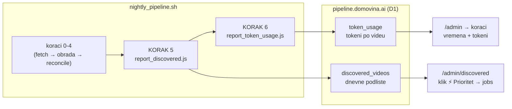

# Pipeline observability — otkriveni videi, vremena koraka, potrošnja tokena (2026-07-25)

SSOT za tri sloja vidljivosti dodana 2026-07-25 u `pipeline.domovina.ai` + dva nova
završna koraka nightlyja. Kod i njegovi komentari su izvor istine za *kako*; ovaj dokument
drži *zašto* i **izmjerene brojke** koje se iz koda ne vide.

Povezano: `docs/PIPELINE_FULL.md` (koraci 0→13), `../pipeline.domovina.ai/bridge/README.md`.

---

## 1. Što je dodano



| Sloj | Gdje se vidi | Puni ga |
|---|---|---|
| Otkriveni videi (dnevne podliste) | `/admin/discovered` | KORAK 5 |
| Vremena po koraku + ukupno | `/admin` → „koraci", `/dashboard` | CDN `Last-Modified` (bez skladištenja) |
| Potrošnja tokena po videu | `/admin` → „koraci" | KORAK 6 |

**Otkriveni videi nisu queue obrade.** Zaseban su zapis („ovo je sinoć stiglo") — tek klik
`⚡ Prioritet` stvori `jobs` redak. Razlog za odvojenu tablicu je u `migrations/0008`.

---

## 2. Claude Code session datoteke kao izvor telemetrije

Najkorisnije otkriće sesije i primjenjivo izvan ovog repoa.

Claude Code piše svaku sesiju kao JSONL: `~/.claude/projects/<encoded-cwd>/<uuid>.jsonl`.
`encoded-cwd` je cwd s `/` i `.` zamijenjenima crticom:

```
/Users/ms/git/domovinatv/fetch.domovina.tv → -Users-ms-git-domovinatv-fetch-domovina-tv
```

Svaki assistant redak nosi:

| polje | sadržaj |
|---|---|
| `message.usage` | `input_tokens`, `output_tokens`, `cache_creation_input_tokens`, `cache_read_input_tokens` |
| `message.model` | npr. `claude-opus-5`, `claude-fable-5` |
| `entrypoint` | **`sdk-cli`** = headless `claude -p` · `cli` = interaktivno · `remote_mobile` |
| `timestamp` | ISO, za raspon sesije |

### Tri filtera — svaki je nužan, mjereno

1. **Samo projekti pipelinea.** Video ID se spominje i u sesijama drugih sustava. Izmjereno
   na ovom Macu:

   | projekt | sesija s video ID-em | stvarna obrada? |
   |---|---|---|
   | `ecosystem-brain` | **436** | ❌ drugi sustav, samo spominje ID-eve |
   | `fetch-domovina-tv` | 33 | ✅ Magisterium MCP runovi |

   Skeniranje svih projekata naduvalo bi brojke ~8× i pripisalo videu tuđe tokene.

2. **Samo `entrypoint === 'sdk-cli'`.** Interaktivne sesije (`cli`) su čovjek za tipkovnicom;
   često spominju isti video ID, ali nisu trošak obrade tog videa.

3. **Video ID iz prompta** — `MAGISTERIUM_MCP_RUN.md <VID>` ili `_yt_<VID>`. Goli 11-znakovni
   niz se NE prihvaća (previše lažnih pogodaka u slobodnom tekstu).

Nakon sva tri filtera: 120 sesija → 38 headless → **30 videa atribuirano**, 5 neatribuiranih
(skener ih broji i prijavi, ne nestanu tiho).

### Izmjereni profil potrošnje (30 videa, Magisterium MCP runbook)

| | ukupno | ~po epizodi |
|---|---|---|
| ulaz | 22.446 | ~750 |
| cache upis | 8.329.263 | ~278k |
| **cache čitanje** | **162.979.191** | **~5,4M** |
| izlaz | 1.610.363 | ~54k |

**Cache čitanje je ~100× veće od izlaza.** Dugi MCP runbook resenda isti kontekst kroz
desetke poziva. Isti obrazac kao kod EN prijevoda (vidi
`docs/translation_throughput_vision_2026-06.md`) — ako se ikad optimizira trošak, poluga je
broj poziva po epizodi, ne veličina odgovora.

**Bez preračuna u dolare.** Ovi runovi idu pod Claude Code **pretplatom**, ne per-token
naplatom (zato `--bare` je zabranjen, vidi `CLAUDE.md`). Prikaz „$X" implicirao bi naplatu
koje nema.

### Što NIJE pokriveno

`--gemini-backend claude` (koraci 7+8) trči s **neutralnim cwd-om**, a prompt mu je čisti
sadržaj iteracije **bez video ID-a**. Te sesije se ne mogu pripisati videu bez izmjene u
`generate_article_gemini.js` (dodati ID u prompt) — a mijenjanje prompta mijenja i izlaz
modela, pa to nije napravljeno usput.

---

## 3. CDN `Last-Modified` kao izvor vremena po koraku

R2 kroz Cloudflare vraća `Last-Modified` na `data/{id}/*` artefaktima, a probe koji ionako
provjerava postojanje koraka to zaglavlje dobiva besplatno. Zato **nema nove instrumentacije**
u `run_pipeline.sh`.

### Što taj broj JEST, a što NIJE

- **JEST**: trenutak objave artefakta na CDN-u. Δ između koraka uključuje i **čekanje**
  (npr. na Colab batch) — zato `+4d 10h` na transkripciji, što je i najkorisniji podatak.
- **NIJE**: wall-clock trajanje računanja. Kad jedan run uploada sve artefakte na kraju
  (KORAK 12), timestampovi se skupe u istu sekundu i Δ ispadne ~0.

### Dvije zamke koje su se pojavile u produkciji

**a) Ukupno manje od pojedinog Δ.** Prvo je „Ukupno" bio job prozor (`claimed_at → done_at`).
Magisterium (KORAK 8.5) trči iz zasebnog `magisterium_jobs` queuea **tek nakon** što je job
već `done`, pa mu Δ pada izvan tog prozora → „Ukupno 9 min" uz korak „+36 min".
Popravak: total je raspon nad **unijom** job prozora i svih artefakata; job prozor ostaje
zasebna ćelija „Od toga job". Invarijanta: **total ≥ svaki Δ**.

**b) Sidro Δ-a ne smije biti job claim kad je job noviji od artefakata.** Video koji je
postojao pa je naknadno ubačen u queue (promoviran iz otkrivenih, ili re-dodan radi
regeneracije članka) ima sve starije artefakte od `claimed_at` → mjerenje „od claima"
proglasilo bi **svaki** stariji korak ponovnom objavom. Sidro je job claim samo ako je
`claimed_at <= najstariji artefakt`; inače prvi korak nema Δ.

Negativan Δ nije greška nego **ponovna objava** (npr. članak regeneriran Opusom mjesecima
nakon Magisteriuma) → prikazuje se kao `↺ ponovna objava`, ne kao trajanje. Sidro se pomiče
samo naprijed da jedna re-objava ne pokvari Δ svim koracima iza sebe.

---

## 4. Gotchas koje su koštale vremena

**AppleDouble sidecari na external volumeima.** `._<ime>.info.json` završava istim sufiksom,
prolazi `extractVideoId`, ali nije JSON → upiše prazan naslov preko pravog retka. Svako
skeniranje `storage/output/**` po sufiksu mora preskočiti sve što počinje točkom. (Srodno:
`yt-dlp` lažna rename greška na istim volumeima.)

**Backtickovi u komentarima unutar `views.ts`.** Cijeli `<script>` admin/dashboard stranica
živi u server-side template literalu. Backtick u *komentaru* zatvara literal i ruši build uz
neintuitivnu poruku (`TS1005: ',' expected`). Isto vrijedi za `${...}`. Pogođeno dvaput u
jednoj sesiji — u datoteci sada stoji eksplicitna napomena.

**Stale `.loudnorm.mp3.part.wav`.** Dvije zaostale datoteke iz rada na loudness normalizaciji
naduvavaju naivni broj „WAV bez `.canary.srt`" (117 umjesto stvarnih 115). Ako se broji
backlog transkripcije, filtrirati po `.info.json`-u, ne po globu `*.wav`.

---

## 5. Operativno

```bash
# Dnevne podliste
node bridge/report_discovered.js --dry-run                  # proba
node bridge/report_discovered.js --since 2026-07-18         # backfill starijih dana
node bridge/report_discovered.js --pending-transcription    # SVE što čeka Colab

# Tokeni
node bridge/report_token_usage.js --dry-run --top 10
node bridge/report_token_usage.js --all-projects            # SAMO dijagnostika (lažna atribucija!)
```

Obje skripte su idempotentne i soft-fail (exit 0 bez `PIPELINE_QUEUE_INGEST_KEY`), pa ne
ruše nightly.

### Stanje na 2026-07-25

- Otkriveni videi: **115 u 13 podlista** (`16.07.` ima 83 — bulk onboarding
  `mladifest_hrvatska` + `slijedi_svoj_poziv_1/2` + `na_kavi_sa_svetim_ignacijem`), svi
  na fazi `WAV spreman`.
- Tokeni: 30 videa atribuirano.
- Za taj backlog je **jedan Colab G4 batch** (~30 min, ~$0.35 za svih 115) i dalje jeftiniji
  od 115 pojedinačnih Modal runova preko `⚡ Prioritet`.
