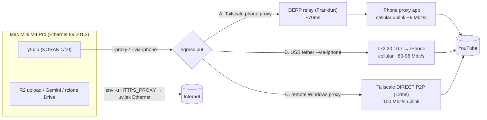
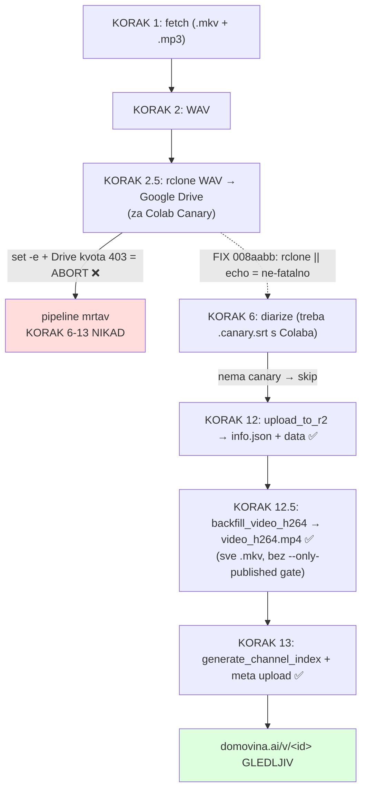
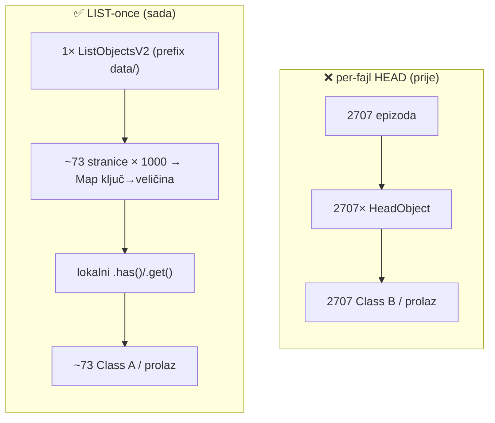

# Pipeline publish robustness, yt-dlp egress & R2 cost model — sesija 2026-06-08

Sažetak naučenog u sesiji 2026-06-08 (+ 06-06/06-07). SSOT za četiri teme koje
prije nisu bile dokumentirane na jednom mjestu:

1. **yt-dlp egress putovi** za zaobilazak YouTube anti-bota (proxy/tether usporedba + throughput)
2. **Robustnost publish puta** — zašto svjež video nije bio gledljiv i kako je popravljeno
3. **R2 operation cost model** — Class A vs Class B, LIST-once pattern
4. **Dvije regresije** — legacy `video.mp4` re-upload + `extractVideoId` first-match

---

## 1. yt-dlp egress putovi (anti-bot bypass)

YouTube blokira fetch s data-center/rezidencijalnih IP-ova Maca (`Sign in to confirm
you're not a bot`). Rješenje = yt-dlp egress kroz **drugačiji IP** (mobilni/drugi uplink).
`run_pipeline.sh` prosljeđuje proxy **samo** yt-dlp pozivima (KORAK 1 fetch + KORAK 10
screenshot); sve ostalo (R2, Gemini, rclone) eksplicitno strip-a proxy env (`env -u`).



### Empirijska usporedba (mjereno 8 MB test downloadom)

| Put | Mac↔proxy veza | egress | throughput | anti-bot | praktično |
|---|---|---|---|---|---|
| **A. Tailscale phone proxy** (`--proxy http://100.71.146.11:8888`) | DERP relay (Frankfurt, ~70ms) | cellular | **~0.8 MB/s** | zaobiđen | presporo za video; OK za male JSON |
| **B. USB tether** (`--via-iphone` → bind 172.20.10.x) | USB (lokalno) | cellular 5G | **~10 MB/s** | zaobiđen | ✅ najbolji za bulk fetch (potvrđeno) |
| **C. remote Windows proxy** (`--proxy http://100.73.x:8888`) | **direct P2P** (12ms) | 100 Mbit/s uplink | (n/a — blokiran) | zaobiđen | obećavajuće, ali blokiran firewallom |

### Ključni nalazi
- **Bottleneck A puta = cellularni UPLINK, NE DERP/Tailscale.** Paralelni test (4 streama)
  NE skalira → zajednička zasićena cijev. Svi downloadani bajtovi moraju izaći iz iPhonea
  kroz spori cellular uplink da dođu do DERP releja → Maca. DERP samo dodaje latenciju.
- **DERP vs DIRECT**: telefon na celularu = CGNAT → Tailscale ne može P2P hole-punching →
  pada na DERP relay (sporiji). Windows komp na fiksnoj vezi = **direct P2P** (`tailscale
  ping` → "via <ip>:port", ne "via DERP"). Direct nema relay penalty.
- **`tailscale ping` radi, ali TCP na app-port ne** = klasičan potpis: ili **Windows
  Firewall Block pravilo** (timeout/drop, ne "refused"; Block gazi Allow!), ili **Tailscale
  "Allow incoming connections" = OFF** (`tailscale set --shields-up=false`). Disco protokol
  (ping) zaobilazi oboje. ICMP 100% loss + tailscale ping OK = shields-up ili firewall.
- LIST/proxy promet: `--via-iphone` koristi `--source-address` (bind na lokalnu IP), ne
  mijenja default route → samo yt-dlp ide kroz iPhone, ostatak Ethernet.

---

## 2. Robustnost publish puta — svjež video odmah gledljiv

**Cilj:** svjež skinut video odmah dostupan na `domovina.ai/v/<id>` (frontend ima
simple-player za neobrađene videe), bez čekanja Colab Canary transkripcije.

**Što frontend treba:**
- `/v/<id>` ruta → `data/<id>/info.json` (metapodaci) + `data/<id>/video_h264.mp4` (player)
- prikaz najnovijih na homepage/kanalu → `channels/data/index.json` (reindex)

**Ovisnosti koraka:** H.264 transcode + info.json + reindex trebaju **samo lokalni
`.mkv` + `.info.json`** — NE Canary/AI. Dakle mogu se objaviti odmah nakon fetcha.



### Što je pošlo po zlu (2026-06-08) i fix
- `set -e` (run_pipeline.sh:71) + rclone WAV→Drive (KORAK 2.5) pao na **punoj Drive kvoti**
  (`Error 403 storageQuotaExceeded`) → **cijeli pipeline abortao** prije H.264 + reindexa.
  Jedan ne-kritičan vanjski-ovisni korak rušio cijeli publish.
- **Fix (commit `008aabb`):** oba Colab/Drive sync koraka (KORAK 0 download + 2.5 upload)
  su sada `rclone ... || echo "warning"` → ne-fatalni pod `set -e`. Prvi prolaz ubuduće
  **uvijek** dođe do info.json + video_h264 + reindex; Colab Canary samo kasni dok se
  Drive ne oslobodi.
- KORAK 12.5 (`backfill_video_h264.js`) već procesira **sve `.mkv`** (skip-unpublished se
  aktivira samo uz `--only-published`, koji pipeline ne šalje) → neobrađeni videi dobiju H.264.

### Hitno objavljivanje već-skinutih (bez Drive/Colab)
```bash
node backfill_video_h264.js --input-dir storage/output --rm-local-after-upload  # video_h264.mp4
node upload_to_r2.js --input-dir storage/output --video-id <ID>                  # info.json + data
node generate_channel_index.js && node upload_to_r2.js --meta-dir storage/meta   # reindex
```

---

## 3. R2 operation cost model — Class A vs Class B, LIST-once

Cloudflare R2 free tier (mjesečno): **Class A** (write/LIST) = 1M, **Class B**
(read/HEAD/GET) = 10M. Egress je besplatan.

| Operacija | Klasa | Napomena |
|---|---|---|
| `HeadObject` (provjera postojanja 1 fajla) | **B** | 1 po fajlu — skупо u petlji |
| `GetObject` | B | skida sadržaj |
| `ListObjectsV2` (do 1000 ključeva/poziv) | **A** | vraća SAMO metapodatke (ključ+veličina+ETag), **NE sadržaj** |
| `PutObject` | A | upload |

**`MaxKeys` je tvrdo limitiran na 1000** — nema "daj milijun odjednom". Paginacija preko
`ContinuationToken` obavezna (S3 protokol, i AWS i R2). Ali svaka stranica = 1 Class A op.



- `upload_to_r2.js`: već LIST-once (`listAllR2Keys` + klasifikacija novi/immutable/mutable;
  HEAD samo na mutable manifeste). `--full-head` override za staro ponašanje.
- `backfill_video_h264.js`: prebačen na LIST-once 2026-06-08 (commit `1be717b`,
  `prefetchR2Index()`). ~73 Class A umjesto ~2707 Class B po prolazu. Fallback na HEAD
  ako `R2_INDEX=null` (no-creds/`--transcode-only`); post-upload confirm + `--delete-old`
  ostaju HEAD (svjež read, niska količina).
- `count_progress --with-r2-video`, `delete_legacy_video_mp4.js`: već LIST-paginirano.

---

## 4. Dvije regresije popravljene u sesiji

### 4a. Legacy `video.mp4` re-upload (commit `2fb1f65`)
`upload_to_r2.js` KORAK 12 je bio **nemigrirani legacy path** — remuxao `.mkv → video.mp4`
(`-c:v copy`, VP9/AV1) i uploadao na `data/{id}/video.mp4`. H.264 migracija je dodana kao
ZASEBAN KORAK 12.5 (`video_h264.mp4`) ali legacy upload nije ugašen → svaki nightly je
**re-populirao obrisani legacy** (vraćeno 893 prije gašenja). Fix: legacy `.mp4`
zakomentiran (UPLOAD_SUFFIXES + getFlutterKey + remux gate iza `--normalize-audio`).
Cleanup: `delete_legacy_video_mp4.js --confirm` (900 obrisano, ~104 GB).

**Pouka:** kad migriraš delivery na novi artefakt, ugasi STARI upload u istom koraku,
ne samo dodaj novi pored.

### 4b. `extractVideoId` first-match (commit `c274178`)
Naslovi nekih epizoda sami sadrže `_yt_` (npr.
`..._osnivac_yt_kanala_crypto_hrvatska_yt_7OospmYpHRU`). First-match regex
`/_yt_([a-zA-Z0-9_-]{11})/` uhvatio `kanala_cryp` (slučajno 11 znakova) umjesto pravog
ID-a → R2 ključevi pod mangled prefiksom → Flutter (gradi URL po konvenciji) **404 na
sve slike** 2 live epizode. Fix: `/.*_yt_([a-zA-Z0-9_-]{11})(?:[._]|$)/` (greedy `.*`
forsira ZADNJI `_yt_`) u 5 kopija. Detekcija: `find -L storage/output -name "*_yt_*_yt_*"`.

---

## Commitovi sesije
| Commit | Što |
|---|---|
| `2fb1f65` | ugasi legacy video.mp4 upload + iPhone proxy auto-probe u nightly |
| `c274178` | extractVideoId uzima ZADNJI _yt_ (last-match) |
| `008aabb` | Colab/Drive sync (KORAK 0 + 2.5) ne-fatalni pod set -e |
| `1be717b` | backfill_video_h264 LIST-once umjesto per-epizodi HEAD |

## Povezani dokumenti
- `docs/video_crossplatform_strategy_2026-06.md` — H.264 strategija (recept, AV1 odluka)
- `docs/deferred_decisions_2026-06.md` — backlog odgođenih odluka
- CLAUDE.md — "Diarization Cost/Performance Note", pipeline koraci
