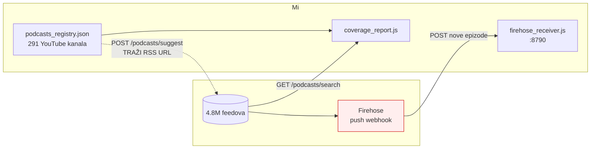

# Podscan.fm integracija — pokrivenost registra, otkrivanje, firehose

**Datum:** 2026-08-26 · **Status:** prva iteracija, trial API ključ

Podscan.fm je indeks RSS podcast feedova (tvrde 4M+). Zanimaju nas tri stvari:

1. Koliki dio našeg [registra](../data/podcasts_registry.json) (291 kanala) Podscan uopće ima?
2. Koje hrvatske podcaste **oni** imaju, a **mi** nemamo? (zanimljiviji smjer)
3. Možemo li dobiti push obavijest o novim epizodama?

---

## ⛔ Tri stvari koje treba znati prije diranja

### 1. Firehose je PRIJEMNIK, ne pošiljatelj

Najčešća zabuna. Firehose ne prima naše podatke — Podscan **gura** JSON na URL
koji upišeš u Team Settings. Ne postoji "pošalji na firehose".



Jedini ulazni put u njihovu bazu je `POST /podcasts/suggest`, i **prima RSS feed
URL** — ne YouTube link, ne ime kanala. Naš registar je YouTube-katalog, pa je
većina naših kanala načelno nemoguće predložiti: bez RSS feeda oni po definiciji
nisu podcast u Podscanovom smislu.

Firehose tier je uz to vezan uz plan: Lite = top 1 000 podcasta (Premium $100/mj),
Core = top 25 000 (Professional $200/mj), **Full = svi 4M+ tek na Advanced
($2 500/mj)**. Hrvatski podcasti gotovo sigurno nisu u top 25 000 globalno, pa bi
firehose na jeftinijim planovima za nas bio prazan.

### 2. Trial ključ = 100 zahtjeva DNEVNO

| Plan | dnevno | u minuti | paralelno |
|---|---|---|---|
| **Trial (naš)** | **100** | 10 | 5 |
| Premium $100/mj | 2 000 | 120 | 10 |
| Professional $200/mj | 5 000 | 120 | 15 |
| Advanced $2 500/mj | 10 000 | 120 | 20 |

Zato skripte **ne pitaju po kanalu**. Umjesto 291 upita gradi se lokalno zrcalo
hrvatskog dijela baze (`data/podscan_hr_corpus.json`), pa se sva analiza vrti
lokalno i besplatno. `podscan_client.js` broji potrošnju u
`data/podscan_cache/.podscan_budget.json` i odustane s porukom umjesto da zaradi 429.

⚠️ **Istu dnevnu kvotu troši i Podscan MCP konektor**, i ručni `curl`, i web
sučelje. Lokalni brojač vidi samo vlastite pozive i zato **podcjenjuje** —
izmjereno 2026-08-26: lokalno 75, server 100. Klijent se zato poravnava po
`x-ratelimit-remaining` headeru sa svakog odgovora.

Praktična posljedica: **MCP konektor na trial ključu puca s HTTP 429** čim
skripte potroše dan. To nije kvar konektora ni "MCP ne radi za free account" —
to je ista kvota. `retry-after` na dnevnom limitu zna biti **~20 sati**, pa
klijent tada odustaje odmah umjesto da ponavlja.

### 3. Search ne prima prazan upit — i chartovi su 30× isplativiji

`query=*` → vodeći wildcard se strippa i vraća 0 rezultata. Ne postoji "izlistaj
sve podcaste jezika hr". Korpus se zato gradi unijom upita po listi čestih
hrvatskih riječi (`TERMS` u `harvest_hr_corpus.js`), 50 rezultata po stranici.

**Ali:** `language=hr` se zasitio na **~1 026 feedova** nakon 68 zahtjeva —
novi termini prestali su donositi ijedan novi zapis. To je samo po sebi nalaz:
cijeli hrvatski segment Podscana je reda veličine tisuću feedova.

Za usporedbu, `harvest_hr_charts.js` je s **2 zahtjeva** donio **901 novi
podcast** (Apple + Spotify top liste za Hrvatsku). Ako te zanima otkrivanje,
kreni od chartova, ne od pretrage.

⚠️ Chart ≠ hrvatski. Top lista znači "sluša se u Hrvatskoj" i vodi je Joe Rogan.
Chart odgovor uz to ne nosi `language`, `region` ni `rss_url`, koristi `name`
umjesto `podcast_name`, a `last_posted_at` vraća kao **UNIX sekunde** dok ga
pretraga vraća kao ISO string (i to nedosljedno — i u pretrazi ima oba oblika).
`match_lib.normalizePodcast()` to poravnava; bez toga 883 živa showa tiho
ispadnu iz izvještaja kao "neaktivna".

---

## Nalazi prve iteracije

Mjereno nad zrcalom od 2026-08-26. Brojke se osvježavaju svakim
`node podscan/coverage_report.js` (bez API poziva).

### A) Pokrivenost registra — ~12 %

Od 291 kanala u registru Podscan ima **35** (12,0 %), od toga 31 pouzdano
(identično ime, "core" ime ili potvrđen YouTube link u njihovim podacima).

Očekivanje "bit će svi, imaju 4M+" se **nije potvrdilo** — ali ne zato što je
Podscan loš. Uzrok je strukturni: naš registar prati **YouTube kanale**, Podscan
indeksira **RSS feedove**. Kanal koji objavljuje samo na YouTubeu nema feed i
nikad neće biti u RSS indeksu. Pokrivenost od 12 % je zapravo mjera koliko naših
kanala paralelno objavljuje i kao audio podcast.

### B) 1 693 kandidata koje mi nemamo — ali pazi na smeće

Podscan zna za **1 693** feeda kojih nema u registru, od čega **832 aktivna** u
zadnjih 90 dana. To je stvarna vrijednost ove integracije. Popis je razdvojen
po izvoru jer izvori nisu jednako vrijedni:

| Izvor | Aktivnih | Što to znači |
|---|---|---|
| pretraga (`language`/`region` = hr) | **121** | stvarno hrvatski — izravni kandidati |
| chart liste za Hrvatsku | 722 | *sluša se* u HR, većinom strani — treba trijaža |

Trijažni popis: [`podscan_candidates_2026-08-26.md`](podscan_candidates_2026-08-26.md).

Uz to: **166 feedova označenih `language=hr` uopće nisu hrvatski.** To su kineske
SEO/engagement farme (identičan obrazac: 10 epizoda, publika ~1 100, opis o
"自动化平台"). Detekcija je u `match_lib.isLikelySpam()` i gleda **pismo**, ne
sadržaj. Bez tog filtra popis kandidata je neupotrebljiv.

Podscan ima i **duple feedove istog showa** pod različitim `podcast_id`, koje
njihov `is_duplicate` ne hvata. Izvještaj dodatno stišće po normaliziranom imenu.

### C) "U bazi unutar 10 minuta od objave" — poluistina

Marketinška tvrdnja spaja dvije različite stvari: **katalogizaciju feeda** i
**obradu epizoda**. Nad našim uparenim podcastima:

| Mjera | Vrijednost |
|---|---|
| Podcasta s **0** obrađenih epizoda | 9 / 35 (25,7 %) |
| Podcasta s **potpuno** obrađenim katalogom | 3 / 35 (8,6 %) |
| Epizoda: feed prijavljuje → Podscan obradio | 4 137 → 1 616 (**39 %**) |
| Feedova u hr korpusu neaktivnih (>90 dana) | 857 / 1 026 (83,5 %) |

Isti obrazac vrijedi i globalno, iz njihovog `/stats`: **4 844 621** podcasta
ukupno, ali samo **604 122 aktivnih** (12,5 %). "4M+" je broj *katalogiziranih*
feedova, uključujući mrtve. Tvrdnja o 10 minuta može biti točna za feedove koje
aktivno prate — za dugi rep očito nije, jer 26 % naših uparenih podcasta nema
ijednu obrađenu epizodu.

---

## Skripte

| Skripta | Što radi | API pozivi |
|---|---|---|
| `podscan/podscan_client.js` | Bearer auth, throttle 6,5 s, dnevni budžet, cache na disk | — |
| `podscan/match_lib.js` | HR-svjesna normalizacija imena, YouTube cross-match, spam detekcija | — |
| `podscan/harvest_hr_corpus.js` | Gradi `data/podscan_hr_corpus.json` (resumable) | 50 rez./poziv |
| `podscan/harvest_hr_charts.js` | Apple/Spotify top liste za HR → isto zrcalo | **2 poziva ≈ 900 showova** |
| `podscan/coverage_report.js` | Pokrivenost + kandidati + provjera tvrdnje | **0** |
| `podscan/suggest_missing.js` | `POST /podcasts/suggest` (default dry-run) | 1 po feedu |
| `podscan/firehose_receiver.js` | Prima push webhook, gzip, filtar hr, JSONL | — |

```bash
# 1. Napuni/nastavi zrcalo (pazi na kvotu)
node podscan/harvest_hr_charts.js                 # najbolji omjer: 2 poziva
node podscan/harvest_hr_corpus.js --max-requests 60
node podscan/harvest_hr_corpus.js --status        # bez ijednog poziva

# 2. Izvještaj — vrti koliko god puta, ne troši kvotu
node podscan/coverage_report.js
node podscan/coverage_report.js --json data/podscan_coverage_report.json \
                                --candidates docs/podscan_candidates_2026-08-26.md

# 3. Predloži feed Podscanu (bez --commit je dry-run)
node podscan/suggest_missing.js --feeds feeds.txt --commit

# 4. Prijemnik firehosea (traži javni tunel)
node podscan/firehose_receiver.js --port 8790
```

### Ključevi

U `.env` (gitignoran): `PODSCAN_API_KEY`, `PODSCAN_FIREHOSE_KEY`, `PODSCAN_TEAM_ID`.

`PODSCAN_FIREHOSE_KEY` (`fhm_…`) nije dokumentiran u REST API specifikaciji —
firehose dokumentacija opisuje samo `X-Webhook-Source: podscan.fm` header, bez
potpisa. Prijemnik ga zato koristi kao **zajedničku tajnu** (`?key=…` ili
`Authorization: Bearer`) da endpoint na javnom tunelu ne stoji otvoren. Ako se
pokaže da Podscan šalje nešto drugo, promijeni provjeru u `firehose_receiver.js`.

---

## Otvoreno

- **Harvest nije dovršen** — trial kvota. `--status` pokazuje koliko termina
  preostaje; nastavi sutra, korpus i cache se čuvaju.
- **`region=hr` os nije obrađena** — pokriva engleske showove iz Hrvatske i
  hrvatske feedove s krivo detektiranim jezikom. Prioritet niži nego što se
  činilo: `language=hr` os se zasitila, pa je vjerojatan i brz plato.
- **Chart kandidatima nedostaje jezik.** Razlučivanje "hrvatski ili strani"
  traži `GET /podcasts/{id}` po showu — 722 poziva, tj. 8 dana trial kvote.
  Jeftinije: trijažirati ručno po imenu, ili nadograditi plan.
- **Podscan MCP** dijeli dnevnu kvotu s REST-om i zato je 2026-08-26 vraćao
  HTTP 429 (`retry-after` ~20 h). Restart sesije to ne rješava — ili se čeka
  reset, ili se podiže plan. REST put je ionako reproducibilniji za skripte.
- **Kandidati nisu ubačeni u registar.** Popis od 120 aktivnih je izlaz izvještaja,
  ne automatska izmjena — registar je [trosloj](../data/podcasts_registry.json)
  i ne smije se puniti automatski.

---

## Povezano

- `docs/registry_discovery_sweep_2026-07-27.md` — yt-dlp search sweep, drugi
  vektor otkrivanja (YouTube strana; 146 → 273 kanala)
- `docs/registry_vision.md` — vizija javnog kataloga
- `docs/podscan_candidates_2026-08-26.md` — trijažni popis kandidata
- Claude memorije: `podscan-fm-integration`, `registry-three-layer-model`,
  `bulk-category-discovery-workflow`, `channel-onboarding-checklist`
