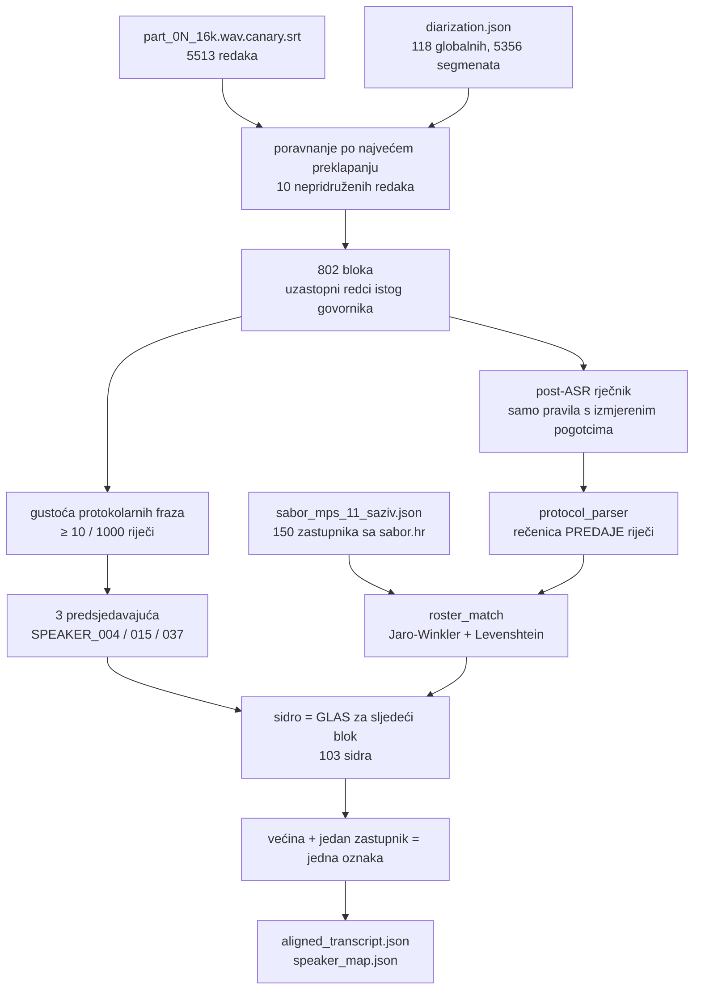

# Faza 03 — ASR poravnanje, službeni registar i protokolarno imenovanje (2026-08-25)

Provedba `sabor_pipeline/03_asr_and_protocol_parser.md` nad pilot-sjednicom
`sabor_11_izvanredna_11_gospic` (20 h 01 min, 4 YouTube streama, 2 dana).

Specifikacija **nije bila pregledana** prije pisanja koda; ispravci su nabrojani
u zaglavlju same specifikacije. Ovaj dokument bilježi što je izvedeno, s kojim
mjerenjima, i gdje su rupe.

---

## 1. Registar zastupnika se SCRAPEA, ne generira

`sabor_pipeline/tools/fetch_sabor_roster.js` → `data/rosters/sabor_mps_11_saziv.json`

Izvor je javni JSON API koji pogoni službeni interaktivni raspored:

```
https://www.sabor.hr/api/interaktivna-sabornica-new?_format=json
```

Normalizacija imena (uključujući `slug` fallback) preuzeta je iz provjerene
skripte `../izbori.domovina.ai/scripts/fetch_sabor_seating.py`, koja je isti
API već koristila za `u_saboru` zastavicu u arhivi izbora.

| Mjera | Vrijednost |
|---|---|
| mjesta u odgovoru API-ja | 150 |
| isparsiranih zastupnika | **150** |
| mjesta u Saboru | 151 |
| klubova | 15 |
| dvosmislenih prezimena | **3** |

Zbroj `number` po klubovima je 158, a ne 151, jer manjinski zastupnici ulaze i
u „Zastupnici nacionalnih manjina" i u svoj klub (158 − 8 = 150). Razlika do 151
nije greška: raspored prikazuje samo **popunjena** mjesta.

### 1.1 Što registar NE sadrži — i zašto to smije boljeti

Raspored sjedenja daje **samo zastupnike**. Ne daje:

* **članove Vlade** — a ministrica je na ovoj sjednici najveći pojedinačni
  govornik (**87 minuta**, 83 bloka odgovora);
* **dužnost** (predsjednik / potpredsjednici Sabora) — polje `duznost` ostaje
  `null` jer izvor tu informaciju ne nosi;
* **rod** — polje `spol` ostaje `null` (vidi §4.3, gdje se izvodi zasebno i
  označeno kao izvedeno).

Provjera da ograničenje radi u pravom smjeru: `matcher.resolve("Vučković")`
vraća **`null`**, a ne „najbližeg" zastupnika. Osoba izvan registra ne dobiva
izmišljeni identitet — to je cijela svrha pravila.

### 1.2 Tri dvosmislena prezimena su otkrivena, ne pretpostavljena

Skripta sama izračuna koja se prezimena ponavljaju i upiše ih u
`ambiguous_surnames`:

| prezime | nositelji |
|---|---|
| BORIC | Josip Borić \| Rada Borić |
| MARKOVIC | Ivana Marković \| Miroslav Marković |
| MILOS | Anteo Milos \| Jelena Miloš |

Predsjedavajući gotovo uvijek kaže **samo prezime**, pa bi bez ovog popisa
„Kolegice Miloš, izvolite" nasumično pogodilo jedno od dvoje.

---

## 2. Tok faze 03



---

## 3. Rezultat nad pilot-sjednicom

| Mjera | Vrijednost |
|---|---|
| SRT redaka | 5513 (nepridruženih **10**) |
| blokova | **802** |
| predsjedavajućih | **3** — isti kao u §8.10 memorijskog dokumenta |
| sidrenih najava | **110** |
| oznaka s glasovima | 66 → **razriješeno 65** |
| različitih imenovanih zastupnika | **65** |
| imenovanih blokova | 306 / 802 |
| **imenovanog govornog vremena** | **65.7 %** |

Brojke su iz stanja NAKON šest popravaka iz §7. Prva verzija je davala 103
sidra i 58.5 % — razlika nije podešavanje nego uklonjene pogreške i zatvorene
rupe. Najniži prihvaćeni rezultat podudaranja imena je
**0.861**, medijan **1.0**.

Vrste sidara: rasprava 36, replika 23, povreda poslovnika 20, klupska rasprava
12, pojedinačna rasprava 11, stanka 1.

Predsjedavajući ostaju **bez imena**: njih nitko ne najavljuje, pa protokol o
njima ne kaže ništa. To je poznata rupa, ne previd (§6).

---

## 4. Tri ograde koje su spriječile tihu pogrešku

### 4.1 🎯 Rečenica PREDAJE riječi, a ne posljednje ime u bloku

Najveći nalaz cijele faze. Blok predsjedavajućeg zna trajati pola minute i
spominjati imena koja **nisu** primatelj riječi:

> „Kolega Marković, molim vas sjednite… **Kolega Štromar**, molim i vas isto
> tako… Nemojte, pustite ljude… **Izvolite odgovor, ministrice.**"

Prva izvedba je uzela posljednje ime u bloku i time zalijepila **„Predrag
Štromar" na 87 minuta ministričinog govora** — a jer je to bio jedini glas za
tu oznaku, s „pouzdanošću 1.0".

Ograda: ime se traži **samo u posljednjoj rečenici koja sadrži poziv**
(„izvolite", „na redu", „govorit će"). Ako ta rečenica imenuje ulogu izvan
registra („ministrice"), sidra namjerno **nema**.

Učinak mjeren na cijeloj sjednici:

| | sidara | različitih zastupnika | imenovano vrijeme |
|---|---|---|---|
| bez ograde | 103 | 60 | 67.5 % |
| **s ogradom** | 98 | 60 | 57.2 % |

Deset postotnih bodova „pokrivenosti" bilo je **krivo pripisano vrijeme**.
Dvije dopune vratile su recall bez gubitka preciznosti (§4.2).

### 4.2 Golo „Izvolite." i kratki proceduralni blok

Dominantni obrazac stavlja ime u **prethodnu** rečenicu:

> „Prelazimo na treću raspravu. Klub nezavisnih zastupnika, govorit će kolega
> Nino Raspudić. **Izvolite.**"

Zato: ako rečenica predaje ne sadrži ime **i** ne imenuje ulogu izvan registra,
gleda se **točno jedna** rečenica unatrag. Dva koraka već hvataju imena iz
drugog konteksta.

Druga dopuna: blok predsjedavajućeg **kraći od 20 riječi** bez ijednog poziva
ipak se čita kao najava („Kolega Miletić, povreda Poslovnika." — 4 riječi).
Duži blok bez poziva je ukor i ime u njemu nije primatelj riječi („Kolegice
Orešković, onda ne možete govoriti…" — 25 riječi).

Prag je odabran tako da razdvaja upravo te dvije izmjerene populacije.

### 4.3 Rod titule razrješava dvosmisleno prezime

Sva tri dvosmislena prezimena 11. saziva su **rodovno raznorodni parovi**, pa
titula koju predsjedavajući ionako izgovori nosi dovoljno informacije:

> „**Kolegice** Miloš, izvolite." → Jelena Miloš (ne Anteo Milos)

Rod osobnog imena je **izveden**, ne iz izvora, pa je ograđen dvostruko: koristi
se isključivo kao razbijač već nastalog izjednačenja između dva pronađena
kandidata, i odustaje kad je ime rodovno dvoznačno (`Vanja`, `Saša`, `Matija`…)
ili kad rod ijednog kandidata nije siguran. Bez titule izjednačenje ostaje
nerazriješeno, točno kao prije.

Učinak: 98 → **103 sidra**, 60 → **61** različitih zastupnika, 57.2 → **58.5 %**.
Usput razrješava i „Kolega Juričević" (Josip Jurčević 0.906 vs Branka
Juričev-Martinčev 0.893 — razmak 0.013, ispod praga).

---

## 5. Zašto podudaranje imena nije obično uspoređivanje nizova

Dva neovisna izvora šuma, oba diraju **kraj** riječi a čuvaju početak:

1. **Hrvatska sklonidba** — „kolegu Troskot**a**", „riječima kolega Borić**a**".
2. **ASR distorzija** — izmjereno u ovom transkriptu: `Troskut`, `Troskogl`
   (Troskot), `Kukavic` (Kukavica), `Sela Kraspudić` (Selak Raspudić),
   `Raukard` (Raukar-Gamulin), `Biljka` (Bilek).

Zato je nosiva mjera **Jaro-Winkler** (nagrađuje zajednički prefiks), a
Levenshtein je druga, neovisna kočnica. Dodatna kočnica: ako se **prva dva
slova** ne poklapaju, rezultat se prepolovi — ni sklonidba ni ASR ne mijenjaju
početak prezimena, a bez toga se „Matić" i „Batić" vežu presložno.

Ta ista kočnica je razlog zašto `Sela Kraspudić` mora u rječnik (§4.1 spec-a):
`Kraspudić` vs `Raspudić` razlikuju se upravo u prva dva slova, pa matcher
pada na 0.70 i ispravno odbija. Rječnik popravlja ASR, matcher ostaje strog.

**Rječnik nosi izmjerene brojeve pojava**, ne hipoteze: `erha` → RH (169×),
`hadeze*` → HDZ (210×), `esdepe*` → SDP (69×), `pefas*` → PFAS (21×),
`uskok`/`dorh` malim slovima (24× / 19×), `andrija štampa` → Andrija Štampar
(4×). Pojmovi bez ijednog pogotka nisu dodani — tiha zamjena teksta koji nitko
nije provjerio je rizik bez koristi.

⚠️ **Ispravak vlastitog mjerenja (isti dan).** Prvo brojanje je odbacilo `HZJZ`
kao „nepostojeći u transkriptu". To je bila greška metode: brojana je **doslovna
kratica**, a govornici je nikad ne izgovaraju kraticom — u transkriptu stoji
„Hrvatski zavod za javno zdravstvo" (4×) i „Zavod za javno zdravstvo
Ličko-senjske županije". Pojam postoji, samo ne u obliku u kojem se tražio.

Pouka vrijedi šire od ovog retka: **odsutnost niza nije odsutnost pojma.** Za
kratice se mora brojati razvijeni oblik, inače rječnik ispadne prekratak upravo
ondje gdje govornici govore formalno.

---

## 6. Otvoreno — s brojkama, ne dojmom

### 6.1 Donja granica broja govornika: 70 od 118

`tools/verify_speaker_count.js` daje prvu procjenu **izvan** metode
klasteriranja: predsjedavajući svakog govornika najavi imenom, pa različitih
imenovanih ljudi ne može biti više nego stvarnih govornika.

| | |
|---|---|
| različitih najavljenih zastupnika | 65 |
| predsjedavajućih (nikad najavljeni) | 3 |
| uloga izvan registra (Vlada) | 2 |
| **donja granica** | **70** |
| klasteriranjem (faza 02b) | 118 |

70 ≤ 118 → **brojka iz faze 02b nije opovrgnuta**. Da je donja granica premašila
118, spajanje bi bilo preagresivno i alat bi pao s izlaznim kodom 1.

Zazor od 48 oznaka (40.7 %) **nije dokaz nadsegmentacije**: upadice iz klupa,
dobacivanja i tehnička javljanja nemaju protokolarnu najavu, pa ih ova metoda po
konstrukciji ne broji. Samo 6 oznaka ima manje od 30 s govora, pa zazor nije ni
objašnjen samim krhotinama. **Ovo pitanje ostaje otvoreno**, ali je sada
omeđeno s obje strane umjesto samo s jedne.

### 6.2 Predsjedavajući nemaju imena

Njih nitko ne najavljuje. Poznato je da ih je troje i da rotiraju čisto (§8.10
memorijskog dokumenta), ali koji je koji — protokol ne kaže. Za imenovanje bi
trebao izvor izvan rasporeda sjedenja (popis predsjednika i potpredsjednika
Sabora) ili glasovni otisak s druge, imenovane sjednice.

### 6.3 Članovi Vlade nemaju imena, ali imaju ULOGU

Kad predsjedavajući preda riječ ulozi („Izvolite odgovor, ministrice."),
oznaka dobiva `role_hint: "clan_vlade"` umjesto imena. SPEAKER_001 ga ima s
**5 neovisnih potvrda**. Time najveći govornik sjednice nije „nepoznat" nego
„neimenovan član Vlade" — razlika koja se dalje može provjeriti.

Puno imenovanje traži scrape sastava Vlade (`vlada.gov.hr`); nije napravljeno.

### 6.4 Recall sidrenja: 103 od 182 poziva

Od 182 bloka predsjedavajućeg koji sadrže poziv, 103 daju sidro, 6 daju ulogu,
**78 ne daju ništa**. Uzorak pokazuje da su ta 78 uglavnom **legitimno bezimeni**:
„Izvolite odgovor.", „Izvolite nastaviti.", „Odgovor na repliku, izvolite." —
riječ se vraća osobi koja već govori, pa ime nije ni izgovoreno. Nije mjereno
koliko ih je stvarno propušteno.

---

## 7. 🔬 Slijepa provjera modelom — šest defekata koje deterministički pristup ne vidi

Faza 03 nema nikakvu unutarnju provjeru: kad sidrenje pogodi, „siguran" je 1.0,
a kad promaši, jednako je siguran. Nijedan test koji sam napiše ne može uhvatiti
grešku koju sam nije predvidio.

### 7.1 Prvo mjerenje je bilo kružno i bezvrijedno

Prva usporedba uzela je bilješke faze 04 (klizni prozor) i usporedila imena u
njima s fazom 03: **98.9 % slaganja**. Brojka ne znači ništa — prozori koje faza
04 šalje modelu **već sadrže imena iz faze 03**:

```
[02:12:42 | SPEAKER_001] Sandra Benčić (Možemo!): Hvala lijepa…
```

Model nije provjerio ništa nego prepisao odgovor koji mu je dan.

### 7.2 Ispravan postupak: gole oznake

`tools/blind_speaker_check.js` daje modelu transkript s oznakama `SPEAKER_042`,
**bez imena, bez uloge i bez registra** (popis imena bio bi navođenje), i traži
da identitet izvede iz konteksta uz doslovan dokaz i timestamp. Mjereno na pet
prozora razbacanih kroz 20 h (≈ 0 h, 4 h, 9 h, 14 h, 19 h):

| | |
|---|---|
| usporedivih (obje strane imenovale) | 38 |
| **slaganje** | **37 (97.4 %)** |
| neslaganje | **1** — i to je bio stvaran bug faze 03 |
| model imenovao gdje faza 03 nije | **11 oznaka ≈ 98 min** |
| „ime izvan registra" | 3 — **nijedno nije halucinacija** |

Ona tri „izvan registra": `Irena Hrstić` i `Damir Habijan` su **ministri** (nisu
u rasporedu sjedenja, §1.1), a `Martina Vlašić Ilikić` **jest zastupnica** koju
je matcher promašio za 0.01. Model nije izmislio nijedno ime.

### 7.3 Šest defekata

| # | Defekt | Kako se očitovao |
|---|---|---|
| 1 | golo **osobno** ime identificira osobu | „kolegica **Ana** Marija Blažević" → token „Ana" savršeno pogodi Anu Puž Kukuljan (1.0); replika pripisana krivoj zastupnici. Sada se traži pogodak u **prezimenu**. |
| 2 | kraći prozor imena pobjeđuje duži | Kod je uzimao najviši *rezultat*, protivno vlastitom komentaru. Kraći prozor je manje podataka — viši rezultat ondje znači manju provjerljivost. |
| 3 | ASR **umeće** granicu riječi | `Anamarija` → „Ana Marija". Poznat je bio samo suprotan smjer (`Selak Raspudić` → „Sela Kraspudić"). Sada se probavaju i spojeni susjedni tokeni. |
| 4 | jedno krivo slovo ruši podudaranje | `ILIKIC~ILJKIC` = 0.849 uz prag 0.86 — pogreška pada u prefiks i gasi Winklerov bonus. „Gotovo pogođen" token sada nosi **pola težine**; stranci i dalje padaju (< 0.75). |
| 5 | `HANDOVER_RE` ne zna za **„dati riječ"** | „…sad **dati riječ** poštovanom zastupniku Josipu Boriću" — **31 minuta u 12 blokova** bezimeno. Fraza se u 20 h javlja **jednom**, pa je nikakvo brojanje učestalosti ne bi izdvojilo. |
| 6 | golo **prezime** prolazi prenisko | `ĆORIĆ~ĆOSIĆ` = 0.8607, taman iznad praga. Tomislav Ćorić je bivši ministar i nije u registru; njegov bi spomen postao istup Pere Ćosića. Jednorječno ime sada traži **0.90**. |

Učinak: sidara 103 → **110**, imenovanih zastupnika 61 → **65**, imenovanog
govornog vremena 57.9 → **65.7 %**, donja granica govornika 70 → **72**. Od 11
oznaka koje je model našao, faza 03 sada sama vraća tri — **uz nula konflikata**:
gdje god obje metode daju ime, daju isto.

### 7.4 Pouka o metodi

Defekt 5 je najvažniji jer se ne da naći brojanjem. Cijela faza 03 građena je na
mjerenju učestalosti fraza — postupak koji je ispravno srušio specifikacijsku
frazu „riječ ima" (0 pogodaka). Ali fraza koja se javlja **jednom** i nosi
31 minutu govora u tom postupku izgleda kao šum. Nju nalazi samo provjera **po
ishodu**: tko je ostao bezimen, i zašto.

Isto vrijedi za `HZJZ` (§5): brojanje doslovne kratice reklo je „ne postoji",
a institucija se u transkriptu spominje četiri puta punim imenom.

**Odsutnost niza nije odsutnost pojma, a niska učestalost nije niska važnost.**

---

## 8. Faza 04 — dugi članak kliznim prozorom: Opus 5 vs Gemini 3.7 Flash

Isti ulaz (802 bloka, 819 000 znakova), isti postupak (MAP po 21 prozoru →
OUTLINE → WRITE po poglavlju), dva backenda.

| | **Opus 5** (`claude -p`) | **Gemini 3.7 Flash** (`agy`) |
|---|---|---|
| riječi | **13 468** | 10 320 |
| poglavlja | 13 *(traženo 8–12)* | 10 |
| jedinstvenih timestampova | **189** | 161 |
| redaka s doslovnim citatom | **81** | 57 |
| pokrivenost sjednice | 20/21 sat | 20/21 sat |
| nepokrivenih prozora | 0 | 0 |
| **provjereno izmišljenih imena** | **0** | **0** |
| sumnjivih timestampova | 0 | 0 |
| trajanje WRITE faze | ~78 s/poglavlje | ~58 s/poglavlje |

### 8.1 Gdje je razlika stvarna

**Sinteza.** Gemini slaže poglavlja uglavnom kronološki (2–4 prozora po
poglavlju, tri tematska). Opusova tematska poglavlja presijecaju **8–9 prozora**
— „SUKOB OKO ODGOVORNOSTI: inspektor kojeg nema" povlači materijal iz prozora
0, 1, 2, 5, 9, 11, 15 i 16, dakle iz raspona od petnaest sati. To je posao koji
klizni prozor treba omogućiti, a jedan prolaz nad 264 000 tokena ne bi.

**Preciznost pod šumom.** Opusovo poglavlje 13 nosi u naslovu „78 protiv 64".
U transkriptu to stoji riječima usred nepunktuiranog odsječka — *„Glasovalo je
sto četrdeset dva zastupnica i zastupnika, šezdeset četiri je bilo za,
sedamdeset osam protiv"* — a u istoj sjednici postoji i drugo glasovanje
(139 glasovalo, 81 za, 58 protiv) koje je **prošlo**. Opus je izvukao točan par
brojeva, točnu orijentaciju i točan ishod.

### 8.2 ⚠️ Opus ispravlja izvor iz vlastitog znanja

Revizija je Opusu prijavila „Prijatelji Gacke" kao izmišljeno. Nije: ASR je
napisao **„prijatelji Gatske"**, a Opus je ime udruge ispravio na stvarno.

Ovdje je pomoglo. Ali to je ista sposobnost koja drugdje izmišlja — model koji
smije popraviti izvor prema svijetu smije ga i prepisati. Za tu klasu nema
strojne provjere: ispravak i halucinacija izgledaju identično dok se ne usporedi
s transkriptom. **Zato revizija ostaje obavezna, a ne opcionalna.**

### 8.3 Poznati lažni pozitivi `audit_article.js`

Alat prijavljuje kao „izmišljeno" i ovo, a nije:

| Slučaj | Zašto promaši |
|---|---|
| `Ivanu Dabi` | hrvatski dativ; u transkriptu stoji „Dabo" (12×) |
| `Prijatelji Gacke` | članak ispravlja ASR distorziju („Gatske") |
| `Ćorić → Pero Ćosić` | matcher poveže dva različita prezimena (0.8607) |

Izvještaj se **ne čita kao presuda** nego kao popis mjesta za pogledati. Nulti
rezultat znači „nije pao na ove tri provjere", ne „članak je točan" — alat to i
ispisuje.

### 8.4 Koji backend

Za produkciju: **Gemini 3.7 Flash** je dovoljan i jeftiniji — pokriva cijelu
sjednicu, nema izmišljenih imena, i po prozoru je 2–3× brži.

**Opus** se isplati kad se traži sinteza kroz cijelu sjednicu, gušća citiranost
i preciznost na brojkama izgovorenim riječima. Cijena je kvota (≈ 34 poziva po
sjednici) i sklonost tihom ispravljanju izvora iz §8.2.

---

## Vezani dokumenti

* `sabor_pipeline/03_asr_and_protocol_parser.md` — izvorna specifikacija sa zaglavljem ispravaka
* `docs/pipeline_memorija_i_propusnost_2026-08.md` §8 — faza 02, mjerenja i tri ispravka
* `sabor_pipeline/README.md` — kako se faze pokreću
