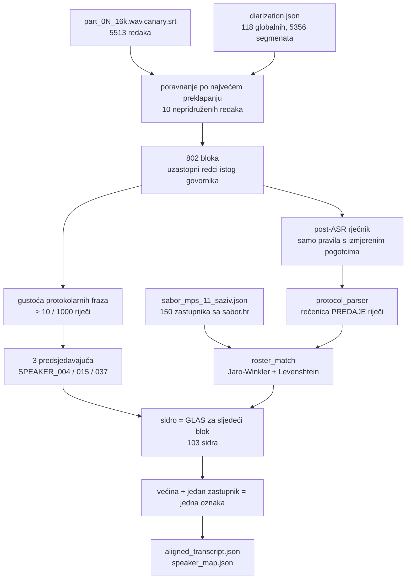

# Faza 03 — ASR poravnanje, službeni registar i protokolarno imenovanje (2026-08-25)

Provedba `sabor_pipeline/03_asr_and_protocol_parser.md` nad pilot-sjednicom
`sabor_11_izvanredna_11_gospic` (20 h 01 min, 4 YouTube streama, 2 dana).

Specifikacija **nije bila pregledana** prije pisanja koda; ispravci su nabrojani
u zaglavlju same specifikacije. Ovaj dokument bilježi što je izvedeno, s kojim
mjerenjima, i gdje su rupe.

---

## 1. Registar zastupnika se SCRAPEA, ne generira

`sabor_pipeline/tools/fetch_sabor_roster.js` → `data/rosters/sabor_mps_11_saziv.json`

Izvor je javni JSON API koji pogoni službeni interaktivni raspored:

```
https://www.sabor.hr/api/interaktivna-sabornica-new?_format=json
```

Normalizacija imena (uključujući `slug` fallback) preuzeta je iz provjerene
skripte `../izbori.domovina.ai/scripts/fetch_sabor_seating.py`, koja je isti
API već koristila za `u_saboru` zastavicu u arhivi izbora.

| Mjera | Vrijednost |
|---|---|
| mjesta u odgovoru API-ja | 150 |
| isparsiranih zastupnika | **150** |
| mjesta u Saboru | 151 |
| klubova | 15 |
| dvosmislenih prezimena | **3** |

Zbroj `number` po klubovima je 158, a ne 151, jer manjinski zastupnici ulaze i
u „Zastupnici nacionalnih manjina" i u svoj klub (158 − 8 = 150). Razlika do 151
nije greška: raspored prikazuje samo **popunjena** mjesta.

### 1.1 Što registar NE sadrži — i zašto to smije boljeti

Raspored sjedenja daje **samo zastupnike**. Ne daje:

* **članove Vlade** — a ministrica je na ovoj sjednici najveći pojedinačni
  govornik (**87 minuta**, 83 bloka odgovora);
* **dužnost** (predsjednik / potpredsjednici Sabora) — polje `duznost` ostaje
  `null` jer izvor tu informaciju ne nosi;
* **rod** — polje `spol` ostaje `null` (vidi §4.3, gdje se izvodi zasebno i
  označeno kao izvedeno).

Provjera da ograničenje radi u pravom smjeru: `matcher.resolve("Vučković")`
vraća **`null`**, a ne „najbližeg" zastupnika. Osoba izvan registra ne dobiva
izmišljeni identitet — to je cijela svrha pravila.

### 1.2 Tri dvosmislena prezimena su otkrivena, ne pretpostavljena

Skripta sama izračuna koja se prezimena ponavljaju i upiše ih u
`ambiguous_surnames`:

| prezime | nositelji |
|---|---|
| BORIC | Josip Borić \| Rada Borić |
| MARKOVIC | Ivana Marković \| Miroslav Marković |
| MILOS | Anteo Milos \| Jelena Miloš |

Predsjedavajući gotovo uvijek kaže **samo prezime**, pa bi bez ovog popisa
„Kolegice Miloš, izvolite" nasumično pogodilo jedno od dvoje.

---

## 2. Tok faze 03



---

## 3. Rezultat nad pilot-sjednicom

| Mjera | Vrijednost |
|---|---|
| SRT redaka | 5513 (nepridruženih **10**) |
| blokova | **802** |
| predsjedavajućih | **3** — isti kao u §8.10 memorijskog dokumenta |
| sidrenih najava | **103** |
| oznaka s glasovima | 63 → **razriješeno 61** |
| različitih imenovanih zastupnika | **61** |
| imenovanih blokova | 276 / 802 |
| **imenovanog govornog vremena** | **58.5 %** |

Razine pouzdanosti: **18 visoka** (≥ 2 složne najave), **43 srednja** (jedna
najava), **4 nerazriješeno**. Najniži prihvaćeni rezultat podudaranja imena je
**0.861**, medijan **1.0**.

Vrste sidara: rasprava 36, replika 23, povreda poslovnika 20, klupska rasprava
12, pojedinačna rasprava 11, stanka 1.

Predsjedavajući ostaju **bez imena**: njih nitko ne najavljuje, pa protokol o
njima ne kaže ništa. To je poznata rupa, ne previd (§6).

---

## 4. Tri ograde koje su spriječile tihu pogrešku

### 4.1 🎯 Rečenica PREDAJE riječi, a ne posljednje ime u bloku

Najveći nalaz cijele faze. Blok predsjedavajućeg zna trajati pola minute i
spominjati imena koja **nisu** primatelj riječi:

> „Kolega Marković, molim vas sjednite… **Kolega Štromar**, molim i vas isto
> tako… Nemojte, pustite ljude… **Izvolite odgovor, ministrice.**"

Prva izvedba je uzela posljednje ime u bloku i time zalijepila **„Predrag
Štromar" na 87 minuta ministričinog govora** — a jer je to bio jedini glas za
tu oznaku, s „pouzdanošću 1.0".

Ograda: ime se traži **samo u posljednjoj rečenici koja sadrži poziv**
(„izvolite", „na redu", „govorit će"). Ako ta rečenica imenuje ulogu izvan
registra („ministrice"), sidra namjerno **nema**.

Učinak mjeren na cijeloj sjednici:

| | sidara | različitih zastupnika | imenovano vrijeme |
|---|---|---|---|
| bez ograde | 103 | 60 | 67.5 % |
| **s ogradom** | 98 | 60 | 57.2 % |

Deset postotnih bodova „pokrivenosti" bilo je **krivo pripisano vrijeme**.
Dvije dopune vratile su recall bez gubitka preciznosti (§4.2).

### 4.2 Golo „Izvolite." i kratki proceduralni blok

Dominantni obrazac stavlja ime u **prethodnu** rečenicu:

> „Prelazimo na treću raspravu. Klub nezavisnih zastupnika, govorit će kolega
> Nino Raspudić. **Izvolite.**"

Zato: ako rečenica predaje ne sadrži ime **i** ne imenuje ulogu izvan registra,
gleda se **točno jedna** rečenica unatrag. Dva koraka već hvataju imena iz
drugog konteksta.

Druga dopuna: blok predsjedavajućeg **kraći od 20 riječi** bez ijednog poziva
ipak se čita kao najava („Kolega Miletić, povreda Poslovnika." — 4 riječi).
Duži blok bez poziva je ukor i ime u njemu nije primatelj riječi („Kolegice
Orešković, onda ne možete govoriti…" — 25 riječi).

Prag je odabran tako da razdvaja upravo te dvije izmjerene populacije.

### 4.3 Rod titule razrješava dvosmisleno prezime

Sva tri dvosmislena prezimena 11. saziva su **rodovno raznorodni parovi**, pa
titula koju predsjedavajući ionako izgovori nosi dovoljno informacije:

> „**Kolegice** Miloš, izvolite." → Jelena Miloš (ne Anteo Milos)

Rod osobnog imena je **izveden**, ne iz izvora, pa je ograđen dvostruko: koristi
se isključivo kao razbijač već nastalog izjednačenja između dva pronađena
kandidata, i odustaje kad je ime rodovno dvoznačno (`Vanja`, `Saša`, `Matija`…)
ili kad rod ijednog kandidata nije siguran. Bez titule izjednačenje ostaje
nerazriješeno, točno kao prije.

Učinak: 98 → **103 sidra**, 60 → **61** različitih zastupnika, 57.2 → **58.5 %**.
Usput razrješava i „Kolega Juričević" (Josip Jurčević 0.906 vs Branka
Juričev-Martinčev 0.893 — razmak 0.013, ispod praga).

---

## 5. Zašto podudaranje imena nije obično uspoređivanje nizova

Dva neovisna izvora šuma, oba diraju **kraj** riječi a čuvaju početak:

1. **Hrvatska sklonidba** — „kolegu Troskot**a**", „riječima kolega Borić**a**".
2. **ASR distorzija** — izmjereno u ovom transkriptu: `Troskut`, `Troskogl`
   (Troskot), `Kukavic` (Kukavica), `Sela Kraspudić` (Selak Raspudić),
   `Raukard` (Raukar-Gamulin), `Biljka` (Bilek).

Zato je nosiva mjera **Jaro-Winkler** (nagrađuje zajednički prefiks), a
Levenshtein je druga, neovisna kočnica. Dodatna kočnica: ako se **prva dva
slova** ne poklapaju, rezultat se prepolovi — ni sklonidba ni ASR ne mijenjaju
početak prezimena, a bez toga se „Matić" i „Batić" vežu presložno.

Ta ista kočnica je razlog zašto `Sela Kraspudić` mora u rječnik (§4.1 spec-a):
`Kraspudić` vs `Raspudić` razlikuju se upravo u prva dva slova, pa matcher
pada na 0.70 i ispravno odbija. Rječnik popravlja ASR, matcher ostaje strog.

**Rječnik nosi izmjerene brojeve pojava**, ne hipoteze: `erha` → RH (169×),
`hadeze*` → HDZ (210×), `esdepe*` → SDP (69×), `pefas*` → PFAS (21×),
`uskok`/`dorh` malim slovima (24× / 19×), `andrija štampa` → Andrija Štampar
(4×). Pojmovi iz specifikacije bez ijednog pogotka (`HZJZ`, `Bilajska`,
`perfluorirane tvari`) **nisu** dodani — tiha zamjena teksta koji nitko nije
provjerio je rizik bez koristi.

---

## 6. Otvoreno — s brojkama, ne dojmom

### 6.1 Donja granica broja govornika: 70 od 118

`tools/verify_speaker_count.js` daje prvu procjenu **izvan** metode
klasteriranja: predsjedavajući svakog govornika najavi imenom, pa različitih
imenovanih ljudi ne može biti više nego stvarnih govornika.

| | |
|---|---|
| različitih najavljenih zastupnika | 65 |
| predsjedavajućih (nikad najavljeni) | 3 |
| uloga izvan registra (Vlada) | 2 |
| **donja granica** | **70** |
| klasteriranjem (faza 02b) | 118 |

70 ≤ 118 → **brojka iz faze 02b nije opovrgnuta**. Da je donja granica premašila
118, spajanje bi bilo preagresivno i alat bi pao s izlaznim kodom 1.

Zazor od 48 oznaka (40.7 %) **nije dokaz nadsegmentacije**: upadice iz klupa,
dobacivanja i tehnička javljanja nemaju protokolarnu najavu, pa ih ova metoda po
konstrukciji ne broji. Samo 6 oznaka ima manje od 30 s govora, pa zazor nije ni
objašnjen samim krhotinama. **Ovo pitanje ostaje otvoreno**, ali je sada
omeđeno s obje strane umjesto samo s jedne.

### 6.2 Predsjedavajući nemaju imena

Njih nitko ne najavljuje. Poznato je da ih je troje i da rotiraju čisto (§8.10
memorijskog dokumenta), ali koji je koji — protokol ne kaže. Za imenovanje bi
trebao izvor izvan rasporeda sjedenja (popis predsjednika i potpredsjednika
Sabora) ili glasovni otisak s druge, imenovane sjednice.

### 6.3 Članovi Vlade nemaju imena, ali imaju ULOGU

Kad predsjedavajući preda riječ ulozi („Izvolite odgovor, ministrice."),
oznaka dobiva `role_hint: "clan_vlade"` umjesto imena. SPEAKER_001 ga ima s
**5 neovisnih potvrda**. Time najveći govornik sjednice nije „nepoznat" nego
„neimenovan član Vlade" — razlika koja se dalje može provjeriti.

Puno imenovanje traži scrape sastava Vlade (`vlada.gov.hr`); nije napravljeno.

### 6.4 Recall sidrenja: 103 od 182 poziva

Od 182 bloka predsjedavajućeg koji sadrže poziv, 103 daju sidro, 6 daju ulogu,
**78 ne daju ništa**. Uzorak pokazuje da su ta 78 uglavnom **legitimno bezimeni**:
„Izvolite odgovor.", „Izvolite nastaviti.", „Odgovor na repliku, izvolite." —
riječ se vraća osobi koja već govori, pa ime nije ni izgovoreno. Nije mjereno
koliko ih je stvarno propušteno.

---

## Vezani dokumenti

* `sabor_pipeline/03_asr_and_protocol_parser.md` — izvorna specifikacija sa zaglavljem ispravaka
* `docs/pipeline_memorija_i_propusnost_2026-08.md` §8 — faza 02, mjerenja i tri ispravka
* `sabor_pipeline/README.md` — kako se faze pokreću
