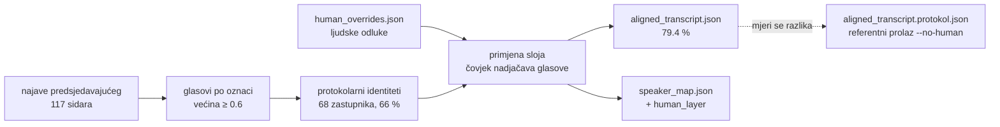
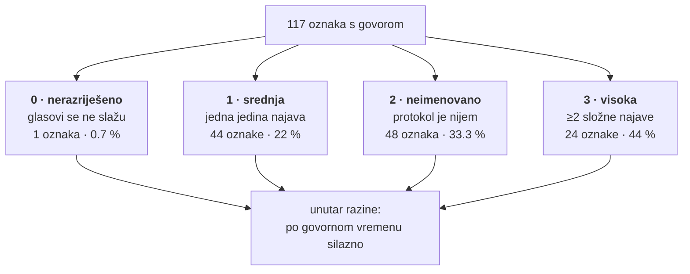

# Ljudski pregled imenovanja govornika — sloj odluka i aplikacija (2026-08-26)

Protokolarno sidrenje staje na **66 % govornog vremena** i to je strop, ne bug
(`docs/sabor_pilot_zakljucak_2026-08.md` §7: 19 od 28 preostalih govornika
predsjedavajući nikad ne imenuje). Ovo je mehanizam koji ostatak zatvara
čovjekom, a da run ostane ponovljiv i da se i dalje zna što je rekao stroj.

Mjereno na pilot-sjednici: **66 % → 79.4 % imenovanog vremena s tri odluke**,
uz protokolarni udio nepromijenjen na 66 %.

---

## 1. Zašto zaseban sloj, a ne upis u transkript

`aligned_transcript.json` je **izvedena** datoteka. Faza 03 se pokreće ponovno
pri svakom popravku sidrenja (u pilotu sedam puta u dva dana), i svaki bi takav
prolaz pregazio ručni upis — tiho, bez ijedne poruke.

Zato ljudska odluka živi u `human_overrides.json` pored transkripta, a faza 03
je pri svakom prolazu primijeni kao sidro najvišeg prioriteta:



Tri stvari koje sloj mora nositi, i zašto:

| polje | zašto |
|---|---|
| `odlucio` + `odluceno_at` | odluka bez potpisa nije odluka nego anonimna izmjena podatka |
| `razlog` + `dokaz` | ista odluka se za pola godine mora dati provjeriti bez ponovnog slušanja |
| `mp_id` (kad postoji) | ime se čita iz registra pri svakom prolazu, pa promjena saziva ne ostavi zamrznuti zapis |

**Referenca se ne snima, nego preračunava.** `--no-human --suffix .protokol`
proizvodi ono što bi protokol dao sam, pri svakom pokretanju. Snimak bi nakon
idućeg popravka sidrenja zastario i ljudskom sloju pripisao tuđu zaslugu.

---

## 2. Odluke

| odluka | učinak | kad |
|---|---|---|
| `imenuj` | pripisuje identitet | protokol šuti ili je promašio |
| `potvrdi` | bilježi pregled, ime ostaje isto | oznaka stoji na **jednoj** najavi |
| `odbaci` | oznaka MORA ostati bezimena | protokolarno ime je promašaj, a točno se ne zna |
| `preskoci` | ništa; ispada iz reda | pregledano, odluka odgođena |

`imenuj` prima i **ime izvan registra** (uz obaveznu ulogu). To je jedini put
za članove Vlade — registar sa sabor.hr je raspored sjedenja i njih ne sadrži.

> **Predsjednik Sabora JEST u registru.** On je zastupnik; protokol ga ne
> imenuje samo zato što njega nitko ne najavljuje. Za njega se upisuje `mp_id`,
> ne slobodno ime — na to je upozorila revizija kad je prva verzija ovog
> dokumenta pretpostavila suprotno.

---

## 3. Red čekanja — poredak je tvrdnja, ne ukras



Razina 1 postoji zato što je „riješeno s jednim glasom" najkrhkije stanje u
sustavu: izgleda jednako sigurno kao šest složnih najava (`confidence: 1.0`),
a počiva na jednoj rečenici koju je ASR mogao krivo čuti.

Razina 2 nosi 33.3 % vremena i tu leži sav dobitak: **jedna odluka o oznaci
ministrice (87 min) vrijedi 8.1 postotnih bodova.**

---

## 4. Što aplikacija stavlja na jedan ekran

`node sabor_review/server.js` → `http://localhost:8788` (bez ijedne vanjske
ovisnosti, isti obrazac kao `dashboard/server.js`).

Za svaku oznaku, bez prebacivanja kartica:

* **tekst istupa**, najduži prvi — na njima se identitet najlakše prepoznaje;
* **najava predsjedavajućeg neposredno prije svakog istupa** (`handoverSentence`,
  isti postupak kao `tools/adjudicate_blind.js`) — jedini dokaz koji protokol
  uopće ima;
* **YouTube deep link** u točan video od četiri, i za istup i za najavu;
* **kandidati sa slikom iz registra**, svaki s izvorom (`najava` / `model` /
  `natjecatelj`) i doslovnim dokazom;
* prijedlozi **slijepe provjere** iz `blind_check_agy/w*.json`.

Odluka → faza 03 → razlika, sve u **~0.4 s** (faza 03 nad 20 h traje 0.19 s),
pa je petlja „AI → čovjek → AI" doslovno interaktivna.

⚠️ Ako faza 03 padne (npr. sukob dviju odluka o istoj osobi), sloj se **vraća
na prijašnje stanje**. Polovična odluka na disku bila bi gora od odbijene.

---

## 5. Skupna potvrda — i granica koju ne prelazi

64 oznake (642 min) imaju istu osobinu: **protokolarna najava i slijepa provjera
modelom daju isto ime**. To su dva neovisna postupka — model je čitao gole
oznake `SPEAKER_042`, bez registra i bez imena.

Skupna potvrda ih zatvara jednim potezom, ali u `razlog` upisuje doslovno što
se dogodilo: *„skupna potvrda: protokolarna najava i slijepa provjera modelom
daju isto ime; snimka nije preslušana"*. Provenijencija koja laže gora je od
neodlučene oznake.

Uvjet je namjerno uzak — imena se uspoređuju **po identitetu iz registra**, ne
po nizu znakova. Bez toga „Habijen"/„Habijan" i „Auguštan"/„Auguštan-Pentek"
prolaze kao različite osobe. Nakon razrješavanja: 64 slaganja, **6 oznaka gdje
model sam sebi proturječi**, i **0 gdje model proturječi protokolu**.

---

## 6. ⚠️ Greška koja je uhvaćena mjerenjem, a ne pregledom koda

Prva verzija sloja svakoj je ljudskoj odluci upisivala `identity_source:
"covjek"`. Djelovalo je ispravno i prošlo je 14 testova.

Onda je skupna potvrda potvrdila 64 imena koja je **protokol sam našao**:

| | prije | poslije potvrde |
|---|---|---|
| imenovano vrijeme | 79.4 % | 79.4 % |
| od toga protokol | 66 % | **6 %** |
| od toga čovjek | 13.4 % | **73.3 %** |

Mjera uvedena da razdvoji stroj i čovjeka uništila je samu sebe prvim skupnim
pregledom — a nijedno ime se nije promijenilo.

**Ispravak:** autorstvo nije isto što i provjerenost. Čovjek je izvor imena
samo ako se identitet **razlikuje** od onoga što je protokol razriješio za tu
oznaku (uključujući slučaj kad protokol nije razriješio ništa). Inače ime
ostaje protokolarno, uz `verified_by_human: true`.

Pouka je ista kao u §9.2 zaključka pilota, samo obrnuta: ondje je mjerenje
oborilo pogrešan zaključak, ovdje je **posljedica jedne radnje na mjeri**
otkrila grešku koju ni testovi ni čitanje koda nisu vidjeli. Četiri testa sada
drže to pravilo prikovanim.

---

## 7. Neovisna provjera ljudskog sloja

Ljudska odluka ulazi s pouzdanošću 1.0 i nadjačava sve. To je **isto svojstvo**
zbog kojeg deterministička faza 03 nije mogla naći vlastite promašaje: kad
pogodi, „sigurna" je 1.0, i jednako je sigurna kad promaši. Bez mjere koja ga
može oboriti, ljudski sloj bi bio jedini mehanizam imenovanja bez ijedne
provjere.

`tools/audit_overrides.js` provjerava pet stvari:

| # | provjera | što hvata |
|---|---|---|
| 1 | protokolarni sukob | koliko je složnih najava odluka pregazila |
| 2 | dijeljena oznaka | tvrdnju „ove dvije oznake su ista osoba" — **akustički** |
| 3 | ime izvan registra | osobu koja je ipak u registru, samo promašena |
| 4 | odluka bez dokaza | unos bez citata i razloga |
| 5 | suprotno modelu | slijepa provjera je za tu oznaku rekla nešto drugo |

**Da „0 nalaza" ne bi značilo „provjera je pokvarena", alat je pušten na
namjerno krivu odluku** — oznaci sa šest složnih najava za Mariju Selak
Raspudić pripisan je Krešimir Ačkar. Revizija ga je uhvatila s tri strane
odjednom (sukob, bez dokaza, suprotno modelu) i izlaznim kodom 1.

### 7.1 Akustička provjera dijeljene oznake

Dvije ljudske odluke o istoj osobi ne razrješavaju se tiho. To je ili greška u
pregledu ili tvrdnja da je faza 02b istu osobu **razdvojila** — a to je
akustička tvrdnja i mjeri se:

```bash
python3 sabor_pipeline/tools/audit_merge_cohesion.py --session <id> --cross SPEAKER_A,SPEAKER_B
```

`--cross` mjeri udaljenost **između** dviju oznaka (dotad se mjerio samo
promjer unutar jedne). Izmjereno na pilotu:

| par | min | tumačenje |
|---|---|---|
| `SPEAKER_068` ↔ sam sa sobom | **0.000** | kontrola |
| `SPEAKER_005` ↔ `SPEAKER_080` | 0.561 | različiti glasovi |
| `SPEAKER_001` ↔ `SPEAKER_012` | 0.881 | različiti glasovi |
| prag spajanja | 0.263 | |

Kontrolna vrijednost 0.000 i razdvojenost 0.56–0.88 pokazuju da mjera doista
diskriminira. Namjerna tvrdnja da su `SPEAKER_001` i `SPEAKER_012` ista osoba
oborena je mjerenjem, iako je bila izričito dopuštena.

Uzgred, to potvrđuje i §9.1 zaključka pilota s treće strane: slijepa provjera
je za `SPEAKER_005` tvrdila Miroslava Markovića, a `SPEAKER_080` je neovisno
identificiran kao Marković. Da je model bio u pravu, te bi dvije oznake bile
isti glas — udaljene su **0.561**. Faza 03 je taj sukob dobila.

---

## 8. Mjereni učinak na pilot-sjednici

| | protokol sam | + 3 ljudske odluke |
|---|---|---|
| imenovanih oznaka | 68 | **71** |
| različitih osoba | 68 | **71** |
| imenovano vrijeme | 66 % | **79.4 %** |
| od toga protokol | 66 % | 66 % |
| od toga čovjek | 0 % | 13.4 % |

Tri odluke: ministrica Marija Vučković (87.1 min), predsjednik Sabora Gordan
Jandroković (30.8 min), ministrica Irena Hrstić (25.3 min). Sve tri su klasa
koju protokol **po konstrukciji** ne može imenovati — dvije nisu u registru, a
predsjedavajućeg nitko ne najavljuje.

⚠️ Te tri odluke i 64 skupne potvrde na disku su potpisane
`claude-code (prijedlog — traži ljudsku potvrdu)`. Dokaz uz svaku je stvaran
(citat iz slijepe provjere), ali potpis nije ljudski i tako i piše.

---

## 9. Što ostaje otvoreno

1. **Zazor od 42 oznake** (76 ≤ 118) i dalje je neobjašnjen. Aplikacija ga sada
   barem izlaže: 45 oznaka u razini „neimenovano", od toga 6 s manje od 30 s
   govora.

2. **Jedna sumnja postavljena pa NEPOTVRĐENA.** Tekst `SPEAKER_049` čita se kao
   dvoje ljudi: jedan blok govori u ime Vlade i HDZ-a, drugi se obraća
   ministrici. Akustička mjera to **ne potvrđuje** — promjer je 0.138 uz prag
   0.263 i sesijski maksimum 0.230. Mjera ima i ogradu: gradi se iz tri lokalna
   centroida za četiri bloka, pa sporni blok možda nije ni zastupljen.
   **Tekst i akustika se ne slažu i pitanje ostaje otvoreno** — ovdje se ne
   zapisuje zaključak, nego neslaganje.

3. **Bilješke faze 04 starije su od svih ispravaka imenovanja.** Aplikacija
   nudi pokretanje (~33 min, troši LLM kvotu), ali izričito, ne klikom usput.

4. **Glasovni otisak kroz sjednice** ostaje pravi sljedeći korak. Ljudski sloj
   je i njegov preduvjet: imenovana oznaka s dokazom je označeni uzorak za
   `pgvector`, pa ono što je čovjek jednom odlučio idući put može odlučiti
   centroid.

---

## Vezani dokumenti

* `docs/sabor_pilot_zakljucak_2026-08.md` — što pilot daje, četiri provjere
* `docs/sabor_faza03_protokol_i_registar_2026-08.md` — sedam defekata imenovanja
* `sabor_pipeline/README.md` — kako se pokreće
