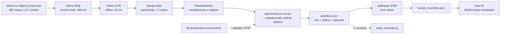

# Natpis s ekrana kao izvor identiteta govornika — izvedba i mjerenja (2026-08-26)

Saborska režija ispisuje ime govornika u donjoj traci. Ovaj dokument bilježi
što je izmjereno kad se ta traka pretvorila u treći izvor identiteta, uz
protokolarnu najavu i slijepu provjeru modelom.

Priprema i polazna procjena: `docs/2026-08-26-sabor-ocr-imena-s-ekrana.md`.
Gdje se novi izvor uklapa: `docs/sabor_human_in_the_loop_2026-08.md` §1 i §7.

**Ishod u jednoj rečenici:** od **49 oznaka koje protokol ne imenuje**, ekran
imenuje **45** (2.8 h govora iz registra + 2.0 h članova Vlade), uz **100 %
slaganja s protokolom** ondje gdje oba izvora imenuju osobu (67/67) i **nula**
slučajeva u kojima ekran tvrdi drugu osobu.

---

## 1. Pitanje koje je moglo srušiti zamisao — provjereno prvo

Priprema je označila jedno pitanje kao kritično: *pojavljuje li se natpis samo
kad predsjedavajući najavi govornika?* Ako da, OCR pokriva točno one koje
protokol već pokriva i cijela zamisao ne vrijedi.

Pokus prije ijedne linije alata: 20 oznaka koje protokol **ne** imenuje, po tri
sličice iz najduljeg bloka svake.

| | rezultat |
|---|---|
| oznaka s natpisom koji nosi ime | **19 / 20** |
| među njima | `SPEAKER_012` (28 min, Milorad Pupovac), `SPEAKER_035` (Božo Petrov), replike koje predsjedavajući ne najavljuje poimence |

Natpis nosi i **vrstu istupa** („Replika", „Odgovor na repliku", „Pojedinačna
rasprava"), pa se pojavljuje i na istupima koje protokol strukturno ne može
imenovati. Zamisao je preživjela.

---

## 2. Rezolucija — 480p, i to je izmjereno

Ista 23 trenutka na četiri rezolucije, čitanje uspoređeno s 1080p:

| format | rezolucija | identično 1080p | što gubi |
|---|---|---|---|
| `134` | 640×360 | 14 / 23 | dijakritiku — „Markovic", „stromar", „Bjezančević" |
| **`135`** | **854×480** | **22 / 23** | ništa bitno |
| `136` | 1280×720 | 22 / 23 | — (ne donosi ništa preko 480p) |

`RosterMatcher` doduše proguta i 360p greške („Miroslav Markovic" → Miroslav
Marković, rezultat 1.0), ali nema razloga trošiti mu rezervu na šum koji se
uklanja jednim formatom više. **Default je `-f 135`.**

⚠️ Format se navodi **izričito**, nikad kao „bestvideo" lanac. To je zamka iz
`screenshot_youtube.js`: lanac koji krene od live-only HLS formata tiho padne
na 360p progressive.

---

## 3. Seek vs preuzimanje — izmjereno, ne pretpostavljeno

| put | mjereno | trošak diska |
|---|---|---|
| **mrežni seek** (`ffmpeg -ss` prije `-i`, conc 16) | **269 ms/sličica** → ~11 min za 2400 | 0 (samo sličice) |
| preuzimanje 480p avc1 | 4.4 GiB @ 5.4 MiB/s ≈ 14 min + 8 ms/sličica lokalno | **4.4 GB** |

Vrijeme je praktički izjednačeno, pa je odluka pala na ostalo: seek ne traži
4.4 GB na disku koji je na 95 %, i prekinut posao se nastavlja **po sličici**
umjesto ispočetka. Stream URL vrijedi ~6 h — više nego dovoljno za cijeli prolaz.

Paralelnost je mjerena, ne pogođena:

| conc | ms/sličica |
|---|---|
| 4 | 823 |
| 8 | 349 |
| **16** | **269** |

Sam OCR je zanemariv: **55 ms/sličica** (1191 sličica za 44 s).

> Preuzimanje ostaje ispravan fallback kad yt-dlp udari u anti-bot — `ffmpeg`
> jednako radi s lokalnom datotekom kao sa stream URL-om.

---

## 4. Kako se uklapa



**OCR ne piše transkript.** Proizvodi prijedloge; ime ulazi kroz
`human_overrides.json`, a `aligned_transcript.json` i dalje piše samo faza 03.
Run ostaje ponovljiv.

---

## 5. Neovisna provjera — i zašto brojka nije bila 95.6 %

`--validate` pušta **isti postupak** na 68 oznaka koje je protokol imenovao:

```
oznaka u provjeri:               68
✅ isti zastupnik:               67  (98.5 %)
⛔ ekran tvrdi DRUGU OSOBU:      0
~  bez prijedloga:               1   (nerazriješeno očitanje)
→ ondje gdje ekran IMENUJE osobu: 100.0 % slaganja (67/67)
```

Prva verzija izvještaja pokazala je **„drukčije ime: 3"**. Sva tri su bila
znakovni šum, ne druga osoba: `Darko_Klasic`, `MariniMandarić`,
`Magdalena Klimes`. Zbrojiti ih s „ekran tvrdi drugu osobu" značilo je sakriti
da je **opasna kategorija prazna**. Otud dva odvojena retka.

Dvije od tri riješene su **mehaničkim** čišćenjem artefakata (podcrtnica umjesto
razmaka; razmak izgubljen na granici malo→veliko slovo). Treća — `Klimes` vs
registarsko `Komes` — ostaje **nerazriješena, i to je ispravan ishod**:
popravljanje slova do najbližeg zastupnika je upravo onaj tihi promašaj zbog
kojeg prag 0.86 postoji.

> ⚠️ Provjera mjeri `p.prijedlog` — **točno onu odluku koja ide u aplikaciju**.
> Prva verzija je mjerila blaži unutarnji put (sirovi `kandidati[0]`, bez
> ograde), a to je način da provjera pokaže 100 % za sustav koji griješi.

---

## 6. Ograda protiv izmišljenog imena

Tri oznake pokazale su zašto „vodeći kandidat pobjeđuje" nije dovoljno:

| oznaka | govor | očitanja |
|---|---|---|
| `SPEAKER_015` | 15 min, **121 blok** | 1× Urša Raukar-Gamulin, 1× Mislav Herman, 1× Matej Mostarac |
| `SPEAKER_037` | 7 min, 58 blokova | 2× Ivan Dabo, 1× Irena Petrijevčanin |

Oznaka koja skuplja **kratke upadice** rijetko dobije vlastiti natpis — a natpis
koji u tom trenutku jest na ekranu pripada osobi koja **drži riječ**. Slaba
pokrivenost zato nije samo tanak dokaz nego dokaz o **krivoj** osobi.

Pragovi su očitani s provjerenog skupa, ne pogođeni. Među 68 oznaka sa 100 %
slaganja:

| mjera | najniža vrijednost među TOČNIMA | postavljeni prag |
|---|---|---|
| pokrivenost natpisa | 0.29 | **0.25** |
| udio vodećeg kandidata | 0.57 | **0.50** |

Prag je namjerno **ispod** tih podova, pa dokazano ne odbacuje nijednu neovisno
potvrđenu oznaku — provjera to i mjeri naglas („ograda je zaustavila 0 oznaka
koje protokol ZNA"). Obje sporne oznake sjede na 0.13 pokrivenosti, upola ispod
poda. Ishod je **„nedovoljno dokaza", ne ime** — ne zna se tko je to, i to je
točan odgovor.

---

## 7. Četiri načina na koja bi natpis tiho dao krivo ime

Svaki je viđen u podacima, ne izmišljen.

### 7.1 Transparenti padnu u traku natpisa

Zastupnici su držali plakate „ODGOVORNOST ZAKOPANA". Vision ih čita, i jedan je
pao **točno** u koordinate imena. Zato natpis nije „prvi redak odozdo" nego
geometrija (`POLJE_IME`) plus tri strukturna uvjeta: mora postojati **vrsta
istupa** u svom pojasu, kandidat **ne smije biti verzal** (natpis je Title Case,
transparenti nisu), i ne smije biti iz rječnika vrsta.

### 7.2 Traka zna nositi samo vrstu, bez imena

„Odgovor na repliku" bez imena — tada vrsta klizne gore u pojas imena.
Prijedlog s takvim „imenom" bio bi čista izmišljotina.

### 7.3 Zajednički termin nije jedna osoba

Natpis `Vučković-Hrstić-Habijan` je oznaka **termina** koji dijeli troje
ministara. Razlikuje se mjerenjem, u tri koraka:

1. dijelovi padnu na **≥2 različita** zastupnika → termin (`Hajdaš Dončić-Zmajlović`)
2. dijelovi padnu na **jednu** osobu → pravo dvostruko prezime (`Mrak-Taritaš`) → **nije** termin
3. **nijedan** dio nije u registru (ministri) → termin ako nabraja **sama prezimena**, bez ijednog osobnog imena

Korak 3 postoji jer Vlada nije u registru zastupnika, pa je korak 1 ne vidi.
Na pravo dvostruko prezime ne može opaliti: traka ga uvijek daje s osobnim
imenom („Anka Mrak Taritaš").

### 7.4 Nerazriješeni šum preglasa točno očitanje

`SPEAKER_042` je imao 5 očitanja „Martina Vlašić **l**ljkić" (OCR je `I` pročitao
kao `l`) i 3 točna „Martina Vlašić Iljkić". Šum je pobijedio i oznaka je ostala
bez prijedloga — ili gore, s **slobodnim tekstom** kao imenom.

Pravilo: **glasa se samo među očitanjima koja nekoga imenuju.** Niz koji se ne
da razriješiti ne imenuje nikoga, pa ne može ni nadglasati ime; broji se samo
kao pad pokrivenosti. Nakon toga `SPEAKER_042` → Martina Vlašić Iljkić (SDP).

---

## 8. Ishod na pilot-sjednici

| | oznaka | govor |
|---|---|---|
| bez protokolarnog imena | 49 | 6.1 h |
| ✅ predloženo iz registra | **42** | 2.8 h |
| 🏛️ predloženo izvan registra (Vlada) | **3** | 2.0 h |
| ⧉ zajednički termin — namjerno bez prijedloga | 1 | — |
| ⚠️ nedovoljno dokaza — ograda zaustavila | 2 | 0.4 h |
| ⌀ ekran nijem | 1 | 0.5 h |

Jedina posve nijema oznaka je `SPEAKER_004` — **predsjedatelj**. Režija ne
titluje predsjedavajućeg jer on ne govori iz tempiranog termina. To je uredan
ishod, ne rupa.

Prijedlozi nose i sekundu i **sličicu**, pa se u aplikaciji vide kao slika:
prijedlog bez slike koju čovjek može pogledati je tvrdnja, ne dokaz.

---

## 9. Šesta provjera nad ljudskim slojem

`tools/audit_overrides.js` dobio je šestu provjeru: **suprotno natpisu s
ekrana**, razine `visok` (viša od „suprotno modelu"). Model zaključuje iz teksta
i zna pogriješiti; natpis je ono što je režija doslovno ispisala dok je osoba
govorila.

Da „0 nalaza" ne bi značilo „provjera je pokvarena", puštena je na **namjerno
krivu odluku**: `SPEAKER_012` (ekran: Milorad Pupovac) pripisan Krešimiru
Ačkaru. Revizija ga je uhvatila i izašla s kodom 1. Na stvarnom sloju od 67
odluka: **0 nalaza**.

---

## 10. Uporaba

```bash
# prijedlozi za oznake koje protokol ne imenuje
node sabor_pipeline/tools/ocr_captions.js --session sabor_11_izvanredna_11_gospic

# neovisna provjera na protokolarno imenovanima (piše u provjera.json)
node sabor_pipeline/tools/ocr_captions.js --session <id> --validate

# jedna oznaka
node sabor_pipeline/tools/ocr_captions.js --session <id> --only SPEAKER_012
```

Alat gradi `sabor_pipeline/tools/ocr/vision_ocr` (Swift, `swiftc` — vidi
`sabor_pipeline/tools/ocr/README.md`). Bez njega ne radi.

Izlaz u `<sjednica>/ocr_captions/`: `prijedlozi.json`, `citanja.json`,
`ocr.jsonl` i `frames/` (dokazne sličice; nedokazne se brišu — 94 MB → 34 MB).
`--keep-frames` zadržava sve.

⚠️ `--validate` i `--only` **ne** pospremaju sličice: gledaju podskup oznaka, pa
bi im „nedokazna sličica" značila i svaku sličicu svih ostalih.

---

## Što ostaje otvoreno

* **`SPEAKER_010` sjedi na pokrivenosti 0.25**, točno na pragu. Prijedlog
  (Damir Habijan) je vjerojatno točan, ali je to najkrhkiji redak u skupu i
  zaslužuje pogled prije prihvaćanja.
* **Pragovi su očitani s jedne sjednice.** Druga režija (drugi saziv, druga
  sjednica) može imati drugu traku i druge koordinate. `POLJE_IME` je izmjereno,
  ne standard — pri prvoj novoj sjednici pusti `--validate` prije nego se
  ijedan prijedlog prihvati.
* **Vrsta istupa se ne koristi ni za što osim kao potvrda da je traka na
  ekranu.** „Replika" / „Odgovor na repliku" / „Pojedinačna rasprava" su gotova
  strukturna oznaka istupa koju faza 04 sad baca.

---

## Vezani dokumenti

* `docs/2026-08-26-sabor-ocr-imena-s-ekrana.md` — priprema i polazne procjene
* `docs/sabor_human_in_the_loop_2026-08.md` — sloj ljudskih odluka, aplikacija, revizija
* `docs/sabor_pilot_zakljucak_2026-08.md` — §7: zašto protokol staje na 66 %
* `sabor_pipeline/tools/ocr/README.md` — prevođenje OCR alata, jezici, koordinate
