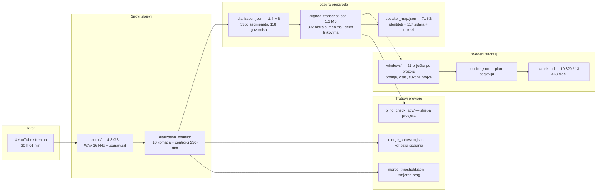
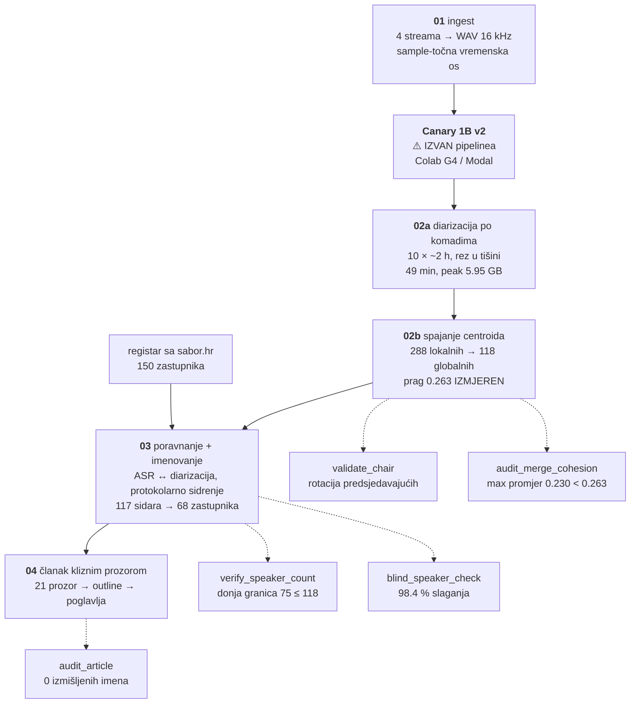
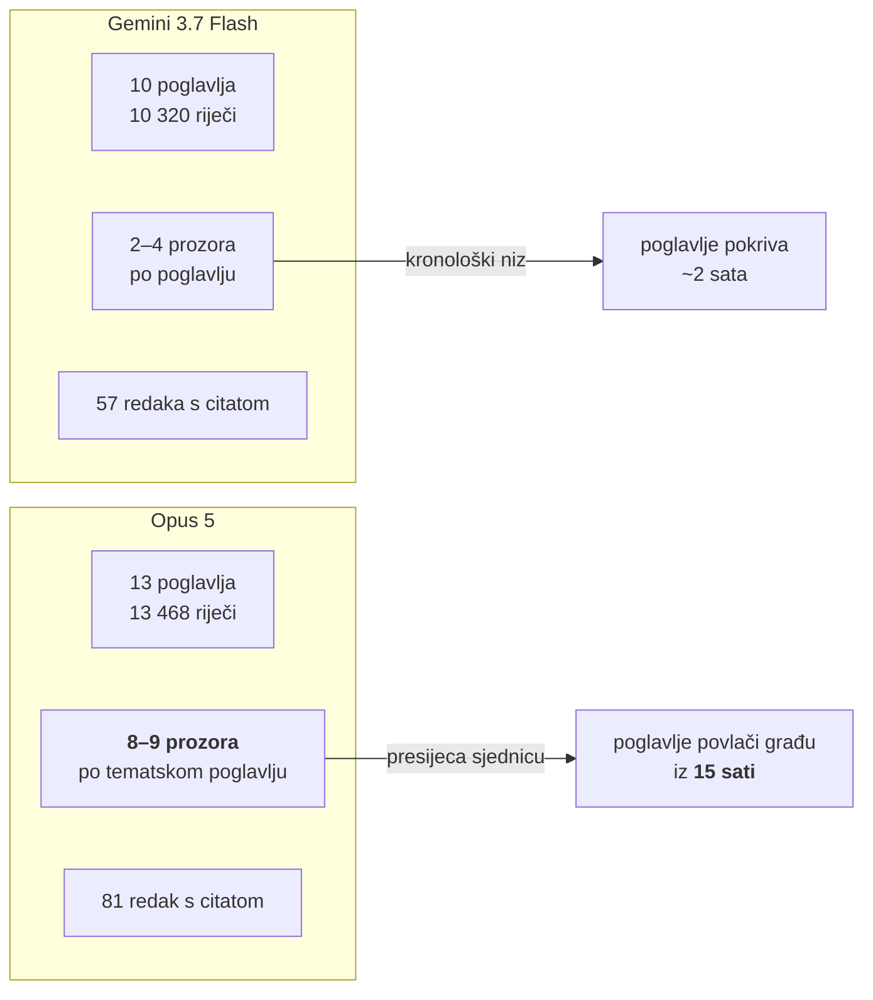
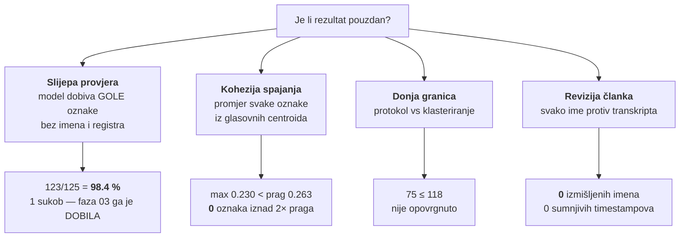
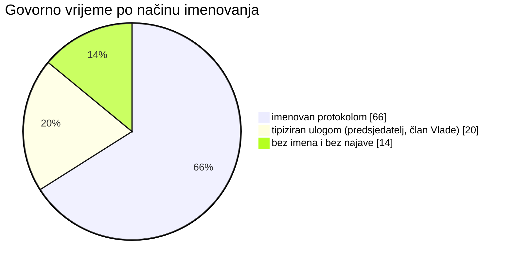

# Pilot obrade saborskih sjednica — zaključak (2026-08-26)

Što je izgrađeno u 48 h, što je izmjereno, i može li se na ovome graditi
produkcijski pipeline za saborske sjednice.

Pilot: **11. izvanredna sjednica Hrvatskoga sabora**, Gospić/otpad,
20.–21. 8. 2026. — **20 h 01 min 14 s**, 4 YouTube live streama, jedna tema.

---

## 1. Kratak odgovor

| Pitanje | Odgovor |
|---|---|
| Imamo li gotov proizvod na disku? | **Da** — dijarizirani i imenovani transkript + dva duga članka |
| Je li članak usporediv s podcast člancima? | **Da**, s outlineom i poglavljima; **duži** (10–13 tisuća riječi) |
| Razaznaju li se osobe? | **68 imenovanih zastupnika**, 66 % govornog vremena; ostatak označen ulogom, ne izmišljen |
| Možemo li pustiti druge sjednice? | **Da**, jednom naredbom (`run_sabor_session.sh`); ostaje ručna transkripcija na Colabu |
| Je li kvaliteta objektivno dobra? | **Da** — 98.4 % slaganja u slijepoj provjeri, 0 izmišljenih imena u člancima |
| Treba li još istraživanja? | **Ne za ovaj pristup.** Da, za ono što protokol ne može (≈ 34 % vremena) |

---

## 2. Što je na disku kao rezultat



### 2.1 Središnji artefakt — `aligned_transcript.json`

802 bloka; blok je **jedan neprekinuti istup jednog govornika**. Svaki nosi:

| polje | primjer | čemu služi |
|---|---|---|
| `speaker_id` | `SPEAKER_064` | stabilno kroz svih 20 h i 4 videa |
| `speaker_name` | `Željko Lacković` | iz službenog registra, nikad izmišljeno |
| `party` / `klub` | `Nezavisni` / `Klub…HSU` | za filtriranje i statistiku |
| `role` | `zastupnik` \| `predsjedatelj` \| `clan_vlade` \| `govornik` | tipizira i neimenovane |
| `identity_confidence` | `1.0` | koliko se najava složilo |
| `start_hms` | `00:25:49` | globalna os cijele sjednice |
| `youtube.url` | `…&t=1549s` | deep link u **točan** video od četiri |
| `text` | … | ASR + post-ASR rječnik |

Raspodjela uloga: **309 zastupnik**, 266 predsjedatelj, 107 član Vlade,
120 neimenovan.

### 2.2 Članak — jest ono što je i kod podcasta, samo veće

Isti oblik kao podcast pipeline (outline → poglavlja → tekst), ali:
**10 320 riječi u 10 poglavlja** (Gemini) odnosno **13 468 u 13** (Opus),
uz **312 / 303 timestampa** koji vode na točnu sekundu točnog videa.

Uz članak ostaje i **međusloj koji podcast pipeline nema**: 21 datoteka
strukturiranih bilježaka po prozoru (`teme`, `kljucne_tvrdnje`, `sukobi`,
`brojke_i_datumi`, `citati`, `proceduralno`). To je gotova građa za RAG,
timeline i „tko je što tvrdio" prikaze, bez ponovnog čitanja transkripta.

---

## 3. Kako je građeno



Pet neovisnih provjera nije ukras — svaka je nastala zato što je jedna
pretpostavka pala. Detalji: `docs/sabor_faza03_protokol_i_registar_2026-08.md`
i `docs/pipeline_memorija_i_propusnost_2026-08.md`.

---

## 4. Opus 5 protiv Gemini 3.7 Flash — mjereno, ne dojmljeno

### 4.1 ⚠️ Ispravak premise: „nekoliko puta brži" ne stoji

Dojam je bio da je Antigravity višestruko brži. Izmjereno po pozivu:

| | Gemini 3.7 Flash (agy) | Opus 5 (`claude -p`) |
|---|---|---|
| poziva | 31 | 19 |
| prosjek po pozivu | **83 s** | 109 s |
| pisanje poglavlja | ~59 s | ~78 s |
| **riječi po sekundi** | **17.5** | 13.3 |
| **omjer** | **1.0×** | **1.3× sporiji** |

Razlika je **1.3×, ne „nekoliko puta"**. Dojam dolazi odatle što je Gemini
prolaz završio dok je Opus još radio — ali uzrok tome nije brzina modela nego
**prekid zbog dosegnutog limita sesije** i ponovno pokretanje.

Napomena o mjerenju: `agy` ima ~2 min hladnog starta po pozivu (mjereno:
trivijalan prompt = 3.5 s modela, 2 min 06 s zidnog sata) koji se u nizu
poziva amortizira. Zato „brzina" ovisi o tome mjeri li se jedan poziv ili niz.

### 4.2 Gdje je Opus stvarno bolji



**Sinteza je jedina razlika koja se vidi golim okom.** Geminijeva poglavlja
uglavnom prate kronologiju. Opusovo poglavlje „SUKOB OKO ODGOVORNOSTI:
inspektor kojeg nema" povlači materijal iz prozora 0, 1, 2, 5, 9, 11, 15 i 16
— raspon od petnaest sati. To je posao zbog kojeg klizni prozor uopće postoji.

**Preciznost pod šumom.** Opus je u naslov zadnjeg poglavlja stavio
„78 protiv 64". U transkriptu to stoji riječima usred nepunktuiranog odsječka
(*„šezdeset četiri je bilo za, sedamdeset osam protiv"*), a u istoj sjednici
postoji i drugo glasovanje (81 za, 58 protiv) koje je **prošlo**. Izvučen je
točan par, točna orijentacija i točan ishod.

### 4.3 Gdje je Opus rizičniji

Revizija je Opusu prijavila „Prijatelji Gacke" kao izmišljeno. Nije — ASR je
napisao **„prijatelji Gatske"**, a Opus je naziv udruge **ispravio** na stvarni.

Ovdje je pomoglo. Ali to je ista sposobnost koja drugdje izmišlja: model koji
smije popraviti izvor prema svijetu smije ga i prepisati. **Za tu klasu nema
strojne provjere** — ispravak i halucinacija izgledaju identično dok se ne
usporedi s transkriptom.

### 4.4 Presuda

| Namjena | Model |
|---|---|
| **Produkcija, redovne sjednice** | **Gemini 3.7 Flash** — pokriva sve, 0 izmišljenih imena, 1.3× brži, ne troši Claude kvotu |
| **Sjednice od posebne važnosti** | **Opus 5** — sinteza kroz cijelu sjednicu, gušća citiranost, preciznost na izgovorenim brojkama |

Oba su prošla reviziju s **nula provjereno izmišljenih imena** i **nula
sumnjivih timestampova**, uz pokrivenost **20 od 21 sata**.

---

## 5. Je li kvaliteta objektivno dobra

Četiri neovisna mjerenja, nijedno samoocjena modela:



### 5.1 Što te brojke znače

**98.4 % slaganja** je jak rezultat jer je provjera **slijepa**: model je dobio
transkript s oznakama `SPEAKER_042`, bez imena, bez uloge i bez registra
zastupnika (popis imena bio bi navođenje). Prvo mjerenje koje je dalo 98.9 %
bilo je **bezvrijedno i odbačeno** — prozori su već sadržavali imena iz faze 03,
pa je model prepisao odgovor koji mu je dan.

Jedini sukob (`SPEAKER_005`, 35.5 min) **faza 03 je dobila**: imala je 4 glasa,
3 za Pausa i 1 za Markovića, a najava je nedvosmislena. Pravilo većine radilo je
točno ono zbog čega je uvedeno.

### 5.2 Sedam defekata koje je slijepa provjera našla

Deterministička faza 03 nema unutarnju provjeru — kad pogodi, „sigurna" je 1.0,
i jednako je sigurna kad promaši. Sve ovo našao je tek model koji čita tekst:

| # | Defekt | Cijena da je ostao |
|---|---|---|
| 1 | golo osobno ime identificira osobu („Ana") | replika pripisana krivoj zastupnici |
| 2 | kraći prozor imena pobjeđuje duži | „Ana" umjesto „Ana Marija Blažević" |
| 3 | ASR **umeće** granicu riječi (`Anamarija` → „Ana Marija") | ime neprepoznato |
| 4 | jedno krivo slovo ruši podudaranje (`ILIKIC~ILJKIC` = 0.849) | zastupnica ispada „izvan registra" |
| 5 | `HANDOVER_RE` ne zna „**dati riječ**" | **31 min u 12 blokova** bezimeno |
| 6 | golo prezime prolazi prenisko (`ĆORIĆ~ĆOSIĆ` = 0.8607) | spomen bivšeg ministra postaje istup zastupnika |
| 7 | `HANDOVER_RE` ne zna oblike replike (`replicira` — **29×**) | 4 propuštena sidra |

Učinak: sidara 103 → **117**, imenovanih zastupnika 61 → **68**, imenovanog
govornog vremena 57.9 % → **66 %**.

### 5.3 Jedan zaključak koji je postavljen pa oboren

Kad je model za istu oznaku (`SPEAKER_042`) dao dva različita imena, zaključeno
je da je oznaka **prespojena** i da 118 ponegdje može biti *premalo*.

`audit_merge_cohesion.py` je to oborio: promjer te oznake je **0.058**, dakle
unutar populacije „ista osoba, različit zvuk" (max 0.077). Četiri centroida su
isti glas; model je pogriješio u jednom imenu, najvjerojatnije na bloku od 21 s.

**Pouka:** proturječnost modela je valjan signal *da nešto treba pogledati*, ali
ne i dokaz o tome **što**. Mjera je bila dostupna cijelo vrijeme.

---

## 6. Skripte za buduće sjednice

```bash
sabor_pipeline/run_sabor_session.sh --session <session_id>
sabor_pipeline/run_sabor_session.sh --session <id> --dry-run
sabor_pipeline/run_sabor_session.sh --session <id> --from 03
sabor_pipeline/run_sabor_session.sh --session <id> --article-backend claude
```

Orkestrator **provodi** četiri pravila, ne samo ih dokumentira:

| Pravilo | Provedba |
|---|---|
| Diarizacija je striktan preduvjet za korak 03 | nema `diarization.json` → ABORT |
| Nikad dva pyannote posla paralelno | `ps` provjera → ABORT |
| Prag se **mjeri**, ne prepisuje | nema `merge_threshold.json` → 02b se ne pokreće |
| Transkripcija je Canary, radi se izvana | nedostaje `.canary.srt` → ABORT s uputom |

### 6.1 Što je nastalo u 48 h

**34 datoteke** u `sabor_pipeline/` + 3 dokumenta, kroz 8 sabor-commita
(`ac6da5f` … `caee3a9`):

| Sloj | Datoteke |
|---|---|
| faze | `01_ingest.js`, `02_diarize.py`, `02b_merge_speakers.py`, `03_transcribe_and_align.js`, `04_article_sliding_window.js` |
| orkestracija | `run_sabor_session.sh` |
| moduli | `time_mapper`, `audio_chunker`, `diar_runner`, `machine_guard`, `protocol_parser`, `roster_match`, `asr_dictionary` |
| podaci | `data/rosters/sabor_mps_11_saziv.json`, `data/sessions/*.json` |
| provjere | `calibrate_threshold`, `validate_chair`, `verify_speaker_count`, `blind_speaker_check`, `adjudicate_blind`, `audit_article`, `audit_merge_cohesion`, `crosscheck_speakers` |
| testovi | `test_protocol_parser.js` (23), `test_merge_speakers.py`, `time_mapper.test.js` |

Usporedno je u istom razdoblju nastalo i ono što je pilot **omogućilo**:
mjerenja memorije i propusnosti (`docs/pipeline_memorija_i_propusnost_2026-08.md`),
`sf.read` s `dtype=float32` (3× manje memorije po epizodi), Modal
`from_volume` ruta iznad 1 GB, i nadzornik stroja.

### 6.2 Što još nije automatizirano

| Rupa | Zašto |
|---|---|
| **Transkripcija** | Canary se vrti na Colabu G4 / Modalu; orkestrator ju traži, ne pokreće |
| **Otkrivanje sjednica** | `data/sessions/*.json` se piše ručno (video ID-ovi po dijelovima) |
| **Isporuka** | nema R2 uploada ni RAG chunkanja za saborski format |

---

## 7. Treba li još istraživanja

**Za ovaj pristup — ne.** Postupak je izmjeren s četiri strane i drži.

**Za ono što protokol ne može — da.** Od 28 govornika koje je model prepoznao a
faza 03 nije, **19 nema nikakvu najavu**: upadice, dobacivanja, „Izvolite
odgovor.", „Hvala." Predsjedavajući te ljude nikad ne imenuje, pa nikakvo
proširenje regexa ne pomaže.



**66 % je blizu stropa protokolarnog sidrenja.** Za ostatak postoje tri smjera,
poredana po omjeru koristi i truda:

1. **Glasovni otisak kroz sjednice.** Zastupnik imenovan na jednoj sjednici
   prepoznaje se na sljedećoj po centroidu. Kohezija je već dokazana (promjer
   ≤ 0.230), a `pgvector` je već odabran za glasovne embeddinge.
2. **LLM kao drugi izvor imena, uz obavezan dokaz.** Slijepa provjera je već
   proizvela 28 imena s citatom i timestampom. Otvoreno pitanje je smiju li ta
   imena ući u proizvod ili ostati prijedlog za pregled.
3. **Predsjedavajući i članovi Vlade.** Njih protokol ne imenuje po definiciji;
   traži se popis dužnosnika (`vlada.gov.hr`, predsjedništvo Sabora).

---

## 8. Otvoreno

| Stavka | Stanje |
|---|---|
| Bilješke faze 04 starije su od 7 popravaka imenovanja | za finalni članak ponoviti MAP (~33 min) |
| 19 govornika bez ikakve najave | traži glasovni otisak, ne bolji regex |
| Predsjedavajući i ministri neimenovani | model ih zna (`Gordan Jandroković`, `Irena Hrstić`), registar ne |
| Koliko oznaka nije nitko | §6.1 — zazor 43 oznake, i dalje neobjašnjen |
| Isporuka (R2, RAG) | nije rađena za saborski format |

---

## Vezani dokumenti

* `docs/sabor_faza03_protokol_i_registar_2026-08.md` — faza 03/04, sedam defekata, sve brojke
* `docs/pipeline_memorija_i_propusnost_2026-08.md` — faza 02, memorija, zašto jedan prolaz ne prolazi
* `sabor_pipeline/README.md` — kako se pokreće
