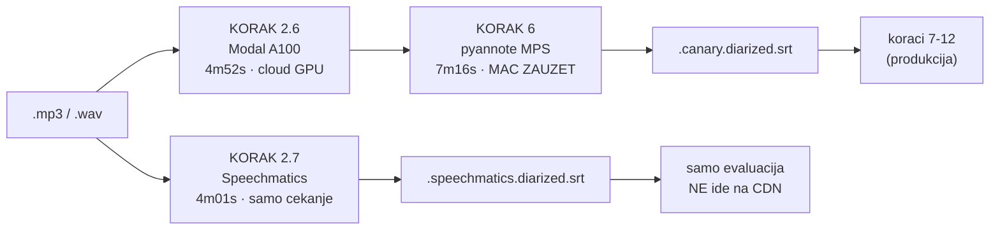

# Speechmatics kao cloud zamjena za Canary + pyannote — mjerenje 01.09.2026.

**Status: EKSPERIMENT.** Produkcija je netaknuta. Odluka o migraciji nije donesena.

## Zašto uopće

Trenutni put je dva koraka na dva stroja: Canary transkripcija (Colab G4 batch ili
Modal A100 ad-hoc) → pyannote diarizacija **lokalno na Mac Miniju** (CPU-bound, vidi
`docs/diarization_research_2026-05.md`). Speechmatics oboje radi u **jednom HTTP pozivu**,
iz `.mp3`, bez WAV konverzije i bez lokalnog GPU/CPU tereta.

Ako kvaliteta drži, to je jedina komponenta pipelinea koja Mac Mini još drži kao
obavezan stroj — pa je ovo preduvjet za "sve u oblak".

## Alat

`transcribe_speechmatics.js` — standalone Node skripta, bez ovisnosti.

```bash
node transcribe_speechmatics.js --file <audio>            # jedna epizoda
node transcribe_speechmatics.js --limit 1                 # najnovija neobrađena, svi kanali
node transcribe_speechmatics.js --channel podcast_cuspajz --limit 3
node transcribe_speechmatics.js --file <audio> --translate en   # bonus: HR→EN
```

Ključ: `SPEECHMATICS_API_KEY` u `.env` (gitignored). Endpoint: `https://asr.api.speechmatics.com/v2`
(**ne** `eu2.` — vraća 401 za ovaj ključ).

### Odvojen namespace — produkcija se ne može pokvariti

Isti obrazac kao `colab_sortformer`:

| Produkcija | Speechmatics |
|---|---|
| `*.wav.canary.srt` | `*.speechmatics.srt` |
| `*.wav.canary.diarized.srt` | `*.speechmatics.diarized.srt` |
| — | `*.speechmatics.json` (sirovi json-v2) |
| — | `*.speechmatics.meta.json` (trajanje, trošak, RTF) |

`upload_to_r2.js` mapira samo `.canary.diarized.srt` → ovo ne ide na CDN.
`run_pipeline.sh` i rclone filter ne poznaju `.speechmatics.*`.

⚠️ **`count_progress.js` je trebao zakrpu.** Njegov popis sufiksa ima opće pravilo
`['.diarized.srt', 'diarized']` (legacy whisper bucket), a suffix matching je
prvi-pogodak. Bez eksplicitnih `.speechmatics.*` unosa **iznad** njega, svaka
Speechmatics epizoda bi se krivo brojala kao whisper diarizacija. Ista zamka kao
za sortformer — vidi CLAUDE.md "Suffix matching order matters".

## Mjerenja

Dvije epizode od 29.08.2026., obje već imaju produkcijski Canary+pyannote izlaz.

| | cuspajz #153 (dijalog) | muzevni_budite (monolog) |
|---|---|---|
| Trajanje | 50:30 | 19:52 |
| Wall clock | **2:29** | **0:47** |
| Realtime faktor | **20.3×** | **25.2×** |
| Upload | 28.9 MB (mp3) | 18.3 MB (mp3) |
| Trošak | $0.67 | $0.26 |

Za usporedbu: Canary na Colab G4 je ~$0.003/ep, ali **ne uključuje diarizaciju** —
ona je zasebnih ~10-20 min CPU-a na Mac Miniju po epizodi.

### Pokrivenost i opseg

| | Canary+pyannote | Speechmatics |
|---|---|---|
| cuspajz: riječi | 7 528 | 7 586 (+0.8%) |
| cuspajz: pokriveno vremena | 87.4% | **91.4%** |
| cuspajz: segmenata | 531 | 380 |
| monolog: riječi | 2 705 | 2 737 (+1.2%) |
| monolog: pokriveno | 87.1% | **90.4%** |
| monolog: rečeničnih znakova | 114 | **215** |

**Nema gubitka sadržaja ni na jednoj strani** — opseg je praktički identičan.
Ovo je bilo vrijedno provjeriti jer je poznato da Canary EN→HR **tiho ispušta
chunkove** (memory `canary_en_to_hr_speech_translation`); na HR→HR se to ovdje
ne događa.

### Vremenske oznake — poravnate

Sidrenje na 584 jedinstvene riječi prisutne u oba transkripta:

```
 0-5min   drift  -0.0s      25-30min  drift  -2.5s
 5-10min  drift  +1.4s      30-35min  drift  -1.9s
10-15min  drift  -0.8s      35-40min  drift  -2.3s
15-20min  drift  -1.0s      40-45min  drift  -2.7s
20-25min  drift  -1.5s      45-50min  drift  -2.4s
```

Maksimalno ~2.7 s, bez akumulacije. Screenshotovi i deep-linkovi bi preživjeli
zamjenu bez pomaka. (Prva impresija da Canary "gubi rečenice" bila je artefakt
uspoređivanja fiksnih vremenskih prozora — granice segmenata se ne poklapaju.)

### Kvaliteta teksta — Speechmatics uvjerljivo bolji na vlastitim imenima

Monolog, prvih 90 s. Lijevo Canary, desno Speechmatics:

| Canary | Speechmatics | točno |
|---|---|---|
| „Hvala Isus i Marija" | „Hvaljen Isus i Marija" | SM |
| „**Iro** Spajić" | „**Miro** Spajić" | SM |
| „u **svjetu** Martinu na Muri" | „u **Svetom** Martinu na Muri" | SM |
| „na **čude se** način" | „na **čudesan** način" | SM |
| „u mjestu **Uskuplju**" | „u mjestu **Uskoplju**" | SM |
| „smo **ocijelili**" | „smo **odselili**" | SM |
| „mojeg **djetinstva**" | „moga **djetinjstva**" | SM |
| „**Tudi se živim** što zdravije" | „**Trudim se živjeti** što je zdravije" | SM |
| „treba **izbrati**" | „treba **izabrati**" | SM |

Ime **subjekta epizode** Canary je pogriješio. To nije kozmetika — vlastita imena
hrane person hub, RAG i atribuciju govornika.

Canary nije svugdje lošiji: „Simon Sinek, Start with..." (SM: „Simon Sings Court 2"),
„tri stepenice niže" (SM: „315 niže"). Na engleskim imenima i brojevima je bolji.

Speechmatics dodatno daje **pravu interpunkciju i velika slova** (215 vs 114
rečeničnih znakova) — Canary izlaz je jedan dugi tok. To izravno pomaže korak 8
(članci) i RAG chunkanje po rečenicama.

### Diarizacija

| | Canary+pyannote | Speechmatics |
|---|---|---|
| cuspajz (2 sugovornika) | 2 govornika | **3** — 178 / 186 / **16** |
| monolog | 1 | 1 ✅ |

Treći „govornik" je 16 kratkih upadica („Ha ha", „Tako", „Ej") — prekrivajući govor
i backchannel. Nije izmišljena osoba nego prefino cijepanje. `--sensitivity 0.4`
(default 0.5) je prva stvar za probati prije nego se ovo proglasi manom.

## Je li unutra Canary + Sortformer + LLM za peglanje rečenica?

Hipoteza je bila razumna — izlaz *izgleda* kao tekst kroz koji je prošao jezični model.
Sirovi `json-v2` kaže da nije. Tri traga:

**1. Interpunkcija je usidrena u akustičnu vremensku os.** Svih 326 / 1 245 znakova
interpunkcije su tokeni s nultim trajanjem na točnom timestampu, s vlastitim
`confidence` i `speaker` poljem:

```
word          13.46 ->  13.91  conf=1     spk=S1  "Marija"
punctuation   13.91 ->  13.91  conf=1     spk=S1  "."
word          14.33 ->  14.51  conf=0.49  spk=S1  "Ja"
```

LLM koji pegla gotov tekst ne može proizvesti timestamp i akustičnu pouzdanost za
točku. Interpunkciju emitira **dekoder same ASR mreže**, unutar poravnanja.

**2. Pouzdanost je po riječi i realno raspoređena** — 29 riječi ispod 0.5, 250 između
0.5 i 0.9 (monolog). To je akustična nesigurnost, ne izlaz generativnog modela.

**3. Odlučujuće: negramatične rečenice su PREŽIVJELE.** U finalnom tekstu stoji

> „Ja **se zove** Miro Spajić."   (treba: *zovem*)
> „ovisnosti o kockanju **koje me uništavale**"   (treba: *koja me uništavala*)

Ijedan LLM za peglanje popravio bi ovo prvo, prije svega drugog. Tekst nije prošao
kroz generativni model — sve što je bolje od Canaryja došlo je iz **boljeg akustičnog
modela za hrvatski**, ne iz naknadne obrade.

Uz to, `metadata.language_pack_info.itn: false` pokazuje da je inverse text
normalization zaseban, konfigurabilan stupanj u njihovom pipelineu — klasična ASR
arhitektura (WFST/pravila), ne LLM. `orchestrator_version` je njihov vlastiti
versionirani language pack.

**Ono što u hipotezi stoji:** oni doista black-boxaju ono što mi radimo korak po
korak — audio IN, interpunktiran i diariziran tekst OUT, jedan poziv. Samo je unutra
jedan bolje istreniran akustični model, a ne naš lanac posložen kod njih.

## Otvoreno prije bilo kakve odluke o migraciji

1. **Sensitivity sweep** — 0.3/0.4/0.5 na istoj epizodi, gleda se pada li broj na 2.
2. **Više epizoda.** Dvije su premalo. Treba i loš zvuk, i 3+ govornika, i EN kanal.
3. **Ekonomika na skali.** $0.80/h × 3 200 epizoda ≈ **$2 500** za pun rekat.
   Za tekući priljev (~15 ep/tjedan × 45 min) je ~$470/god — to je realan broj.
   Free tier je 480 min/mj (≈ 10 epizoda), pokriva evaluaciju.
4. **Downstream ne zna za `.speechmatics.*`.** Promocija u produkciju znači
   preimenovanje sufiksa + rclone + `count_progress.js` + `upload_to_r2.js`.
5. **Ovisnost o jednom vanjskom servisu** za korak koji je danas u potpunosti naš.
   Canary+pyannote ostaje kao fallback čak i ako Speechmatics postane default.

## Uključivanje u nightly (KORAK 2.7)

`--with-speechmatics`, **default OFF**, non-fatal, preskače se bez ključa u `.env`.

```bash
./run_pipeline.sh --with-speechmatics
SPEECHMATICS_MAX_FILES=5 SPEECHMATICS_FRESH_DAYS=7 ./run_pipeline.sh --with-speechmatics
```

Izmjeren noćni priljev (git povijest `chore(podcasts): refresh podcast lists`,
40 refresha kroz kolovoz): **medijan 2-3 nove epizode/noć**, ukupno 69 novih.
Stvarnih preuzimanja zna biti 11-12/dan kad se povlači backlog.

Otud ograde: `SPEECHMATICS_MAX_FILES=3` pokriva tipičnu noć u cijelosti i omeđuje
skok, `SPEECHMATICS_FRESH_DAYS=3` drži korak na svježem priljevu.
Worst case ≈ **$1.80/noć**, ≈ $55/mj — free tier (480 min/mj ≈ 10 ep) pokrije
otprilike trećinu.

⚠️ **Prozor svježine je ovdje namjerno suprotan KORAKU 2.6.** Ondje je mtime prozor
ukinut jer transkripcija MORA konvergirati nad katalogom. Ovdje evaluacijski sloj
**ne smije** konvergirati: bez prozora bi po 3 epizode/noć progrizao svih 3 200
epizoda ≈ $2 500 bez ičije odluke.

## Prvi zaključak

Za **hrvatski monolog i čist dijalog Speechmatics daje bolji tekst** (imena,
morfologija, interpunkcija), **jednaku pokrivenost**, **poravnate timestampove** i
**20-25× realtime bez ijednog lokalnog resursa**. Diarizacija je nešto agresivnija.

Ovo je dovoljno dobar rezultat da migracija bude ozbiljna opcija, ali odluka
čeka točke 1-3 gore.

---

# Dodatak: prvi stvarni nightly run, 01.09.2026.

Gore su mjerenja iz ručnih poziva. Ovo je što se dogodilo kad je korak pušten
u pravi nightly (`--with-speechmatics`, run 22:15, PID 57761).

## Rezultat koraka 2.7

```
🧪 Prozor 3d, cap 3 epizoda, timeout 30 min/ep
🗓️  Prozor svježine 3d: 3277 → 2 kandidata
   ⏳ Mrežna greška (fetch failed) — čekam 5s…      ← retry ju je progutao
   ✅ 104 segmenata, 2 govornika | 22.41× realtime | ~$0.21
   ✅ 116 segmenata, 1 govornika | 25.58× realtime | ~$0.25
📊 Uspješnih: 2 | Neuspjelih: 0
```

Cijeli korak **87 s / $0.46**. Dvije mrežne greške dogodile su se same od sebe i
retry ih je progutao — neplanirana potvrda da put otpornosti radi.
Propovijed je točno prepoznata kao 1 govornik, razgovor kao 2.

## Head-to-head na identičnom zvuku

Nightly 30.08. obradio je točno 3 epizode koje su naknadno prošle Speechmatics
(89 min zvuka ukupno). Isti fajlovi, obje putanje:

| | vrijeme | gdje se troši |
|---|---|---|
| KORAK 2.6 Modal A100 | 4m 52s | cloud GPU |
| KORAK 6 pyannote | 7m 16s | **Mac Mini, 100% zauzet** |
| **stari put ukupno** | **12m 08s** | |
| **Speechmatics** (jedan poziv) | **4m 01s** | čekanje na socketu |

**3.0× brže** — i večerašnja kontrolna točka na istoj epizodi kroz oba puta daje
isto (157 s → 41 s = 3.8×).

⚠️ **Brzina nije argument za migraciju.** Nightly 30.08. trajao je ukupno **1h 28m**;
8 minuta uštede je šum, jer koraci 7/8 (Claude članci) pojedu većinu. Prava razlika
je *gdje* se posao odvija: `7m 16s` punog zauzeća Mac Minija postaje `0`.

Dvije napomene koje sprječavaju krivi zaključak:
- Modalovih 4m52s uključuje ~39 s hladnog učitavanja modela. Pri 1-3 epizode po
  noći hladni start je **pravilo**, ne iznimka — ne amortizira se kao u batchu.
- 25.08. je diarizacija trajala **1h 50min**, ali to je bila saborska sjednica
  chunkana na 4 dijela (`part_01_16k.wav`) — drugi proizvod, nije reprezentativno
  za podcast nightly. Pokazuje ipak gdje lokalni pyannote stvarno boli.



## Ekonomika — ispravak ranije procjene

Prosječna epizoda u katalogu je **57.4 min** (medijan 55.1), izmjereno nad 3206
`.info.json`. Ranija procjena od 45 min bila je preniska, pa je stvarni trošak
**~$0.77/ep**, ne $0.60.

| | |
|---|---|
| Katalog | 3068 h → pun rekat **$2454** |
| Krediti $98.69 (01.09.) | 123 h ≈ **128 epizoda** |
| Pri 2 ep/noć | $1.53/noć → **~64 noći (2.1 mj)** |
| Pri 3 ep/noć | $2.30/noć → **~42 noći (1.4 mj)** |

**Posljedica: migracija može biti samo forward-only.** $2454 za retroaktivni rekat
se ne isplati. Ako se ikad poželi popraviti stare epizode, ciljano — samo one gdje
`TRANSCRIPT_GAP` javlja rupu ili su imena gostiju očito promašena.

## Zamke pronađene pri uključivanju

1. **`automatic/nightly_pipeline.sh` nije prosljeđivao `--with-speechmatics`.**
   Flag u `run_pipeline.sh` sam po sebi ne znači ništa — nightly ima vlastiti
   popis flagova (linija ~305). Bez ovoga bi ujutro izgledalo kao da eksperiment
   ne radi, **bez ijedne poruke o grešci**. Vrijedi za svaki budući korak.

2. **Timeout je bio 90 min PO EPIZODI** → zaglavljen servis držao bi nightly
   3 × 90 = 4.5 h. Spušteno na `SPEECHMATICS_TIMEOUT_MIN=30`.

3. **Selekcija je hvatala yt-dlp orphan fragmente** (`.f396.mp4`, video-only) —
   plaćen upload bez ijednog zvučnog uzorka. I nudila već obrađenu epizodu ponovno
   kao `.wav`; „gotovo" je sada svojstvo **epizode**, ne datoteke.

4. **Nightly je u 01:00, ne 03:00** (`plutil -p` na plistu: `Hour => 1`).
   Memory je godinama nosio krivu brojku.

5. **Log je po DANU, ne po runu.** `nightly_YYYY-MM-DD.log` drži i zakazani 01:00
   run i svaki ručni run istog dana. Monitor s `tail -f -n +1` preigrao je
   jutrošnji run i javio „KORAK 6/10" kao tekući — lažni alarm. Koristi goli
   `tail -f` i provjeri timestamp prije nego zaključiš.

## Provjere sigurnosti (empirijske, ne iz čitanja koda)

| Provjera | Rezultat |
|---|---|
| `run_pipeline.sh` ima `set -e` — ruši li pad 2.7 run? | `node … \|\| echo` preživi |
| Izlazni kod na API grešci | 1, s čistom porukom |
| Ostavlja li pad parcijalni `.speechmatics.diarized.srt`? | Ne — idempotencija čista |
| Mogu li fajlovi na CDN? | Ne — nijedan `.speechmatics.*` ne matcha nijedan od 13 `UPLOAD_SUFFIXES` |
| Sudar ručnog runa s launchd 01:00 | `.nightly.lock` s provjerom PID-a → launchd čisto izađe |

## Stanje backloga na kraju sesije

Pipeline je **potpuno sustignut** na praćenim kanalima: 3210 WAV-ova, **0** bez
`.canary.srt`, **0** bez diarizacije, **0** mp3 koji čeka konverziju, **0**
Speechmatics kandidata u prozoru. Run u 01:00 obradit će samo ono što YouTube
objavi u međuvremenu.

## Vezani dokumenti

- `docs/transcription_colab_vs_modal_cost_2026-07.md` — Colab batch vs Modal ad-hoc
- `docs/diarization_research_2026-05.md` — zašto je pyannote CPU-bound
- `docs/2026-08-28-konvergencija-pipelinea.md` — zašto KORAK 2.6 NEMA prozor svježine
