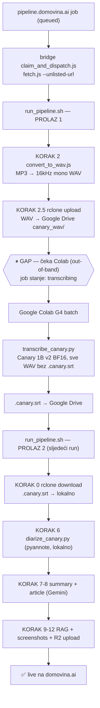
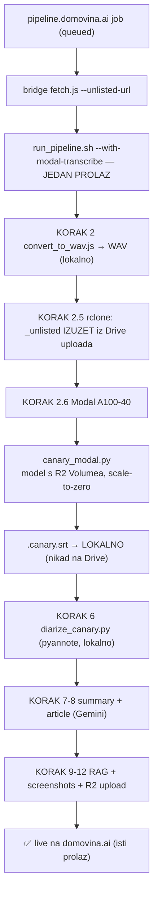
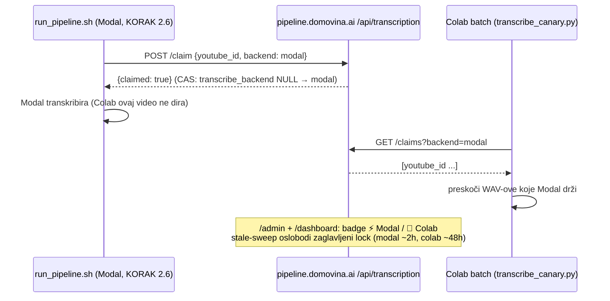

# Transkripcija: dvoprolazni Colab batch vs jednoprolazni Modal ad-hoc — proces + trošak

**Status:** SSOT za odabir transkripcijskog backenda (Colab G4 batch vs Modal serverless A100).
**Datum:** 2026-07-07.
**Povezano:** `colab_canary/` (batch), `modal_canary/canary_modal.py` (ad-hoc), `run_pipeline.sh`
KORAK 2.5/2.6, `docs/PIPELINE_FULL.md`, transcription claim/lock (pipeline.domovina.ai `/api/transcription/*`).

Pipeline ima **dva transkripcijska backenda** koji rade isti posao (WAV → `.canary.srt`)
ali s bitno različitim operativnim i troškovnim profilom:

| | **Colab G4 batch** (dvoprolazni) | **Modal A100-40 ad-hoc** (jednoprolazni) |
|---|---|---|
| Kad | Nakupljeni backlog (deseci+ epizoda) | Pojedinačne epizode koje kaplju (pipeline.domovina.ai job) |
| Latencija | Visoka (nakupi → ručni/Playwright Colab run → sljedeći pipeline prolaz) | Niska (sekunde nakon zahtjeva, u istom prolazu) |
| Ljudski overhead | Otvori notebook + Run all (ili `colab_automation.js`) + čekaj GPU alokaciju | `modal run` / programatski, push-button |
| Idle trošak | Nema (auto-shutdown) — ali plaćaš GPU-vrijeme dok traje | **$0** (scale-to-zero) |
| Marginalni $/ep | **Vrlo nizak** (~$0.003) | Viši (~$0.03–0.09; svaki poziv re-plaća cold start) |
| Skala | Tisuće/tjedno jeftino | Deseci; iznad toga batch je jeftiniji |

**TL;DR zaključak** (detalji u §4): po čistom **trošku po epizodi Colab batch je jeftiniji
praktički od 1. epizode** — nema "postaje jeftiniji nakon N". Ali **apsolutna razlika je u
centima do ~20 epizoda**, a Modalov free tier (~$30/mj) ad-hoc čini **efektivno besplatnim** do
~500 ep/mj. Zato je prava os odluke **latencija + operativni overhead, ne novac**: Modal za
pojedinačno/na-zahtjev, Colab batch za nakupljeni backlog (≳20 epizoda odjednom).

---

## 1. Dvoprolazni proces — Google Colab G4 batch (postojeći, za bulk)

Transkripcija je **out-of-band Colab korak** dohvaćen preko rclone/Drive round-tripa, pa jedan
video NE završi u jednom prolazu — parkira se čekajući Colab, a *kasniji* run ga nastavi.



Zašto ovako: Colab G4 je GPU-bound i najjeftiniji **po fajlu** na skali (empirijski
**$0.003/ep** za batch od 96), ali traži nakupljanje + ručni/automatizirani session spin-up.
Diarizacija ostaje lokalno (pyannote je CPU-bound — vidi `docs/diarization_research_2026-05.md`).

---

## 2. Jednoprolazni proces — Modal A100-40 ad-hoc (novo, za pojedinačne zahtjeve)

`--with-modal-transcribe` (KORAK 2.6) zamjenjuje Colab/rclone hop **inline** pozivom na Modal
serverless GPU. `.canary.srt` nastaje lokalno, pa KORAK 6 diarizira odmah — **cijeli run je
jednoprolazan**, bez `transcribing`-limba.



Model se skida s R2 (`models.domovina.ai/canary-1b-v2.nemo`) na perzistentni Modal Volume
**jednom**, pa svaki poziv čita lokalno (cold start = sekunde, ne minute). Miruje = **$0**.

---

## 3. Koordinacija — transcription claim/lock (da se ne dupliraju)

Oba backenda mogu vidjeti isti video (WAV na Drive + Modal istovremeno). D1 claim u
pipeline.domovina.ai (`/api/transcription/*`) osigurava da **samo jedan** transkribira.



Belt-and-suspenders: uz D1 claim, KORAK 2.5 izuzima `_unlisted/` iz Drive uploada kad je Modal
aktivan → Colab te fajlove fizički ni ne vidi.

---

## 4. Analiza troška + break-even

### 4.1 Pretpostavke (mijenjaj i preračunaj)

**Colab G4 (Pro+):**
- Cijena: **$11 / 100 credita** → **$0.11/credit**.
- G4 potrošnja: **8.9 credita/h** → 8.9 × $0.11 = **$0.979/h** ≈ **$0.000272/s**.
- Fiksni session overhead (GPU-vrijeme): model pull s R2 + `restore_from` + mount ≈ **90 s** → **$0.0245/session**.
- Po epizodi (transkripcija): **~13 s** (empirijski prosjek mješovitog batcha) → **$0.00354/ep**.
- **Empirijsko sidro:** produkcijski run 96 fajlova = **2.91 credita = $0.32** → **$0.0033/ep** all-in (potvrđuje model).

**Modal A100-40:**
- Cijena: **~$2.10/h** → **~$0.000583/s** (Modal naplaćuje po sekundi; +sitno CPU/mem).
- Po ad-hoc epizodi = cold model-restore s Volumea (~25 s) + inference (~15 s) + scaledown idle.
  - Trenutni `scaledown_window=120s` → ~160 s naplaćeno → **~$0.093/ep**.
  - Tuniran (scaledown ~15 s za čisti ad-hoc) → ~55 s → **~$0.032/ep**.
- Volume storage: **~$1/mj** fiksno. Free tier: **~$30/mj** (Starter) → prvih ~500 ad-hoc ep/mj efektivno **$0**.
- Radni midpoint za tablicu: **$0.06/ep**.

### 4.2 Formule

```
Colab batch(N)   = 0.000272 × (90 + 13·N)   = 0.0245 + 0.00354·N     [$]
Modal ad-hoc(N)  = c_modal × N               (c_modal ≈ 0.03–0.09, midpoint 0.06)
```

### 4.3 Trošak po broju epizoda (N)

| N (epizoda) | Colab batch $ | Modal ad-hoc $ (@0.06) | Δ (Modal − Colab) | Modal/Colab |
|---:|---:|---:|---:|---:|
| 1   | 0.028 | 0.06 | +0.03 | 2.1× |
| 2   | 0.032 | 0.12 | +0.09 | 3.8× |
| 5   | 0.042 | 0.30 | +0.26 | 7.1× |
| 10  | 0.060 | 0.60 | +0.54 | 10× |
| 20  | 0.095 | 1.20 | +1.11 | 13× |
| 50  | 0.202 | 3.00 | +2.80 | 15× |
| 100 | 0.378 | 6.00 | +5.62 | 16× |

### 4.4 Break-even — dvije razine

1. **Po $/epizodi:** Colab je jeftiniji već na **N ≈ 1** (rješenje `0.0245 + 0.00354·N = 0.06·N`
   daje **N\* ≈ 0.4**). Dakle **NE postoji** "Colab postaje jeftiniji nakon N epizoda" — jeftiniji je
   po jedinici od starta, jer Modal svaki ad-hoc poziv re-plaća cold start + keep-warm.

2. **Gdje razlika postane vrijedna spomena** (Δ prijeđe ~$1, tj. "vrijedi upaliti Colab"):
   **N ≈ 18–20 epizoda**. Ispod toga govorimo o **centima** — nije vrijedno optimizirati; biraj po
   zgodnosti. Iznad, batch na Colabu štedi stvarni novac i ionako je alat za bulk.

**Osjetljivost:** ako je Modal tuniran na $0.03/ep, "vrijedno" prelazi na **N ≈ 40**; ako je na
$0.09/ep, na **N ≈ 12**. Colab-strana je robusna (fiksni + ~$0.0035/ep) neovisno o tome.

### 4.5 Modal free tier mijenja sliku

Modal Starter uključuje **~$30/mj besplatnih kredita** → pri ~$0.06/ep to je **~500 ad-hoc
epizoda mjesečno besplatno**. Za realan ad-hoc volumen (pojedinačni pipeline.domovina.ai jobovi)
Modal je dakle **efektivno $0**, dok Colab traži kupnju credita. Tek kad ad-hoc volumen probije
free tier (~500/mj) — a to je već "bulk" režim — Colab batch postaje i nominalno i operativno
pravi izbor. (Napomena: uvjeti free tiera se mogu promijeniti — provjeri modal.com/pricing.)

---

## 5. Preporuka (pravilo palca)

- **< ~20 nakupljenih epizoda / pojedinačni zahtjevi koji kaplju** → **Modal ad-hoc**
  (`--with-modal-transcribe`). Trošak zanemariv/nula (free tier), latencija i push-button
  jednostavnost pobjeđuju, single-pass = odmah live.
- **≥ ~20 nakupljenih epizoda (backlog)** → **Colab G4 batch** (`colab_canary/`). Stvarna ušteda
  počinje ovdje, a to je ionako alat za mase (tisuće/tjedno po $0.003/ep).
- Odluka je **operativna, ne financijska** ispod bulk skale — oba su centi. Ne troši trud na
  mikro-optimizaciju troška; biraj po **latenciji i tome imaš li već hrpu za obraditi**.
- Diarizacija ostaje **lokalno (pyannote)** u oba slučaja — vidi `docs/diarization_research_2026-05.md`.

> Brojke su parametrizirane u §4.1 — ako se cijene (Colab credit, Modal $/h, free tier) promijene,
> ažuriraj pretpostavke i preračunaj §4.3/§4.4. Model je namjerno transparentan da ostane provjerljiv.
