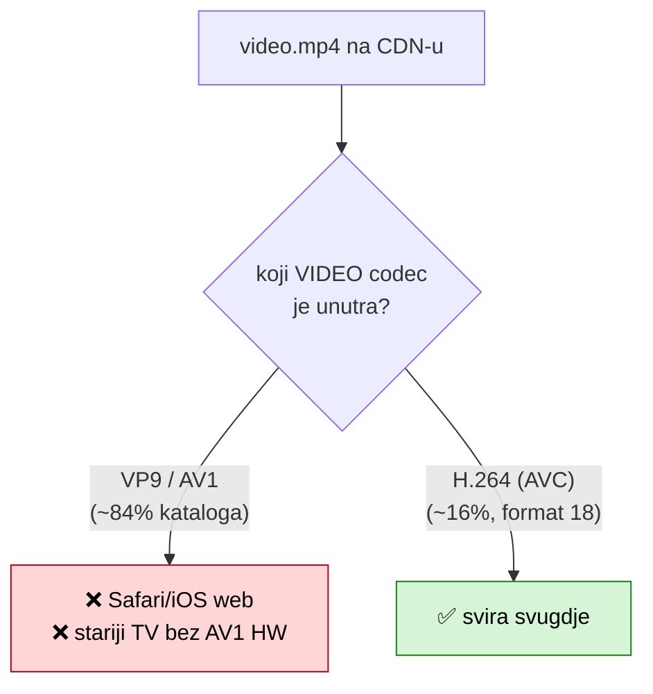
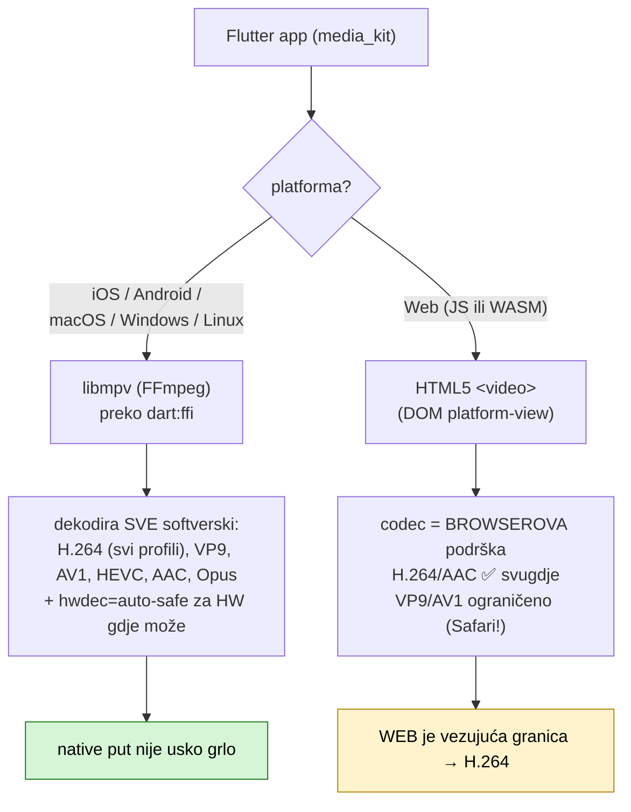
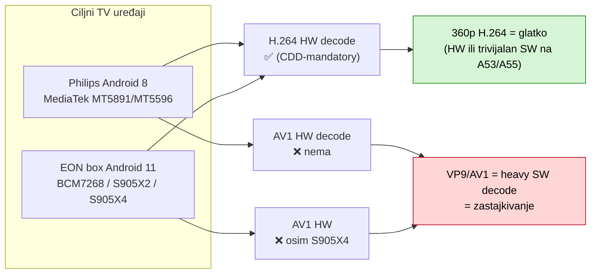
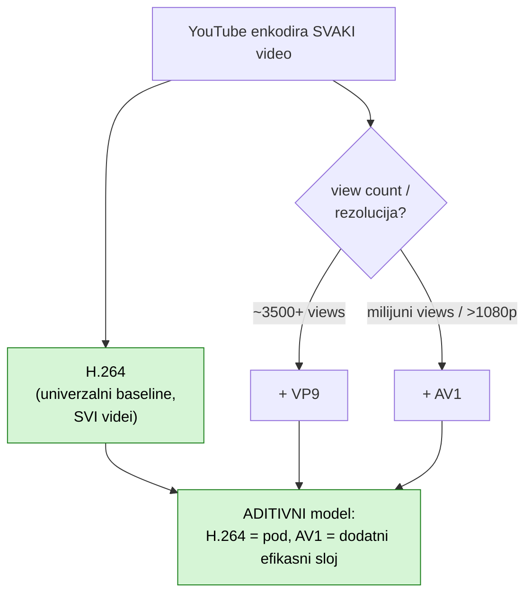
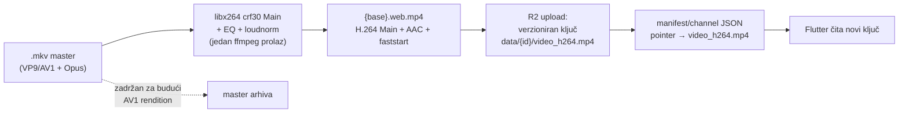

# Cross-platform video delivery — strategija (H.264 baseline, AV1 budućnost)

**Datum:** 2026-06-01
**Status:** istraženo + pilot uploadan, čeka empirijsku potvrdu na uređajima
**Povezano:** [`video_formats_inventory_2026-06.md`](video_formats_inventory_2026-06.md) (forenzika kataloga — odakle VP9/AV1/H.264 mix), [`loudness_crosschannel_ab_2026-06.md`](loudness_crosschannel_ab_2026-06.md) (audio normalizacija + EQ)

Ovaj dokument je **trajni zapis** istraživanja (3 nezavisna web-research prolaza, citirano) o tome koji video format jamči reprodukciju na svim našim platformama, i strateška odluka H.264-sad / AV1-kasnije.

---

## Problem u jednoj rečenici

Produkcija je servirala `data/{id}/video.mp4` koji je **VP9/AV1 unutar MP4 kontejnera** (remux `-c:v copy` zadržao izvorni codec) — što **ne svira** na Safari/iOS web-putu ni na starijim TV uređajima bez AV1/VP9 hardvera. Container (mp4) ≠ codec; reprodukciju određuje **codec**.



---

## Ključ: tko zapravo dekodira naš fajl (Flutter app = media_kit)

Consumer app (`domovina.ai`) koristi **`media_kit`** (ne `video_player`). Decode put se bitno razlikuje native vs web:



**Posljedice:**
- **Native (libmpv/FFmpeg):** dekodira *sve* — Android CDD/MediaCodec ograničenje **ne vrijedi** jer media_kit ne ide kroz MediaCodec. Čak bi i VP9/AV1 radio na native (uz softverski trošak).
- **Web (HTML5 `<video>`):** codec = browserova podrška. **WASM ne mijenja ništa** — `<video>` je DOM element izvan skwasm/CanvasKit rendera. Ovo je razlog zašto je H.264 nužan: VP9/AV1-u-mp4 puca u Safariju.

---

## Per-platform kompatibilnost našeg formata

**Format:** MP4 (`+faststart`) · H.264 **Main profile, Level 3.1**, `yuv420p` (8-bit 4:2:0) · AAC-LC 128k 48kHz.

| Target (via media_kit) | Decode put | Verdikt |
|---|---|---|
| iOS / iPadOS | libmpv/FFmpeg | ✅ |
| Android (telefon) | libmpv/FFmpeg | ✅ (CDD MediaCodec limit ne vrijedi) |
| Android TV / Google TV | HW H.264 (CDD-mandatory) + SW fallback | ✅ |
| macOS / Windows / Linux | libmpv/FFmpeg | ✅ (Linux treba sistemski libmpv) |
| Web (WASM) | HTML5 `<video>` | ✅ (`avc1`+`mp4a.40.2` univerzalno) |

**Potvrđeno usput:** CRF/VBR ne utječe na kompatibilnost (samo codec/profile/level/pixfmt); `yuv420p` obavezan (4:2:2/4:4:4/10-bit razbije Safari/iOS); `+faststart` bitan za brzi start na sporim vezama. **Main** umjesto High: jedino mjesto gdje profile uopće igra je web `<video>`, a Main je tamo najsigurniji (i Android CDD jamči samo Baseline+Main L3.1 na MediaCodecu).

---

## Ciljni TV uređaji — hardware decode



H.264 hardverski decode je **obavezan** na svakom Android TV uređaju (Android 15 CDD §5.3 `T-0-2`, Baseline/Main/High do 1080p60). Baš ti uređaji **nemaju AV1 hardver** (osim najnovijeg S905X4) → trenutni VP9/AV1 ih tjera na teški software decode. **Prelazak na H.264 je za njih najveća pobjeda.** media_kit/libmpv koristi `hwdec=auto-safe` + automatski software fallback; na 360p je SW decode trivijalan. Caveat: Amlogic green-frame bug s `mediacodec-copy` → na 360p se zaobilazi `hwdec=no`.

---

## AV1 vs H.264 — što Google/YouTube službeno kažu



**Nalaz (citiran):**
- **H.264 NIJE legacy** — trajni je obavezni baseline (Android 15 CDD `H-0-1`/`T-0-2`). YouTube: *"nikad ne ostavlja gledatelja bez H.264 verzije."*
- **AV1 je aditivan, ne zamjena.** Google (suosnivač AOMedia) gura AV1 za high-value tier (ušteda ~33% bandwidtha — Netflix 2025).
- **AV1 mandat = samo NOVI Android-TV uređaji nakon 31.3.2021** (nije retroaktivno). ~70% terena još bez AV1 HW.
- **Safari AV1 samo na M3+/iPhone 15 Pro+** (nema SW fallback) → AV1 na webu odsijeca većinu Apple korisnika.

**Zašto AV1 ne sad za nas:** ušteda je *postotak*; na 360p talking-headu apsolutni MB je sitan, AV1 encode ~18× sporiji, a lomi reprodukciju na našim stvarnim uređajima. Win bi se vidio tek na YouTube/Netflix skali.

---

## Odluka i recept

**H.264 Main sad za cijeli katalog; AV1 kao mogući BUDUĆI 2. rendition** (YouTube model). Čuvamo `.mkv` mastere pa se AV1 kasnije može dodati jeftino i servirati samo capable klijentima uz H.264 fallback. Revisit kad: CDN trošak postane stvaran / krenu 1080p+ rezolucije / analitika pokaže AV1-HW publiku.

**Finalni encode recept** (usvojen nakon A/B usporedbe libx264 vs videotoolbox — vidi inventory doc):

```bash
ffmpeg -i SRC -map 0:v:0 -map 0:a:0 \
  -c:v libx264 -preset medium -crf 30 -profile:v main -level 3.1 -pix_fmt yuv420p \
  -af "highpass=f=100,bass=g=-4:f=200:w=0.7,equalizer=f=3200:width_type=q:w=1.2:g=2,\
loudnorm=I=-16:TP=-2:LRA=11:linear=false" \
  -c:a aac -b:a 128k -ar 48000 -movflags +faststart  OUT.web.mp4
```

- **libx264 crf30** pobjeđuje VideoToolbox: goran 2.68h = **246 MB** vs 435 MB (vtb 250k) vs 1.1 GB (800k). libx264 daje manji fajl *i* bolju sliku po byteu (cilj: mali fajlovi za spore mobilne veze, audio je prioritet).
- **EQ_IZRAZENIJI** (high-pass 100 + low-shelf −4@200 + presence +2@3.2k) prije loudnorm-a — čisti bass (snimano bez pop-filtera); čisti DSP, ne AI.

### Catalog-wide flow



- **Verzioniran R2 ključ** (`video_h264.mp4`, ne prepisuj live `video.mp4`) jer je immutable cache 1god; + manifest pointer da Flutter prijeđe na novi ključ. Fast-path uploader (HEAD-skip, paralelni PUT), ne MD5-stream anti-pattern.
- **Sloj B (fmt18, već H.264):** za pilot re-enkodiran uniformno; za bulk razmotriti `-c:v copy` + samo audio (bez generacijskog gubitka, veći fajl).

---

## Pilot (čeka potvrdu)

4 epizode @ `cdn.domovina.ai/data/{id}/video_h264.mp4`: `b-nls1ck8EE` (VP9→H264, 244MB), `fO7iltytw0I` (VP9→H264, 107MB), `AoXN-3Mkmew` (H264→H264, 204MB), `NWuKcDgUhcE` (AV1→H264, 51MB). Svi H.264 Main L3.1 + AAC + faststart + EQ. Test: iPhone, web/WASM build, Philips A8, EON box → pa catalog-wide.

---

## Izvori (sažeto)

- Android 15 CDD §5.3 (H.264 `H-0-1`/`T-0-2` mandatory; AV1 1080p-only)
- media_kit README + pub.dev (libmpv native / HTML5 `<video>` web); mpv `hwdec=auto-safe` + software fallback
- MDN Web video codecs (Safari AV1 samo HW: M3+/iPhone 15 Pro+); caniuse AV1
- AOMedia "Google Story"; Netflix Tech Blog "AV1 — 30% of streaming" (2025); StreamingLearningCenter "Which Codec Does YouTube Use" (2021)
- 9to5Google (AV1 mandat za nove Android-TV uređaje od 31.3.2021)
- Amlogic/MediaTek/Broadcom SoC specs (H.264 HW da, AV1 ne osim S905X4)
