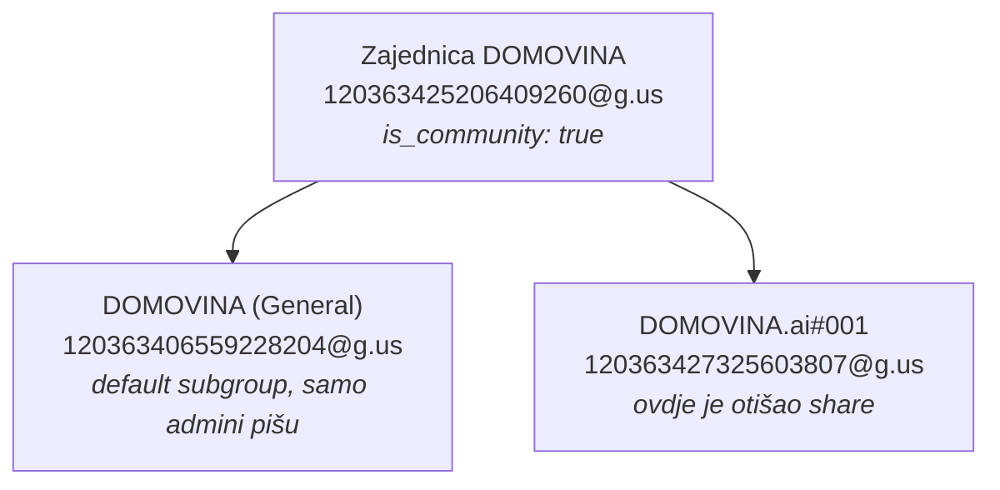

# Share epizode na WhatsApp — `share_to_whatsapp.js`

Šalje jednu epizodu i **sva njezina poglavlja** u WhatsApp grupu: jedan link po
poruci, svaki s vlastitim preview-om (naslov `MM:SS · tema`, opis i slika
`og-t-{sek}.jpg`). Prvi put je odrađeno ručno 21.09.2026. za `aue1GuuMsbA`
(Iva Kraljević × Marin Periš, 46 poglavlja); ova skripta je to pretvorila u
determinističku naredbu.

```bash
# tko su grupe i koja je u kojoj zajednici
node share_to_whatsapp.js --list-groups domovina

# plan (ništa se ne šalje)
node share_to_whatsapp.js --video-id aue1GuuMsbA --group "DOMOVINA.ai#001"

# stvarno slanje
node share_to_whatsapp.js --video-id aue1GuuMsbA --group "DOMOVINA.ai#001" --commit
```

## Zašto poruka smije biti SAMO link

WhatsApp resolva `og:` tagove samo kad je link **sam** u poruci. Čim se doda
makar riječ uvoda, preview nestane i primatelj dobije gol URL. Zato skripta ne
nudi `--message`, `--prefix` ni potpis — to nije propust nego uvjet da share
uopće ima smisla. Ako treba uvodna rečenica, pošalji je zasebno rukom.

## Što skriptu čini determinističkom

### 1. Poglavlja dolaze s CDN-a, ne s diska

Default je `--source cdn`, dakle `cdn.domovina.ai/data/{id}/article.json` — točno
onaj članak koji stoji iza stranice koju će primatelj otvoriti. Disk i CDN
driftaju u oba smjera (CDN zna biti *bogatiji*, npr. Opus verzija gore, gemini
verzija dolje), a link na timestamp kojeg na stranici nema vodi u prazan
screenshot. Isti razlog zbog kojeg audit razlikuje „CDN KRNJI" od „samo drugi
model".

`--source disk` postoji za epizodu koja još nije uploadana. Tada vrijedi
leksikografski dedup (`opus` > `gemini-*` > `agy`) i **linkovi mogu voditi na
timestamp koji na stranici još ne postoji** — pošalji tek nakon
`upload_to_r2.js`.

### 2. Grupa se razrješava preko mosta, ne preko `messages.db`

`messages.db` zna samo za chatove kroz koje je prošla poruka ili koje je pokupio
history sync. **Svježe napravljena grupa u kojoj još nitko ništa nije rekao tamo
ne postoji** — 22.09.2026. upravo se to dogodilo s `DOMOVINA.ai#001`: grupa je
bila stvorena, ali nevidljiva dok u nju nije otišla prva poruka. Zato skripta
pita most (`GET /api/groups`), koji popis vuče izravno s WhatsApp servera.

Razrješavanje ide redom: točan JID → točno ime → jednoznačan podniz imena.
**Višeznačnost je greška**, nikad „uzmi prvu":

```
❌ "DOMOVINA" odgovara na 2 grupa — suzi upit ili navedi JID:
  120363406559228204@g.us  DOMOVINA
  120363425206409260@g.us  DOMOVINA
```

Te dvije stvarno postoje i to nije slučajnost: jedna je zajednica „DOMOVINA",
druga njezina *default* announce-podgrupa. Da skripta bira prvu, 47 poruka bi
otišlo u krivu.

### 3. Već poslano se preskače

Prije slanja skripta pročita `messages.db` (samo čitanje) i izbaci URL-ove koji
su u toj grupi već bili. Ponovno pokretanje **dopunjava** ono što je prošli put
palo umjesto da duplicira.

To je jedina zaštita koju imamo, jer **most nema brisanje poruka** — poslana
poruka se može maknuti samo ručno u aplikaciji. Iz istog razloga je `--commit`
obavezan: bez njega se ispiše plan i ništa ne ode.

Usporedba je po **točnom** URL-u, pa `/t/27` i `/t/270` nisu ista stvar
(pokriveno testom).

## Zastavice

| Zastavica | Default | Što radi |
|---|---|---|
| `--video-id <ID>` | — | YouTube ID epizode (obavezno) |
| `--group <JID\|ime>` | — | grupa (obavezno); JID > točno ime > podniz |
| `--commit` | isključeno | bez njega je suho pokretanje |
| `--list-groups [upit]` | — | ispiši grupe s JID-om, brojem članova i zajednicom |
| `--source cdn\|disk` | `cdn` | odakle poglavlja |
| `--delay <sek>` | `3` | pauza između poruka |
| `--limit <n>` | — | najviše n poruka (za probu) |
| `--no-intro` | — | bez uvodnog linka na epizodu |
| `--force` | — | šalji i ono što je poslano — **stvara trajne duplikate** |
| `--input-dir <dir>` | `storage/output` | korijen za `--source disk` |
| `--bridge <url>` | `http://127.0.0.1:8080` | most |
| `--site-base <url>` | `https://domovina.ai` | baza linkova |

Env: `WA_BRIDGE_URL`, `SHARE_SITE_BASE`, `SHARE_CDN_BASE`, `SHARE_INPUT_DIR`,
`WA_STORE_DB`.

Izlazni kod je `1` ako je ijedna poruka pala, pa se može vezati u lanac.

## Linkovi idu kroz domovina.ai, nikad na YouTube

Vrijedi isto pravilo kao za EPUB i `.canary.summary.md`: artefakt koji putuje
sam (WhatsApp, mail) ne smije nositi `youtube.com/watch?v=…&t=Ns`, inače smo
share poklonili YouTubeu. Format je `https://domovina.ai/v/:id/t/:sec` —
stvarna Flutter ruta, ista koju koriste og-share slike. Pokriveno testom
(„linkovi NIKAD ne vode na YouTube").

## Preview lijepi most, ne ova skripta

Skripta šalje gol URL; naslov, opis i sliku dodaje **whatsapp-mcp most** u
`~/git/mcps/whatsapp-mcp` (`whatsapp-bridge/linkpreview.go`, uvedeno
21.09.2026.). Ako preview izostane, kvar je tamo, ne ovdje:

```bash
# je li preview otišao uz poruku
grep preview ~/Library/Logs/whatsapp-bridge.log | tail -5
#   → Message sent true … [preview: naslov="7:25 · Introvert pred kamerama…" sicica=10730B hi-res=1200x630]
```

`hi-res=1200x630` je bitan dio: bez hi-res uploada WhatsApp crta mali kvadratić
umjesto velikog preview-a. `WA_LINK_PREVIEW=0` gasi preview bez rebuilda.

## `GET /api/groups` (most)

Dodan 22.09.2026. u istom repou (`whatsapp-bridge/groups.go`). Popis grupa vuče
izravno s WhatsApp servera, pa vidi i grupe kojih u `messages.db` nema, i jedini
je izvor podatka o zajednici.

```bash
curl -s "http://127.0.0.1:8080/api/groups?query=domovina.ai" | python3 -m json.tool
```

```json
{
  "jid": "120363427325603807@g.us",
  "name": "DOMOVINA.ai#001",
  "participant_count": 1,
  "is_community": false,
  "community_jid": "120363425206409260@g.us",
  "community_name": "DOMOVINA",
  "is_default_subgroup": false,
  "is_announce": false
}
```

- `is_community` — ova grupa **jest** roditelj zajednice
- `community_jid` / `community_name` — ova grupa **pripada** toj zajednici; ime
  se razriješi samo ako smo član i roditeljske grupe, inače ostaje gol JID
  (nikad izmišljeno ime)
- `is_announce` — samo administratori smiju pisati; slanje će pasti ako nisi admin

## Zamke

1. **Duplikat je trajan.** Most ne može obrisati poruku. Uvijek prvo suho
   pokretanje, pa `--commit`.
2. **`--force` gazi zaštitu od duplikata.** Koristi ga samo kad znaš da su stare
   poruke otišle bez preview-a i hoćeš ih namjerno ponoviti.
3. **Provjeri broj članova prije `--commit`.** Skripta ga ispiše. 47 poruka u
   grupu od troje ljudi je spam; u vlastitu grupu od jednog člana nije.
4. **Epizoda bez članka nema poglavlja.** Ako `article.json` nije na CDN-u,
   skripta stane s uputom — ne šalje polovičan set.
5. **Tempo.** Default 3 s daje ~2,5 min za 47 poruka. Ispod 1 s nema smisla
   dirati; WhatsApp ne voli rafal, a i preview svake poruke traži dohvat
   stranice.

## Mjereno na stvarnom prolazu (22.09.2026.)

Epizoda `aue1GuuMsbA`, 46 poglavlja + uvodni link = **47 poruka**, grupa
`DOMOVINA.ai#001`:

| Što | Vrijednost |
|---|---|
| Uspješnost | **47/47**, nula grešaka |
| Tempo | ~3,5 s po poruci (3 s pauza + ~0,5 s dohvat preview-a) |
| Ukupno | ~2 min 45 s |
| Inline sličica | 5,7–10,7 KB (putuje unutar E2E poruke) |
| Hi-res preview | 1200×630 kod svih 47 |

Isti set je dan prije otišao i u `Matija Only` (42 u zadnjem batchu, također bez
greške). Dakle dva puta zaredom 100 % — tempo od 3 s je dovoljno konzervativan i
nema razloga ga snižavati.

Preview se potvrđuje iz loga mosta, ne iz izlaza skripte (skripta vidi samo
`success: true`):

```
Message sent true Message sent to 120363427325603807@g.us \
  [preview: naslov="2:39:30 · Podcast za pet godina i oproštaj…" sicica=8483B hi-res=1200x630]
```

## Zatečena struktura zajednice „DOMOVINA"

Otkriveno tek kad je `/api/groups` proradio — u `messages.db` se sve troje vidi
kao obične grupe, dvije od njih čak pod istim imenom:



Zato `--group DOMOVINA` namjerno puca: pogodio bi i zajednicu i njezinu
announce-podgrupu, a u drugu ionako ne bismo smjeli pisati da nismo admin.

## Vezani dokumenti

- `docs/2026-09-15-linkovi-kroz-domovina-ai.md` — zašto offline artefakt nikad ne
  linka na YouTube; isti razlog vrijedi za svaku poruku koju šalje ova skripta
- `docs/ebook_epub_pipeline.md` — drugi artefakt koji putuje sam (EPUB)
- `~/git/mcps/whatsapp-mcp/SETUP-ms.md` — most: link preview, `/api/groups`, launchd
